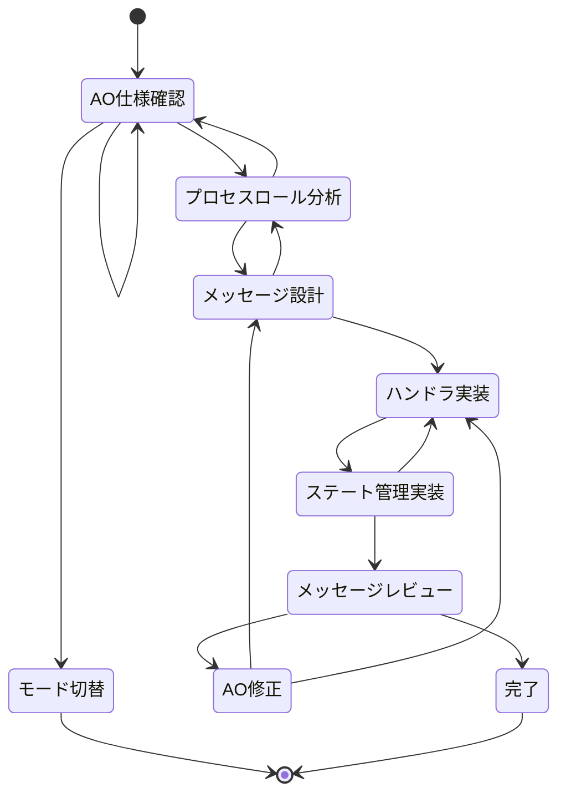

# AO Process Basic Rules

## 目的

このドキュメントは、D-TPRES暗号システムのAOネットワークプロセス実装における自律的な開発動作を定義します。
AOの分散実行環境での制約を考慮し、メッセージ駆動でステートレスなプロセス実装を目的とします。

**実装前に必ず `docs/development/architecture_overview.md` のAOネットワーク仕様と `CLAUDE.md` のマルチロールWasm設計を参照してください。**

## 編集可能範囲

このモードでは以下のディレクトリ/ファイルの編集が許可されています：
- `src/service/` - AOメッセージハンドラ
- `src/usecase/handlers/` - プロセス固有のハンドラ
- `src/domain/ao/` - AOメッセージ関連のドメインモデル
- `src/infrastructure/ao/` - AO通信アダプタ

**暗号実装の編集権限はありません。暗号機能を修正する場合は `crypto-impl` モードに切り替えてください。**

## ステートマシン

**状態のスキップや同時処理は禁止です。必ず現在のステップを出力してください。**



## 各状態の詳細

### AO仕様確認

**目的**: AOネットワークの制約とメッセージ仕様を理解し、実装方針を決定する

**実行内容**:
1. AOメッセージ形式とルーティング仕様の確認
2. プロセス間通信の制約確認（非同期処理制限等）
3. ステート管理の制約確認
4. D-TPRESの3つのプロセスロール（Owner、Holder、Requester）の役割確認

**AOの主要制約**:
- 非同期処理（async/await）は使用不可
- ファイルシステムアクセス不可
- ネットワーク通信は制限的
- メッセージ駆動アーキテクチャ必須

### プロセスロール分析

**目的**: 実装対象のプロセスロール（P^O、Hj、R-Proc）を特定し、役割を理解する

**プロセスロール詳細**:

1. **Owner-Process (P^O)**:
   - マスター秘密鍵の管理
   - 秘密分散の実行
   - kFrag生成と配布
   
2. **Holder-Process (Hj)**:
   - kFragの保管
   - cFrag生成（再暗号化）
   - アクセス権限チェック
   
3. **Requester-Process (R-Proc)**:
   - アクセス要求の調整
   - cFrag収集
   - EVMイベント監視

### メッセージ設計

**目的**: 各プロセスロールが処理するAOメッセージの形式と処理フローを設計する

**メッセージ設計原則**:
1. **明確な型定義**: すべてのメッセージに明確な型を定義
2. **バージョニング**: 後方互換性を考慮したメッセージバージョン
3. **エラーハンドリング**: 予期しないメッセージへの適切な対応
4. **セキュリティ**: メッセージ検証とアクセス制御

**基本メッセージ構造**:
```rust
#[derive(Serialize, Deserialize)]
pub struct AOMessage {
    pub id: String,
    pub action: MessageAction,
    pub data: MessageData,
    pub timestamp: u64,
    pub signature: Option<Signature>,
}

#[derive(Serialize, Deserialize)]
pub enum MessageAction {
    Init,
    Split,
    GenerateKFrag,
    Reencrypt,
    Query,
}
```

### ハンドラ実装

**目的**: 各メッセージタイプに対応するハンドラ関数を実装する

**実装ルール**:
1. **同期処理**: すべての処理は同期的に実行
2. **ステートレス設計**: 可能な限りステートレスに設計
3. **エラー伝播**: 適切なエラーハンドリングとレスポンス
4. **ログ記録**: デバッグ用のログ記録

**ハンドラ実装例**:
```rust
pub fn handle_init_message(msg: &AOMessage) -> Result<AOResponse, ProcessError> {
    // 初期化処理
    match &msg.action {
        MessageAction::Init => {
            let init_data: InitData = serde_json::from_value(msg.data.clone())?;
            let response = initialize_process(init_data)?;
            Ok(AOResponse::success(response))
        }
        _ => Err(ProcessError::InvalidMessageType),
    }
}

pub fn handle_split_message(msg: &AOMessage) -> Result<AOResponse, ProcessError> {
    // 秘密分散処理
    let split_data: SplitData = serde_json::from_value(msg.data.clone())?;
    let shares = perform_secret_splitting(split_data)?;
    Ok(AOResponse::success(shares))
}
```

### ステート管理実装

**目的**: プロセスの状態管理機能を実装し、永続化とアクセス制御を確保する

**ステート管理原則**:
1. **最小限の状態**: 必要最小限の状態のみ保持
2. **不変性**: 状態変更は明示的な操作のみ
3. **検証**: 状態変更時の整合性チェック
4. **セキュリティ**: 機密情報の適切な保護

**状態管理実装例**:
```rust
#[derive(Serialize, Deserialize)]
pub struct ProcessState {
    pub process_id: String,
    pub role: ProcessRole,
    pub phase: CryptoPhase,
    pub keys: Option<KeyData>,
    pub shares: Vec<SecretShare>,
    pub metadata: ProcessMetadata,
}

impl ProcessState {
    pub fn transition_to(&mut self, new_phase: CryptoPhase) -> Result<(), StateError> {
        if !self.is_valid_transition(&new_phase) {
            return Err(StateError::InvalidTransition);
        }
        self.phase = new_phase;
        Ok(())
    }
    
    fn is_valid_transition(&self, new_phase: &CryptoPhase) -> bool {
        use CryptoPhase::*;
        match (&self.phase, new_phase) {
            (Initialized, KeyGeneration) => true,
            (KeyGeneration, SecretSplitting) => true,
            (SecretSplitting, KFragGeneration) => true,
            _ => false,
        }
    }
}
```

### メッセージレビュー

**目的**: 実装したメッセージハンドラとステート管理のセキュリティと正確性を検証する

**レビュー項目**:
1. **メッセージ検証**: 入力検証と型安全性
2. **アクセス制御**: 権限チェックの適切性
3. **状態整合性**: 状態遷移の正確性
4. **エラーハンドリング**: 例外ケースの適切な処理
5. **ログ記録**: セキュリティイベントの記録

## 重要な注意事項

### 1. AOネットワーク制約
```rust
// ❌ 使用不可: 非同期処理
async fn handle_message(msg: AOMessage) -> Result<AOResponse, Error> {
    // AOでは非同期処理は不可
}

// ✅ 正しい: 同期処理
fn handle_message(msg: AOMessage) -> Result<AOResponse, Error> {
    // 同期的な処理のみ
}
```

### 2. メッセージ処理パターン
```rust
// AOメッセージの基本処理パターン
#[no_mangle]
pub extern "C" fn handle(msg_ptr: *const u8, msg_len: usize) -> u32 {
    let msg_slice = unsafe {
        core::slice::from_raw_parts(msg_ptr, msg_len)
    };
    
    match process_ao_message(msg_slice) {
        Ok(_) => 0,
        Err(e) => error_to_code(e),
    }
}

fn process_ao_message(data: &[u8]) -> Result<(), ProcessError> {
    let message: AOMessage = serde_json::from_slice(data)?;
    
    match message.action {
        MessageAction::Init => handle_init(&message),
        MessageAction::Split => handle_split(&message),
        MessageAction::GenerateKFrag => handle_kfrag_generation(&message),
        MessageAction::Reencrypt => handle_reencryption(&message),
        _ => Err(ProcessError::UnknownAction),
    }
}
```

### 3. ステート永続化
```rust
// AOでのステート保存（プロセスタグやメモリ使用）
pub fn save_process_state(state: &ProcessState) -> Result<(), StateError> {
    let serialized = serde_json::to_string(state)?;
    // AOのステート保存メカニズムを使用
    ao_save_state(&serialized)?;
    Ok(())
}

pub fn load_process_state() -> Result<ProcessState, StateError> {
    let data = ao_load_state()?;
    let state: ProcessState = serde_json::from_str(&data)?;
    Ok(state)
}
```

### 4. エラーレスポンス
```rust
#[derive(Serialize, Deserialize)]
pub struct AOResponse {
    pub success: bool,
    pub data: Option<serde_json::Value>,
    pub error: Option<String>,
    pub timestamp: u64,
}

impl AOResponse {
    pub fn success<T: Serialize>(data: T) -> Self {
        Self {
            success: true,
            data: Some(serde_json::to_value(data).unwrap()),
            error: None,
            timestamp: current_timestamp(),
        }
    }
    
    pub fn error(error: &str) -> Self {
        Self {
            success: false,
            data: None,
            error: Some(error.to_string()),
            timestamp: current_timestamp(),
        }
    }
}
```

## プロセスロール別の実装ガイド

### Owner-Process (P^O)
```rust
// Phase 0: 初期化
fn handle_owner_init(data: InitData) -> Result<InitResponse, ProcessError> {
    let keypair = generate_master_keypair()?;
    let state = ProcessState::new(ProcessRole::Owner, keypair);
    save_process_state(&state)?;
    Ok(InitResponse { public_key: state.public_key() })
}

// Phase 1: 秘密分散
fn handle_secret_split(data: SplitData) -> Result<SplitResponse, ProcessError> {
    let shares = split_master_secret(data.threshold, data.total_shares)?;
    // Arweaveに保存後、Holderプロセスに配布
    Ok(SplitResponse { share_count: shares.len() })
}
```

### Holder-Process (Hj)
```rust
// kFragの受信と保存
fn handle_kfrag_storage(data: KFragData) -> Result<StorageResponse, ProcessError> {
    validate_kfrag(&data.kfrag)?;
    store_kfrag(data.holder_id, data.kfrag)?;
    Ok(StorageResponse { stored: true })
}

// 再暗号化処理
fn handle_reencryption_request(data: ReencryptData) -> Result<CFragResponse, ProcessError> {
    let kfrag = load_kfrag(data.holder_id)?;
    let cfrag = perform_reencryption(&data.capsule, &kfrag)?;
    Ok(CFragResponse { cfrag })
}
```

### Requester-Process (R-Proc)
```rust
// アクセス要求の調整
fn handle_access_request(data: AccessData) -> Result<AccessResponse, ProcessError> {
    verify_evm_permission(&data.requester, &data.resource)?;
    coordinate_cfrag_collection(data.threshold)?;
    Ok(AccessResponse { granted: true })
}
```

## テストとデバッグ

### AOプロセステスト
```rust
#[cfg(test)]
mod tests {
    use super::*;
    
    #[test]
    fn test_message_handling() {
        let msg = AOMessage {
            id: "test-1".to_string(),
            action: MessageAction::Init,
            data: serde_json::json!({"threshold": 3, "shares": 5}),
            timestamp: 1234567890,
            signature: None,
        };
        
        let result = handle_init_message(&msg);
        assert!(result.is_ok());
    }
}
```