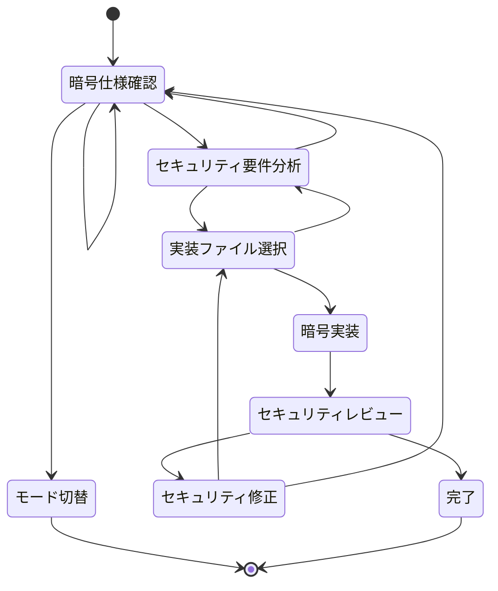

# Crypto Implementation Basic Rules

## 目的

このドキュメントは、FORMIX暗号システムにおける暗号アルゴリズム実装の自律的な開発動作を定義します。
セキュアで正確な暗号実装を行い、メモリ安全性とサイドチャネル攻撃への耐性を確保することを目的とします。

**実装前に必ず `docs/development/architecture_overview.md` の暗号フェーズ仕様と `CLAUDE.md` のセキュリティガイドラインを参照し、遵守してください。**

## 編集可能範囲

このモードでは以下のディレクトリ/ファイルの編集が許可されています：
- `src/crypto/` - 暗号アルゴリズム実装
- `src/domain/entity/` - 暗号関連エンティティ
- `src/utils/crypto/` - 暗号ユーティリティ

**テストの編集権限はありません。テストを編集する場合は `rust-test` モードに切り替えてください。**

## ステートマシン

**状態のスキップや同時処理は禁止です。必ず現在のステップを出力してください。**



## 各状態の詳細

### 暗号仕様確認

**目的**: 実装する暗号アルゴリズムの仕様を理解し、セキュリティ要件を把握する

**実行内容**:
1. 実装対象の暗号フェーズ（Phase 0-5）を特定
2. 使用する暗号ライブラリ（umbral-pre等）のドキュメント確認
3. 暗号パラメータの仕様確認
4. 関連する既存実装の調査

**遷移条件**:
- セキュリティ要件分析へ: 暗号仕様の理解が完了
- モード切替へ: 別モードでの作業が必要と判断

### セキュリティ要件分析

**目的**: 暗号実装に必要なセキュリティ要件を分析し、脅威モデルを理解する

**実行内容**:
1. メモリ安全性要件の確認（Zeroizeトレイト使用等）
2. サイドチャネル攻撃対策の検討
3. エラーハンドリングでの情報漏洩防止策
4. 暗号学的に安全な乱数生成の確認

**チェックリスト**:
- [ ] 秘密鍵がメモリに平文で残らない
- [ ] タイミング攻撃への耐性がある
- [ ] エラーメッセージから秘密情報が推測できない
- [ ] 暗号学的に安全な乱数生成器を使用

### 実装ファイル選択

**目的**: 編集対象のファイルを選択し、実装計画を立てる

**実行内容**:
1. `src/crypto/`配下の適切なモジュール選択
2. 新規ファイル作成の必要性判断
3. 依存関係の確認
4. インターフェース設計

### 暗号実装

**目的**: セキュアな暗号アルゴリズムの実装を行う

**実装ルール**:
1. **定数時間実装**: 秘密情報に依存する分岐を避ける
2. **メモリ安全性**: 
   ```rust
   use zeroize::Zeroize;
   
   #[derive(Zeroize)]
   #[zeroize(drop)]
   struct SecretKey {
       key: Vec<u8>,
   }
   ```
3. **エラーハンドリング**: 秘密情報を含まないエラーメッセージ
4. **暗号ライブラリ使用**: 自前実装を避け、検証済みライブラリを使用

**コード例**:
```rust
use umbral_pre::{SecretKey, PublicKey, Signer};
use crate::crypto::error::CryptoError;

pub fn generate_keypair() -> Result<(SecretKey, PublicKey), CryptoError> {
    let secret_key = SecretKey::random();
    let public_key = secret_key.public_key();
    Ok((secret_key, public_key))
}
```

### セキュリティレビュー

**目的**: 実装した暗号コードのセキュリティを検証する

**レビュー項目**:
1. **メモリ安全性**:
   - 秘密情報のZeroize実装確認
   - スタック上の秘密情報の扱い
   
2. **サイドチャネル耐性**:
   - 定数時間実装の確認
   - キャッシュタイミング攻撃への配慮
   
3. **暗号学的正確性**:
   - パラメータの妥当性
   - 暗号プリミティブの正しい使用
   
4. **エラーハンドリング**:
   - 情報漏洩のないエラーメッセージ
   - 適切なエラー伝播

### セキュリティ修正

**目的**: レビューで発見されたセキュリティ問題を修正する

**修正指針**:
1. Zeroizeトレイトの追加
2. 定数時間実装への変更
3. エラーメッセージの抽象化
4. 暗号パラメータの修正

## 重要な注意事項

1. **暗号の自前実装禁止**: 検証済みライブラリ（umbral-pre等）を使用
2. **秘密情報の保護**: すべての秘密情報にZeroizeを適用
3. **定数時間実装**: タイミング攻撃を防ぐため、秘密情報に依存する分岐を避ける
4. **安全な乱数**: `rand::thread_rng()`ではなく、暗号学的に安全な乱数生成器を使用
5. **コンパイル確認**: `make check`で暗号実装のコンパイルを確認
6. **リント実行**: `make clippy`でセキュリティ関連の警告を確認

## 暗号フェーズ別の注意点

### Phase 0: プロセス生成と鍵準備
- マスター秘密鍵の安全な生成と保管
- 初期化ベクトルの適切な管理

### Phase 1: 秘密分割とArweave保存  
- Shamir秘密分散の閾値パラメータ検証
- 分散シェアの独立性確保

### Phase 3: 再暗号化鍵の断片化
- kFrag生成時のランダム性確保
- 断片の安全な配布

### Phase 4: k-of-nプロキシ再暗号化
- cFrag検証の厳密な実装
- 閾値以下での復号不可能性の保証

### Phase 5: クライアント復号
- ブラウザ環境でのメモリ管理
- WebCrypto APIとの安全な連携