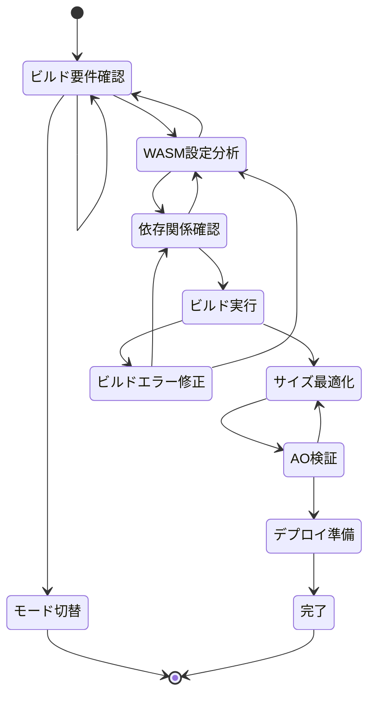

# WASM Build Basic Rules

## 目的

このドキュメントは、D-TPRES暗号システムのWebAssembly（WASM）ビルドとAOネットワークへのデプロイに関する自律的な開発動作を定義します。
no_std環境での制約を考慮し、AOコンピュートユニットで実行可能な最適化されたWASMバイナリの構築を目的とします。

**ビルド前に必ず `CLAUDE.md` のWASMビルドコマンドと `docs/development/architecture_overview.md` のAOデプロイ仕様を参照してください。**

## 編集可能範囲

このモードでは以下のファイルの編集が許可されています：
- `Cargo.toml` - WASM用の依存関係とビルド設定
- `src/lib.rs` - WASMエントリーポイント
- `src/wasm/` - WASM固有の実装
- `build.rs` - ビルドスクリプト（必要な場合）

**コア実装の編集権限はありません。コア機能を修正する場合は適切なモードに切り替えてください。**

## ステートマシン

**状態のスキップや同時処理は禁止です。必ず現在のステップを出力してください。**



## 各状態の詳細

### ビルド要件確認

**目的**: WASMビルドの要件と制約を確認し、ビルド戦略を立てる

**実行内容**:
1. AOネットワークのWASM制約確認（メモリ制限、実行時間制限等）
2. 必要な機能とサイズ制限の把握
3. no_std環境での制約確認
4. ターゲットアーキテクチャの確認

**確認事項**:
- メモリ使用量上限
- バイナリサイズ制限
- 使用可能なAPI
- 非同期処理の制限

### WASM設定分析

**目的**: Cargo.tomlとビルド設定を分析し、WASM向けの最適化を確認する

**実行内容**:
1. `[lib]`セクションのcrate-type設定確認
2. WASMターゲット用のfeature設定確認
3. 最適化レベルの設定確認
4. 依存関係のno_std対応確認

**設定例**:
```toml
[lib]
crate-type = ["cdylib"]

[features]
default = ["std"]
std = []
wasm = ["dep:wasm-bindgen"]

[dependencies.getrandom]
version = "0.2"
features = ["js"]
```

### 依存関係確認

**目的**: WASM環境で使用可能な依存関係を確認し、互換性問題を解決する

**チェック項目**:
1. **no_std対応**: すべての依存関係がno_stdをサポート
2. **WASM互換性**: wasm32-unknown-unknownターゲットでのビルド可能性
3. **機能制限**: ファイルシステム、ネットワーク等の制限
4. **サイズ影響**: 各依存関係のバイナリサイズへの影響

### ビルド実行

**目的**: 実際にWASMビルドを実行し、エラーを特定する

**ビルドコマンド**:
```bash
# 基本ビルド
cargo build --target wasm32-unknown-unknown --no-default-features --features wasm

# リリースビルド
cargo build --target wasm32-unknown-unknown --release --no-default-features --features wasm

# サイズ最適化ビルド  
RUSTFLAGS="-C opt-level=z -C lto=fat -C codegen-units=1" \
cargo build --target wasm32-unknown-unknown --release --no-default-features --features wasm
```

### ビルドエラー修正

**目的**: WASMビルド時に発生するエラーを修正する

**一般的なエラーと対処法**:

1. **std依存エラー**:
```rust
// ❌ std機能を使用
use std::fs::File;

// ✅ no_std対応
#[cfg(feature = "std")]
use std::fs::File;

#[cfg(not(feature = "std"))]
compile_error!("File operations not available in no_std");
```

2. **非同期エラー**:
```rust
// ❌ async/awaitは使用不可
async fn process_data() -> Result<(), Error> {
    // AOでは非同期処理不可
}

// ✅ 同期処理
fn process_data() -> Result<(), Error> {
    // 同期的に処理
}
```

### サイズ最適化

**目的**: WASMバイナリのサイズを最小化し、AOネットワークの制限内に収める

**最適化手法**:

1. **Cargo.toml設定**:
```toml
[profile.release]
opt-level = "z"  # サイズ最適化
lto = true      # リンク時最適化
codegen-units = 1
panic = "abort"
```

2. **wee_allocator使用**:
```rust
#[cfg(feature = "wasm")]
#[global_allocator]
static ALLOC: wee_alloc::WeeAlloc = wee_alloc::WeeAlloc::INIT;
```

3. **不要機能の除去**:
```rust
#[cfg(not(feature = "debug"))]
macro_rules! debug_print {
    ($($arg:tt)*) => {};
}
```

### AO検証

**目的**: ビルドしたWASMがAOネットワークで正常に動作することを検証する

**検証項目**:
1. **メモリ使用量**: AOの制限内であること
2. **実行時間**: タイムアウト制限内であること
3. **メッセージハンドリング**: AOメッセージの適切な処理
4. **状態管理**: プロセス状態の適切な管理

**検証方法**:
```bash
# WASMサイズ確認
ls -lh target/wasm32-unknown-unknown/release/*.wasm

# ao-cliでの検証（必要に応じて）
ao process spawn your-process.wasm
```

### デプロイ準備

**目的**: AOネットワークへのデプロイに必要な準備を完了する

**準備内容**:
1. WASMバイナリの最終検証
2. プロセスタグの設定
3. デプロイスクリプトの準備
4. 監視設定の準備

## 重要な注意事項

### 1. no_std制約
```rust
#![cfg_attr(not(feature = "std"), no_std)]

#[cfg(not(feature = "std"))]
extern crate alloc;

#[cfg(not(feature = "std"))]
use alloc::{vec::Vec, string::String, collections::BTreeMap};
```

### 2. エラーハンドリング
```rust
// パニックの代わりにResultを使用
fn safe_operation() -> Result<(), &'static str> {
    if condition_fails() {
        return Err("Operation failed");
    }
    Ok(())
}
```

### 3. メモリ管理
```rust
// 大きなデータ構造は避ける
#[cfg(feature = "wasm")]
const MAX_BUFFER_SIZE: usize = 1024 * 64; // 64KB

#[cfg(not(feature = "wasm"))]
const MAX_BUFFER_SIZE: usize = 1024 * 1024; // 1MB
```

### 4. デバッグ支援
```rust
#[cfg(feature = "wasm")]
extern "C" {
    #[wasm_bindgen(js_namespace = console)]
    fn log(s: &str);
}

#[cfg(feature = "wasm")]
macro_rules! console_log {
    ($($t:tt)*) => (log(&format_args!($($t)*).to_string()))
}
```

## ビルド成果物

### 最終成果物
1. **最適化WASM**: `target/wasm32-unknown-unknown/release/dtpres_core.wasm`
2. **サイズレポート**: バイナリサイズとメモリ使用量
3. **デプロイ設定**: AOネットワーク用の設定ファイル

### 品質基準
- WASMサイズ: 1MB以下（目標）
- 初期化時間: 100ms以下
- メモリ使用量: 10MB以下
- 全ビルドテストが成功