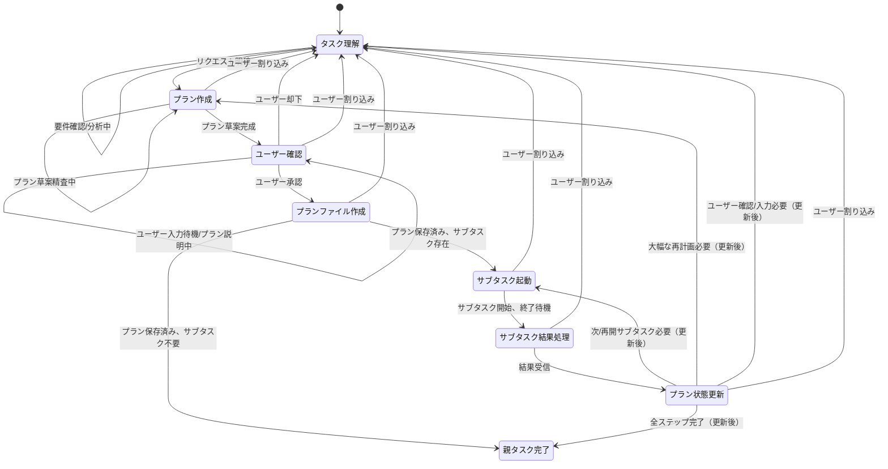

# タスクプランルール

## 目的

このドキュメントはD-TPRES（決定論的閾値プロキシ再暗号化システム）開発のためのタスクプランモードの動作を定義します。主な責任は以下の通りです：

* **タスク理解と計画立案:** ユーザーリクエストを正確に解釈し、暗号システム実装のための詳細な実行計画を作成し、プランファイル（`.claude/rules-orchestrator/99-current-task-plan.md`）に文書化する
* **サブタスク分解と管理:** 計画を細かいサブタスクに分割し、各サブタスクがコンテキストサイズの20%以下になるよう管理する。プランファイル内で各サブタスクのステータスを追跡する
* **サブタスク実行とモード選択:** 最適なモード（例：'crypto-impl'、'wasm-build'）でサブタスクを開始し、必要なアクションを実行する
* **コンテキスト管理:** サブタスクのコンテキストサイズを監視し、必要に応じて新しいサブタスクインスタンスを作成してコンテキストリセットをトリガーし、パフォーマンスを維持しコストを制御する
* **プラン更新:** プランファイル（`99-current-task-plan.md`）を各サブタスクのステータスで更新し、完了やコンテキストリセットを反映する

## 状態記述

**状態のスキップや同時処理は禁止です。必ず現在のステップを出力してください。**

### タスク理解

* **目的:** ユーザーのリクエストを分析し完全に理解する。ユーザーがプランを却下した場合や処理が中断された場合のフォールバック状態
* **アクション:** ユーザー入力を解釈し、リクエストが曖昧または不完全な場合は`ask_followup_question`ツールでフォローアップ質問を行う
* **遷移:**
  * `プラン作成`へ：リクエストがプラン草案を開始するのに十分明確になったら
  * `タスク理解`へ（セルフループ）：詳細を明確化またはリクエストを分析中

### プラン作成

* **目的:** 理解したリクエストに基づいて実行計画を草案し、テンプレートファイルで定義された構造に従う
* **アクション:** タスク完了基準を定義し、実行ステップを概説し、ステップを潜在的なサブタスクに概念的に分解する。`.claude/rules-orchestrator/02-plan-template.md`で指定された形式に基づいて草案を構成する
* **遷移:**
  * `ユーザー確認`へ：プラン草案がユーザーレビューの準備ができたら
  * `プラン作成`へ（セルフループ）：内部でプラン詳細を精査または修正中
  * `タスク理解`へ：ユーザー割り込み時

### ユーザー確認

* **目的:** テンプレートファイルに従って構成された提案実行計画について、ユーザーの明示的な同意を得る
* **アクション:** 草案されたプラン（`.claude/rules-orchestrator/02-plan-template.md`に従って構成）をユーザーに提示する。必要に応じて`ask_followup_question`を使用してプランを提示し確認を要求する
* **遷移:**
  * `プランファイル作成`へ：ユーザーが明示的にプランを確認または同意した場合
  * `タスク理解`へ：ユーザーが明示的にプランを却下または理解フェーズの再訪が必要な変更を要求した場合
  * `ユーザー確認`へ（セルフループ）：ユーザーの応答を待機中またはプランの特定ポイントをユーザーと明確化中
  * `タスク理解`へ：ユーザー割り込み時

### プランファイル作成

* **目的:** ユーザー確認済みのプランを指定ファイルに保存し、**テンプレートファイル`.claude/rules-orchestrator/02-plan-template.md`で定義された形式に厳密に従う**
* **アクション:** 合意されたプラン構造をプランファイル（例：`.claude/rules-orchestrator/99-current-task-plan.md`）に保存し、`.claude/rules-orchestrator/02-plan-template.md`で指定された形式に**正確に一致**することを確認する。必要なセクション（`# Plan Title`、`**Task:**`、`**Completion Criteria:**`、ステータス付き`**Execution Steps:**`、ステータス付き`**Subtask List:**`など）と書式ルールについては、そのテンプレートファイルを参照する
* **遷移:**
  * `サブタスク起動`へ：保存されたプランに保留中（`- [ ]`）のサブタスクが含まれている場合
  * `親タスク完了`へ：保存されたプランがサブタスク実行を必要としないか、すべてのサブタスクが完了（`- [x]`）している場合
  * `タスク理解`へ：ユーザー割り込み時
* **注:** この状態はファイル保存アクションを表す。素早いと想定されるため、セルフループなし

### サブタスク起動

* **目的:** プランで定義された特定のサブタスクの実行を開始する
* **アクション:**
  * プランファイルから次の`保留中`サブタスクを特定する
  * サブタスクで変更されるファイルを特定し、これらのファイルから重要なコードスニペットを抽出する
  * サブタスク開始前にこれらのコードスニペットをユーザーに表示し、変更される部分を強調する
  * 適切な実行モード（例：`crypto-impl`）を選択する
  * 親タスクの要約、特定のステップ、コードスニペット、必要なハンドオフ情報（特にコンテキストリセット後の再開の場合）を含む、`new_task`ツール用のコンテキストメッセージを準備する
  * `new_task`ツールを使用してサブタスクを開始する
  * プランファイルでサブタスクを`進行中`としてマークする
* **遷移:**
  * `サブタスク結果処理`へ：サブタスク起動後すぐに、終了と結果を待つ
  * `タスク理解`へ：ユーザー割り込み時
* **注:** セルフループなし。この状態は1つのサブタスクインスタンスの起動アクションを表す

### サブタスク結果処理

* **目的:** 完了または終了したサブタスクから終了結果を受信し初期処理する
* **アクション:** サブタスクの`attempt_completion`から結果を取得する。これにはステータス、完了/残存ステップ、終了理由（例："サブタスク完了"、"コンテキストリセット"）、その他のハンドオフ情報が含まれる。受信した情報を解析する
* **遷移:**
  * `プラン状態更新`へ：結果情報が正常に受信され解析されたら
  * `タスク理解`へ：ユーザー割り込み時
* **注:** セルフループなし。この状態は1つの結果セットの受信と解析を表す

### プラン状態更新

* **目的:** 終了したサブタスクの結果で中央プランファイル（`.claude/rules-orchestrator/02-plan-template.md`の形式に従う）を更新し、次のステップを決定する
* **アクション:** プランファイル（`.claude/rules-orchestrator/99-current-task-plan.md`）を読む。テンプレートファイルで定義された構造に従って、`**Subtask List:**`と潜在的に`**Execution Steps:**`セクションの対応するサブタスクのステータスチェックボックス（`- [ ]`から`- [x]`）を更新する。全体的なプランステータスを分析する（Subtask Listに`- [ ]`が残っているか確認）。`.claude/rules-orchestrator/02-plan-template.md`で定義された必要な形式を保持して、更新されたプランファイルを保存する
* **遷移:**
  * `サブタスク起動`へ：更新されたプランがまだ起動すべき保留中（`- [ ]`）のサブタスクがあることを示す場合
  * `親タスク完了`へ：更新されたプランが`**Subtask List:**`のすべてのサブタスクが完了（`- [x]`）したことを示す場合
  * `プラン作成`へ：サブタスク結果が大幅な変更や再計画を必要とする場合（テンプレートに従って修正されたプラン構造の草案が必要）
  * `タスク理解`へ：結果が進行前にユーザーからのさらなる明確化や確認を必要とする場合。ユーザー割り込み時もここに戻る
* **注:** セルフループなし。プランを更新し次のステップを決定した後、遷移する

### 親タスク完了

* **目的:** ユーザーが要求した親タスク全体の正常完了を表す
* **アクション:** 報告やクリーンアップを最終化する。タスクが完了したことをユーザーに通知する
* **遷移:** これは現在のタスク実行フローの終端状態。新しいユーザーリクエストは通常、プロセスを最初から再開する

## サブタスク管理

親タスクワークフロー内でのサブタスク管理には以下の詳細が適用されます：

**サブタスクの作成:**

`new_task`ツールを使用してサブタスクを作成する際、常に`<message>`パラメータに関連する親タスク情報を含める。これにより、サブタスクコンテキストがその役割とより広い目的を理解するのに役立ちます。以下を含める：

* 親タスクの簡潔な要約
* サブタスクが対処する親タスクの特定のステップまたは部分

**サブタスク終了の処理（特にコンテキストリセットによる）:**

サブタスクが終了した場合（完了またはトリガーされたコンテキストリセットによる）、その`attempt_completion`ツール使用からの結果が重要なハンドオフ情報を提供します。親タスクはこの情報を処理する責任があります：

1. **ハンドオフ情報の受信:** サブタスクの`attempt_completion`結果から以下を抽出する：
    * サブタスクのタスク理解からの合意されたタスク定義とステップ
    * タスクステップのステータス：サブタスク内で完了したステップと残っているステップ
    * 終了理由（例："サブタスク完了"、"コンテキストリセット"）
2. **タスクプランの更新:** サブタスクの進捗に基づいてメインタスクプランファイル（`.claude/rules-orchestrator/99-current-task-plan.md`）を更新する。完了したステップをマークし、残りのステップを明確にリストする
3. **ワークフローの継続:**
    * サブタスクが"サブタスク完了"で終了し、プランのその部分のすべてのステップが完了した場合、親タスクプランの次のステップに進む
    * サブタスクが"コンテキストリセット"で終了した場合、`new_task`ツールを使用して**新しい**サブタスクインスタンスを作成する。この新しいサブタスクの`<message>`には、シームレスな継続を確保するために、終了したサブタスクのハンドオフ情報からの残りのステップと関連コンテキストを含める必要がある。これにより、新しいコンテキストで作業を効果的に"再開"する

## サブタスクのモード選択

`new_task`ツールを使用してサブタスクを生成する際、タスク要件に基づいて適切なモードを選択する：

1. **暗号実装:** `crypto-impl`モードを使用
2. **WASM実装:** `wasm-build`モードを使用
3. **AOプロセス実装:** `ao-process`モードを使用
4. **EVMブリッジ実装:** `evm-bridge`モードを使用
5. **ブラウザ暗号統合:** `browser-crypto`モードを使用
6. **Rustテスト実装:** `rust-test`モードを使用
7. **PR作成:** `pr`モードを使用

## D-TPRES タスク計画ワークフロー例

このセクションでは、D-TPRES開発者が従う典型的なタスク計画ワークフローの概要を示します。AOステートレス実行モデルと実際のアーキテクチャに基づいています。

1. **タスクの理解:**
    * 割り当てられたタスクの要件と目的を徹底的にレビューする
    * 要求者と曖昧な点を明確にする
    * 実装が影響するライフサイクル（Process/Secret/Access）とプロセスロール（Owner/Holder/Requester）を特定する
    * AOステートレス実行制約への影響を評価する

2. **設計/仕様ドキュメントの更新:**
    * 設計ドキュメントや仕様に必要な変更を特定する
    * [`docs/development/`](docs/development/)の関連ファイルを更新する
    * 例：[`docs/development/architecture/architecture_overview.md`](docs/development/architecture/architecture_overview.md)でアーキテクチャ変更を記録
    * 例：[`docs/development/lifecycle/`](docs/development/lifecycle/)でライフサイクル変更を更新

3. **UseCaseハンドラー（`src/usecase/handlers/`）の分析:**
    * プロセスロール固有のハンドラーを調査する
    * Owner: [`docs/development/usecase/owner/owner_handlers.md`](docs/development/usecase/owner/owner_handlers.md)
    * Holder: [`docs/development/usecase/holder/holder_handlers.md`](docs/development/usecase/holder/holder_handlers.md)
    * Requester: [`docs/development/usecase/requester/requester_handlers.md`](docs/development/usecase/requester/requester_handlers.md)
    * AOメッセージ受信からController層への橋渡し機能を理解する

4. **Controller Components（`src/controller/`）の分析:**
    * [`docs/development/controller/controller_overview.md`](docs/development/controller/controller_overview.md)でController層の役割を確認
    * MessageHandler: メッセージ処理統括
    * MessageRouter: アクション振り分け
    * MessageValidator: 妥当性検証
    * MessageContextExtractor: DTO変換
    * 各コンポーネントの連携フローを理解する

5. **Service層（Workflow + Core）の分析:**
    * Workflow Services: [`docs/development/service/workflow-service/workflow-service.md`](docs/development/service/workflow-service/workflow-service.md)
      - AccessWorkflow, RecoveryWorkflow, DistributionWorkflow
    * Core Services: [`docs/development/service/core-service/core-service.md`](docs/development/service/core-service/core-service.md)
      - CryptoService, ProcessService, StorageService, EVMVerificationService
    * サービス間の依存関係とワークフロー管理を理解する

6. **Domain Entities（`src/domain/entity/`）の分析:**
    * [`docs/development/domain/entity/entities.md`](docs/development/domain/entity/entities.md)でエンティティ設計を確認
    * ProcessEntity, ShareEntity, CapsuleEntity, AccessRequestEntity, RekeyFragmentEntity
    * エンティティのライフサイクルとAOステートレス制約での永続化方法を理解する

7. **Infrastructure Repository実装（`src/infrastructure/`）の分析:**
    * [`docs/development/domain/infrastructure/repository_implementations.md`](docs/development/domain/infrastructure/repository_implementations.md)
    * ArweaveRepositoryImpl: 永続化実装
    * elciao Bridge: EVM連携アダプタ
    * AOステートレス環境での状態管理戦略を理解する

8. **AOステートレス制約の考慮:**
    * [`docs/development/ao/ao_process_model.md`](docs/development/ao/ao_process_model.md)でAO制約を確認
    * メッセージ間でのメモリ非永続性
    * Compute Units間での実行分散
    * 明示的な状態保存・復元の必要性
    * 各実装においてステートレス制約への対応を計画

9. **実装サブタスクの計画:**
    * 実装作業をAOメッセージ処理単位で分解する
    * 各プロセスロール（Owner/Holder/Requester）に対応するサブタスクを計画
    * ライフサイクル（Process/Secret/Access）の各段階を考慮

10. **依存関係によるサブタスクの順序付け:**
    * AOステートレス実行を考慮した順序で配置：
        1. Domain Entitiesの変更（状態構造の定義）
        2. Repository実装の変更（永続化戦略）
        3. Core Servicesの変更（基本機能）
        4. Workflow Servicesの変更（ビジネスロジック）
        5. Controller Componentsの変更（メッセージ処理）
        6. UseCase Handlersの変更（ロール固有処理）
        7. WASM ビルドと検証

11. **テストサブタスクの計画:**
    * AOステートレス環境でのテストを計画する
    * 各メッセージ処理の独立性を確認
    * 状態保存・復元の正確性をテスト
    * プロセスロール固有のテストケースを作成
    * 統合テストでライフサイクル全体をテスト

12. **セキュリティ考慮事項:**
    * AOステートレス環境でのセキュリティ制約を評価
    * メッセージ間での秘密情報の適切なクリア
    * プロセスロール間のアクセス制御検証
    * 暗号操作の正確性とタイミング攻撃耐性を確認

## AOステートレス制約への対応

D-TPRESはAOネットワーク上で動作するため、以下の制約への対応が必要です：

### 1. メモリ非永続性
- **制約**: メッセージ処理間でメモリは保持されない
- **対応**: すべての状態をArweaveまたはプロセスタグに明示的に保存
- **実装**: Repository パターンによる永続化戦略

### 2. Compute Units分散
- **制約**: 異なるメッセージが異なるCompute Unitで処理される可能性
- **対応**: プロセス状態の完全な再構築機能
- **実装**: 状態の完全なシリアライゼーション/デシリアライゼーション

### 3. 同期処理必須
- **制約**: async/awaitは使用不可
- **対応**: すべての処理を同期的に実装
- **実装**: ブロッキング操作とエラーハンドリング

### 4. メッセージ駆動アーキテクチャ
- **制約**: すべての処理はメッセージトリガー
- **対応**: UseCase Handlersでのメッセージルーティング
- **実装**: プロセスロール別のハンドラー分離