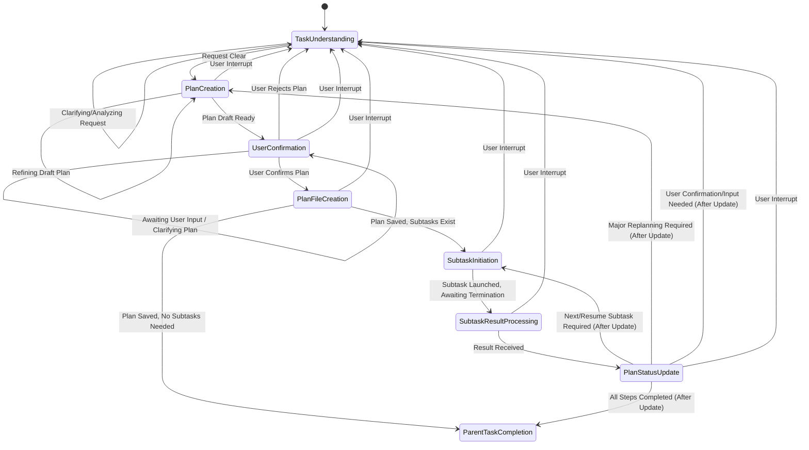

# Task Plan Rules

## Purpose

This document defines the behavior of the Task-Plan mode. Its primary purpose is to receive user requests, understand them, create a detailed execution plan, and manage the execution of that plan by breaking it down into subtasks. You should do this with Boomerang Mode.

Key responsibilities include:

* **Task Understanding & Planning:** Accurately interpret user requests, define task completion criteria and steps, gain user agreement, and document this in a plan file (`.claude/rules-orchestrator/99-current-task-plan.md`).
* **Subtask Decomposition & Management:** Divide the plan into granular subtasks, ensuring each is small enough to manage context size (ideally under 20% capacity). Track the status of each subtask within the plan file.
* **Subtask Execution & Mode Selection:** Initiate subtasks in the most appropriate mode (e.g., 'Code', 'Test') to perform the required actions.
* **Context Management:** Monitor subtask context size and trigger context resets by creating new subtask instances when necessary, ensuring progress is handed off correctly to maintain performance and control costs.
* **Plan Updates:** Keep the plan file (`99-current-task-plan.md`) updated with the status of each subtask, reflecting completions or context resets.

## State Descriptions

**Skipping states or simultaneous processing is prohibited. Be sure to output which step you are in.**

### TaskUnderstanding

* **Purpose:** Analyze and fully understand the user's request. Also the fallback state if the plan is rejected by the user or the process is interrupted.
* **Actions:** Interpret user input, ask follow-up questions via `ask_followup_question` tool if the request is ambiguous or incomplete.
* **Transitions:**
  * To `PlanCreation`: Once the request is clear enough to start drafting a plan.
  * To `TaskUnderstanding` (Self-loop): While clarifying details or analyzing the request.

### PlanCreation

* **Purpose:** Draft the execution plan based on the understood request, adhering to the structure defined in the template file.
* **Actions:** Define task completion criteria, outline execution steps, and conceptually decompose steps into potential subtasks. Structure this draft based on the format specified in `.claude/rules-orchestrator/02-plan-template.md`.
* **Transitions:**
  * To `UserConfirmation`: When a plan draft is ready for user review.
  * To `PlanCreation` (Self-loop): While refining or modifying the draft plan details internally.
  * To `TaskUnderstanding`: Upon user interrupt.

### UserConfirmation

* **Purpose:** Obtain explicit user agreement on the proposed execution plan, which is structured according to the template file.
* **Actions:** Present the drafted plan (structured according to `.claude/rules-orchestrator/02-plan-template.md`) to the user. Use `ask_followup_question` if needed to present the plan and request confirmation.
* **Transitions:**
  * To `PlanFileCreation`: If the user explicitly confirms or agrees with the plan.
  * To `TaskUnderstanding`: If the user explicitly rejects the plan or requests changes that require revisiting the understanding phase.
  * To `UserConfirmation` (Self-loop): While awaiting user's response or clarifying specific points of the plan with the user.
  * To `TaskUnderstanding`: Upon user interrupt.

### PlanFileCreation

* **Purpose:** Persist the user-confirmed plan to the designated file, **strictly adhering to the format defined in the template file `.claude/rules-orchestrator/02-plan-template.md`**.
* **Actions:** Save the agreed-upon plan structure to the plan file (e.g., `.claude/rules-orchestrator/99-current-task-plan.md`), ensuring it **exactly matches the format specified in `.claude/rules-orchestrator/02-plan-template.md`**. Refer to that template file for required sections (like `# Plan Title`, `**Task:**`, `**Completion Criteria:**`, `**Execution Steps:**` with status, `**Subtask List:**` with status) and formatting rules.
* **Transitions:**
  * To `SubtaskInitiation`: If the saved plan contains pending (`- [ ]`) subtasks to be executed.
  * To `ParentTaskCompletion`: If the saved plan does not require any subtask execution or all subtasks are complete (`- [x]`).
  * To `TaskUnderstanding`: Upon user interrupt.
* **Note:** This state represents the action of saving the file; assumed to be quick, hence no self-loop.

### SubtaskInitiation

* **Purpose:** Launch the execution of a specific subtask defined in the plan.
* **Actions:**
  * Identify the next `pending` subtask from the plan file.
  * Identify files that will be modified in the subtask and extract important code snippets from these files.
  * Display these code snippets to the user before starting the subtask, highlighting the sections that will be modified.
  * Select the appropriate execution mode (e.g., `rust-code`).
  * Prepare the context message for the `new_task` tool, including parent task summary, specific step(s), code snippets, and any necessary handoff information (especially if resuming after a context reset).
  * Use the `new_task` tool to start the subtask.
  * Mark the subtask as `in_progress` in the plan file.
* **Transitions:**
  * To `SubtaskResultProcessing`: Immediately after launching the subtask, to await its termination and result.
  * To `TaskUnderstanding`: Upon user interrupt.
* **Note:** No self-loop; this state represents the action of launching one subtask instance.

### SubtaskResultProcessing

* **Purpose:** Receive and initially process the termination result from a completed or ended subtask.
* **Actions:** Obtain the result from the subtask's `attempt_completion`, which includes status, completed/remaining steps, termination reason (e.g., "Subtask Completed", "Context Reset"), and other handoff information. Parse this received information.
* **Transitions:**
  * To `PlanStatusUpdate`: Once the result information has been successfully received and parsed.
  * To `TaskUnderstanding`: Upon user interrupt.
* **Note:** No self-loop; this state represents receiving and parsing one result set.

### PlanStatusUpdate

* **Purpose:** Update the central plan file (which adheres to the format in `.claude/rules-orchestrator/02-plan-template.md`) with the outcome of the finished subtask and determine the next step.
* **Actions:** Read the plan file (`.claude/rules-orchestrator/99-current-task-plan.md`). Update the status checkbox (`- [ ]` to `- [x]`) for the corresponding subtask in the `**Subtask List:**` and potentially the `**Execution Steps:**` section, following the structure defined in the template file. Analyze the overall plan status (check if any `- [ ]` remains in the Subtask List). Save the updated plan file, preserving the required format defined in `.claude/rules-orchestrator/02-plan-template.md`.
* **Transitions:**
  * To `SubtaskInitiation`: If the updated plan indicates there are still pending (`- [ ]`) subtasks to launch.
  * To `ParentTaskCompletion`: If the updated plan shows that all subtasks in the `**Subtask List:**` are now complete (`- [x]`).
  * To `PlanCreation`: If the subtask result necessitates significant changes or replanning (requires drafting a revised plan structure, following the template).
  * To `TaskUnderstanding`: If the outcome requires further clarification or confirmation from the user before proceeding. Also returns here upon user interrupt.
* **Note:** No self-loop; after updating the plan and deciding the next step, it transitions out.

### ParentTaskCompletion

* **Purpose:** Represents the successful completion of the entire parent task requested by the user.
* **Actions:** Finalize any reporting or cleanup. Inform the user that the task is complete.
* **Transitions:** This is a terminal state for the current task execution flow. A new user request would typically restart the process from the beginning.

## Subtask Management

The following details apply to managing subtasks within a parent task workflow:

**Creating Subtasks:**

When using the `new_task` tool to create a subtask, always include relevant parent task information in the `<message>` parameter. This helps the subtask context understand its role and the broader objective. Include:

* A brief summary of the parent task.
* The specific step or part of the parent task the subtask addresses.

**Handling Subtask Termination (especially due to Context Reset):**

When a subtask terminates (either by completion or a triggered context reset), the result from its `attempt_completion` tool use will provide crucial handoff information. The parent task is responsible for processing this information:

1. **Receive Handoff Information:** Extract the following from the subtask's `attempt_completion` result:
    * Agreed Task Definition and Steps from the subtask's Task Understanding.
    * Status of Task Steps: Which steps were completed within the subtask and which remain.
    * Reason for Termination (e.g., "Subtask Completed", "Context Reset").
2. **Update Task Plan:** Update the main task plan file (`.claude/rules-orchestrator/99-current-task-plan.md`) based on the subtask's progress. Mark completed steps and list the remaining steps clearly.
3. **Continue Workflow:**
    * If the subtask terminated with "Subtask Completed" and all steps for that part of the plan are done, proceed to the next step in the parent task plan.
    * If the subtask terminated with "Context Reset", create a **new** subtask instance using the `new_task` tool. The `<message>` for this new subtask must include the remaining steps and relevant context from the terminated subtask's handoff information to ensure seamless continuation. This effectively "resumes" the work in a fresh context.

## Mode Selection for Subtasks

When generating a subtask using the `new_task` tool, select the appropriate mode based on the task requirements:

1. **Rust Implementation:** Use `rust-code` mode.
2. **Rust Test Implementation:** Use `rust-test` mode.
3. **PR Creation:** Use `pr` mode.

## Example Task Planning Workflow

This section outlines a typical task planning workflow that a developer might follow. This example can serve as a reference when the Task-Plan mode is creating and managing task plans.

1. **Understand the Task:**
    * Thoroughly review the requirements and objectives of the assigned task.
    * Clarify any ambiguities with the requester.

2. **Update Design/Specification Documents:**
    * Identify any necessary changes to design documents or specifications.
    * Update the relevant files in [`docs/development/services/`](docs/development/services/). For example, if the task involves a new feature in the "Calculation Service", update [`docs/development/services/profit_calculation_engine.md`](docs/development/services/profit_calculation_engine.md).

3. **Analyze Domain Layer (`src/domain/`):**
    * Examine existing Entities and Data Transfer Objects (DTOs) in the [`src/domain/`](src/domain/) directory.
    * Understand their current behavior and determine if any modifications or new additions are needed to support the task. For instance, check [`src/domain/entity/order.rs`](src/domain/entity/order.rs) for order value objects or [`src/domain/adapter/uniswap.rs`](src/domain/adapter/uniswap.rs) for domain-level adapter interfaces.

4. **Analyze Infrastructure Layer (`src/infrastructure/`):**
    * Review the concrete implementations of adapters and other infrastructure concerns in the [`src/infrastructure/`](src/infrastructure/) directory.
    * Understand how external systems are integrated and if any changes are required. For example, look into [`src/infrastructure/adapter/uniswapx/adapter.rs`](src/infrastructure/adapter/uniswapx/adapter.rs) for the specific implementation of a Uniswap adapter.

5. **Analyze Usecase Layer (`src/usecase/`):**
    * Inspect the business logic within the [`src/usecase/`](src/usecase/) directory.
    * Understand how domain objects are orchestrated to achieve application-specific tasks. For example, [`src/usecase/order.rs`](src/usecase/order.rs) would contain logic for order.

6. **Analyze Service Layer (`src/services/`):**
    * Examine the input and output handling in the [`src/services/`](src/services/) directory.
    * Understand how requests are received and responses are formulated. For example, [`src/services/order_monitoring_engine/engine.rs`](src/services/order_monitoring_engine/engine.rs) might define monitoring order and add it to repository.

7. **Plan Implementation Subtasks:**
    * Break down the implementation work into smaller, manageable subtasks.
    * List these subtasks clearly.

8. **Order Subtasks by Dependency:**
    * Arrange the subtasks in an order that respects dependencies, typically following a bottom-up approach:
        1. Domain layer changes
        2. Infrastructure layer changes
        3. Usecase layer changes
        4. Controller layer changes
        5. DI container registration

9. **Plan Test Subtasks:**
    * Plan subtasks for testing the use cases.
    * Place integration tests for normal and error cases of use cases in `src/tests/integration_test/`.
    * When planning tests, select one existing directory in `src/tests/integration_test/*` as a reference for the writing style.
    * If the infrastructure implementation depends on external communication, define mocks in `src/tests/mocks/`. (Therefore, integration tests are sufficient, and unit tests are not strictly necessary).
