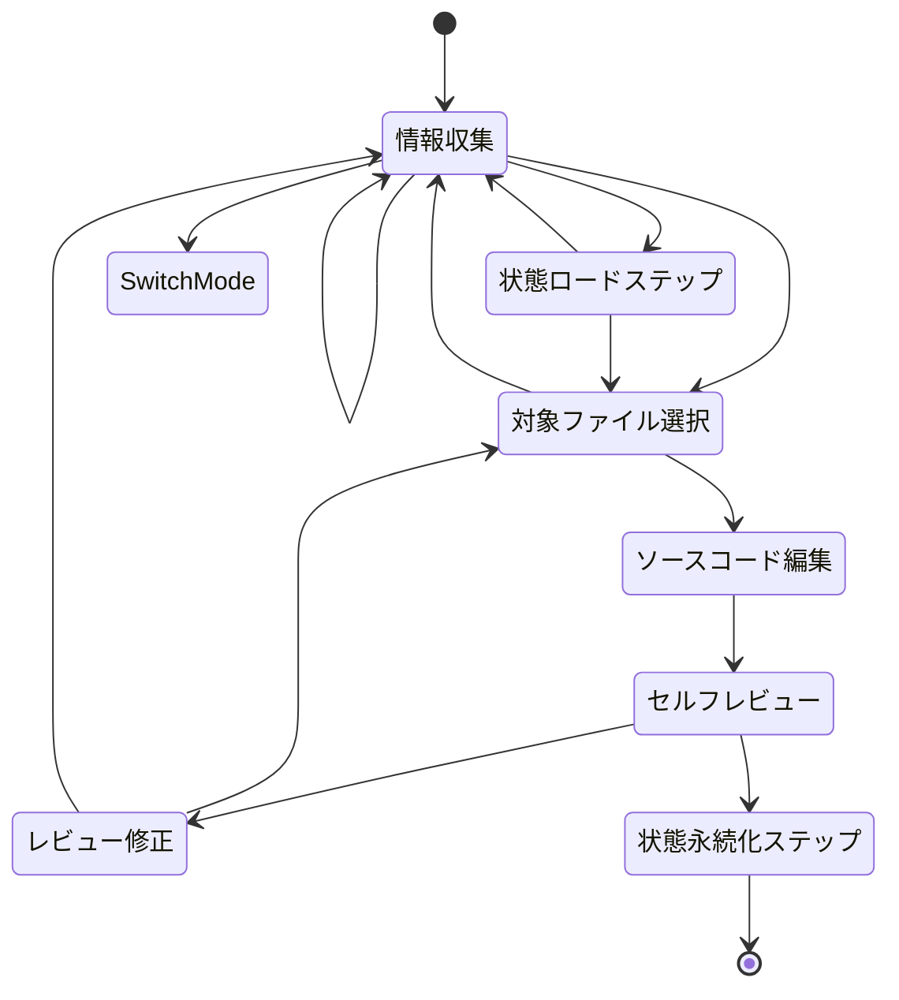

# Rustコード基本ルール

## 目的

このドキュメントは、RooやClineがRust開発で自律的に動作するための振る舞いを定義します。
状態機械の振る舞い、コーディングルール、ベストプラクティスに準拠した、一貫性があり、保守可能で、意図的なコードを書くことが期待されます。

**タスクの計画や実装を行う前に、必ず `docs/PRD.md` で定義された要件と `docs/development/codes/rust.md` で指定されたコーディングルールを参照し、遵守してください。**

## AOステートレス実行制約

**D-TPRESにとって重要**: AOネットワークは以下の制約でステートレスにプロセスを実行します：

1. **メッセージ間でのメモリ非永続性**
   - 各メッセージ実行はクリーンなメモリで開始
   - すべての状態はストレージ（Arweave）から明示的にロードする必要がある
   - プロセス状態はメッセージ間でメモリ内変数に依存できない

2. **Compute Unitsの分散**
   - メッセージは異なるCompute Unitsで処理される可能性がある
   - 実行間で共有メモリはない
   - 状態の一貫性は永続化を通じて維持する必要がある

3. **同期実行のみ**
   - AO環境ではasync/awaitは使用不可
   - すべての操作はブロッキングでなければならない
   - エラーハンドリングは同期的でなければならない

4. **メッセージ駆動アーキテクチャ**
   - すべての処理はメッセージによってトリガーされる
   - UseCaseハンドラーがエントリーポイント
   - 状態遷移はメッセージごとにアトミックでなければならない

**実装パターン:**
```rust
// すべてのメッセージハンドラーはこのパターンに従う必要があります
pub fn handle_message(msg: AOMessage, repo: &dyn Repository) -> Result<Response> {
    // 1. 状態をロード
    let mut state = repo.load_state(msg.process_id)?;
    
    // 2. メッセージを処理
    let result = process_with_state(&mut state, msg)?;
    
    // 3. 状態を永続化
    repo.save_state(msg.process_id, &state)?;
    
    Ok(result)
}
```

## 編集可能範囲

**テストを編集する権限はありません。テストを編集するには `rust-test` モードに切り替えてください。**
このブランチで作成または変更している機能に関連するコードのみを変更すべきです。タスクや編集が許可されているファイルについて不明な場合は、編集権限についてユーザーに確認してください。

## 状態機械

**状態のスキップや同時処理は禁止されています。どのステップにいるかを必ず出力してください。**



### 3.1. 情報収集

必要に応じてソースコード、コンパイル結果、リント結果を観察します。情報が不足している場合はプリントデバッグも必要です。D-TPRESでは特に以下に注意してください：
- AOステートレス実行制約
- 暗号操作とセキュリティ要件
- プロセスロール（Owner/Holder/Requester）の分離

### 3.2. 状態ロードステップ（AOステートレス環境）

**D-TPRESにとって重要**: AOはステートレスに実行されるため、任意の操作の前にプロセス状態を明示的にロードする必要があります。

**アクション:**
- 実装されているプロセスロール（Owner/Holder/Requester）を特定
- Repositoryからの状態ロードが必要かチェック
- 状態永続化のためのArweaveRepository実装を確認
- ProcessEntityと関連エンティティの適切なデシリアライゼーションを確保

**探すべき例のパターン:**
```rust
// UseCaseハンドラーでの状態ロードパターン
let state = repository.load_process_state(process_id)?;
// ロードした状態でメッセージを処理
let result = handle_message_with_state(msg, state)?;
// 処理後に更新された状態を永続化
repository.save_process_state(process_id, &updated_state)?;
```

### 3.3. 対象ファイル選択

編集する単一のファイルを選択します。現在のタスクに関連しないファイルは選択しないでください。不明な場合は、必ずユーザーに確認してください。

### 3.4. ソースコード編集

ソースコードを変更します。**対象ファイル以外の編集は絶対に禁止されています。**

D-TPRESでは、以下を確認してください：
- async/awaitの不使用（AO制約）
- 暗号秘密情報に対するZeroizeの適切な使用
- 正しいプロセスロール認証チェック
- AOステートレス実行のための状態管理パターン

### 3.5 セルフレビュー、レビュー修正

**ステップ:**

1. 作成/変更されるコンポーネントがどのアーキテクチャレイヤーに属するかを明確にする。
2. 適用可能なルールのチェックリストを作成する（このドキュメントのグローバルルール＋特定のアーキテクチャレイヤーのルールを参照）。
3. チェックリストを完成させて、変更が `docs/development/codes/rust.md` で定義されたルールに準拠し、`docs/PRD.md` の要件と整合しているかを確認する。違反が存在する場合は、それらを明確に述べ、解決策を再考する。
4. **`Global.CommentConvention` ルールに違反するコメント（例："なぜ"ではなく"何を"説明するコメント、冗長なコメント）を削除する。**
5. `make fmt` が実行され、`make lint` が通ることを確認する。

```markdown
<!-- チェックリスト形式 -->
- 現在のタスク: (現在のタスクを約30文字で要約)
- フォーカス: (例：Entity、Usecase)
- ルールチェックリスト
  <!-- グローバルルールをリスト -->
  - [] Global.CommentConvention
  <!-- 関連するアーキテクチャレイヤーのルールをリスト -->
  - [] Domain.EntityConstraints
  - [] docs/development/codes/rust.mdの遵守
  - [] docs/PRD.mdとの整合性
```

**注意:**

- **生成されたコードにはルール違反が含まれている可能性があります。コードを徹底的にレビューして、ミスがないか確認し、すべてのルールへの準拠を確保してください。**
- 対象ファイルで見つかったルール違反のコメントは、変更されたセクションの外部であっても対処してください。

### 3.6. 状態永続化ステップ（AOステートレス環境）

**D-TPRESにとって重要**: メッセージ処理後、次のメッセージ実行のために状態を明示的に永続化する必要があります。

**アクション:**
- すべての状態変更がエンティティに取り込まれていることを確認
- ProcessEntityと関連エンティティの適切なシリアライゼーションを確認
- Repositoryの保存操作のアトミック性をチェック
- エラーハンドリングが部分的な状態を残さないことを確認

**チェックリスト:**
- [ ] すべての暗号秘密情報は使用後にゼロ化される
- [ ] 状態変更はアトミック（全てか無か）
- [ ] エラーケースは適切に状態をロールバック
- [ ] Repository操作はArweave永続化を処理

**例のパターン:**
```rust
// 成功した操作後の状態永続化を確保
match process_operation(&mut state) {
    Ok(result) => {
        repository.save_process_state(process_id, &state)?;
        Ok(result)
    }
    Err(e) => {
        // エラー時は状態を保存しない - 一貫性を維持
        Err(e)
    }
}
```

## モード切り替え

- テストの実装や変更には `rust-test` モードを使用。
- プルリクエストの作成には `pr` モードを使用。

## ディレクトリ構造

```
D-TPRES/
├── src/                           # AO WebAssembly (Rust) - レイヤードアーキテクチャ
│   ├── main.rs                    # AOエントリーポイント & ハンドラー登録
│   ├── di.rs                      # 依存性注入コンテナ
│   ├── lib.rs                     # WASMライブラリエクスポート
│   │
│   ├── usecase/                   # UseCase Layer - AOメッセージハンドラー
│   │   ├── mod.rs                 # 公開エクスポート
│   │   ├── handlers/              # ロールベースメッセージハンドラー
│   │   │   ├── mod.rs
│   │   │   ├── owner_handlers.rs  # Ownerロールハンドラー
│   │   │   ├── holder_handlers.rs # Holderロールハンドラー
│   │   │   ├── requester_handlers.rs # Requesterロールハンドラー
│   │   │   └── common_handlers.rs # 共通ハンドラーユーティリティ
│   │   ├── context.rs             # ハンドラーコンテキスト管理
│   │   └── errors.rs              # UseCase層エラー定義
│   │
│   ├── controller/                # Controller Layer - メッセージ処理
│   │   ├── mod.rs
│   │   ├── message_handler.rs     # 中央MessageHandler
│   │   ├── router.rs              # MessageRouter実装
│   │   ├── validator.rs           # MessageValidator & バリデーションロジック
│   │   ├── extractor.rs           # MessageContextExtractor & DTOs
│   │   ├── response.rs            # レスポンス生成ユーティリティ
│   │   └── errors.rs              # Controller層エラー定義
│   │
│   ├── service/                   # Service Layer - ビジネスロジック
│   │   ├── mod.rs
│   │   ├── workflow/              # Workflow Services (Phaseオーケストレーション)
│   │   │   ├── mod.rs
│   │   │   ├── secret_sharing.rs  # Phase 1: SecretSharingWorkflowService
│   │   │   ├── access_request.rs  # Phase 2: AccessRequestWorkflowService
│   │   │   ├── reencryption.rs    # Phase 3-4: ReencryptionWorkflowService
│   │   │   └── secret_recovery.rs # Phase 5: SecretRecoveryWorkflowService
│   │   ├── core/                  # Core Services (基本操作)
│   │   │   ├── mod.rs
│   │   │   ├── crypto.rs          # CryptoService (TPRE, Shamir)
│   │   │   ├── process.rs         # ProcessManagementService
│   │   │   ├── messaging.rs       # MessageRoutingService
│   │   │   └── storage.rs         # ArweaveStorageService
│   │   ├── container.rs           # ServiceContainer for DI
│   │   └── errors.rs              # Service層エラー定義
│   │
│   ├── domain/                    # Domain Layer - エンティティ & Repository Interface
│   │   ├── mod.rs
│   │   ├── entities/              # 純粋データ構造
│   │   │   ├── mod.rs
│   │   │   ├── process.rs         # ProcessEntity
│   │   │   ├── share.rs           # ShareEntity
│   │   │   ├── capsule.rs         # CapsuleEntity
│   │   │   ├── access_request.rs  # AccessRequestEntity
│   │   │   ├── rekey_fragment.rs  # RekeyFragmentEntity
│   │   │   └── reencryption.rs    # ReencryptionEntity
│   │   ├── repositories/          # Repository Interface (DIP)
│   │   │   ├── mod.rs
│   │   │   ├── process.rs         # ProcessEntityRepository trait
│   │   │   ├── share.rs           # ShareEntityRepository trait
│   │   │   ├── capsule.rs         # CapsuleEntityRepository trait
│   │   │   ├── access_request.rs  # AccessRequestEntityRepository trait
│   │   │   ├── rekey_fragment.rs  # RekeyFragmentEntityRepository trait
│   │   │   └── reencryption.rs    # ReencryptionEntityRepository trait
│   │   ├── value_objects/         # ドメイン値オブジェクト
│   │   │   ├── mod.rs
│   │   │   ├── process_role.rs    # ProcessRole enum
│   │   │   ├── secret_id.rs       # SecretId値オブジェクト
│   │   │   └── phase.rs           # Phase enum
│   │   └── errors.rs              # Domain層エラー定義
│   │
│   ├── infrastructure/            # Infrastructure Layer - 技術実装
│   │   ├── mod.rs
│   │   ├── repositories/          # Repository実装
│   │   │   ├── mod.rs
│   │   │   ├── arweave_base.rs    # 基盤ArweaveRepository実装
│   │   │   ├── process_impl.rs    # ProcessEntityRepositoryImpl
│   │   │   ├── share_impl.rs      # ShareEntityRepositoryImpl
│   │   │   ├── capsule_impl.rs    # CapsuleEntityRepositoryImpl
│   │   │   ├── access_request_impl.rs # AccessRequestEntityRepositoryImpl
│   │   │   ├── rekey_fragment_impl.rs # RekeyFragmentEntityRepositoryImpl
│   │   │   └── reencryption_impl.rs # ReencryptionEntityRepositoryImpl
│   │   ├── external/              # 外部システムアダプター
│   │   │   ├── mod.rs
│   │   │   ├── arweave_client.rs  # ArweaveClient
│   │   │   └── evm_bridge.rs      # elciao EVM bridge
│   │   ├── cache.rs               # メッセージスコープキャッシュ
│   │   └── errors.rs              # Infrastructure層エラー定義
│   │
│   ├── crypto/                    # 暗号化ユーティリティ
│   │   ├── mod.rs
│   │   ├── umbral.rs              # Umbral TPRE操作
│   │   ├── shamir.rs              # Shamir Secret Sharing
│   │   └── utils.rs               # 暗号化ユーティリティ関数
│   │
│   └── utils/                     # 共有ユーティリティ
│       ├── mod.rs
│       ├── serialization.rs       # Serdeヘルパー
│       ├── time.rs                # タイムスタンプユーティリティ
│       └── constants.rs           # システム定数
│
├── browser/                       # ブラウザフロントエンド
│   ├── packages/
│   │   ├── core/                  # 共通ライブラリ
│   │   │   ├── crypto/            # WebCrypto + WASM統合
│   │   │   ├── ao/                # AO通信ライブラリ
│   │   │   └── types/             # 共通型定義
│   │   ├── o-browser/             # データ所有者UI
│   │   └── a-browser/             # アクセス者UI
│   ├── shared/                    # 共通コンポーネント
│   └── package.json
├── contracts/                     # EVM Smart Contracts
│   ├── src/
│   │   └── VerifyAccess.sol
│   └── package.json
├── wasm/                          # WebAssembly ビルド成果物
│   ├── umbral_wasm.js
│   └── umbral_wasm.wasm
├── scripts/                       # ビルド・デプロイスクリプト
└── docs/
```
