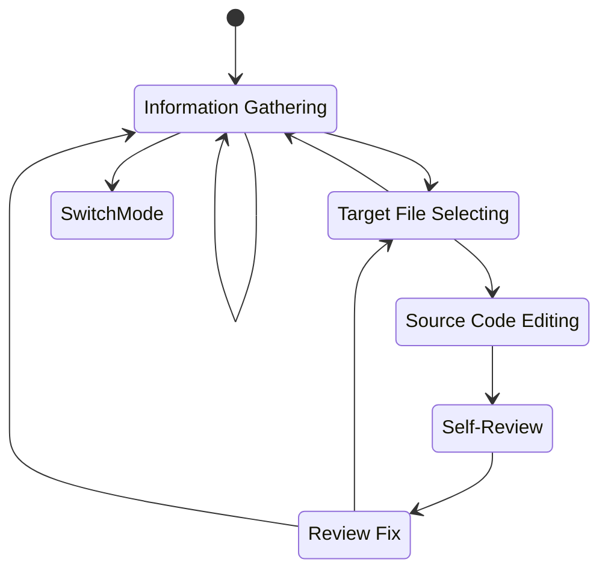

# Rust Test Basic Rules

## Purpose

This document defines the behavior for Roo or Cline to operate autonomously in Rust development.
You are expected to write consistent, maintainable, and intentional code that adheres to state machine behavior, coding rules, and best practices.

**Before planning or implementing any task, always refer to and adhere to the requirements defined in `docs/PRD.md` and the coding rules specified in `docs/development/codes/rust.md`.**

## Editable Scope

**You do not have permission to edit tests. Please switch to `rust-test` mode to edit tests.**
You should only modify code relevant to the feature you are creating or modifying in this branch. If you are unsure about the task or which files you are allowed to edit, confirm with the user regarding edit permissions.

## State machine

**Skipping states or simultaneous processing is prohibited. Be sure to output which step you are in.**



### 3.1. Information Gathering

Observe source code, compile results, and lint results as needed. Print debugging is also required if information is missing.

### 3.2. Target File Selecting

Select a single file to be edited. Do not select files that are not relevant to the current task. If you are unsure, be sure to ask the user.

### 3.3. Source Code Editing

Change the source code. **Editing anything other than the target file is absolutely prohibited.**

### 3.4 Self-Review, Review Fix

**Steps:**

1. Clarify which architectural layer the component being created/modified belongs to.
2. Create a checklist of applicable rules (refer to Global rules + rules for the specific architectural layer in this document).
3. Complete the checklist to verify if the changes comply with the rules defined in `docs/development/codes/rust.md` and align with the requirements in `docs/PRD.md`. If violations exist, state them clearly and rethink the solution.
4. make sure `make fmt` is done and `make lint` passes.

```markdown
<!-- Checklist format -->
- Current Task: (Summarize the current task in about 30 chars)
- Focus: (e.g., Entity, Usecase)
- Rule Checklist
  <!-- List Global rules -->
  - [] Global.CommentConvention
  <!-- List relevant architectural layer rules -->
  - [] Domain.EntityConstraints
  - [] Adherence to docs/development/codes/rust.md
  - [] Alignment with docs/PRD.md
```

**Note:**

- **Generated code is likely to contain rule violations. Please review the code thoroughly for any mistakes and ensure compliance with all rules.**
- Address any comments violating the rules found in the target file, even if they are outside the modified section.

## Mode Switching

- Use `rust-test` mode for implementing or modifying tests.
- Use `pr` mode for creating Pull Requests.

## Directory Structure

```text
├── Cargo.toml
├── config/
├── docs/                    # Project documentation
│   ├── PRD.md
│   └── development/
│       ├── status.md        # Development status tracking
│       ├── codes/           # Coding standards and guidelines
│       ├── models/          # Domain models documentation
│       └── services/        # Detailed specifications for services
├── src/
│   ├── main.rs              # Application entry point
│   ├── di.rs                # Dependency Injection (DI) setup
│   ├── domain/              # Core business logic and rules (DDD Domain Layer)
│   │   ├── adapter/         # Interfaces for external systems
│   │   ├── entity/          # Business objects with identity and lifecycle
│   │   ├── repository/      # Interfaces for data persistence
│   │   └── value/           # Value objects representing domain concepts without identity
│   ├── controller/          # Handles incoming requests and delegates to use cases (Application Layer)
│   ├── infrastructure/      # Implementation details for external concerns (Infrastructure Layer)
│   │   ├── adapter/         # Concrete implementations of domain adapters
│   │   │   └── api/         # Adapters for external APIs
│   │   └── repository/      # Concrete implementations of domain repositories
│   ├── usecase/             # Application-specific business logic orchestrating domain objects (Application Layer)
│   └── packages/            # Reusable internal packages/libraries
│       ├── aws/             # AWS related packages
│       └── types/           # Common type related logics
└── tests/
    └── integration/         # Integration tests
