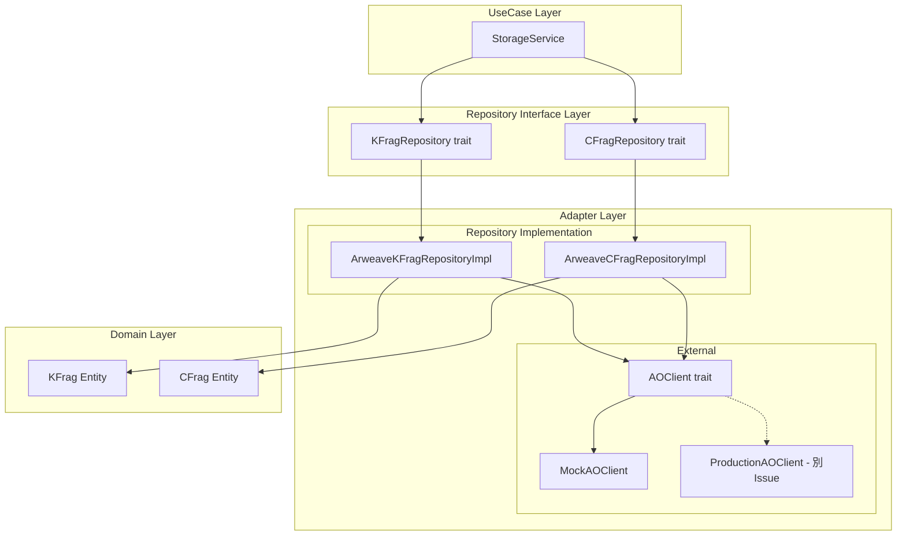
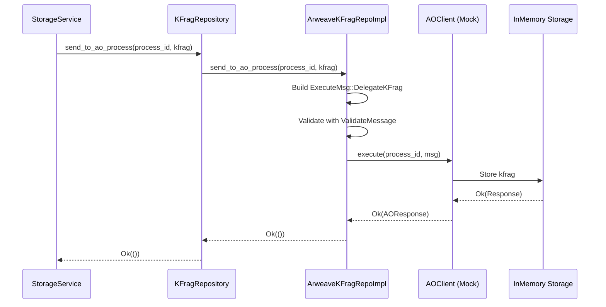
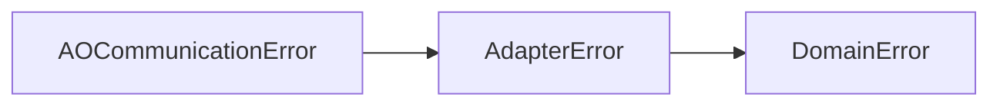

# Design Document: ao-network-communication

## Overview

本設計はFORMIXクライアントライブラリにAO Network通信基盤を追加する。Issue #47のスコープとして、AOClient trait（インターフェース）とMockAOClient実装（テスト・開発用）を提供し、将来のProductionAOClient実装（別Issue）に備えた拡張性の高い設計を実現する。

**設計目標:**
- Clean Architecture（6層）に準拠したインターフェース設計
- 依存性逆転原則（DIP）によるテスタビリティの確保
- 既存の`ExecuteMsg`/`QueryMsg`パターンとの互換性
- `thiserror`ベースの一貫したエラーハンドリング

## Steering Document Alignment

### Technical Standards (tech.md)

本設計は以下の技術標準に準拠する：

1. **Clean Architecture（6層構成）**
   - AOClient traitはAdapter層の`external/`に配置
   - Repository拡張はRepository Interface層で定義
   - UseCase層（StorageService）からはRepository Interfaceを通じてアクセス

2. **エラーハンドリング**
   - `thiserror`クレートを使用した`#[error]`/`#[from]`属性
   - 既存の`AdapterError`→`DomainError`変換パターンを継承

3. **非同期処理**
   - `async_trait`を使用した非同期トレイト定義
   - 既存の`KFragRepository`/`CFragRepository`パターンと整合

### Project Structure (structure.md)

新規ファイルの配置：

```
client/src/
├── adapter/
│   ├── external/                    # 新規ディレクトリ
│   │   ├── mod.rs                   # external モジュール定義
│   │   ├── ao_client.rs             # AOClient trait + MockAOClient
│   │   └── ao_message.rs            # AO Message types (client側複製)
│   ├── errors.rs                    # AOCommunicationError 追加
│   └── mod.rs                       # external モジュール公開
├── repositories/
│   ├── kfrag_interface.rs           # AO送信メソッド追加
│   └── cfrag_interface.rs           # AO取得メソッド追加
└── adapter/repository_impl/
    ├── kfrag_impl.rs                # AOClient統合
    └── cfrag_impl.rs                # AOClient統合
```

## Code Reuse Analysis

### Existing Components to Leverage

- **`adapter/errors.rs`**: `AdapterError` enum - AO通信エラーの追加先
- **`domain/errors.rs`**: `DomainError` enum - エラー変換先
- **`ao/contracts/src/msg.rs`**: `ExecuteMsg`, `QueryMsg`, `ValidateMessage`, `AOMessageTags` - メッセージ型定義（参照）
- **`repositories/kfrag_interface.rs`**: `KFragRepository` trait - AO送信メソッド追加先
- **`repositories/cfrag_interface.rs`**: `CFragRepository` trait - AO取得メソッド追加先

### Integration Points

- **Repository Interface拡張**: 既存の`KFragRepository`/`CFragRepository`にAO通信メソッドを追加
- **Repository実装**: `ArweaveKFragRepository`/`ArweaveCFragRepository`でAOClientを使用
- **エラー変換**: `AOCommunicationError` → `AdapterError` → `DomainError`

## Architecture

### Modular Design Principles

- **Single File Responsibility**: AOClient traitとMockAOClientを`ao_client.rs`に集約
- **Component Isolation**: AO通信ロジックを`external/`ディレクトリに分離
- **Service Layer Separation**: Repository Interfaceを通じてUseCase層と分離
- **Utility Modularity**: メッセージ型は`ao_message.rs`に独立

### Architecture Diagram



### Data Flow



## Components and Interfaces

### Component 1: AOClient Trait

- **Purpose:** AO Networkとの通信を抽象化したクライアントインターフェース
- **Location:** `client/src/adapter/external/ao_client.rs`
- **Interfaces:**
  ```rust
  #[async_trait]
  pub trait AOClient: Send + Sync {
      /// Execute a state-changing message to an AO Process
      async fn execute(
          &self,
          process_id: &str,
          msg: ExecuteMsg,
      ) -> Result<AOResponse, AOCommunicationError>;

      /// Query an AO Process (read-only, via dry_run)
      async fn query(
          &self,
          process_id: &str,
          msg: QueryMsg,
      ) -> Result<Binary, AOCommunicationError>;

      /// Dry-run execution (read-only state inspection)
      async fn dry_run(
          &self,
          process_id: &str,
          msg: ExecuteMsg,
      ) -> Result<AOResponse, AOCommunicationError>;
  }
  ```
- **Dependencies:** `async_trait`, `serde`, `ao_message` types
- **Reuses:** `ExecuteMsg`, `QueryMsg` patterns from `ao/contracts/src/msg.rs`

### Component 2: MockAOClient

- **Purpose:** テスト・開発用のインメモリAOクライアント実装
- **Location:** `client/src/adapter/external/ao_client.rs`
- **Interfaces:**
  ```rust
  pub struct MockAOClient {
      kfrag_storage: Arc<RwLock<HashMap<String, HashMap<String, Vec<u8>>>>>,
      cfrag_storage: Arc<RwLock<HashMap<String, HashMap<String, Vec<u8>>>>>,
      config: MockConfig,
  }

  pub struct MockConfig {
      pub delay_ms: Option<u64>,
      pub error_injection: Option<AOCommunicationError>,
      pub fail_rate: Option<f64>,
  }

  impl MockAOClient {
      pub fn new() -> Self;
      pub fn with_config(config: MockConfig) -> Self;
      pub fn inject_error(&self, error: AOCommunicationError);
      pub fn clear_error(&self);
      pub fn get_stored_kfrags(&self, process_id: &str) -> Vec<(String, Vec<u8>)>;
  }
  ```
- **Dependencies:** `std::sync::RwLock`, `std::collections::HashMap`
- **Reuses:** None (new implementation)

### Component 3: AOCommunicationError

- **Purpose:** AO通信に特化したエラー型
- **Location:** `client/src/adapter/errors.rs` (既存ファイルに追加)
- **Interfaces:**
  ```rust
  #[derive(Debug, Clone, PartialEq, Eq, thiserror::Error)]
  #[non_exhaustive]
  pub enum AOCommunicationError {
      #[error("Connection to AO Network failed: {details}")]
      ConnectionError { details: String },

      #[error("Request timed out after {timeout_ms}ms: {operation}")]
      Timeout { operation: String, timeout_ms: u64 },

      #[error("Process not found: {process_id}")]
      ProcessNotFound { process_id: String },

      #[error("Invalid process ID: {process_id}, reason: {reason}")]
      InvalidProcessId { process_id: String, reason: String },

      #[error("Serialization error for {operation}: {details}")]
      SerializationError { operation: String, details: String },

      #[error("Deserialization error for {operation}: {details}")]
      DeserializationError { operation: String, details: String },

      #[error("Message validation failed: {details}")]
      ValidationError { details: String },

      #[error("Insufficient CFrags: required {required}, available {available}")]
      InsufficientCFrags { required: u8, available: u8 },

      #[error("Partial send failure: succeeded {succeeded}, failed {failed}")]
      PartialSendFailure {
          succeeded: Vec<String>,
          failed: Vec<(String, String)>,
      },

      #[error("AO Process execution error: {details}")]
      ExecutionError { details: String },
  }
  ```
- **Dependencies:** `thiserror`
- **Reuses:** Existing `AdapterError` pattern

### Component 4: AO Message Types (Client-side)

- **Purpose:** クライアント側で使用するAOメッセージ型定義
- **Location:** `client/src/adapter/external/ao_message.rs`
- **Interfaces:**
  ```rust
  // ExecuteMsg, QueryMsg, ValidateMessage は ao/contracts/src/msg.rs と同一定義
  // Binary は Vec<u8> のラッパー

  #[derive(Debug, Clone, Serialize, Deserialize)]
  pub struct AOResponse {
      pub success: bool,
      pub data: Option<Binary>,
      pub events: Vec<AOEvent>,
  }

  #[derive(Debug, Clone, Serialize, Deserialize)]
  pub struct AOEvent {
      pub event_type: String,
      pub attributes: Vec<AOAttribute>,
  }

  #[derive(Debug, Clone, Serialize, Deserialize)]
  pub struct AOAttribute {
      pub key: String,
      pub value: String,
  }

  #[derive(Debug, Clone, Serialize, Deserialize)]
  pub struct AOMessageTags {
      pub app_name: String,
      pub action: String,
      pub read_only: String,
      pub input: String,
      pub process_id: String,
      pub actor: String,
      pub ts: String,
  }
  ```
- **Dependencies:** `serde`
- **Reuses:** Structure from `ao/contracts/src/msg.rs`

### Component 5: KFragRepository AO Extension

- **Purpose:** KFragRepositoryにAO送信メソッドを追加
- **Location:** `client/src/repositories/kfrag_interface.rs` (既存ファイルに追加)
- **Interfaces:**
  ```rust
  #[async_trait]
  pub trait KFragRepository: Repository<KFrag, KFragId> {
      // 既存メソッド...

      /// Send a KFrag to an AO Process (Owner-Process)
      async fn send_to_ao_process(
          &self,
          process_id: &str,
          kfrag: &KFrag,
      ) -> DomainResult<()>;

      /// Batch send multiple KFrags to an AO Process
      async fn batch_send_to_ao_process(
          &self,
          process_id: &str,
          kfrags: &[KFrag],
      ) -> DomainResult<Vec<KFragId>>;
  }
  ```
- **Dependencies:** Existing `KFrag`, `KFragId`, `DomainResult`
- **Reuses:** Existing `Repository` trait pattern

### Component 6: CFragRepository AO Extension

- **Purpose:** CFragRepositoryにAO取得メソッドを追加
- **Location:** `client/src/repositories/cfrag_interface.rs` (既存ファイルに追加)
- **Interfaces:**
  ```rust
  #[async_trait]
  pub trait CFragRepository: Repository<CFrag, CFragId> {
      // 既存メソッド...

      /// Retrieve CFrags from an AO Process (Requester-Process)
      async fn retrieve_from_ao_process(
          &self,
          process_id: &str,
          secret_id: &SecretId,
      ) -> DomainResult<Vec<CFrag>>;
  }
  ```
- **Dependencies:** Existing `CFrag`, `CFragId`, `SecretId`, `DomainResult`
- **Reuses:** Existing `Repository` trait pattern

## Data Models

### Model 1: AOResponse

```rust
/// Response from AO Process execution
#[derive(Debug, Clone, Serialize, Deserialize)]
pub struct AOResponse {
    /// Whether the execution succeeded
    pub success: bool,
    /// Response data (if any)
    pub data: Option<Binary>,
    /// Events emitted during execution
    pub events: Vec<AOEvent>,
}
```

### Model 2: Binary (wrapper)

```rust
/// Binary data wrapper for serialization
#[derive(Debug, Clone, Serialize, Deserialize, PartialEq, Eq)]
pub struct Binary(pub Vec<u8>);

impl Binary {
    pub fn new(data: Vec<u8>) -> Self { Self(data) }
    pub fn as_slice(&self) -> &[u8] { &self.0 }
    pub fn len(&self) -> usize { self.0.len() }
    pub fn is_empty(&self) -> bool { self.0.is_empty() }
}

impl From<Vec<u8>> for Binary {
    fn from(data: Vec<u8>) -> Self { Self(data) }
}
```

### Model 3: MockConfig

```rust
/// Configuration for MockAOClient behavior
#[derive(Debug, Clone, Default)]
pub struct MockConfig {
    /// Simulated network delay in milliseconds
    pub delay_ms: Option<u64>,
    /// Error to inject on next operation
    pub error_injection: Option<AOCommunicationError>,
    /// Random failure rate (0.0 to 1.0)
    pub fail_rate: Option<f64>,
}
```

## Error Handling

### Error Scenarios

1. **ConnectionError**
   - **Handling:** `AOCommunicationError::ConnectionError`を返す
   - **User Impact:** 操作の再試行を促すエラーメッセージを表示
   - **Recovery:** リトライ機能（将来実装）またはユーザーによる手動再試行

2. **Timeout**
   - **Handling:** `AOCommunicationError::Timeout`を返す
   - **User Impact:** タイムアウト時間とオペレーション名を含むエラー
   - **Recovery:** より長いタイムアウト設定での再試行

3. **ProcessNotFound**
   - **Handling:** `AOCommunicationError::ProcessNotFound`を返す
   - **User Impact:** 指定されたプロセスIDが見つからないエラー
   - **Recovery:** プロセスIDの確認、プロセスのデプロイ状態確認

4. **ValidationError**
   - **Handling:** `AOCommunicationError::ValidationError`を返す
   - **User Impact:** メッセージバリデーション失敗の詳細
   - **Recovery:** 入力データの修正

5. **InsufficientCFrags**
   - **Handling:** `AOCommunicationError::InsufficientCFrags`を返す
   - **User Impact:** 閾値未達の詳細（必要数/取得数）
   - **Recovery:** より多くのHolder-Processからの再暗号化を待機

6. **PartialSendFailure**
   - **Handling:** `AOCommunicationError::PartialSendFailure`を返す
   - **User Impact:** 成功したkFrag IDと失敗したkFrag ID + 理由のリスト
   - **Recovery:** 失敗した分のみ再送信

### Error Conversion Chain



```rust
// AOCommunicationError → AdapterError
impl From<AOCommunicationError> for AdapterError {
    fn from(err: AOCommunicationError) -> Self {
        match err {
            AOCommunicationError::ConnectionError { details } => {
                AdapterError::ConnectionError { details }
            }
            AOCommunicationError::SerializationError { operation, details } => {
                AdapterError::SerializationError { operation, details }
            }
            AOCommunicationError::ProcessNotFound { process_id } => {
                AdapterError::NotFound {
                    entity_type: "AOProcess".to_string(),
                    id: process_id,
                }
            }
            // ... other conversions
            _ => AdapterError::StorageError {
                operation: "ao_communication".to_string(),
                details: err.to_string(),
            }
        }
    }
}
```

## Testing Strategy

### Unit Testing

- **AOClient Trait Tests**
  - `test_ao_client_execute_delegate_kfrag` - ExecuteMsgの送信が正常に完了
  - `test_ao_client_query_get_cfrag` - QueryMsgの送信が正常に完了
  - `test_ao_client_dry_run_success` - dry_runが読み取りのみで実行

- **MockAOClient Tests**
  - `test_mock_ao_client_kfrag_storage` - インメモリ保存と取得
  - `test_mock_ao_client_error_injection` - エラー注入の動作確認
  - `test_mock_ao_client_delay_simulation` - 遅延シミュレーション

- **AOCommunicationError Tests**
  - `test_ao_communication_error_variants` - 全バリアントの定義確認
  - `test_ao_error_display_trait` - Display実装の確認
  - `test_ao_error_to_adapter_error_conversion` - AdapterErrorへの変換

- **Repository Extension Tests**
  - `test_kfrag_repository_send_to_ao_process` - 単一kFrag送信
  - `test_kfrag_repository_batch_send_to_ao_process` - バッチ送信
  - `test_cfrag_repository_retrieve_from_ao_process` - cFrag取得

### Integration Testing

- **End-to-End Flow Tests**
  - `test_kfrag_delegate_and_retrieve_flow` - kFrag委譲から取得までのフロー
  - `test_cfrag_query_threshold_check` - 閾値チェックを含むcFrag取得フロー

- **Error Recovery Tests**
  - `test_partial_failure_recovery` - 部分的失敗後の再送信
  - `test_timeout_retry_behavior` - タイムアウト後のリトライ

### Mock-based Testing

テスト時のDI構成例：

```rust
#[tokio::test]
async fn test_storage_service_with_mock_ao_client() {
    // MockAOClientを設定
    let mock_ao_client = Arc::new(MockAOClient::new());

    // Repository実装にMockを注入
    let kfrag_repo = ArweaveKFragRepositoryImpl::new(
        mock_ao_client.clone(),
        arweave_client.clone(),
    );

    // StorageServiceにRepositoryを注入
    let storage_service = StorageService::new(kfrag_repo, cfrag_repo);

    // テスト実行
    let result = storage_service.send_kfrags_to_owner_process(
        "test-process-id",
        &kfrags,
    ).await;

    assert!(result.is_ok());

    // Mockの内部状態を検証
    let stored = mock_ao_client.get_stored_kfrags("test-process-id");
    assert_eq!(stored.len(), kfrags.len());
}
```

## File Modifications Summary

| File | Action | Description |
|------|--------|-------------|
| `client/src/adapter/external/mod.rs` | Create | external モジュール定義 |
| `client/src/adapter/external/ao_client.rs` | Create | AOClient trait + MockAOClient |
| `client/src/adapter/external/ao_message.rs` | Create | AO Message types |
| `client/src/adapter/errors.rs` | Modify | AOCommunicationError 追加 |
| `client/src/adapter/mod.rs` | Modify | external モジュール公開 |
| `client/src/repositories/kfrag_interface.rs` | Modify | AO送信メソッド追加 |
| `client/src/repositories/cfrag_interface.rs` | Modify | AO取得メソッド追加 |
| `client/src/adapter/repository_impl/kfrag_impl.rs` | Modify | AOClient統合 |
| `client/src/adapter/repository_impl/cfrag_impl.rs` | Modify | AOClient統合 |

## Design Decisions

### Decision 1: Mock-first Approach

**選択:** Issue #47ではMockAOClientのみ実装し、ProductionAOClientは別Issueで対応

**理由:**
- 開発・テストを早期に開始可能
- インターフェース設計の検証が先行可能
- AO Network接続なしでワークフロー統合テスト可能

### Decision 2: Message Type Duplication

**選択:** `ao/contracts/src/msg.rs`の型を`client/`内に複製

**理由:**
- クライアントライブラリの独立性確保
- ビルド依存関係の簡素化
- 将来的なバージョン管理の柔軟性

### Decision 3: Async Trait

**選択:** `async_trait`を使用した非同期インターフェース

**理由:**
- 既存の`Repository` traitパターンとの整合性
- ネットワーク操作のノンブロッキング性
- 将来のProductionAOClient実装への対応

### Decision 4: thiserror for Error Types

**選択:** `thiserror`クレートを使用したエラー定義

**理由:**
- 既存の`AdapterError`パターンとの一貫性
- `#[error]`属性による自動Display実装
- `#[from]`属性による変換の簡素化
