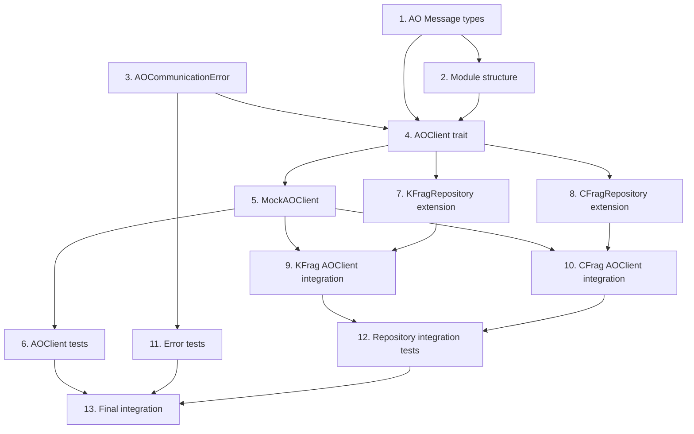

# Tasks Document: ao-network-communication

## Overview

AO Network通信基盤（Issue #47）の実装タスク。AOClient trait + MockAOClient実装を提供し、Phase 1/Phase 3のワークフロー統合に備える。

---

- [-] 1. Create AO Message types for client
  - File: `client/src/adapter/external/ao_message.rs`
  - Define ExecuteMsg, QueryMsg, Binary, AOResponse, AOMessageTags types
  - Implement ValidateMessage trait for message validation
  - Purpose: Establish type-safe AO message structures for client-side communication
  - _Leverage: `ao/contracts/src/msg.rs` (reference), `serde`_
  - _Requirements: 1.4, 2.3, 3.3_
  - _Prompt: |
      Implement the task for spec ao-network-communication, first run spec-workflow-guide to get the workflow guide then implement the task:

      Role: Rust Developer specializing in type systems and serialization
      Task: Create AO message types in `client/src/adapter/external/ao_message.rs` following the patterns from `ao/contracts/src/msg.rs`. Define ExecuteMsg enum (DelegateKFrag, DelegateCapsule, SubmitKFrag, SubmitCapsule, Reencrypt variants), QueryMsg enum (GetCFrag, ListCapsulesByKFrag variants), Binary wrapper type, AOResponse struct with events, and AOMessageTags struct. Implement ValidateMessage trait with validation helpers (validate_kfrag_id, validate_capsule_id, validate_binary_data).
      Restrictions: Do not import directly from `ao/contracts` - duplicate types for client independence. Use `#[serde(rename_all = "snake_case")]` for enums. Maximum binary data size: 128KB. ID validation: max 128 chars, ASCII alphanumeric + underscore + hyphen only.
      _Leverage: `ao/contracts/src/msg.rs:1-250` for type definitions
      _Requirements: 1.4 (AOMessageTags), 2.3 (ValidateMessage), 3.3 (ValidateMessage)
      Success: All message types compile, serde serialization/deserialization works correctly, ValidateMessage trait validates all fields properly, unit tests pass.
      Instructions: Before starting, mark this task as in-progress by changing `[ ]` to `[-]` in tasks.md. After completing, use log-implementation tool to record artifacts, then mark as complete `[x]`._

---

- [ ] 2. Create external module structure
  - File: `client/src/adapter/external/mod.rs`
  - File: `client/src/adapter/mod.rs` (modify)
  - Set up external module exports and integrate into adapter module
  - Purpose: Establish module structure for external system adapters
  - _Leverage: `client/src/adapter/mod.rs` existing pattern_
  - _Requirements: 1 (AOClient architecture)_
  - _Prompt: |
      Implement the task for spec ao-network-communication, first run spec-workflow-guide to get the workflow guide then implement the task:

      Role: Rust Developer with expertise in module organization
      Task: Create the external module structure. Create `client/src/adapter/external/mod.rs` with public exports for `ao_client`, `ao_message` modules. Modify `client/src/adapter/mod.rs` to add `pub mod external;` and re-export key types (AOClient, MockAOClient, AOCommunicationError, etc.).
      Restrictions: Follow existing module organization patterns in the codebase. Keep exports minimal and well-organized.
      _Leverage: `client/src/adapter/mod.rs` for existing pattern
      _Requirements: 1 (AOClient base interface architecture)
      Success: Module compiles without errors, all public types are properly exported and accessible from `crate::adapter::external::*`.
      Instructions: Before starting, mark this task as in-progress by changing `[ ]` to `[-]` in tasks.md. After completing, use log-implementation tool to record artifacts, then mark as complete `[x]`._

---

- [ ] 3. Create AOCommunicationError type
  - File: `client/src/adapter/errors.rs` (modify)
  - Add AOCommunicationError enum with all error variants
  - Implement From<AOCommunicationError> for AdapterError conversion
  - Purpose: Provide comprehensive error handling for AO communication
  - _Leverage: `client/src/adapter/errors.rs` existing AdapterError pattern, `thiserror`_
  - _Requirements: 5.1, 5.2, 5.3, 5.4, 5.5_
  - _Prompt: |
      Implement the task for spec ao-network-communication, first run spec-workflow-guide to get the workflow guide then implement the task:

      Role: Rust Developer with expertise in error handling and thiserror
      Task: Add AOCommunicationError enum to `client/src/adapter/errors.rs`. Define variants: ConnectionError{details}, Timeout{operation, timeout_ms}, ProcessNotFound{process_id}, InvalidProcessId{process_id, reason}, SerializationError{operation, details}, DeserializationError{operation, details}, ValidationError{details}, InsufficientCFrags{required, available}, PartialSendFailure{succeeded, failed}, ExecutionError{details}. Use `#[derive(Debug, Clone, PartialEq, Eq, thiserror::Error)]` and `#[non_exhaustive]`. Implement `From<AOCommunicationError> for AdapterError`. Add helper methods for creating each error variant.
      Restrictions: Follow existing AdapterError pattern exactly. Use thiserror `#[error("...")]` attributes for Display implementation. Do not expose internal details in error messages.
      _Leverage: `client/src/adapter/errors.rs:1-108` for AdapterError pattern
      _Requirements: 5.1 (error variants), 5.2 (Display trait), 5.3 (AdapterError conversion), 5.4 (DomainError conversion), 5.5 (detailed messages)
      Success: All error variants defined, Display trait implemented via thiserror, From conversion to AdapterError works, helper methods available.
      Instructions: Before starting, mark this task as in-progress by changing `[ ]` to `[-]` in tasks.md. After completing, use log-implementation tool to record artifacts, then mark as complete `[x]`._

---

- [ ] 4. Create AOClient trait
  - File: `client/src/adapter/external/ao_client.rs`
  - Define AOClient async trait with execute, query, dry_run methods
  - Purpose: Establish abstract interface for AO Network communication
  - _Leverage: `async_trait`, existing Repository trait pattern_
  - _Requirements: 1.1, 1.2, 1.3, 1.4_
  - _Prompt: |
      Implement the task for spec ao-network-communication, first run spec-workflow-guide to get the workflow guide then implement the task:

      Role: Rust Developer specializing in async trait design and Clean Architecture
      Task: Create AOClient trait in `client/src/adapter/external/ao_client.rs`. Define async trait with: `execute(&self, process_id: &str, msg: ExecuteMsg) -> Result<AOResponse, AOCommunicationError>`, `query(&self, process_id: &str, msg: QueryMsg) -> Result<Binary, AOCommunicationError>`, `dry_run(&self, process_id: &str, msg: ExecuteMsg) -> Result<AOResponse, AOCommunicationError>`. Trait must be Send + Sync.
      Restrictions: Use `#[async_trait]` from async_trait crate. Do not include any implementation logic in the trait itself. Follow existing Repository trait patterns for consistency.
      _Leverage: `client/src/repositories/kfrag_interface.rs` for async_trait pattern, `ao_message.rs` for types
      _Requirements: 1.1 (execute method), 1.2 (query method), 1.3 (dry_run method), 1.4 (AOMessageTags)
      Success: Trait compiles with async_trait, all methods have correct signatures, trait is Send + Sync, proper documentation added.
      Instructions: Before starting, mark this task as in-progress by changing `[ ]` to `[-]` in tasks.md. After completing, use log-implementation tool to record artifacts, then mark as complete `[x]`._

---

- [ ] 5. Implement MockAOClient
  - File: `client/src/adapter/external/ao_client.rs` (continue)
  - Implement MockAOClient with in-memory storage for kFrags/cFrags
  - Add MockConfig for delay simulation and error injection
  - Purpose: Provide test/development mock for AO communication
  - _Leverage: `std::sync::RwLock`, `std::collections::HashMap`_
  - _Requirements: 1.8, 1.9, 1.5, 1.6, 1.7_
  - _Prompt: |
      Implement the task for spec ao-network-communication, first run spec-workflow-guide to get the workflow guide then implement the task:

      Role: Rust Developer with expertise in testing infrastructure and mocking
      Task: Implement MockAOClient in `client/src/adapter/external/ao_client.rs`. Create MockConfig struct with delay_ms: Option<u64>, error_injection: Option<AOCommunicationError>, fail_rate: Option<f64>. Create MockAOClient struct with kfrag_storage: Arc<RwLock<HashMap<String, HashMap<String, Vec<u8>>>>>, cfrag_storage: Arc<RwLock<HashMap<String, HashMap<String, Vec<u8>>>>>, config: Arc<RwLock<MockConfig>>. Implement new(), with_config(config), inject_error(error), clear_error(), get_stored_kfrags(process_id) methods. Implement AOClient trait: execute() should store kFrags/capsules based on message type, query() should retrieve cFrags, dry_run() should return state without modification. Handle error injection and delay simulation.
      Restrictions: Use RwLock for thread safety. Validate process_id format. Apply error injection before processing. Simulate delay with std::thread::sleep (for simplicity in tests).
      _Leverage: `client/src/repositories/kfrag_interface.rs:46-56` for MockKFragRepository pattern
      _Requirements: 1.8 (in-memory management), 1.9 (error injection/delay), 1.5 (ConnectionError), 1.6 (Timeout), 1.7 (ProcessNotFound)
      Success: MockAOClient implements AOClient trait, stores/retrieves data correctly, error injection works, delay simulation works, all tests pass.
      Instructions: Before starting, mark this task as in-progress by changing `[ ]` to `[-]` in tasks.md. After completing, use log-implementation tool to record artifacts, then mark as complete `[x]`._

---

- [ ] 6. Add AOClient unit tests
  - File: `client/src/adapter/external/ao_client.rs` (tests module)
  - Write comprehensive unit tests for AOClient trait and MockAOClient
  - Purpose: Ensure AOClient implementation reliability
  - _Leverage: existing test patterns in `kfrag_interface.rs`_
  - _Requirements: 1.1-1.9 (all AOClient requirements)_
  - _Prompt: |
      Implement the task for spec ao-network-communication, first run spec-workflow-guide to get the workflow guide then implement the task:

      Role: QA Engineer with expertise in Rust unit testing
      Task: Add #[cfg(test)] mod tests to `client/src/adapter/external/ao_client.rs`. Implement tests: test_ao_client_execute_delegate_kfrag, test_ao_client_query_get_cfrag, test_ao_client_dry_run_success, test_ao_client_message_tags_construction, test_ao_client_connection_error (error injection), test_ao_client_timeout_error (error injection), test_ao_client_process_not_found, test_mock_ao_client_kfrag_storage, test_mock_ao_client_error_injection, test_ao_client_message_serialization.
      Restrictions: Use #[tokio::test] for async tests. Create helper functions for test data. Test both success and error scenarios. Do not test external dependencies.
      _Leverage: `client/src/repositories/kfrag_interface.rs:120-215` for test patterns
      _Requirements: 1.1-1.9 (all AOClient acceptance criteria from requirements.md)
      Success: All 10+ tests pass, coverage includes success/error scenarios, tests are well-documented and maintainable.
      Instructions: Before starting, mark this task as in-progress by changing `[ ]` to `[-]` in tasks.md. After completing, use log-implementation tool to record artifacts, then mark as complete `[x]`._

---

- [ ] 7. Extend KFragRepository with AO methods
  - File: `client/src/repositories/kfrag_interface.rs` (modify)
  - Add send_to_ao_process and batch_send_to_ao_process methods to trait
  - Update MockKFragRepository with new methods
  - Purpose: Enable kFrag transmission to AO processes via repository interface
  - _Leverage: existing KFragRepository trait, DomainResult_
  - _Requirements: 6.1, 6.2, 6.3_
  - _Prompt: |
      Implement the task for spec ao-network-communication, first run spec-workflow-guide to get the workflow guide then implement the task:

      Role: Rust Developer with expertise in repository patterns and DDD
      Task: Extend KFragRepository trait in `client/src/repositories/kfrag_interface.rs`. Add methods: `async fn send_to_ao_process(&self, process_id: &str, kfrag: &KFrag) -> DomainResult<()>` and `async fn batch_send_to_ao_process(&self, process_id: &str, kfrags: &[KFrag]) -> DomainResult<Vec<KFragId>>`. Update existing MockKFragRepository implementation to include these methods (store in HashMap with process_id as key). Add tests for new methods.
      Restrictions: Maintain backward compatibility with existing trait methods. Follow existing async_trait pattern. New methods should use DomainResult for consistency.
      _Leverage: `client/src/repositories/kfrag_interface.rs:18-38` for existing trait pattern
      _Requirements: 6.1 (send_to_ao_process), 6.2 (batch_send_to_ao_process), 6.3 (error handling)
      Success: Trait extended with new methods, MockKFragRepository implements new methods, tests pass, existing tests still pass.
      Instructions: Before starting, mark this task as in-progress by changing `[ ]` to `[-]` in tasks.md. After completing, use log-implementation tool to record artifacts, then mark as complete `[x]`._

---

- [ ] 8. Extend CFragRepository with AO methods
  - File: `client/src/repositories/cfrag_interface.rs` (modify)
  - Add retrieve_from_ao_process method to trait
  - Update MockCFragRepository with new method
  - Purpose: Enable cFrag retrieval from AO processes via repository interface
  - _Leverage: existing CFragRepository trait, DomainResult_
  - _Requirements: 7.1, 7.2, 7.3_
  - _Prompt: |
      Implement the task for spec ao-network-communication, first run spec-workflow-guide to get the workflow guide then implement the task:

      Role: Rust Developer with expertise in repository patterns and DDD
      Task: Extend CFragRepository trait in `client/src/repositories/cfrag_interface.rs`. Add method: `async fn retrieve_from_ao_process(&self, process_id: &str, secret_id: &SecretId) -> DomainResult<Vec<CFrag>>`. Update existing MockCFragRepository implementation to include this method (retrieve from HashMap filtered by secret_id). Add tests for new method.
      Restrictions: Maintain backward compatibility with existing trait methods. Follow existing async_trait pattern. Return empty Vec if no CFrags found (not an error).
      _Leverage: `client/src/repositories/cfrag_interface.rs:18-39` for existing trait pattern
      _Requirements: 7.1 (retrieve_from_ao_process), 7.2 (SecretId filter), 7.3 (error handling)
      Success: Trait extended with new method, MockCFragRepository implements new method, tests pass, existing tests still pass.
      Instructions: Before starting, mark this task as in-progress by changing `[ ]` to `[-]` in tasks.md. After completing, use log-implementation tool to record artifacts, then mark as complete `[x]`._

---

- [ ] 9. Implement ArweaveKFragRepository AOClient integration
  - File: `client/src/adapter/repository_impl/kfrag_impl.rs` (modify)
  - Add AOClient generic parameter and implement send_to_ao_process methods
  - Build and validate ExecuteMsg::DelegateKFrag messages
  - Purpose: Connect KFrag repository to AO communication layer
  - _Leverage: existing ArweaveKFragRepository, AOClient trait, ExecuteMsg_
  - _Requirements: 2.1, 2.2, 2.3, 2.4, 2.5, 2.6_
  - _Prompt: |
      Implement the task for spec ao-network-communication, first run spec-workflow-guide to get the workflow guide then implement the task:

      Role: Rust Developer with expertise in repository implementations and integration
      Task: Modify `client/src/adapter/repository_impl/kfrag_impl.rs` to integrate AOClient. Add generic parameter `C: AOClient` to ArweaveKFragRepository struct. Add `ao_client: Arc<C>` field. Implement send_to_ao_process: build ExecuteMsg::DelegateKFrag, validate with ValidateMessage trait, call ao_client.execute(), handle Response events. Implement batch_send_to_ao_process: iterate and collect results, handle partial failures by returning PartialSendFailure error with succeeded/failed lists. Convert AOCommunicationError to DomainError appropriately.
      Restrictions: Validate all messages before sending. Handle partial failures gracefully. Do not expose raw AOCommunicationError to domain layer.
      _Leverage: `client/src/adapter/repository_impl/kfrag_impl.rs` existing implementation, `ao_message.rs` for ExecuteMsg
      _Requirements: 2.1 (DelegateKFrag message), 2.2 (Response events), 2.3 (ValidateMessage), 2.4 (InvalidProcessId), 2.5 (SerializationError), 2.6 (partial failure)
      Success: AOClient integrated, send methods work correctly, messages validated, errors converted properly, partial failures handled.
      Instructions: Before starting, mark this task as in-progress by changing `[ ]` to `[-]` in tasks.md. After completing, use log-implementation tool to record artifacts, then mark as complete `[x]`._

---

- [ ] 10. Implement ArweaveCFragRepository AOClient integration
  - File: `client/src/adapter/repository_impl/cfrag_impl.rs` (modify)
  - Add AOClient generic parameter and implement retrieve_from_ao_process method
  - Build and validate QueryMsg::GetCFrag messages
  - Purpose: Connect CFrag repository to AO communication layer
  - _Leverage: existing ArweaveCFragRepository, AOClient trait, QueryMsg_
  - _Requirements: 3.1, 3.2, 3.3, 3.4, 3.5, 3.6_
  - _Prompt: |
      Implement the task for spec ao-network-communication, first run spec-workflow-guide to get the workflow guide then implement the task:

      Role: Rust Developer with expertise in repository implementations and integration
      Task: Modify `client/src/adapter/repository_impl/cfrag_impl.rs` to integrate AOClient. Add generic parameter `C: AOClient` to ArweaveCFragRepository struct. Add `ao_client: Arc<C>` field. Implement retrieve_from_ao_process: build QueryMsg::GetCFrag, validate with ValidateMessage trait, call ao_client.query(), deserialize Binary response to GetCFragResponse, convert to CFrag entities. Handle threshold check (return InsufficientCFrags if needed based on threshold parameter).
      Restrictions: Validate all queries before sending. Properly deserialize Binary responses. Convert AOCommunicationError to DomainError.
      _Leverage: `client/src/adapter/repository_impl/cfrag_impl.rs` existing implementation, `ao_message.rs` for QueryMsg
      _Requirements: 3.1 (GetCFrag query), 3.2 (GetCFragResponse), 3.3 (ValidateMessage), 3.4 (InsufficientCFrags), 3.5 (InvalidProcessId), 3.6 (DeserializationError)
      Success: AOClient integrated, retrieve method works correctly, queries validated, responses deserialized, errors converted properly.
      Instructions: Before starting, mark this task as in-progress by changing `[ ]` to `[-]` in tasks.md. After completing, use log-implementation tool to record artifacts, then mark as complete `[x]`._

---

- [ ] 11. Add AOCommunicationError unit tests
  - File: `client/src/adapter/errors.rs` (tests module)
  - Write unit tests for AOCommunicationError variants and conversions
  - Purpose: Ensure error handling reliability
  - _Leverage: existing test patterns_
  - _Requirements: 5.1, 5.2, 5.3, 5.4, 5.5_
  - _Prompt: |
      Implement the task for spec ao-network-communication, first run spec-workflow-guide to get the workflow guide then implement the task:

      Role: QA Engineer with expertise in Rust error handling testing
      Task: Add tests to `client/src/adapter/errors.rs` for AOCommunicationError. Implement: test_ao_communication_error_variants (verify all variants can be created), test_ao_error_display_trait (verify Display output format), test_ao_error_to_adapter_error_conversion (verify From implementation), test_ao_error_to_domain_error_conversion (verify transitive conversion via AdapterError), test_ao_error_message_contains_details (verify error messages include operation/details).
      Restrictions: Test all error variants. Verify exact error message format. Test helper methods.
      _Leverage: existing AdapterError tests if any
      _Requirements: 5.1-5.5 (all error handling requirements)
      Success: All 5 tests pass, all error variants tested, conversion chains verified.
      Instructions: Before starting, mark this task as in-progress by changing `[ ]` to `[-]` in tasks.md. After completing, use log-implementation tool to record artifacts, then mark as complete `[x]`._

---

- [ ] 12. Add Repository integration tests
  - File: `client/src/adapter/repository_impl/kfrag_impl.rs` (tests)
  - File: `client/src/adapter/repository_impl/cfrag_impl.rs` (tests)
  - Write integration tests using MockAOClient
  - Purpose: Verify repository-to-AOClient integration
  - _Leverage: MockAOClient, existing repository tests_
  - _Requirements: 2.1-2.6, 3.1-3.6, 6.1-6.3, 7.1-7.3_
  - _Prompt: |
      Implement the task for spec ao-network-communication, first run spec-workflow-guide to get the workflow guide then implement the task:

      Role: QA Engineer with expertise in integration testing
      Task: Add integration tests to repository implementations. In kfrag_impl.rs tests: test_send_kfrags_delegate_kfrag_message, test_send_kfrags_response_events, test_send_kfrags_validate_message, test_send_kfrags_invalid_process_id, test_send_kfrags_serialization_error, test_send_kfrags_partial_failure, test_kfrag_repository_send_to_ao_process, test_kfrag_repository_batch_send_to_ao_process, test_kfrag_repository_ao_send_failure. In cfrag_impl.rs tests: test_retrieve_cfrags_get_cfrag_query, test_retrieve_cfrags_response_format, test_retrieve_cfrags_validate_message, test_retrieve_cfrags_insufficient_threshold, test_retrieve_cfrags_invalid_process_id, test_retrieve_cfrags_deserialization_error, test_cfrag_repository_retrieve_from_ao_process, test_cfrag_repository_retrieve_with_secret_id_filter, test_cfrag_repository_ao_retrieve_failure.
      Restrictions: Use MockAOClient with error injection for failure tests. Create realistic test data. Test edge cases.
      _Leverage: MockAOClient, existing repository test patterns
      _Requirements: All kFrag/cFrag related requirements from requirements.md
      Success: All integration tests pass, error scenarios covered, MockAOClient properly exercises all code paths.
      Instructions: Before starting, mark this task as in-progress by changing `[ ]` to `[-]` in tasks.md. After completing, use log-implementation tool to record artifacts, then mark as complete `[x]`._

---

- [ ] 13. Final integration and make check
  - Run `make check`, `make lint`, `make test`
  - Fix any compilation errors or warnings
  - Verify all modules properly export types
  - Purpose: Ensure all code compiles and tests pass
  - _Leverage: Makefile commands_
  - _Requirements: All_
  - _Prompt: |
      Implement the task for spec ao-network-communication, first run spec-workflow-guide to get the workflow guide then implement the task:

      Role: Senior Rust Developer with expertise in code quality and CI/CD
      Task: Run `make check` to verify compilation, `make lint` to ensure no clippy warnings, `make test` to run all tests. Fix any issues found. Verify all new types are properly exported and accessible. Check that existing tests still pass.
      Restrictions: Do not ignore warnings. Fix all clippy suggestions. Ensure backward compatibility with existing code.
      _Leverage: Makefile, existing code patterns
      _Requirements: All requirements should be satisfied
      Success: `make check` passes, `make lint` passes with no warnings, `make test` passes all tests including new ones.
      Instructions: Before starting, mark this task as in-progress by changing `[ ]` to `[-]` in tasks.md. After completing, use log-implementation tool to record artifacts, then mark as complete `[x]`._

---

## Task Dependencies

## Summary

| Task | Files | Requirements |
|------|-------|--------------|
| 1 | ao_message.rs | 1.4, 2.3, 3.3 |
| 2 | external/mod.rs, adapter/mod.rs | 1 |
| 3 | errors.rs | 5.1-5.5 |
| 4 | ao_client.rs | 1.1-1.4 |
| 5 | ao_client.rs | 1.5-1.9 |
| 6 | ao_client.rs (tests) | 1.1-1.9 |
| 7 | kfrag_interface.rs | 6.1-6.3 |
| 8 | cfrag_interface.rs | 7.1-7.3 |
| 9 | kfrag_impl.rs | 2.1-2.6 |
| 10 | cfrag_impl.rs | 3.1-3.6 |
| 11 | errors.rs (tests) | 5.1-5.5 |
| 12 | kfrag_impl.rs, cfrag_impl.rs (tests) | 2, 3, 6, 7 |
| 13 | (verification) | All |
