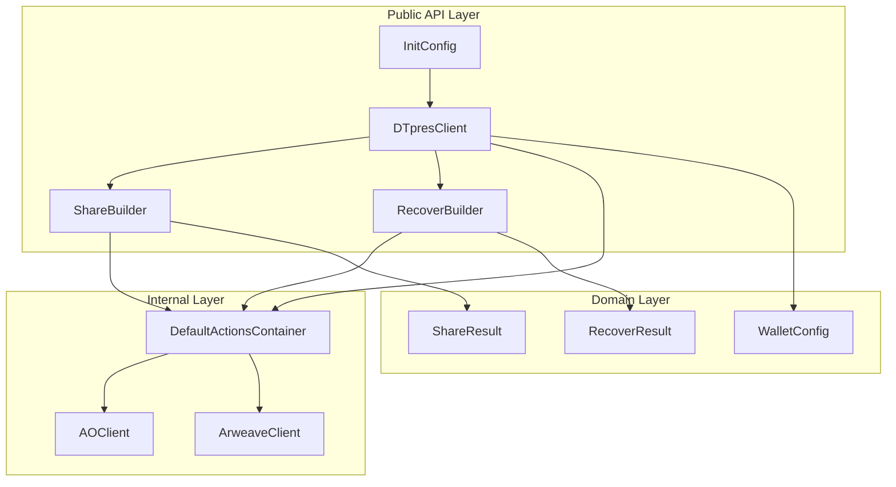

# Design Document

## Overview

FORMIXクライアントライブラリのAPI DX改善設計。DTpresClientを中心とした新しいアーキテクチャで、AO Process管理、ネットワーク設定、ビルダーパターンによるshare/recover操作を統合する。本ライブラリはRust Crate（`dtpres-client`）として配布する。

## Steering Document Alignment

### Technical Standards (tech.md)

- **Type-State Builder Pattern**: コンパイル時の型安全性でランタイムエラーを防止
- **Zero-Cost Abstractions**: ビルダーパターンはコンパイル時に解決、ランタイムオーバーヘッドなし
- **Zeroize for Secrets**: 秘密鍵を含む構造体はZeroize/ZeroizeOnDrop実装
- **Error Handling**: thiserrorによる明確なエラー型定義

### Project Structure (structure.md)

- **client/src/actions/**: 新しいbuilder.rsモジュールを追加
- **client/src/domain/**: DTpresClient構造体を追加
- **単一責任原則**: ビルダー、クライアント、設定は独立したモジュール

## Code Reuse Analysis

### Existing Components to Leverage

- **DefaultActionsContainer**: 既存のshare/recover実装を内部で使用
- **CryptoOperations trait**: 鍵生成とUmbral操作を再利用
- **AOClient**: AO Process通信を再利用
- **SecretId**: UUID v4生成ロジックを再利用

### Integration Points

- **AO Network**: 既存のAOClient経由でProcess管理
- **Arweave**: 既存のArweaveClient経由でデータ永続化
- **umbral_pre**: owner_public_key導出に使用

## Architecture



### Modular Design Principles

- **Single File Responsibility**:
  - `client.rs`: DTpresClient実装
  - `builder.rs`: ShareBuilder/RecoverBuilder実装
  - `config.rs`: InitConfig/WalletConfig定義
  - `result.rs`: ShareResult/RecoverResult定義

- **Component Isolation**: ビルダーはクライアントから独立してテスト可能

- **Service Layer Separation**:
  - Public API: DTpresClient, Builders
  - Internal: DefaultActionsContainer, AOClient
  - Domain: Result types, Value Objects

## Components and Interfaces

### DTpresClient

- **Purpose:** FORMIXクライアントのメインエントリポイント。AO Process管理とビルダーファクトリを提供
- **Interfaces:**
  ```rust
  impl DTpresClient {
      pub fn init(config: InitConfig) -> Result<Self, ClientError>;
      pub fn process_id(&self) -> &str;
      pub fn wallet_address(&self) -> &str;
      pub fn ao_gateway_url(&self) -> &str;
      pub fn arweave_gateway_url(&self) -> &str;
      pub fn share(&self) -> ShareBuilder<NotSet, NotSet, NotSet, NotSet, NotSet>;
      pub fn recover(&self) -> RecoverBuilder<NotSet, NotSet>;
      pub fn generate_keypair(&self) -> Result<(SecretKey, PublicKey), CryptoError>;
  }
  ```
- **Dependencies:** AOClient, ArweaveClient, WalletConfig
- **Reuses:** DefaultActionsContainer内部

### InitConfig

- **Purpose:** クライアント初期化設定
- **Interfaces:**
  ```rust
  pub struct InitConfig {
      pub wallet_path: String,
      pub ao_gateway_url: Option<String>,
      pub arweave_gateway_url: Option<String>,
  }
  ```
- **Dependencies:** None
- **Reuses:** None

### ShareBuilder (Type-State Pattern)

- **Purpose:** 秘密共有操作のビルダー。必須フィールドをコンパイル時に保証
- **Interfaces:**
  ```rust
  impl<S, T, N, O, R> ShareBuilder<S, T, N, O, R> {
      pub fn secret(self, secret: Vec<u8>) -> ShareBuilder<Set, T, N, O, R>;
      pub fn threshold(self, k: u32) -> ShareBuilder<S, Set, N, O, R>;
      pub fn total_shares(self, n: u32) -> ShareBuilder<S, T, Set, O, R>;
      pub fn owner_key(self, key: SecretKey) -> ShareBuilder<S, T, N, Set, R>;
      pub fn requester_key(self, key: PublicKey) -> ShareBuilder<S, T, N, O, Set>;
      pub fn metadata(self, meta: Option<Metadata>) -> Self;
  }

  impl ShareBuilder<Set, Set, Set, Set, Set> {
      pub fn execute(self) -> Result<ShareResult, ShareError>;
  }
  ```
- **Dependencies:** DTpresClient (process_id), DefaultActionsContainer
- **Reuses:** 既存のshare実装

### RecoverBuilder (Type-State Pattern)

- **Purpose:** 秘密復元操作のビルダー
- **Interfaces:**
  ```rust
  impl<S, R> RecoverBuilder<S, R> {
      pub fn secret_id(self, id: &SecretId) -> RecoverBuilder<Set, R>;
      pub fn requester_key(self, key: SecretKey) -> RecoverBuilder<S, Set>;
  }

  impl RecoverBuilder<Set, Set> {
      pub fn execute(self) -> Result<Vec<u8>, RecoverError>;
  }
  ```
- **Dependencies:** DTpresClient (process_id), DefaultActionsContainer
- **Reuses:** 既存のrecover実装

### ShareResult

- **Purpose:** share操作の結果を格納
- **Interfaces:**
  ```rust
  pub struct ShareResult {
      pub secret_id: SecretId,
      pub capsule_info: CapsuleInfo,
      pub encrypted_shares: Vec<EncryptedShare>,
      pub holder_process_ids: Vec<String>,
  }
  ```
- **Dependencies:** SecretId, CapsuleInfo, EncryptedShare
- **Reuses:** 既存の型定義

## Data Models

### InitConfig
```rust
pub struct InitConfig {
    pub wallet_path: String,
    pub ao_gateway_url: Option<String>,      // Default: "https://ao.arweave.net"
    pub arweave_gateway_url: Option<String>, // Default: "https://arweave.net"
}
```

### DTpresClient (Internal State)
```rust
pub struct DTpresClient {
    process_id: String,
    wallet_address: String,
    ao_gateway_url: String,
    arweave_gateway_url: String,
    actions: Arc<DefaultActionsContainer>,
}
```

### ShareResult
```rust
pub struct ShareResult {
    pub secret_id: SecretId,
    pub capsule_info: CapsuleInfo,
    pub encrypted_shares: Vec<EncryptedShare>,
    pub holder_process_ids: Vec<String>,
}
```

### Type-State Markers
```rust
pub struct Set;
pub struct NotSet;

pub struct ShareBuilder<Secret, Threshold, TotalShares, OwnerKey, RequesterKey> {
    client: Arc<DTpresClient>,
    secret: Option<Vec<u8>>,
    threshold: Option<u32>,
    total_shares: Option<u32>,
    owner_key: Option<SecretKey>,
    requester_key: Option<PublicKey>,
    metadata: Option<Metadata>,
    _marker: PhantomData<(Secret, Threshold, TotalShares, OwnerKey, RequesterKey)>,
}
```

## Error Handling

### Error Scenarios

1. **WalletLoadError**
   - **Handling:** JWKファイルが存在しない、または不正な形式の場合
   - **User Impact:** `ClientError::WalletLoadFailed { path, reason }`

2. **ProcessSpawnError**
   - **Handling:** AO Processのスポーンに失敗した場合
   - **User Impact:** `ClientError::ProcessSpawnFailed { reason }`

3. **ProcessConnectionError**
   - **Handling:** 既存Processへの接続に失敗した場合
   - **User Impact:** `ClientError::ProcessConnectionFailed { process_id, reason }`

4. **ShareExecutionError**
   - **Handling:** share操作中のエラー（暗号エラー、通信エラー等）
   - **User Impact:** `ShareError::ExecutionFailed { reason }`

5. **RecoverExecutionError**
   - **Handling:** recover操作中のエラー（閾値未達、通信エラー等）
   - **User Impact:** `RecoverError::ExecutionFailed { reason }`

6. **InvalidThresholdError**
   - **Handling:** threshold > total_shares または threshold < 2
   - **User Impact:** `ShareError::InvalidThreshold { threshold, total_shares }`

### Error Types

```rust
#[derive(Debug, thiserror::Error)]
pub enum ClientError {
    #[error("Failed to load wallet from {path}: {reason}")]
    WalletLoadFailed { path: String, reason: String },

    #[error("Failed to spawn process: {reason}")]
    ProcessSpawnFailed { reason: String },

    #[error("Failed to connect to process {process_id}: {reason}")]
    ProcessConnectionFailed { process_id: String, reason: String },
}

#[derive(Debug, thiserror::Error)]
pub enum ShareError {
    #[error("Invalid threshold {threshold} for {total_shares} shares")]
    InvalidThreshold { threshold: u32, total_shares: u32 },

    #[error("Share execution failed: {reason}")]
    ExecutionFailed { reason: String },
}

#[derive(Debug, thiserror::Error)]
pub enum RecoverError {
    #[error("Secret not found: {secret_id}")]
    SecretNotFound { secret_id: String },

    #[error("Recover execution failed: {reason}")]
    ExecutionFailed { reason: String },
}
```

## Testing Strategy

### Unit Testing

- **ShareBuilder**: 各メソッドの型遷移をコンパイルテストで検証
- **RecoverBuilder**: 必須フィールドのコンパイル時チェックを検証
- **InitConfig**: デフォルト値の適用を検証
- **Error Types**: 各エラーシナリオのメッセージフォーマットを検証

### Integration Testing

- **Init → Share → Recover フロー**: 完全なラウンドトリップテスト
- **Process自動検出**: 既存Process接続とスポーンの両方をテスト
- **Backward Compatibility**: 旧APIが新実装に委譲されることを検証

### End-to-End Testing

- **実際のAO Network接続**: テストネットでの動作確認
- **Wallet操作**: 実際のJWKファイルを使用したテスト
- **エラーリカバリ**: ネットワークエラー時の再試行動作を検証

## Crate Structure

### Crate Name
`dtpres-client`

### Public API (re-exported at crate root)
```rust
// lib.rs
pub use client::DTpresClient;
pub use config::InitConfig;
pub use builder::{ShareBuilder, RecoverBuilder, Set, NotSet};
pub use result::ShareResult;
pub use errors::{ClientError, ShareError, RecoverError};
```

### Internal (pub(crate) only)
- `DefaultActionsContainer` — share/recover内部実装
- `AOClient` — AO Network通信
- `ArweaveClient` — Arweaveデータ永続化
- `CryptoOperations` — 暗号操作trait実装
- Controller層（validator, extractor, router）

### Cargo.toml Design
```toml
[package]
name = "dtpres-client"
version = "0.2.0"
edition = "2024"
description = "FORMIX threshold proxy re-encryption client library"
license = "MIT OR Apache-2.0"

[dependencies]
umbral-pre = "0.11"
thiserror = "2"
serde = { version = "1", features = ["derive"] }
serde_json = "1"
zeroize = { version = "1", features = ["derive"] }

[features]
default = []
mock = []  # テスト用モッククライアント
```

### Feature Flags
- `default`: 本番用の最小構成
- `mock`: テスト用のMockAOClient等を公開

## Migration Path

### Phase 1: 新API追加（後方互換）
1. DTpresClient, ShareBuilder, RecoverBuilderを追加
2. 既存APIは#[deprecated]マークして維持
3. 既存テストはそのまま動作

### Phase 2: ドキュメント更新
1. 新APIの使用例をドキュメントに追加
2. 移行ガイドを作成
3. #[deprecated]警告で新APIへの移行を促す

### Phase 3: 旧API削除（将来）
1. 十分な移行期間後に旧APIを削除
2. メジャーバージョンアップで実施
