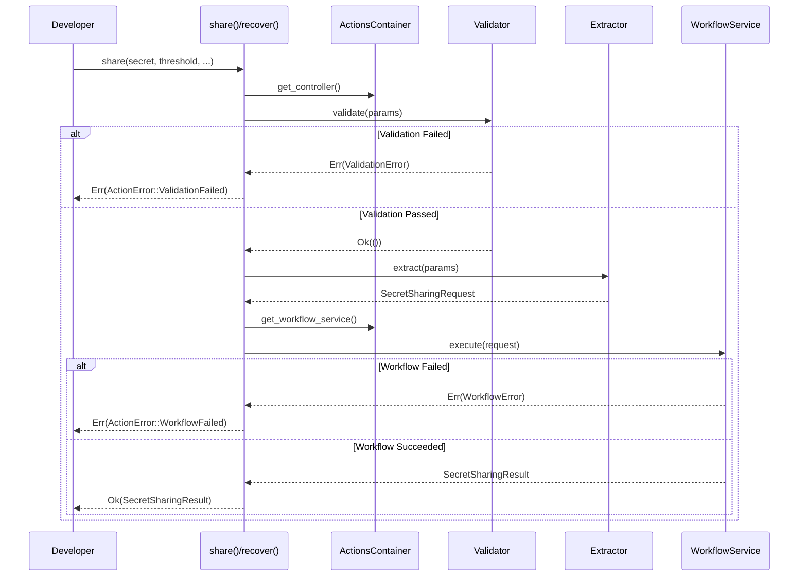

# Design Document: client-actions

## Overview

本設計書は、D-TPRESクライアントライブラリのActions層の設計を定義します。Actions層はFacadeパターンを適用し、開発者向けのシンプルなエンドポイント関数（`share()`, `recover()`, `generateKeyPair()`）を提供します。内部の複雑さ（Controller層、UseCase層）を隠蔽し、最小限のパラメータでD-TPRES機能を利用可能にします。

**アーキテクチャフロー:**
```
Developer API ─────────────────────────────────────────────
                         │
                         ▼
              ┌──────────────────────┐
              │    Actions層         │
              │  share()             │
              │  recover()           │
              │  generateKeyPair()   │
              └──────────┬───────────┘
                         │
        ┌────────────────┼────────────────┐
        ▼                ▼                ▼
   Validator        Extractor       CryptoService
        │                │                │
        └────────────────┼────────────────┘
                         ▼
              ┌──────────────────────┐
              │  WorkflowService     │
              │  (UseCase層)          │
              └──────────────────────┘
```

## Steering Document Alignment

### Technical Standards (tech.md)

本設計は以下の技術標準に準拠します：

1. **Clean Architecture（6層構成）**: Actions層は最上位層として、開発者向けFacadeを提供
2. **Facadeパターン**: 内部サブシステム（Controller、UseCase）の複雑さを隠蔽
3. **依存性逆転原則（DIP）**: Actions層はControllerとWorkflowServiceのインターフェースに依存
4. **Zeroize**: 秘密データを含む結果型（`SecretRecoveryResult`）はZeroizeトレイトを実装
5. **TERASOLUNA Guidelines**: Actions層は「開発者向けエンドポイント」として単一責務を持つ

### Project Structure (structure.md)

実装ファイルは以下の構成に従います：

```
client/src/actions/
├── mod.rs                  # モジュールエクスポート、share(), recover(), generateKeyPair()
├── error.rs                # ActionError定義
├── options.rs              # ShareOptions, RecoverOptions定義
└── di.rs                   # ActionsContainer（DI）
```

## Code Reuse Analysis

### Existing Components to Leverage

- **ControllerContainer** (`controller/di.rs`):
  - ShareValidator, RecoverValidator, ShareExtractor, RecoverExtractor へのアクセス
  - 入力検証とDTO生成の統括

- **WorkflowServiceContainer** (`usecase/workflow/di.rs`):
  - SecretSharingWorkflowService, SecretRecoveryWorkflowService へのアクセス
  - Phase 1/3 ワークフローの実行

- **CryptoService** (`usecase/core/crypto.rs`):
  - `generate_keypair()` - PRE鍵ペア生成
  - Umbral暗号操作の抽象化

- **SecretSharingRequest / SecretSharingResult** (`usecase/dto.rs`):
  - Phase 1 のリクエスト/レスポンスDTO

- **SecretRecoveryRequest / SecretRecoveryResult** (`usecase/dto.rs`):
  - Phase 3 のリクエスト/レスポンスDTO
  - `recovered_secret` はZeroize実装

- **ValidationError** (`controller/error.rs`):
  - Controller層のバリデーションエラー型

- **WorkflowError** (`usecase/error.rs`):
  - UseCase層のワークフローエラー型

### Integration Points

- **Controller層**: `ControllerContainer` を使用してValidatorとExtractorにアクセス
- **UseCase層**: `WorkflowServiceContainer` を使用してWorkflowServiceにアクセス
- **CryptoService**: 鍵ペア生成に直接使用（ActionsContainer経由）

## Architecture

### Component Interaction Flow



### Layered Architecture Position

```
┌─────────────────────────────────────────────────────────────────┐
│                        Developer API                             │
│   share(secret, threshold, total_shares, owner_sk, req_pk, ...) │
│   recover(secret_id, requester_sk, requester_process_id)        │
│   generateKeyPair()                                              │
└─────────────────────────────────┬───────────────────────────────┘
                                  │
┌─────────────────────────────────▼───────────────────────────────┐
│                     Actions層 (Facade)                          │
│  ┌────────────────────────────────────────────────────────┐     │
│  │                   share()                               │     │
│  │  1. Validate → 2. Extract → 3. Execute Workflow        │     │
│  └────────────────────────────────────────────────────────┘     │
│  ┌────────────────────────────────────────────────────────┐     │
│  │                   recover()                             │     │
│  │  1. Validate → 2. Extract → 3. Execute Workflow        │     │
│  └────────────────────────────────────────────────────────┘     │
│  ┌────────────────────────────────────────────────────────┐     │
│  │                generateKeyPair()                        │     │
│  │  CryptoService.generate_keypair()                      │     │
│  └────────────────────────────────────────────────────────┘     │
│  ┌────────────────────────────────────────────────────────┐     │
│  │    ActionsContainer (DI)                                │     │
│  │    - ControllerContainer                                │     │
│  │    - WorkflowServiceContainer                           │     │
│  │    - CryptoService                                      │     │
│  └────────────────────────────────────────────────────────┘     │
│  ┌────────────────────────────────────────────────────────┐     │
│  │    ActionError                                          │     │
│  │    - ValidationFailed                                   │     │
│  │    - WorkflowFailed                                     │     │
│  │    - ResourceNotFound                                   │     │
│  │    - CryptoError                                        │     │
│  └────────────────────────────────────────────────────────┘     │
└─────────────────────────────────┬───────────────────────────────┘
                                  │
┌─────────────────────────────────▼───────────────────────────────┐
│                     Controller層                                 │
│       ShareValidator ──── RecoverValidator                       │
│       ShareExtractor ──── RecoverExtractor                       │
└─────────────────────────────────┬───────────────────────────────┘
                                  │
┌─────────────────────────────────▼───────────────────────────────┐
│                     UseCase層                                    │
│   SecretSharingWorkflowService ─── SecretRecoveryWorkflowService│
└─────────────────────────────────────────────────────────────────┘
```

## Components and Interfaces

### Component 1: ActionError

- **Purpose:** Actions層固有のエラー型。内部エラー（ValidationError、WorkflowError）をラップし、開発者フレンドリーなエラーを提供
- **Interfaces:**
  ```rust
  /// Actions層のエラー型
  #[derive(Debug)]
  pub enum ActionError {
      /// Controller層でのバリデーション失敗
      ValidationFailed {
          /// エラーコード（例: "secret_empty", "invalid_threshold"）
          code: String,
          /// 人間可読なエラーメッセージ
          message: String,
      },
      /// UseCase層でのワークフロー失敗
      WorkflowFailed {
          /// エラーメッセージ
          message: String,
      },
      /// リソースが見つからない
      ResourceNotFound {
          /// リソース種別（例: "secret", "process"）
          resource: String,
      },
      /// 暗号操作エラー
      CryptoError {
          /// エラーメッセージ
          message: String,
      },
  }

  impl ActionError {
      /// ValidationFailed を作成
      pub fn validation_failed(code: impl Into<String>, message: impl Into<String>) -> Self;

      /// WorkflowFailed を作成
      pub fn workflow_failed(message: impl Into<String>) -> Self;

      /// ResourceNotFound を作成
      pub fn resource_not_found(resource: impl Into<String>) -> Self;

      /// CryptoError を作成
      pub fn crypto_error(message: impl Into<String>) -> Self;
  }

  impl std::fmt::Display for ActionError { ... }
  impl std::error::Error for ActionError { }

  /// ValidationError からの変換
  impl From<ValidationError> for ActionError {
      fn from(err: ValidationError) -> Self {
          ActionError::ValidationFailed {
              code: err.code().to_string(),
              message: err.message().to_string(),
          }
      }
  }

  /// WorkflowError からの変換
  impl From<WorkflowError> for ActionError {
      fn from(err: WorkflowError) -> Self {
          match err {
              WorkflowError::ValidationError(msg) => ActionError::ValidationFailed {
                  code: "workflow_validation".to_string(),
                  message: msg,
              },
              WorkflowError::ResourceNotFound(resource) => ActionError::ResourceNotFound { resource },
              _ => ActionError::WorkflowFailed {
                  message: err.to_string(),
              },
          }
      }
  }
  ```
- **Dependencies:** `controller/error.rs` (ValidationError), `usecase/error.rs` (WorkflowError)
- **Reuses:** なし（新規定義）

### Component 2: ShareOptions

- **Purpose:** `share()` 関数のオプションパラメータを格納
- **Interfaces:**
  ```rust
  /// share() のオプションパラメータ
  #[derive(Debug, Clone, Default)]
  pub struct ShareOptions {
      /// 秘密のメタデータ（オプション）
      pub metadata: Option<SecretMetadata>,
  }

  impl ShareOptions {
      /// 新しいShareOptionsを作成
      pub fn new() -> Self;

      /// メタデータ付きで作成
      pub fn with_metadata(metadata: SecretMetadata) -> Self;
  }
  ```
- **Dependencies:** `usecase/dto.rs` (SecretMetadata)
- **Reuses:** なし（新規定義）

### Component 3: RecoverOptions

- **Purpose:** `recover()` 関数のオプションパラメータを格納（将来の拡張用）
- **Interfaces:**
  ```rust
  /// recover() のオプションパラメータ
  #[derive(Debug, Clone, Default)]
  pub struct RecoverOptions {
      // 将来の拡張用に予約
  }

  impl RecoverOptions {
      /// 新しいRecoverOptionsを作成
      pub fn new() -> Self;
  }
  ```
- **Dependencies:** なし
- **Reuses:** なし（新規定義）

### Component 4: ActionsContainer

- **Purpose:** Actions層の依存性注入コンテナ。Controller層、UseCase層、CryptoServiceへのアクセスを提供
- **Interfaces:**
  ```rust
  /// Actions層DIコンテナ
  pub struct ActionsContainer {
      controller: ControllerContainer,
      workflow_services: WorkflowServiceContainer,
      crypto_service: Arc<CryptoService>,
  }

  impl ActionsContainer {
      /// デフォルト構成で新しいActionsContainerを作成
      pub fn new() -> Self;

      /// カスタム依存性で作成（テスト用）
      pub fn with_dependencies(
          controller: ControllerContainer,
          workflow_services: WorkflowServiceContainer,
          crypto_service: Arc<CryptoService>,
      ) -> Self;

      /// ControllerContainerへの参照を取得
      pub fn controller(&self) -> &ControllerContainer;

      /// WorkflowServiceContainerへの参照を取得
      pub fn workflow_services(&self) -> &WorkflowServiceContainer;

      /// CryptoServiceへの参照を取得
      pub fn crypto_service(&self) -> &CryptoService;

      /// share() を実行
      pub fn share(
          &self,
          secret: Vec<u8>,
          threshold: u8,
          total_shares: u8,
          owner_secret_key: SecretKey,
          requester_public_key: PublicKey,
          owner_process_id: String,
          options: Option<ShareOptions>,
      ) -> Result<SecretSharingResult, ActionError>;

      /// recover() を実行
      pub fn recover(
          &self,
          secret_id: &str,
          requester_secret_key: SecretKey,
          requester_process_id: String,
          options: Option<RecoverOptions>,
      ) -> Result<SecretRecoveryResult, ActionError>;

      /// generateKeyPair() を実行
      pub fn generate_keypair(&self) -> Result<(SecretKey, PublicKey), ActionError>;
  }

  impl Default for ActionsContainer {
      fn default() -> Self { Self::new() }
  }
  ```
- **Dependencies:** `ControllerContainer`, `WorkflowServiceContainer`, `CryptoService`
- **Reuses:** 既存のコンテナとサービスを再利用

### Component 5: share() 関数

- **Purpose:** 秘密分割と配布を行うメインAPI
- **Interfaces:**
  ```rust
  /// 秘密を分割してkFragを生成する
  ///
  /// # Arguments
  /// * `secret` - 分割する秘密データ
  /// * `threshold` - 復元に必要な最小シェア数 (k)
  /// * `total_shares` - 生成する総シェア数 (n)
  /// * `owner_secret_key` - Owner秘密鍵
  /// * `requester_public_key` - Requester公開鍵
  /// * `owner_process_id` - Owner-Process ID
  /// * `options` - オプションパラメータ（メタデータなど）
  ///
  /// # Returns
  /// * `Ok(SecretSharingResult)` - 分割成功、secret_idとkFragを含む
  /// * `Err(ActionError)` - バリデーションまたはワークフローエラー
  ///
  /// # Example
  /// ```rust
  /// let container = ActionsContainer::new();
  /// let (owner_sk, owner_pk) = container.generate_keypair()?;
  /// let (_, requester_pk) = container.generate_keypair()?;
  ///
  /// let result = container.share(
  ///     b"my secret data".to_vec(),
  ///     3,  // threshold
  ///     5,  // total_shares
  ///     owner_sk,
  ///     requester_pk,
  ///     "owner_process_123".to_string(),
  ///     None,
  /// )?;
  ///
  /// println!("Secret ID: {}", result.secret_id);
  /// println!("kFrag count: {}", result.kfrags.len());
  /// ```
  pub fn share(
      secret: Vec<u8>,
      threshold: u8,
      total_shares: u8,
      owner_secret_key: SecretKey,
      requester_public_key: PublicKey,
      owner_process_id: String,
      options: Option<ShareOptions>,
  ) -> Result<SecretSharingResult, ActionError>;
  ```
- **Dependencies:** `ActionsContainer`, `ShareValidator`, `ShareExtractor`, `SecretSharingWorkflowService`
- **Reuses:** Controller層とUseCase層の既存コンポーネント

### Component 6: recover() 関数

- **Purpose:** 秘密を復元するメインAPI
- **Interfaces:**
  ```rust
  /// 秘密を復元する
  ///
  /// # Arguments
  /// * `secret_id` - 復元対象の秘密ID
  /// * `requester_secret_key` - Requester秘密鍵
  /// * `requester_process_id` - Requester-Process ID
  /// * `options` - オプションパラメータ（将来の拡張用）
  ///
  /// # Returns
  /// * `Ok(SecretRecoveryResult)` - 復元成功、recovered_secretを含む
  /// * `Err(ActionError)` - バリデーション、ワークフロー、またはリソースエラー
  ///
  /// # Example
  /// ```rust
  /// let container = ActionsContainer::new();
  ///
  /// let result = container.recover(
  ///     "secret_abc123",
  ///     requester_sk,
  ///     "requester_process_456".to_string(),
  ///     None,
  /// )?;
  ///
  /// println!("Recovered secret: {:?}", result.recovered_secret);
  /// // recovered_secret is Zeroize on drop
  /// ```
  pub fn recover(
      secret_id: &str,
      requester_secret_key: SecretKey,
      requester_process_id: String,
      options: Option<RecoverOptions>,
  ) -> Result<SecretRecoveryResult, ActionError>;
  ```
- **Dependencies:** `ActionsContainer`, `RecoverValidator`, `RecoverExtractor`, `SecretRecoveryWorkflowService`
- **Reuses:** Controller層とUseCase層の既存コンポーネント

### Component 7: generateKeyPair() 関数

- **Purpose:** PRE用の鍵ペアを生成するユーティリティAPI
- **Interfaces:**
  ```rust
  /// Umbral PRE用の鍵ペアを生成する
  ///
  /// # Returns
  /// * `Ok((SecretKey, PublicKey))` - 生成された鍵ペア
  /// * `Err(ActionError::CryptoError)` - 生成失敗
  ///
  /// # Example
  /// ```rust
  /// let container = ActionsContainer::new();
  /// let (secret_key, public_key) = container.generate_keypair()?;
  ///
  /// // secret_key is 32 bytes
  /// // Use for owner or requester operations
  /// ```
  ///
  /// # Security
  /// - `SecretKey` はZeroize traitを実装し、ドロップ時にメモリをクリア
  /// - 生成された鍵は暗号学的に安全な乱数生成器を使用
  pub fn generate_keypair() -> Result<(SecretKey, PublicKey), ActionError>;
  ```
- **Dependencies:** `CryptoService`
- **Reuses:** `CryptoService.generate_keypair()`

## Data Models

### ActionError

```rust
/// Actions層エラー型
#[derive(Debug)]
pub enum ActionError {
    /// バリデーション失敗
    ValidationFailed { code: String, message: String },
    /// ワークフロー失敗
    WorkflowFailed { message: String },
    /// リソースが見つからない
    ResourceNotFound { resource: String },
    /// 暗号操作エラー
    CryptoError { message: String },
}
```

### ShareOptions

```rust
/// share() オプションパラメータ
#[derive(Debug, Clone, Default)]
pub struct ShareOptions {
    /// 秘密のメタデータ
    pub metadata: Option<SecretMetadata>,
}
```

### RecoverOptions

```rust
/// recover() オプションパラメータ
#[derive(Debug, Clone, Default)]
pub struct RecoverOptions {
    // 将来の拡張用に予約
}
```

## Error Handling

### Error Scenarios

1. **ValidationFailed - 秘密データが空**
   - **Handling:** Controller層のShareValidatorが検出
   - **User Impact:** `ActionError::ValidationFailed { code: "secret_empty", message: "Secret data cannot be empty" }`

2. **ValidationFailed - 閾値が無効**
   - **Handling:** Controller層のShareValidatorが検出
   - **User Impact:** `ActionError::ValidationFailed { code: "invalid_threshold", message: "Threshold must be greater than 0" }`

3. **ValidationFailed - 閾値が総シェア数を超過**
   - **Handling:** Controller層のShareValidatorが検出
   - **User Impact:** `ActionError::ValidationFailed { code: "threshold_exceeds_total", message: "Threshold (k) cannot exceed total shares (n)" }`

4. **ValidationFailed - 秘密IDが空**
   - **Handling:** Controller層のRecoverValidatorが検出
   - **User Impact:** `ActionError::ValidationFailed { code: "invalid_secret_id", message: "Secret ID cannot be empty" }`

5. **ResourceNotFound - 秘密が存在しない**
   - **Handling:** UseCase層のWorkflowServiceが検出
   - **User Impact:** `ActionError::ResourceNotFound { resource: "secret" }`

6. **WorkflowFailed - ワークフロー実行エラー**
   - **Handling:** UseCase層で発生したエラーをラップ
   - **User Impact:** `ActionError::WorkflowFailed { message: "..." }`

7. **CryptoError - 鍵生成エラー**
   - **Handling:** CryptoServiceで発生したエラーをラップ
   - **User Impact:** `ActionError::CryptoError { message: "..." }`

### Error Propagation

```rust
// share() の実装例
impl ActionsContainer {
    pub fn share(
        &self,
        secret: Vec<u8>,
        threshold: u8,
        total_shares: u8,
        owner_secret_key: SecretKey,
        requester_public_key: PublicKey,
        owner_process_id: String,
        options: Option<ShareOptions>,
    ) -> Result<SecretSharingResult, ActionError> {
        // 1. Owner公開鍵を導出
        let owner_public_key = owner_secret_key.public_key();

        // 2. Controller層でバリデーション
        self.controller.share_validator().validate(
            &secret,
            threshold,
            total_shares,
            &owner_secret_key,
            &requester_public_key,
        )?; // ValidationError → ActionError::ValidationFailed

        // 3. Controller層でDTO抽出
        let request = self.controller.share_extractor().extract(
            secret,
            owner_secret_key,
            owner_public_key,
            requester_public_key,
            threshold,
            total_shares,
            owner_process_id,
            options.and_then(|o| o.metadata),
        );

        // 4. UseCase層でワークフロー実行
        let result = self.workflow_services
            .secret_sharing_service()
            .execute(request)?; // WorkflowError → ActionError

        Ok(result)
    }
}
```

## Testing Strategy

### Unit Testing

**対象コンポーネント:**
- `ActionError` - エラー生成、変換、フォーマットテスト
- `ShareOptions` - デフォルト値、ビルダーパターンテスト
- `RecoverOptions` - デフォルト値テスト
- `ActionsContainer` - コンポーネントアクセステスト

**テストパターン:**
```rust
#[cfg(test)]
mod tests {
    use super::*;

    // ActionError Tests
    #[test]
    fn test_action_error_from_validation_error() {
        let val_err = ValidationError::new("test_code", "test message");
        let action_err: ActionError = val_err.into();

        match action_err {
            ActionError::ValidationFailed { code, message } => {
                assert_eq!(code, "test_code");
                assert_eq!(message, "test message");
            }
            _ => panic!("Expected ValidationFailed"),
        }
    }

    #[test]
    fn test_action_error_from_workflow_error() {
        let workflow_err = WorkflowError::CryptoError("crypto failed".to_string());
        let action_err: ActionError = workflow_err.into();

        match action_err {
            ActionError::WorkflowFailed { message } => {
                assert!(message.contains("crypto"));
            }
            _ => panic!("Expected WorkflowFailed"),
        }
    }

    #[test]
    fn test_action_error_display() {
        let err = ActionError::validation_failed("test", "Test error");
        let display = format!("{}", err);
        assert!(display.contains("test"));
        assert!(display.contains("Test error"));
    }

    // ShareOptions Tests
    #[test]
    fn test_share_options_default() {
        let options = ShareOptions::default();
        assert!(options.metadata.is_none());
    }

    #[test]
    fn test_share_options_with_metadata() {
        let metadata = SecretMetadata::new("test".to_string());
        let options = ShareOptions::with_metadata(metadata);
        assert!(options.metadata.is_some());
    }

    // ActionsContainer Tests
    #[test]
    fn test_container_provides_controller() {
        let container = ActionsContainer::new();
        let _ = container.controller();
    }

    #[test]
    fn test_container_provides_workflow_services() {
        let container = ActionsContainer::new();
        let _ = container.workflow_services();
    }

    #[test]
    fn test_container_provides_crypto_service() {
        let container = ActionsContainer::new();
        let _ = container.crypto_service();
    }
}
```

### Integration Testing

**対象フロー:**
- `share()` - バリデーション → DTO抽出 → ワークフロー実行の完全フロー
- `recover()` - バリデーション → DTO抽出 → ワークフロー実行の完全フロー
- `generateKeyPair()` - 鍵生成の正確性検証
- エラー伝播テスト - 各層のエラーがActionErrorに正しく変換されるか

**テスト例:**
```rust
#[test]
fn test_share_valid_params() {
    let container = ActionsContainer::new();
    let (owner_sk, _) = container.generate_keypair().unwrap();
    let (_, requester_pk) = container.generate_keypair().unwrap();

    let result = container.share(
        b"test secret".to_vec(),
        3,
        5,
        owner_sk,
        requester_pk,
        "owner_123".to_string(),
        None,
    );

    assert!(result.is_ok());
    let result = result.unwrap();
    assert!(!result.secret_id.is_empty());
    assert_eq!(result.kfrags.len(), 5);
}

#[test]
fn test_share_empty_secret_fails() {
    let container = ActionsContainer::new();
    let (owner_sk, _) = container.generate_keypair().unwrap();
    let (_, requester_pk) = container.generate_keypair().unwrap();

    let result = container.share(
        vec![], // empty secret
        3,
        5,
        owner_sk,
        requester_pk,
        "owner_123".to_string(),
        None,
    );

    assert!(result.is_err());
    match result.unwrap_err() {
        ActionError::ValidationFailed { code, .. } => {
            assert_eq!(code, "secret_empty");
        }
        _ => panic!("Expected ValidationFailed"),
    }
}

#[test]
fn test_share_and_recover_roundtrip() {
    let container = ActionsContainer::new();

    // Generate keys
    let (owner_sk, _) = container.generate_keypair().unwrap();
    let (requester_sk, requester_pk) = container.generate_keypair().unwrap();

    // Share
    let original_secret = b"my precious secret data".to_vec();
    let share_result = container.share(
        original_secret.clone(),
        3,
        5,
        owner_sk,
        requester_pk,
        "owner_123".to_string(),
        None,
    ).unwrap();

    // Recover
    let recover_result = container.recover(
        &share_result.secret_id,
        requester_sk,
        "requester_456".to_string(),
        None,
    ).unwrap();

    // Verify
    assert_eq!(recover_result.recovered_secret.as_ref(), &original_secret);
}

#[test]
fn test_generate_keypair_unique() {
    let container = ActionsContainer::new();

    let (sk1, pk1) = container.generate_keypair().unwrap();
    let (sk2, pk2) = container.generate_keypair().unwrap();

    assert_ne!(pk1.to_bytes(), pk2.to_bytes());
}
```

### End-to-End Testing

**対象シナリオ:**
- 完全な秘密分割→復元フロー
- 様々なk-of-n組み合わせでの動作確認
- エラーケースの網羅的テスト

## Security Considerations

### Memory Safety

```rust
// ActionErrorは秘密情報を含まない
// エラーメッセージに秘密鍵やデータを含めない

impl ActionError {
    pub fn validation_failed(code: impl Into<String>, message: impl Into<String>) -> Self {
        ActionError::ValidationFailed {
            code: code.into(),
            message: message.into(), // 秘密情報を含めない
        }
    }
}

// SecretRecoveryResult.recovered_secret はZeroize実装
// ドロップ時に自動的にメモリがクリアされる
```

### Secret Key Handling

```rust
// SecretKeyは使用後にZeroizeされる
pub fn generate_keypair() -> Result<(SecretKey, PublicKey), ActionError> {
    let crypto = CryptoService::new();
    crypto.generate_keypair()
        .map_err(|e| ActionError::crypto_error(e.to_string()))
}
// SecretKeyがスコープを抜けると自動的にゼロ化
```

### Input Validation Flow

バリデーションは決定論的な順序で実行され、同じ入力に対して常に同じ最初のエラーを返します：

1. Actions層で基本的なnullチェック（オプション）
2. Controller層のValidatorで詳細なバリデーション
3. UseCase層でドメイン固有のバリデーション

## Implementation Dependencies

### Required Before Implementation

1. 既存の `controller/mod.rs` - ControllerContainer
2. 既存の `usecase/workflow/di.rs` - WorkflowServiceContainer
3. 既存の `usecase/core/crypto.rs` - CryptoService
4. 既存の `usecase/dto.rs` - SecretSharingRequest, SecretRecoveryRequest, etc.
5. 既存の `controller/error.rs` - ValidationError
6. 既存の `usecase/error.rs` - WorkflowError

### Implementation Order

1. ActionError定義（`actions/error.rs`）
2. ShareOptions, RecoverOptions定義（`actions/options.rs`）
3. ActionsContainer実装（`actions/di.rs`）
4. share(), recover(), generateKeyPair() 実装（`actions/mod.rs`）
5. mod.rsでのエクスポート
6. ユニットテスト
7. 統合テスト
