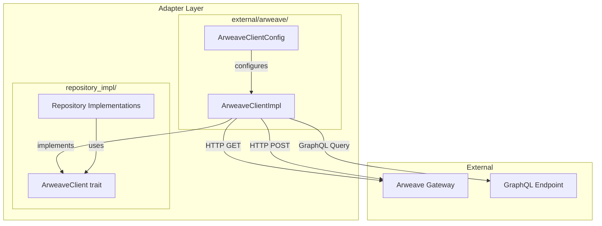

# 設計書

## 概要

本設計書は、D-TPRESクライアントライブラリにおける本番用 `ArweaveClientImpl` の技術設計を定義します。`ArweaveClientImpl` は、既存の `ArweaveClient` トレイト（`client/src/adapter/repository_impl/mod.rs` で定義）を実装し、Arweaveネットワークとの実際の通信を担当します。

本コンポーネントは Adapter 層の `external/` サブディレクトリに配置され、Repository 実装がArweaveへのデータ永続化・取得を行うための基盤インフラを提供します。

## ステアリングドキュメントとの整合性

### 技術スタック (tech.md)

- **言語**: Rust 1.86.0（Edition 2024）
- **ターゲット**: `wasm32-unknown-unknown`（WASM互換性必須）
- **非同期処理**: `async_trait` を使用（既存トレイト定義に準拠）
- **シリアライゼーション**: `serde` + `serde_json`（GraphQL通信用）
- **HTTPクライアント**: `reqwest`（WASM対応ビルド）

## 技術選定: HTTPクライアント

### 選定結果

**`reqwest` を直接使用**し、既存の `arweave-rs` クレートは使用しない。

### 検討した選択肢

| 選択肢 | 概要 |
|--------|------|
| **arweave-rs** | Arweave Rust SDK（v0.2.0、2023年9月） |
| **arweave-sdk-rs** | 高性能Arweave SDK（v0.0.1、初期段階） |
| **reqwest直接使用** | HTTPクライアントで直接Arweave APIを呼び出す |

### 選定理由

#### 1. WASM互換性の確保

**reqwest**（[docs.rs/reqwest](https://docs.rs/reqwest/latest/reqwest/)より）:
> reqwest 0.13.1 は `wasm32-unknown-unknown` ターゲットに**明示的に対応**

- `js-sys`, `wasm-bindgen`, `wasm-bindgen-futures`, `web-sys` 依存関係が組み込まれている
- WASM環境での制限事項がドキュメント化されている

**arweave-rs**（[lib.rs/crates/arweave-rs](https://lib.rs/crates/arweave-rs)、[GitHub](https://github.com/nestdotland/arweave-rs)より）:
> - WASM対応に関する**明示的な記述なし**
> - `reqwest` の `rustls-tls` feature を使用（WASM環境では**TLSは利用不可**）

`arweave-rs` が `rustls-tls` を使用しているため、WASMターゲットでコンパイルエラーになる可能性がある。

#### 2. 依存関係の軽量化

- **arweave-rs**: 24-41MB、約667K行のコード
- **reqwest直接使用**: 必要最小限の依存関係のみ

D-TPRESの目標「WASMバイナリサイズ2MB未満」への影響を最小化。

#### 3. メンテナンス独立性

- `arweave-rs` は2023年9月以降更新なし
- 外部ライブラリの更新停止リスクを回避
- D-TPRES固有の要件に柔軟に対応可能

#### 4. 既存トレイトとの整合性

`ArweaveClient` トレイトは既に定義済みで、シンプルな3メソッド（`get`, `post`, `query`）のみ。
直接実装しても複雑性は低い。

### プロジェクト構造 (structure.md)

```
client/src/adapter/
├── mod.rs                    # Adapter層モジュール定義（既存）
├── errors.rs                 # AdapterError定義（既存）
├── repository_impl/          # Repository実装（既存）
│   ├── mod.rs               # ArweaveClient trait定義（既存）
│   └── ...
└── external/                 # 外部システムアダプター（新規）
    ├── mod.rs               # external モジュール定義
    └── arweave/             # Arweaveクライアント（新規）
        ├── mod.rs           # arweave モジュール定義・公開エクスポート
        ├── client.rs        # ArweaveClientImpl 実装
        └── config.rs        # ArweaveClientConfig 設定
```

## コード再利用分析

### 活用する既存コンポーネント

- **`ArweaveClient` トレイト** (`repository_impl/mod.rs`): 実装対象のインターフェース定義
- **`Tag` 構造体** (`repository_impl/mod.rs`): Arweaveタグの共通データ構造
- **`AdapterError`** (`adapter/errors.rs`): 統一されたエラー型
- **`MockArweaveClient`** (`repository_impl/mod.rs`): テスト時の参照実装

### 統合ポイント

- **Repository 実装**: `ArweaveSecretRepository`, `ArweaveCapsuleRepository` 等が `ArweaveClient` を使用
- **DI コンテナ** (`di.rs`): `ArweaveClientImpl` インスタンスの注入

## アーキテクチャ

### モジュラー設計原則

- **単一ファイル責務**: `arweave_client.rs` はHTTP/GraphQL通信のみを担当
- **コンポーネント分離**: 設定は `config.rs` に分離
- **サービス層分離**: シリアライゼーション/エンティティマッピングはRepository実装に委譲
- **ユーティリティモジュール性**: GraphQLクエリビルダーは内部ヘルパーとして実装



## コンポーネントとインターフェース

### ArweaveClientConfig

- **目的**: ArweaveClientの設定パラメータを保持
- **インターフェース**:
  ```rust
  pub struct ArweaveClientConfig {
      pub gateway_url: String,
      pub graphql_url: String,
      pub timeout_secs: u64,
      pub max_retries: u32,
      pub retry_backoff_ms: u64,
  }

  impl ArweaveClientConfig {
      pub fn new() -> Self;
      pub fn with_gateway_url(self, url: impl Into<String>) -> Self;
      pub fn with_graphql_url(self, url: impl Into<String>) -> Self;
      pub fn with_timeout(self, secs: u64) -> Self;
      pub fn with_retries(self, max: u32, backoff_ms: u64) -> Self;
      pub fn from_env() -> Result<Self, AdapterError>;
  }

  impl Default for ArweaveClientConfig {
      fn default() -> Self;
  }
  ```
- **依存関係**: なし
- **再利用**: 新規コンポーネント

### ArweaveClientImpl

- **目的**: `ArweaveClient` トレイトの本番実装
- **インターフェース**:
  ```rust
  pub struct ArweaveClientImpl {
      config: ArweaveClientConfig,
      http_client: reqwest::Client,
      wallet: Option<ArweaveWallet>,
  }

  impl ArweaveClientImpl {
      pub fn new(config: ArweaveClientConfig) -> Result<Self, AdapterError>;
      pub fn with_wallet(self, wallet: ArweaveWallet) -> Self;
      pub fn read_only(config: ArweaveClientConfig) -> Result<Self, AdapterError>;
  }

  #[async_trait]
  impl ArweaveClient for ArweaveClientImpl {
      async fn get(&self, tx_id: &str) -> Result<Option<Vec<u8>>, AdapterError>;
      async fn post(&self, data: &[u8], tags: Vec<Tag>) -> Result<String, AdapterError>;
      async fn query(&self, tags: Vec<Tag>) -> Result<Vec<String>, AdapterError>;
  }
  ```
- **依存関係**: `ArweaveClientConfig`, `reqwest::Client`, `ArweaveWallet`
- **再利用**: `ArweaveClient` トレイト、`Tag` 構造体、`AdapterError`

### ArweaveWallet

- **目的**: Arweaveトランザクション署名用のウォレット抽象化
- **インターフェース**:
  ```rust
  pub struct ArweaveWallet {
      jwk: serde_json::Value,
  }

  impl ArweaveWallet {
      pub fn from_jwk(jwk: serde_json::Value) -> Result<Self, AdapterError>;
      pub fn from_file(path: &str) -> Result<Self, AdapterError>;
      pub fn address(&self) -> String;
      pub(crate) fn sign(&self, data: &[u8]) -> Result<Vec<u8>, AdapterError>;
  }
  ```
- **依存関係**: `serde_json`, 暗号ライブラリ（RSA署名用）
- **再利用**: 新規コンポーネント

## データモデル

### GraphQL クエリレスポンス

```rust
#[derive(Debug, Deserialize)]
struct GraphQLResponse {
    data: Option<TransactionsData>,
    errors: Option<Vec<GraphQLError>>,
}

#[derive(Debug, Deserialize)]
struct TransactionsData {
    transactions: TransactionConnection,
}

#[derive(Debug, Deserialize)]
struct TransactionConnection {
    edges: Vec<TransactionEdge>,
    #[serde(rename = "pageInfo")]
    page_info: PageInfo,
}

#[derive(Debug, Deserialize)]
struct TransactionEdge {
    node: TransactionNode,
    cursor: String,
}

#[derive(Debug, Deserialize)]
struct TransactionNode {
    id: String,
    block: Option<BlockInfo>,
}

#[derive(Debug, Deserialize)]
struct BlockInfo {
    height: u64,
    timestamp: u64,
}

#[derive(Debug, Deserialize)]
struct PageInfo {
    #[serde(rename = "hasNextPage")]
    has_next_page: bool,
}

#[derive(Debug, Deserialize)]
struct GraphQLError {
    message: String,
}
```

### ArweaveTransaction（投稿用）

```rust
#[derive(Debug, Serialize)]
struct ArweaveTransaction {
    format: u8,           // 常に2
    id: String,           // 空文字列（署名後に計算）
    last_tx: String,      // 最新のアンカートランザクションID
    owner: String,        // ウォレット公開鍵（Base64URL）
    tags: Vec<EncodedTag>,
    target: String,       // 空文字列（データ専用TX）
    quantity: String,     // "0"（データ専用TX）
    data: String,         // Base64URLエンコードされたデータ
    data_size: String,    // データサイズ（文字列）
    data_root: String,    // データルートハッシュ
    reward: String,       // 計算されたトランザクション料金
    signature: String,    // RSA-PSS署名
}

#[derive(Debug, Serialize)]
struct EncodedTag {
    name: String,   // Base64URLエンコード
    value: String,  // Base64URLエンコード
}
```

## エラーハンドリング

### エラーシナリオ

1. **ネットワーク接続失敗**
   - **処理**: 指数バックオフでリトライ（最大3回）
   - **ユーザー影響**: `AdapterError::NetworkError` を返却

2. **トランザクション未確認**
   - **処理**: `Ok(None)` を返却（エラーではない）
   - **ユーザー影響**: 呼び出し元でリトライロジックを実装可能

3. **ウォレット未設定での投稿**
   - **処理**: 即座に `AdapterError::ConfigurationError` を返却
   - **ユーザー影響**: 明確なエラーメッセージで設定不足を通知

4. **GraphQLクエリエラー**
   - **処理**: GraphQLエラーレスポンスを解析し適切なエラーに変換
   - **ユーザー影響**: `AdapterError::QueryError` を返却

5. **データサイズ超過**
   - **処理**: 投稿前にサイズ検証、即座にエラー返却
   - **ユーザー影響**: `AdapterError::ValidationError` を返却

6. **無効なJWKウォレット**
   - **処理**: ウォレット初期化時に検証
   - **ユーザー影響**: `AdapterError::ConfigurationError` を返却

### AdapterError 拡張

既存の `AdapterError` に以下のバリアントを追加：

```rust
pub enum AdapterError {
    // 既存
    SerializationError { context: String, message: String },
    NotFound { resource: String, id: String },

    // 新規追加
    NetworkError {
        context: String,
        message: String,
        retries_attempted: u32,
    },
    ConfigurationError {
        context: String,
        message: String,
    },
    ValidationError {
        context: String,
        message: String,
    },
    QueryError {
        context: String,
        message: String,
    },
}
```

## テスト戦略

### ユニットテスト

- **設定テスト**: `ArweaveClientConfig` のビルダーパターン、デフォルト値、環境変数読み込み
- **GraphQLクエリ構築**: タグからのクエリ文字列生成
- **レスポンス解析**: GraphQLレスポンスJSONのデシリアライズ
- **エラー変換**: 各種エラーシナリオの正しいエラー型変換

### 統合テスト

- **MockArweaveClient との互換性**: 同じテストケースが両実装で動作することを確認
- **リトライロジック**: モックHTTPクライアントで失敗/成功シナリオをシミュレート
- **ウォレット署名**: テスト用JWKでの署名検証

### E2Eテスト

- **Arweave Testnet**: テストネットへの実際の読み書き
- **ローカルArweave**: ArLocal などのローカル開発環境での動作確認
- **Repository統合**: `ArweaveSecretRepository` 等との組み合わせテスト
