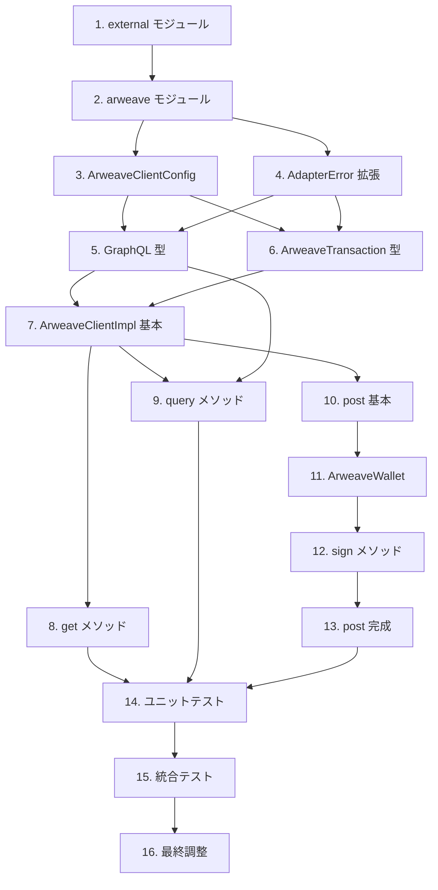

# タスクドキュメント

## 概要

本ドキュメントは、`ArweaveClientImpl` の実装タスクを定義します。設計書に基づき、以下のタスクを順序立てて実装します。

---

- [x] 1. external モジュール構造の作成
  - File: `client/src/adapter/external/mod.rs`
  - external ディレクトリと mod.rs を新規作成
  - arweave サブモジュールを宣言
  - adapter/mod.rs に external モジュールを追加
  - Purpose: external アダプター層の基盤構造を確立
  - _Leverage: client/src/adapter/mod.rs_
  - _Requirements: 1.1_
  - _Prompt: Role: Rust Developer specializing in module organization | Task: Create external module structure following the design document, establishing the foundation for external adapters in client/src/adapter/external/ | Restrictions: Follow existing adapter module patterns, maintain clean module hierarchy | Success: Module compiles without errors, proper module exports configured_

- [x] 2. arweave モジュール構造の作成
  - File: `client/src/adapter/external/arweave/mod.rs`
  - arweave ディレクトリと mod.rs を新規作成
  - client, config サブモジュールを宣言
  - 公開エクスポートを設定（ArweaveClientImpl, ArweaveClientConfig）
  - Purpose: Arweave クライアント実装のモジュール構造を確立
  - _Leverage: client/src/adapter/external/mod.rs_
  - _Requirements: 1.1_
  - _Prompt: Role: Rust Developer | Task: Create arweave submodule structure with proper module declarations for client and config components | Restrictions: Follow project module patterns, export only public interfaces | Success: Submodule compiles, exports are correctly configured_

- [x] 3. ArweaveClientConfig の実装
  - File: `client/src/adapter/external/arweave/config.rs`
  - ArweaveClientConfig 構造体を実装
  - Builder パターンのメソッド群を実装（with_gateway_url, with_graphql_url, with_timeout, with_retries）
  - Default トレイト実装
  - from_env メソッドの実装（環境変数からの設定読み込み）
  - Purpose: ArweaveClient の設定管理機能を提供
  - _Leverage: client/src/adapter/errors.rs (AdapterError)_
  - _Requirements: 1.2, 7.1_
  - _Prompt: Role: Rust Developer with expertise in builder patterns and configuration management | Task: Implement ArweaveClientConfig with builder pattern following requirement 1.2 and 7.1, including environment variable support | Restrictions: Use AdapterError for error handling, follow project coding conventions | Success: Config struct compiles, builder pattern works correctly, environment variable loading functions_

- [x] 4. AdapterError の拡張
  - File: `client/src/adapter/errors.rs`
  - NetworkError バリアントを追加
  - ConfigurationError バリアントを追加
  - ValidationError バリアントを追加
  - QueryError バリアントを追加
  - Purpose: Arweave クライアント固有のエラーハンドリングを提供
  - _Leverage: client/src/adapter/errors.rs (既存の AdapterError)_
  - _Requirements: 6.1, 6.2, 6.3_
  - _Prompt: Role: Rust Developer specializing in error handling | Task: Extend AdapterError enum with network, configuration, validation, and query error variants following requirements 6.1-6.3 | Restrictions: Maintain backward compatibility with existing error variants, follow project error handling patterns | Success: New error variants compile, existing code continues to work_

- [x] 5. GraphQL レスポンス型の定義
  - File: `client/src/adapter/external/arweave/client.rs`
  - GraphQLResponse 構造体を定義
  - TransactionsData, TransactionConnection, TransactionEdge 構造体を定義
  - TransactionNode, BlockInfo, PageInfo 構造体を定義
  - GraphQLError 構造体を定義
  - Purpose: Arweave GraphQL API レスポンスのデシリアライズ型を提供
  - _Leverage: serde, serde_json_
  - _Requirements: 3.1_
  - _Prompt: Role: Rust Developer with expertise in serde and API integration | Task: Define GraphQL response types following the design document data models | Restrictions: Use serde derive macros, handle optional fields properly | Success: Types compile, can deserialize GraphQL responses_

- [x] 6. ArweaveTransaction 型の定義
  - File: `client/src/adapter/external/arweave/client.rs`
  - ArweaveTransaction 構造体を定義（投稿用）
  - EncodedTag 構造体を定義
  - Base64URL エンコーディング用のヘルパー関数を実装
  - Purpose: Arweave トランザクション投稿用の型を提供
  - _Leverage: serde, base64_
  - _Requirements: 2.1_
  - _Prompt: Role: Rust Developer with expertise in Arweave protocol | Task: Define ArweaveTransaction type for posting data following Arweave transaction format specification | Restrictions: Follow Arweave format 2 specification, use Base64URL encoding | Success: Transaction type compiles, serializes to valid Arweave format_

- [x] 7. ArweaveClientImpl の基本構造実装
  - File: `client/src/adapter/external/arweave/client.rs`
  - ArweaveClientImpl 構造体を定義
  - new コンストラクタを実装
  - read_only コンストラクタを実装
  - reqwest::Client の初期化を実装
  - Purpose: ArweaveClient の基本構造を確立
  - _Leverage: reqwest, ArweaveClientConfig_
  - _Requirements: 1.1_
  - _Prompt: Role: Rust Developer with expertise in HTTP clients | Task: Implement ArweaveClientImpl basic structure with reqwest client initialization | Restrictions: Configure reqwest for WASM compatibility, handle initialization errors properly | Success: Struct compiles, HTTP client initializes correctly_

- [x] 8. ArweaveClient::get メソッドの実装
  - File: `client/src/adapter/external/arweave/client.rs`
  - ArweaveClient トレイトの get メソッドを実装
  - GET /tx/{tx_id}/data エンドポイントを呼び出し
  - 404 レスポンスを Ok(None) として処理
  - リトライロジックを実装
  - Purpose: トランザクションデータ取得機能を提供
  - _Leverage: client/src/adapter/repository_impl/mod.rs (ArweaveClient trait)_
  - _Requirements: 1.3_
  - _Prompt: Role: Rust Developer with expertise in async HTTP operations | Task: Implement ArweaveClient::get method following requirement 1.3 with retry logic | Restrictions: Handle 404 as Ok(None), implement exponential backoff, use AdapterError | Success: Get method works, retries on failure, handles missing transactions_

- [x] 9. ArweaveClient::query メソッドの実装
  - File: `client/src/adapter/external/arweave/client.rs`
  - ArweaveClient トレイトの query メソッドを実装
  - GraphQL クエリビルダーを実装
  - ページネーション処理を実装
  - GraphQL レスポンスのパースを実装
  - Purpose: タグによるトランザクション検索機能を提供
  - _Leverage: client/src/adapter/repository_impl/mod.rs (ArweaveClient trait, Tag)_
  - _Requirements: 3.1, 3.2_
  - _Prompt: Role: Rust Developer with expertise in GraphQL | Task: Implement ArweaveClient::query method with GraphQL query building and pagination following requirements 3.1-3.2 | Restrictions: Build valid Arweave GraphQL queries, handle pagination cursors, parse response properly | Success: Query method works, returns transaction IDs matching tags_

- [x] 10. ArweaveClient::post メソッドの実装（署名なし版）
  - File: `client/src/adapter/external/arweave/client.rs`
  - ArweaveClient トレイトの post メソッドの基本構造を実装
  - ウォレット未設定時のエラーハンドリングを実装
  - データサイズ検証を実装
  - Purpose: トランザクション投稿の基本構造を確立
  - _Leverage: client/src/adapter/repository_impl/mod.rs (ArweaveClient trait)_
  - _Requirements: 2.1, 2.2_
  - _Prompt: Role: Rust Developer | Task: Implement ArweaveClient::post method basic structure with validation following requirements 2.1-2.2 | Restrictions: Return error if wallet not configured, validate data size | Success: Post method structure compiles, validation works_

- [x] 11. ArweaveWallet の実装
  - File: `client/src/adapter/external/arweave/wallet.rs`
  - ArweaveWallet 構造体を定義
  - from_jwk メソッドを実装
  - address メソッドを実装（公開鍵からアドレス導出）
  - Purpose: Arweave ウォレット抽象化を提供
  - _Leverage: serde_json, sha2 (SHA-256 for address)_
  - _Requirements: 4.1_
  - _Prompt: Role: Rust Developer with expertise in cryptographic key handling | Task: Implement ArweaveWallet with JWK parsing and address derivation | Restrictions: Validate JWK format, derive address using SHA-256 of public key | Success: Wallet parses JWK, derives correct address_

- [x] 12. ArweaveWallet::sign メソッドの実装
  - File: `client/src/adapter/external/arweave/wallet.rs`
  - RSA-PSS 署名機能を実装
  - SHA-256 ハッシュを使用
  - Purpose: トランザクション署名機能を提供
  - _Leverage: rsa crate または ring crate_
  - _Requirements: 4.2_
  - _Prompt: Role: Rust Developer with expertise in cryptography | Task: Implement RSA-PSS signing for Arweave transactions using SHA-256 | Restrictions: Use constant-time operations where applicable, clear sensitive data after use | Success: Signing produces valid Arweave signatures_

- [x] 13. ArweaveClient::post メソッドの完成（署名あり）
  - File: `client/src/adapter/external/arweave/client.rs`
  - with_wallet メソッドを実装
  - トランザクション構築ロジックを実装
  - 署名とデータルート計算を実装
  - POST /tx エンドポイントへの送信を実装
  - Purpose: 完全なトランザクション投稿機能を提供
  - _Leverage: ArweaveWallet, ArweaveTransaction_
  - _Requirements: 2.1, 2.2, 4.2_
  - _Prompt: Role: Rust Developer with expertise in Arweave protocol | Task: Complete ArweaveClient::post with transaction building and signing | Restrictions: Follow Arweave transaction format 2, calculate proper data root, sign correctly | Success: Post creates and submits valid signed transactions_

- [x] 14. ユニットテストの作成
  - File: `client/src/adapter/external/arweave/tests.rs`
  - ArweaveClientConfig テスト（ビルダー、デフォルト値、環境変数）
  - GraphQL クエリ構築テスト
  - レスポンス解析テスト
  - エラー変換テスト
  - Purpose: 個々のコンポーネントの正確性を検証
  - _Leverage: MockArweaveClient from repository_impl/mod.rs_
  - _Requirements: All_
  - _Prompt: Role: Rust Developer with expertise in testing | Task: Create comprehensive unit tests for ArweaveClient components | Restrictions: Test edge cases, use mocking where appropriate | Success: All unit tests pass, good coverage of functionality_

- [x] 15. 統合テストの作成
  - File: `client/tests/arweave_client_integration.rs`
  - MockArweaveClient との互換性テスト
  - リトライロジックテスト
  - ウォレット署名テスト
  - Purpose: コンポーネント間の連携を検証
  - _Leverage: MockArweaveClient, test fixtures_
  - _Requirements: All_
  - _Prompt: Role: QA Engineer with expertise in integration testing | Task: Create integration tests verifying ArweaveClientImpl compatibility with MockArweaveClient | Restrictions: Test same scenarios that work with mock, ensure interchangeability | Success: Integration tests pass, implementations are interchangeable_

- [x] 16. コードレビューと最終調整
  - File: All created files
  - コードスタイルの確認（make lint）
  - ドキュメントコメントの追加
  - モジュールエクスポートの最終確認
  - Purpose: コード品質の最終確認
  - _Leverage: Project coding standards_
  - _Requirements: All_
  - _Prompt: Role: Senior Rust Developer | Task: Review all created code for quality, add documentation comments, finalize exports | Restrictions: Follow project lint rules, ensure WASM compatibility | Success: All code passes lint, well-documented, ready for production_

---

## WASM互換性修正タスク（PR #48レビュー対応）

PR #48のコードレビューで指摘されたWASM互換性問題を修正します。

**問題:**
- `reqwest`の`rustls-tls`機能は`wasm32-unknown-unknown`ターゲットで動作しない
- `tokio::time::sleep`はWASM環境で動作しない
- steering docs（tech.md, structure.md）によると、`client/`は**ブラウザWASMが主要実行環境**

- [-] 17. Cargo.toml のプラットフォーム別依存関係設定
  - File: `client/Cargo.toml`
  - `rustls-tls`をネイティブ専用に変更
  - `tokio`の`time`機能をネイティブ専用に変更
  - WASM用のベース依存関係を設定
  - Purpose: WASMビルドでの依存関係エラーを解消
  - _Requirements: steering docs (tech.md: wasm32-unknown-unknown target)_
  - _Prompt: Implement the task for spec client-adapter-external-arweaveclient, first run spec-workflow-guide to get the workflow guide then implement the task: Role: Rust Developer with expertise in cross-platform compilation | Task: Update Cargo.toml to separate native-only dependencies (rustls-tls, tokio time) from WASM-compatible dependencies | Restrictions: Maintain backward compatibility for native builds, follow Cargo target-specific dependency syntax | _Leverage: client/Cargo.toml, .spec-workflow/steering/tech.md | Success: `cargo check --target wasm32-unknown-unknown` succeeds without TLS/tokio errors | Instructions: 1. Mark task as in-progress in tasks.md, 2. Implement, 3. Log with log-implementation tool, 4. Mark as complete_

- [ ] 18. client.rs の条件付きコンパイル追加
  - File: `client/src/adapter/external/arweave/client.rs`
  - `tokio::time::sleep`を条件付きコンパイルでラップ
  - WASM用の代替実装（スリープなしまたはgloo-timers）を追加
  - `#[cfg(not(target_arch = "wasm32"))]`と`#[cfg(target_arch = "wasm32")]`を使用
  - Purpose: WASMビルドでのtokio依存を解消
  - _Requirements: steering docs (tech.md: wasm32-unknown-unknown target)_
  - _Prompt: Implement the task for spec client-adapter-external-arweaveclient, first run spec-workflow-guide to get the workflow guide then implement the task: Role: Rust Developer with expertise in conditional compilation | Task: Add cfg attributes to isolate tokio::time::sleep for native-only, provide WASM alternative | Restrictions: Keep retry logic functional on both platforms, minimize code duplication | _Leverage: client/src/adapter/external/arweave/client.rs lines 274, 360 | Success: Code compiles for both native and wasm32 targets | Instructions: 1. Mark task as in-progress in tasks.md, 2. Implement, 3. Log with log-implementation tool, 4. Mark as complete_

- [ ] 19. dead_code 警告の修正
  - File: `client/src/adapter/external/arweave/client.rs`
  - `TransactionNode.block`フィールドに`#[allow(dead_code)]`追加
  - `BlockInfo.height`と`BlockInfo.timestamp`フィールドに`#[allow(dead_code)]`追加
  - Arweave GraphQL APIレスポンス構造として必要なフィールドであることをコメントで説明
  - Purpose: clippy警告をクリーンアップ
  - _Requirements: コードレビュー指摘事項_
  - _Prompt: Implement the task for spec client-adapter-external-arweaveclient, first run spec-workflow-guide to get the workflow guide then implement the task: Role: Rust Developer | Task: Add #[allow(dead_code)] attributes to GraphQL response struct fields that are part of API contract but not currently used | Restrictions: Add explanatory comments for future maintainers | _Leverage: client/src/adapter/external/arweave/client.rs lines 44-53 | Success: `make clippy` passes without dead_code warnings | Instructions: 1. Mark task as in-progress in tasks.md, 2. Implement, 3. Log with log-implementation tool, 4. Mark as complete_

- [ ] 20. WASMビルド検証
  - File: N/A (verification task)
  - `cargo check --manifest-path client/Cargo.toml --target wasm32-unknown-unknown`を実行
  - ネイティブビルド`cargo check --manifest-path client/Cargo.toml`も確認
  - `make clippy`でlint警告がないことを確認
  - Purpose: WASM互換性の最終検証
  - _Requirements: steering docs (tech.md: wasm32-unknown-unknown target)_
  - _Prompt: Implement the task for spec client-adapter-external-arweaveclient, first run spec-workflow-guide to get the workflow guide then implement the task: Role: QA Engineer | Task: Verify WASM build succeeds and native build still works | Restrictions: Both targets must compile without errors | _Leverage: Makefile, Cargo.toml | Success: Both wasm32 and native targets compile successfully, clippy passes | Instructions: 1. Mark task as in-progress in tasks.md, 2. Run verification commands, 3. Log results with log-implementation tool, 4. Mark as complete_

---

## タスク依存関係

## 実装優先度

| 優先度 | タスク | 理由 |
|--------|--------|------|
| 高 | 1-4 | 基盤構造、他のタスクの前提条件 |
| 高 | 5-9 | 読み取り専用機能（get, query）の実装 |
| 中 | 10-13 | 書き込み機能（post）の実装 |
| 中 | 14-15 | テストによる品質保証 |
| 低 | 16 | 最終調整 |
