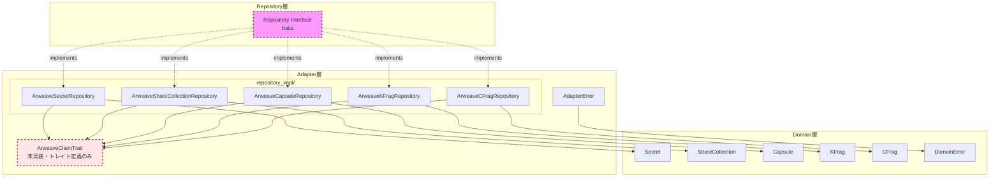

# Design Document: Client Adapter Repository Implementation

## Overview

本ドキュメントは、FORMIXクライアントライブラリのAdapter層におけるRepository実装の技術設計を定義します。Repository層で定義された5つのRepository Interface（SecretRepository, ShareCollectionRepository, CapsuleRepository, KFragRepository, CFragRepository）を、ArweaveClientトレイトに依存する形で実装します。

本実装は、Clean Architecture（6層構成）の依存性逆転原則（DIP）に従い、Adapter層がRepository層のインターフェースを実装することで、ドメイン層とインフラストラクチャ層の分離を実現します。

## Steering Document Alignment

### Technical Standards (tech.md)

- **言語**: Rust 1.86.0（Edition 2024）
- **ターゲット**: wasm32-unknown-unknown（WebAssembly）
- **シリアライゼーション**: serde + bincode
- **セキュリティ**: zeroize（機密データのメモリクリア）
- **非同期処理**: async_trait
- **Arweaveライブラリ**: arweave-rs (https://github.com/nestdotland/arweave-rs)

### Project Structure (structure.md)

実装対象ディレクトリ:
```
client/src/adapter/
├── mod.rs                    # Adapterモジュールエクスポート
├── errors.rs                 # Adapter層エラー定義
└── repository_impl/          # Repository実装
    ├── mod.rs                # repository_implモジュールエクスポート
    ├── secret_impl.rs        # ArweaveSecretRepository
    ├── share_impl.rs         # ArweaveShareCollectionRepository
    ├── capsule_impl.rs       # ArweaveCapsuleRepository
    ├── kfrag_impl.rs         # ArweaveKFragRepository
    └── cfrag_impl.rs         # ArweaveCFragRepository
```

## Code Reuse Analysis

### Existing Components to Leverage

- **Domain Entities** (`client/src/domain/entities/`):
  - `Secret`, `ShareCollection`, `Capsule`, `KFrag`, `CFrag`
  - `from_stored()` メソッドを使用してRepository読み込み時にエンティティを再構築

- **Value Objects** (`client/src/domain/value_objects/`):
  - `SecretId`, `ShareCollectionId`, `CapsuleId`, `KFragId`, `CFragId`
  - ID生成と一意性保証に使用

- **Domain Errors** (`client/src/domain/errors.rs`):
  - `DomainError`, `DomainResult<T>`
  - `StorageError`, `SerializationError` バリアントを活用

- **Repository Interfaces** (`client/src/repositories/`):
  - `Repository<T, ID>` 基底トレイト（CRUD操作）
  - `SecretRepository`, `ShareCollectionRepository`, `CapsuleRepository`, `KFragRepository`, `CFragRepository` トレイト

### Integration Points

- **ArweaveClient（別PR実装）**: Repository実装はArweaveClientトレイトに依存し、実際のArweave通信を委譲
- **Serialization**: serde + bincode でエンティティのシリアライズ/デシリアライズ

## Architecture

本設計は依存性逆転原則（DIP）に基づき、Repository Interfaceを中心とした設計を採用します。



### Modular Design Principles

- **Single File Responsibility**: 各Repository実装ファイルは1つのエンティティの永続化のみを担当
- **Component Isolation**: Repository実装はArweaveClientトレイトを通じて外部通信を抽象化
- **Service Layer Separation**: Domain層（エンティティ）とAdapter層（永続化）を明確に分離
- **Utility Modularity**: シリアライゼーション/デシリアライゼーションロジックは共通化可能

## Components and Interfaces

### Component 1: ArweaveClientTrait

- **Purpose**: Arweave通信を抽象化するトレイト定義（実装は別PR）
- **Interfaces**:
  ```rust
  #[async_trait]
  pub trait ArweaveClient: Send + Sync {
      async fn get(&self, tx_id: &str) -> Result<Option<Vec<u8>>, AdapterError>;
      async fn post(&self, data: &[u8], tags: Vec<Tag>) -> Result<String, AdapterError>;
      async fn query(&self, tags: Vec<Tag>) -> Result<Vec<String>, AdapterError>;
  }
  ```
- **Dependencies**: なし（純粋なトレイト定義）
- **Reuses**: なし

### Component 2: ArweaveSecretRepository

- **Purpose**: SecretエンティティのArweave永続化
- **Interfaces**: `SecretRepository` トレイト実装
  - `save(&self, entity: &Secret) -> DomainResult<()>`
  - `find_by_id(&self, id: &SecretId) -> DomainResult<Option<Secret>>`
  - `delete(&self, id: &SecretId) -> DomainResult<()>`
  - `exists(&self, id: &SecretId) -> DomainResult<bool>`
  - `find_by_ids(&self, ids: &[SecretId]) -> DomainResult<Vec<Secret>>`
- **Dependencies**: ArweaveClient, Secret, SecretId, DomainError
- **Reuses**: serde, bincode

### Component 3: ArweaveShareCollectionRepository

- **Purpose**: ShareCollectionエンティティのArweave永続化
- **Interfaces**: `ShareCollectionRepository` トレイト実装
  - 基底Repository操作 + `find_by_secret_id(&self, secret_id: &SecretId) -> DomainResult<Option<ShareCollection>>`
- **Dependencies**: ArweaveClient, ShareCollection, ShareCollectionId, SecretId
- **Reuses**: serde, bincode

### Component 4: ArweaveCapsuleRepository

- **Purpose**: CapsuleエンティティのArweave永続化
- **Interfaces**: `CapsuleRepository` トレイト実装
  - 基底Repository操作 + `find_by_secret_id(&self, secret_id: &SecretId) -> DomainResult<Option<Capsule>>`
- **Dependencies**: ArweaveClient, Capsule, CapsuleId, SecretId
- **Reuses**: serde, bincode

### Component 5: ArweaveKFragRepository

- **Purpose**: KFragエンティティのArweave永続化（機密データ）
- **Interfaces**: `KFragRepository` トレイト実装
  - 基底Repository操作
  - `find_by_secret_id(&self, secret_id: &SecretId) -> DomainResult<Vec<KFrag>>`
  - `find_by_holder_index(&self, secret_id: &SecretId, holder_index: u8) -> DomainResult<Option<KFrag>>`
  - `delete_by_secret_id(&self, secret_id: &SecretId) -> DomainResult<()>`
- **Dependencies**: ArweaveClient, KFrag, KFragId, SecretId, zeroize
- **Reuses**: serde, bincode, Zeroize trait

### Component 6: ArweaveCFragRepository

- **Purpose**: CFragエンティティのArweave永続化（機密データ）
- **Interfaces**: `CFragRepository` トレイト実装
  - 基底Repository操作
  - `find_by_secret_id(&self, secret_id: &SecretId) -> DomainResult<Vec<CFrag>>`
  - `find_by_kfrag_id(&self, kfrag_id: &KFragId) -> DomainResult<Option<CFrag>>`
  - `delete_by_secret_id(&self, secret_id: &SecretId) -> DomainResult<()>`
  - `count_by_secret_id(&self, secret_id: &SecretId) -> DomainResult<usize>`
- **Dependencies**: ArweaveClient, CFrag, CFragId, SecretId, KFragId, zeroize
- **Reuses**: serde, bincode, Zeroize trait

### Component 7: AdapterError

- **Purpose**: Adapter層固有のエラー定義
- **Interfaces**:
  ```rust
  pub enum AdapterError {
      StorageError { operation: String, details: String },
      SerializationError { operation: String, details: String },
      NotFound { entity_type: String, id: String },
      ConnectionError { details: String },
  }

  impl From<AdapterError> for DomainError { ... }
  ```
- **Dependencies**: DomainError
- **Reuses**: なし

## Data Models

### Serializable Secret Model

```rust
#[derive(Serialize, Deserialize)]
struct StoredSecret {
    id: String,
    threshold_k: u8,
    threshold_n: u8,
    state: String,
    capsule_id: Option<String>,
    share_collection_id: Option<String>,
    kfrag_ids: Vec<String>,
    owner_public_key: Vec<u8>,
    requester_public_key: Option<Vec<u8>>,
    created_at: u64,
    deleted: bool,  // ソフト削除フラグ
}
```

### Serializable ShareCollection Model

```rust
#[derive(Serialize, Deserialize)]
struct StoredShareCollection {
    id: String,
    secret_id: String,
    threshold_k: u8,
    threshold_n: u8,
    shares: Vec<StoredEncryptedShare>,
    arweave_tx_id: Option<String>,
    deleted: bool,
}

#[derive(Serialize, Deserialize)]
struct StoredEncryptedShare {
    index: u8,
    data: Vec<u8>,
}
```

### Serializable Capsule Model

```rust
#[derive(Serialize, Deserialize)]
struct StoredCapsule {
    id: String,
    secret_id: String,
    capsule_bytes: Vec<u8>,
    ciphertext_bytes: Vec<u8>,
    arweave_tx_id: Option<String>,
    deleted: bool,
}
```

### Serializable KFrag Model

```rust
#[derive(Serialize, Deserialize)]
struct StoredKFrag {
    id: String,
    secret_id: String,
    holder_index: u8,
    total_holders: u8,
    kfrag_bytes: Vec<u8>,  // 機密データ
    deleted: bool,
}
```

### Serializable CFrag Model

```rust
#[derive(Serialize, Deserialize)]
struct StoredCFrag {
    id: String,
    secret_id: String,
    kfrag_id: String,
    holder_index: u8,
    cfrag_bytes: Vec<u8>,  // 機密データ
    deleted: bool,
}
```

### Arweave Tag Structure

```rust
pub struct Tag {
    pub name: String,
    pub value: String,
}

// 共通タグ
const TAG_APP: &str = "App-Name";
const TAG_APP_VALUE: &str = "FORMIX";
const TAG_ENTITY_TYPE: &str = "Entity-Type";
const TAG_ENTITY_ID: &str = "Entity-Id";
const TAG_SECRET_ID: &str = "Secret-Id";
const TAG_DELETED: &str = "Deleted";
```

## Error Handling

### Error Scenarios

1. **Storage Connection Failure**
   - **Handling**: ArweaveClient呼び出し時のエラーを`AdapterError::ConnectionError`でラップ
   - **User Impact**: 操作失敗、DomainError::StorageErrorとして伝播

2. **Serialization Failure**
   - **Handling**: bincode::serialize/deserialize失敗を`AdapterError::SerializationError`でラップ
   - **User Impact**: 操作失敗、DomainError::SerializationErrorとして伝播

3. **Entity Not Found**
   - **Handling**: `Ok(None)`を返す（エラーではない）
   - **User Impact**: 呼び出し元でNone処理

4. **Deserialization of Corrupted Data**
   - **Handling**: `AdapterError::SerializationError`を返す
   - **User Impact**: 操作失敗、データ整合性エラーとして報告

5. **Soft-Deleted Entity Access**
   - **Handling**: deleted=trueのエンティティは`None`として扱う
   - **User Impact**: 削除済みエンティティは存在しないものとして扱われる

### Error Conversion

```rust
impl From<AdapterError> for DomainError {
    fn from(err: AdapterError) -> Self {
        match err {
            AdapterError::StorageError { operation, details } => {
                DomainError::StorageError { operation, details }
            }
            AdapterError::SerializationError { operation, details } => {
                DomainError::SerializationError { operation, details }
            }
            AdapterError::NotFound { entity_type, id } => {
                DomainError::NotFound { entity_type, id }
            }
            AdapterError::ConnectionError { details } => {
                DomainError::StorageError {
                    operation: "connection".to_string(),
                    details,
                }
            }
        }
    }
}
```

## Testing Strategy

### Unit Testing

- **アプローチ**: MockArweaveClientを使用した各Repository実装の単体テスト
- **テスト対象**:
  - 各CRUD操作の正常系
  - エラーハンドリング
  - シリアライゼーション/デシリアライゼーション
  - ソフト削除動作
  - バッチ操作

```rust
#[cfg(test)]
mod tests {
    use super::*;
    use std::collections::HashMap;
    use std::sync::RwLock;

    struct MockArweaveClient {
        storage: RwLock<HashMap<String, Vec<u8>>>,
        tags: RwLock<HashMap<String, Vec<Tag>>>,
    }

    #[async_trait]
    impl ArweaveClient for MockArweaveClient {
        async fn get(&self, tx_id: &str) -> Result<Option<Vec<u8>>, AdapterError> {
            Ok(self.storage.read().unwrap().get(tx_id).cloned())
        }

        async fn post(&self, data: &[u8], tags: Vec<Tag>) -> Result<String, AdapterError> {
            let tx_id = uuid::Uuid::new_v4().to_string();
            self.storage.write().unwrap().insert(tx_id.clone(), data.to_vec());
            self.tags.write().unwrap().insert(tx_id.clone(), tags);
            Ok(tx_id)
        }

        async fn query(&self, tags: Vec<Tag>) -> Result<Vec<String>, AdapterError> {
            // タグでフィルタリングして該当するtx_idを返す
            Ok(vec![])
        }
    }
}
```

### Integration Testing

- **アプローチ**: 複数Repository間の連携テスト
- **テスト対象**:
  - Secret → ShareCollection → Capsule の関連エンティティ操作
  - Secret → KFrag の一括削除連携
  - CFrag カウントと閾値確認

### End-to-End Testing

- **アプローチ**: 実際のArweaveテストネット（または開発用モック）を使用
- **テスト対象**:
  - Phase 1: 秘密分割フロー全体
  - Phase 3: 秘密復元フロー全体
  - データ永続性確認

## Security Considerations

### Zeroize Implementation

KFrag, CFragの機密データを含む構造体は、使用後にメモリをクリアします。

```rust
use zeroize::{Zeroize, ZeroizeOnDrop};

impl ArweaveKFragRepository<C> {
    async fn find_by_id(&self, id: &KFragId) -> DomainResult<Option<KFrag>> {
        // ...
        let mut stored: StoredKFrag = bincode::deserialize(&data)?;
        let kfrag = KFrag::from_stored(/* ... */);
        stored.kfrag_bytes.zeroize();  // 機密データをクリア
        Ok(Some(kfrag))
    }
}
```

### Error Message Safety

エラーメッセージに機密情報（秘密鍵、暗号化データ等）を含めないよう設計します。

```rust
// 悪い例
AdapterError::SerializationError {
    operation: "deserialize",
    details: format!("Failed to deserialize: {:?}", secret_key_bytes),  // NG
}

// 良い例
AdapterError::SerializationError {
    operation: "deserialize",
    details: "Invalid KFrag data format".to_string(),  // OK
}
```
