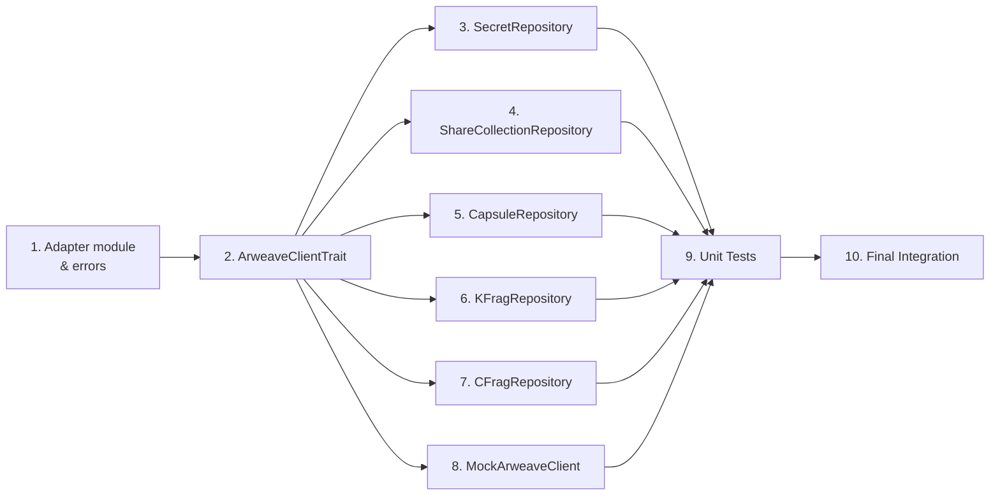

# Tasks Document: Client Adapter Repository Implementation

## Overview

本ドキュメントは、Client Adapter Repository Implementationの実装タスクを定義します。各タスクは1-3ファイルの変更に収まるアトミックな単位で構成されています。

---

- [x] 1. Create Adapter module structure and error definitions
  - Files: `client/src/adapter/mod.rs`, `client/src/adapter/errors.rs`
  - Define AdapterError enum with StorageError, SerializationError, NotFound, ConnectionError variants
  - Implement From<AdapterError> for DomainError conversion
  - Export adapter module from lib.rs
  - Purpose: Establish adapter layer foundation and error handling
  - _Leverage: `client/src/domain/errors.rs` (DomainError pattern)_
  - _Requirements: REQ-6_
  - _Prompt: |
      Implement the task for spec client-adapter-repositoryimpl, first run spec-workflow-guide to get the workflow guide then implement the task:

      Role: Rust Developer specializing in error handling and module architecture

      Task: Create Adapter module structure with AdapterError enum following REQ-6. Define error variants (StorageError, SerializationError, NotFound, ConnectionError) and implement From<AdapterError> for DomainError conversion. Follow existing DomainError patterns from client/src/domain/errors.rs.

      Restrictions:
      - Do not modify existing domain errors
      - Follow thiserror crate pattern for error definitions
      - Error messages must not contain sensitive information

      _Leverage: client/src/domain/errors.rs
      _Requirements: REQ-6

      Success:
      - AdapterError enum is defined with all required variants
      - From<AdapterError> for DomainError is implemented
      - Module exports are correctly configured
      - `make check` passes

      After completion:
      1. Mark this task as in-progress in tasks.md by changing [ ] to [-]
      2. After implementation, use log-implementation tool to record details
      3. Mark task as complete by changing [-] to [x]_

- [x] 2. Create ArweaveClientTrait definition
  - Files: `client/src/adapter/repository_impl/mod.rs`
  - Define ArweaveClient async trait with get, post, query methods
  - Define Tag struct for Arweave tagging
  - Define common tag constants (APP_NAME, ENTITY_TYPE, etc.)
  - Purpose: Abstract Arweave communication interface for DIP
  - _Leverage: None (new trait definition)_
  - _Requirements: REQ-7_
  - _Prompt: |
      Implement the task for spec client-adapter-repositoryimpl, first run spec-workflow-guide to get the workflow guide then implement the task:

      Role: Rust Developer specializing in async traits and abstraction design

      Task: Create ArweaveClient trait with async methods (get, post, query) following REQ-7. Define Tag struct and common constants for Arweave tagging. Use async_trait crate for async trait support.

      Restrictions:
      - Trait must be Send + Sync
      - Do not implement actual Arweave client (that's for another PR)
      - Keep trait methods minimal and focused

      _Leverage: None
      _Requirements: REQ-7

      Success:
      - ArweaveClient trait is defined with async methods
      - Tag struct and constants are defined
      - Trait is Send + Sync compatible
      - `make check` passes

      After completion:
      1. Mark this task as in-progress in tasks.md by changing [ ] to [-]
      2. After implementation, use log-implementation tool to record details
      3. Mark task as complete by changing [-] to [x]_

- [x] 3. Implement ArweaveSecretRepository
  - Files: `client/src/adapter/repository_impl/secret_impl.rs`
  - Implement SecretRepository trait for ArweaveSecretRepository struct
  - Define StoredSecret serializable struct
  - Implement save, find_by_id, delete, exists, find_by_ids methods
  - Handle soft-delete with deleted flag
  - Purpose: Persist Secret entities to Arweave
  - _Leverage: `client/src/repositories/secret_interface.rs`, `client/src/domain/entities/secret.rs`_
  - _Requirements: REQ-1_
  - _Prompt: |
      Implement the task for spec client-adapter-repositoryimpl, first run spec-workflow-guide to get the workflow guide then implement the task:

      Role: Rust Developer specializing in repository pattern and serialization

      Task: Implement ArweaveSecretRepository following REQ-1. Create StoredSecret serializable struct for bincode serialization. Implement all SecretRepository trait methods with soft-delete support.

      Restrictions:
      - Must implement SecretRepository trait exactly
      - Use bincode for serialization
      - Soft-delete uses deleted flag, not physical deletion
      - find_by_id must return Ok(None) for deleted entities

      _Leverage: client/src/repositories/secret_interface.rs, client/src/domain/entities/secret.rs
      _Requirements: REQ-1

      Success:
      - SecretRepository trait is fully implemented
      - Serialization/deserialization works correctly
      - Soft-delete behavior is correct
      - Unit tests pass (TC-1.1 through TC-1.9)
      - `make check` passes

      After completion:
      1. Mark this task as in-progress in tasks.md by changing [ ] to [-]
      2. After implementation, use log-implementation tool to record details
      3. Mark task as complete by changing [-] to [x]_

- [x] 4. Implement ArweaveShareCollectionRepository
  - Files: `client/src/adapter/repository_impl/share_impl.rs`
  - Implement ShareCollectionRepository trait for ArweaveShareCollectionRepository struct
  - Define StoredShareCollection and StoredEncryptedShare serializable structs
  - Implement base CRUD + find_by_secret_id method
  - Preserve arweave_tx_id during serialization
  - Purpose: Persist ShareCollection entities to Arweave
  - _Leverage: `client/src/repositories/share_interface.rs`, `client/src/domain/entities/share.rs`_
  - _Requirements: REQ-2_
  - _Prompt: |
      Implement the task for spec client-adapter-repositoryimpl, first run spec-workflow-guide to get the workflow guide then implement the task:

      Role: Rust Developer specializing in repository pattern and data relationships

      Task: Implement ArweaveShareCollectionRepository following REQ-2. Create serializable structs for ShareCollection and EncryptedShare. Implement find_by_secret_id for parent-child relationship query.

      Restrictions:
      - Must preserve arweave_tx_id field during serialization
      - find_by_secret_id must query by Secret-Id tag
      - Use consistent tagging with other repositories

      _Leverage: client/src/repositories/share_interface.rs, client/src/domain/entities/share.rs
      _Requirements: REQ-2

      Success:
      - ShareCollectionRepository trait is fully implemented
      - find_by_secret_id returns correct entity
      - arweave_tx_id is preserved
      - Unit tests pass (TC-2.1 through TC-2.5)
      - `make check` passes

      After completion:
      1. Mark this task as in-progress in tasks.md by changing [ ] to [-]
      2. After implementation, use log-implementation tool to record details
      3. Mark task as complete by changing [-] to [x]_

- [x] 5. Implement ArweaveCapsuleRepository
  - Files: `client/src/adapter/repository_impl/capsule_impl.rs`
  - Implement CapsuleRepository trait for ArweaveCapsuleRepository struct
  - Define StoredCapsule serializable struct
  - Implement base CRUD + find_by_secret_id method
  - Ensure capsule_bytes and ciphertext_bytes are fully preserved
  - Purpose: Persist Capsule entities to Arweave
  - _Leverage: `client/src/repositories/capsule_interface.rs`, `client/src/domain/entities/capsule.rs`_
  - _Requirements: REQ-3_
  - _Prompt: |
      Implement the task for spec client-adapter-repositoryimpl, first run spec-workflow-guide to get the workflow guide then implement the task:

      Role: Rust Developer specializing in binary data handling and cryptographic data persistence

      Task: Implement ArweaveCapsuleRepository following REQ-3. Ensure binary data (capsule_bytes, ciphertext_bytes) is correctly serialized and deserialized without corruption.

      Restrictions:
      - Binary data must be fully preserved
      - Do not modify or process capsule data
      - Use consistent tagging pattern

      _Leverage: client/src/repositories/capsule_interface.rs, client/src/domain/entities/capsule.rs
      _Requirements: REQ-3

      Success:
      - CapsuleRepository trait is fully implemented
      - Binary data integrity is maintained
      - Unit tests pass (TC-3.1 through TC-3.5)
      - `make check` passes

      After completion:
      1. Mark this task as in-progress in tasks.md by changing [ ] to [-]
      2. After implementation, use log-implementation tool to record details
      3. Mark task as complete by changing [-] to [x]_

- [x] 6. Implement ArweaveKFragRepository
  - Files: `client/src/adapter/repository_impl/kfrag_impl.rs`
  - Implement KFragRepository trait for ArweaveKFragRepository struct
  - Define StoredKFrag serializable struct
  - Implement base CRUD + find_by_secret_id, find_by_holder_index, delete_by_secret_id
  - Apply Zeroize to sensitive kfrag_bytes after deserialization
  - Purpose: Persist KFrag entities (sensitive cryptographic data) to Arweave
  - _Leverage: `client/src/repositories/kfrag_interface.rs`, `client/src/domain/entities/kfrag.rs`_
  - _Requirements: REQ-4_
  - _Prompt: |
      Implement the task for spec client-adapter-repositoryimpl, first run spec-workflow-guide to get the workflow guide then implement the task:

      Role: Rust Developer specializing in secure cryptographic data handling

      Task: Implement ArweaveKFragRepository following REQ-4. Handle sensitive kfrag_bytes with Zeroize for memory safety. Implement holder_index-based queries and bulk deletion.

      Restrictions:
      - MUST use Zeroize on kfrag_bytes after deserialization
      - delete_by_secret_id must delete ALL KFrags for a Secret
      - Error messages must not contain kfrag data

      _Leverage: client/src/repositories/kfrag_interface.rs, client/src/domain/entities/kfrag.rs
      _Requirements: REQ-4

      Success:
      - KFragRepository trait is fully implemented
      - Zeroize is applied to sensitive data
      - Bulk delete works correctly
      - Unit tests pass (TC-4.1 through TC-4.7)
      - `make check` passes

      After completion:
      1. Mark this task as in-progress in tasks.md by changing [ ] to [-]
      2. After implementation, use log-implementation tool to record details
      3. Mark task as complete by changing [-] to [x]_

- [x] 7. Implement ArweaveCFragRepository
  - Files: `client/src/adapter/repository_impl/cfrag_impl.rs`
  - Implement CFragRepository trait for ArweaveCFragRepository struct
  - Define StoredCFrag serializable struct
  - Implement base CRUD + find_by_secret_id, find_by_kfrag_id, delete_by_secret_id, count_by_secret_id
  - Apply Zeroize to sensitive cfrag_bytes after deserialization
  - Purpose: Persist CFrag entities (sensitive cryptographic data) to Arweave
  - _Leverage: `client/src/repositories/cfrag_interface.rs`, `client/src/domain/entities/cfrag.rs`_
  - _Requirements: REQ-5_
  - _Prompt: |
      Implement the task for spec client-adapter-repositoryimpl, first run spec-workflow-guide to get the workflow guide then implement the task:

      Role: Rust Developer specializing in secure cryptographic data handling and threshold cryptography

      Task: Implement ArweaveCFragRepository following REQ-5. Handle sensitive cfrag_bytes with Zeroize. Implement count_by_secret_id for threshold verification support.

      Restrictions:
      - MUST use Zeroize on cfrag_bytes after deserialization
      - count_by_secret_id is critical for k-of-n threshold checks
      - Error messages must not contain cfrag data

      _Leverage: client/src/repositories/cfrag_interface.rs, client/src/domain/entities/cfrag.rs
      _Requirements: REQ-5

      Success:
      - CFragRepository trait is fully implemented
      - Zeroize is applied to sensitive data
      - count_by_secret_id returns correct count
      - Unit tests pass (TC-5.1 through TC-5.8)
      - `make check` passes

      After completion:
      1. Mark this task as in-progress in tasks.md by changing [ ] to [-]
      2. After implementation, use log-implementation tool to record details
      3. Mark task as complete by changing [-] to [x]_

- [x] 8. Create MockArweaveClient for testing
  - Files: `client/src/adapter/repository_impl/mod.rs` (add mock module)
  - Implement MockArweaveClient with in-memory HashMap storage
  - Implement ArweaveClient trait for MockArweaveClient
  - Add tag-based query filtering
  - Purpose: Enable unit testing without actual Arweave connection
  - _Leverage: ArweaveClient trait from Task 2_
  - _Requirements: REQ-7_
  - _Prompt: |
      Implement the task for spec client-adapter-repositoryimpl, first run spec-workflow-guide to get the workflow guide then implement the task:

      Role: Rust Developer specializing in testing infrastructure and mocks

      Task: Create MockArweaveClient with HashMap-based in-memory storage following REQ-7. Implement full ArweaveClient trait with tag-based query support.

      Restrictions:
      - Mock must be thread-safe (use RwLock or similar)
      - Query must correctly filter by tags
      - Should only be available in #[cfg(test)] or as a feature

      _Leverage: ArweaveClient trait
      _Requirements: REQ-7

      Success:
      - MockArweaveClient fully implements ArweaveClient trait
      - In-memory storage works correctly
      - Tag-based queries work correctly
      - Unit tests pass (TC-7.1 through TC-7.3)
      - `make check` passes

      After completion:
      1. Mark this task as in-progress in tasks.md by changing [ ] to [-]
      2. After implementation, use log-implementation tool to record details
      3. Mark task as complete by changing [-] to [x]_

- [x] 9. Add unit tests for all Repository implementations
  - Files: Tests within each `*_impl.rs` file
  - Add #[cfg(test)] mod tests for each repository
  - Test all CRUD operations, edge cases, and error scenarios
  - Use MockArweaveClient for all tests
  - Purpose: Ensure repository reliability and catch regressions
  - _Leverage: MockArweaveClient from Task 8, existing test patterns from repositories/_
  - _Requirements: REQ-1 through REQ-7 (all test cases)_
  - _Prompt: |
      Implement the task for spec client-adapter-repositoryimpl, first run spec-workflow-guide to get the workflow guide then implement the task:

      Role: QA Engineer with Rust expertise in unit testing

      Task: Add comprehensive unit tests for all Repository implementations. Cover all test cases defined in requirements (TC-1.1 through TC-7.3).

      Restrictions:
      - Use MockArweaveClient for all tests
      - Test both success and failure scenarios
      - Tests must be independent and not share state

      _Leverage: MockArweaveClient, existing test patterns from client/src/repositories/
      _Requirements: All test cases from REQ-1 through REQ-7

      Success:
      - All test cases from requirements are implemented
      - Tests cover edge cases and error scenarios
      - `make test` passes
      - Test coverage is comprehensive

      After completion:
      1. Mark this task as in-progress in tasks.md by changing [ ] to [-]
      2. After implementation, use log-implementation tool to record details
      3. Mark task as complete by changing [-] to [x]_

- [x] 10. Update module exports and run final verification
  - Files: `client/src/adapter/mod.rs`, `client/src/lib.rs`
  - Export all repository implementations from adapter module
  - Update lib.rs to include adapter module
  - Run `make all` (check, lint, test) for final verification
  - Purpose: Complete module integration and verify build
  - _Leverage: All previous tasks_
  - _Requirements: All_
  - _Prompt: |
      Implement the task for spec client-adapter-repositoryimpl, first run spec-workflow-guide to get the workflow guide then implement the task:

      Role: Rust Developer responsible for module integration

      Task: Update module exports to properly expose all Repository implementations. Run final verification with `make all`.

      Restrictions:
      - Maintain clean public API surface
      - Do not expose internal implementation details
      - All existing tests must continue to pass

      _Leverage: All previous task implementations
      _Requirements: All

      Success:
      - All repository implementations are properly exported
      - `make all` passes (check, lint, test)
      - Public API is clean and minimal
      - No clippy warnings

      After completion:
      1. Mark this task as in-progress in tasks.md by changing [ ] to [-]
      2. After implementation, use log-implementation tool to record details
      3. Mark task as complete by changing [-] to [x]_

---

## Task Dependencies

## Estimated File Count

| Task | New Files | Modified Files |
|------|-----------|----------------|
| 1 | 2 | 1 |
| 2 | 1 | 0 |
| 3 | 1 | 1 |
| 4 | 1 | 1 |
| 5 | 1 | 1 |
| 6 | 1 | 1 |
| 7 | 1 | 1 |
| 8 | 0 | 1 |
| 9 | 0 | 5 |
| 10 | 0 | 2 |
| **Total** | **8** | **14** |
