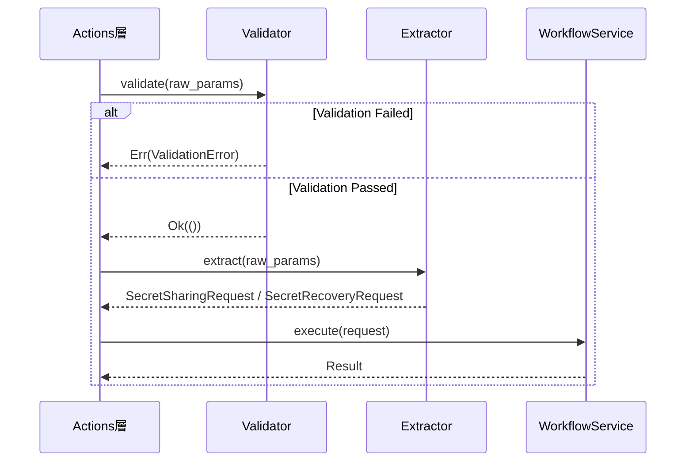

# Design Document: client-controller

## Overview

本設計書は、D-TPRESクライアントライブラリのController層の設計を定義します。Controller層は Actions層（`share()`, `recover()`）からの生の入力パラメータを受け取り、検証（Validator）とDTO変換（Extractor）を行った後、UseCase層（Workflow Services）に処理を委譲します。

**アーキテクチャフロー:**
```
Actions → Controller → UseCase → Domain
              ↓
         Validator → Extractor → WorkflowService
```

## Steering Document Alignment

### Technical Standards (tech.md)

本設計は以下の技術標準に準拠します：

1. **Clean Architecture（6層構成）**: Controller層はActions層とUseCase層の間に配置され、入力検証とDTO変換を担当
2. **依存性逆転原則（DIP）**: Controller層はUseCase層のDTOに依存するが、具体的なWorkflowService実装には依存しない
3. **Zeroize**: 秘密データを含むDTOはZeroizeトレイトを実装（既存DTOの仕様に従う）
4. **TERASOLUNA Guidelines**: Controller層の4つの責務（入力検証、型変換、サービス呼び出し、レスポンス生成）

### Project Structure (structure.md)

実装ファイルは以下の構成に従います：

```
client/src/controller/
├── mod.rs                  # モジュールエクスポート
├── validator.rs            # ShareValidator, RecoverValidator
├── extractor.rs            # ShareExtractor, RecoverExtractor
├── error.rs                # ValidationError定義
└── di.rs                   # ControllerContainer（DI）
```

## Code Reuse Analysis

### Existing Components to Leverage

- **SecretSharingRequest** (`usecase/dto.rs`):
  - 既存のPhase 1リクエストDTO
  - `secret`, `owner_secret_key`, `owner_public_key`, `requester_public_key`, `threshold`, `total_shares`, `owner_process_id`, `metadata`
  - Drop時にsecretをZeroize

- **SecretRecoveryRequest** (`usecase/dto.rs`):
  - 既存のPhase 3リクエストDTO
  - `secret_id`, `requester_secret_key`, `requester_process_id`

- **WorkflowError** (`usecase/error.rs`):
  - 既存のWorkflow層エラー型
  - `ValidationError(String)` バリアントを使用

- **SecretId** (`domain/value_objects/ids.rs`):
  - 秘密識別子Value Object

- **PublicKey / SecretKey** (`usecase/core/crypto.rs`):
  - 暗号鍵型（umbral-pre由来）

### Integration Points

- **Actions層**: Controller層のエントリーポイント（`share()`, `recover()`から呼び出し）
- **UseCase層**: Extractorが生成したDTOをWorkflowServiceに渡す
- **既存DTO**: 新しいDTO定義は行わず、`usecase/dto.rs`の既存DTOを使用

## Architecture

### Component Interaction Flow



### Layered Architecture Position

```
┌─────────────────────────────────────────────────────────────┐
│                     Actions層（Facade）                      │
│    share() ─────────────────────────────── recover()        │
└─────────────────────────────┬───────────────────────────────┘
                              │
┌─────────────────────────────▼───────────────────────────────┐
│                     Controller層                             │
│  ┌─────────────────────────────────────────────────────┐    │
│  │                    Validator                         │    │
│  │   ShareValidator ──────────── RecoverValidator      │    │
│  └─────────────────────────────────────────────────────┘    │
│  ┌─────────────────────────────────────────────────────┐    │
│  │                    Extractor                         │    │
│  │   ShareExtractor ──────────── RecoverExtractor      │    │
│  └─────────────────────────────────────────────────────┘    │
│  ┌─────────────────────────────────────────────────────┐    │
│  │              ControllerContainer (DI)               │    │
│  └─────────────────────────────────────────────────────┘    │
└─────────────────────────────┬───────────────────────────────┘
                              │
┌─────────────────────────────▼───────────────────────────────┐
│                     UseCase層                                │
│   SecretSharingWorkflowService ─── SecretRecoveryWorkflowService   │
└──────────────────────────────────────────────────────────────┘
```

## Components and Interfaces

### Component 1: ValidationError

- **Purpose:** Controller層固有のバリデーションエラーを表現
- **Interfaces:**
  ```rust
  /// Controller層のバリデーションエラー
  #[derive(Debug, Clone, PartialEq, Eq)]
  pub struct ValidationError {
      /// エラーコード（例: "secret_empty", "invalid_threshold"）
      code: String,
      /// 人間可読なエラーメッセージ
      message: String,
      /// エラーが発生したフィールド名（オプション）
      field: Option<String>,
  }

  impl ValidationError {
      /// 新しいValidationErrorを作成
      pub fn new(code: impl Into<String>, message: impl Into<String>) -> Self;

      /// フィールド名付きでValidationErrorを作成
      pub fn with_field(
          code: impl Into<String>,
          message: impl Into<String>,
          field: impl Into<String>,
      ) -> Self;

      /// エラーコードを取得
      pub fn code(&self) -> &str;

      /// エラーメッセージを取得
      pub fn message(&self) -> &str;

      /// フィールド名を取得
      pub fn field(&self) -> Option<&str>;
  }

  impl std::fmt::Display for ValidationError { ... }
  impl std::error::Error for ValidationError { }

  /// WorkflowErrorへの変換
  impl From<ValidationError> for WorkflowError {
      fn from(err: ValidationError) -> Self {
          WorkflowError::ValidationError(format!("[{}] {}", err.code, err.message))
      }
  }
  ```
- **Dependencies:** `usecase/error.rs` (WorkflowError)
- **Reuses:** なし（新規定義）

### Component 2: ShareValidator

- **Purpose:** 秘密分割リクエストの入力パラメータを検証
- **Interfaces:**
  ```rust
  /// 秘密分割リクエストのバリデータ
  pub struct ShareValidator;

  impl ShareValidator {
      /// 新しいShareValidatorを作成
      pub fn new() -> Self;

      /// 入力パラメータを検証
      ///
      /// # Arguments
      /// * `secret` - 分割する秘密データ
      /// * `threshold` - 閾値 k
      /// * `total_shares` - 総シェア数 n
      /// * `owner_secret_key` - Owner秘密鍵
      /// * `requester_public_key` - Requester公開鍵
      ///
      /// # Returns
      /// * `Ok(())` - 検証成功
      /// * `Err(ValidationError)` - 検証失敗
      pub fn validate(
          &self,
          secret: &[u8],
          threshold: u8,
          total_shares: u8,
          owner_secret_key: &SecretKey,
          requester_public_key: &PublicKey,
      ) -> Result<(), ValidationError>;
  }

  impl Default for ShareValidator {
      fn default() -> Self { Self::new() }
  }
  ```
- **Dependencies:** `usecase/core/crypto.rs` (SecretKey, PublicKey)
- **Reuses:** なし（新規定義）

### Component 3: RecoverValidator

- **Purpose:** 秘密復元リクエストの入力パラメータを検証
- **Interfaces:**
  ```rust
  /// 秘密復元リクエストのバリデータ
  pub struct RecoverValidator;

  impl RecoverValidator {
      /// 新しいRecoverValidatorを作成
      pub fn new() -> Self;

      /// 入力パラメータを検証
      ///
      /// # Arguments
      /// * `secret_id` - 復元対象の秘密ID
      /// * `requester_secret_key` - Requester秘密鍵
      /// * `requester_process_id` - Requester-Process ID
      ///
      /// # Returns
      /// * `Ok(())` - 検証成功
      /// * `Err(ValidationError)` - 検証失敗
      pub fn validate(
          &self,
          secret_id: &str,
          requester_secret_key: &SecretKey,
          requester_process_id: &str,
      ) -> Result<(), ValidationError>;
  }

  impl Default for RecoverValidator {
      fn default() -> Self { Self::new() }
  }
  ```
- **Dependencies:** `usecase/core/crypto.rs` (SecretKey)
- **Reuses:** なし（新規定義）

### Component 4: ShareExtractor

- **Purpose:** 検証済みパラメータからSecretSharingRequest DTOを生成
- **Interfaces:**
  ```rust
  /// 秘密分割リクエストDTO生成器
  pub struct ShareExtractor;

  impl ShareExtractor {
      /// 新しいShareExtractorを作成
      pub fn new() -> Self;

      /// SecretSharingRequestを生成
      ///
      /// # Arguments
      /// * `secret` - 分割する秘密データ
      /// * `owner_secret_key` - Owner秘密鍵
      /// * `owner_public_key` - Owner公開鍵
      /// * `requester_public_key` - Requester公開鍵
      /// * `threshold` - 閾値 k
      /// * `total_shares` - 総シェア数 n
      /// * `owner_process_id` - Owner-Process ID
      /// * `metadata` - オプショナルメタデータ
      ///
      /// # Returns
      /// * `SecretSharingRequest` - 生成されたDTO
      pub fn extract(
          &self,
          secret: Vec<u8>,
          owner_secret_key: SecretKey,
          owner_public_key: PublicKey,
          requester_public_key: PublicKey,
          threshold: u8,
          total_shares: u8,
          owner_process_id: String,
          metadata: Option<SecretMetadata>,
      ) -> SecretSharingRequest;
  }

  impl Default for ShareExtractor {
      fn default() -> Self { Self::new() }
  }
  ```
- **Dependencies:** `usecase/dto.rs` (SecretSharingRequest, SecretMetadata)
- **Reuses:** 既存の`SecretSharingRequest` DTOをそのまま使用

### Component 5: RecoverExtractor

- **Purpose:** 検証済みパラメータからSecretRecoveryRequest DTOを生成
- **Interfaces:**
  ```rust
  /// 秘密復元リクエストDTO生成器
  pub struct RecoverExtractor;

  impl RecoverExtractor {
      /// 新しいRecoverExtractorを作成
      pub fn new() -> Self;

      /// SecretRecoveryRequestを生成
      ///
      /// # Arguments
      /// * `secret_id` - 復元対象の秘密ID
      /// * `requester_secret_key` - Requester秘密鍵
      /// * `requester_process_id` - Requester-Process ID
      ///
      /// # Returns
      /// * `SecretRecoveryRequest` - 生成されたDTO
      pub fn extract(
          &self,
          secret_id: SecretId,
          requester_secret_key: SecretKey,
          requester_process_id: String,
      ) -> SecretRecoveryRequest;
  }

  impl Default for RecoverExtractor {
      fn default() -> Self { Self::new() }
  }
  ```
- **Dependencies:** `usecase/dto.rs` (SecretRecoveryRequest), `domain/value_objects` (SecretId)
- **Reuses:** 既存の`SecretRecoveryRequest` DTOをそのまま使用

### Component 6: ControllerContainer

- **Purpose:** Controller層コンポーネントの依存性注入コンテナ
- **Interfaces:**
  ```rust
  /// Controller層DIコンテナ
  pub struct ControllerContainer {
      share_validator: ShareValidator,
      recover_validator: RecoverValidator,
      share_extractor: ShareExtractor,
      recover_extractor: RecoverExtractor,
  }

  impl ControllerContainer {
      /// デフォルト構成で新しいControllerContainerを作成
      pub fn new() -> Self;

      /// ShareValidatorへの参照を取得
      pub fn share_validator(&self) -> &ShareValidator;

      /// RecoverValidatorへの参照を取得
      pub fn recover_validator(&self) -> &RecoverValidator;

      /// ShareExtractorへの参照を取得
      pub fn share_extractor(&self) -> &ShareExtractor;

      /// RecoverExtractorへの参照を取得
      pub fn recover_extractor(&self) -> &RecoverExtractor;
  }

  impl Default for ControllerContainer {
      fn default() -> Self { Self::new() }
  }
  ```
- **Dependencies:** ShareValidator, RecoverValidator, ShareExtractor, RecoverExtractor
- **Reuses:** なし（新規定義）

## Data Models

### ValidationError

```rust
/// Controller層バリデーションエラー
#[derive(Debug, Clone, PartialEq, Eq)]
pub struct ValidationError {
    /// エラーコード
    code: String,
    /// エラーメッセージ
    message: String,
    /// 対象フィールド
    field: Option<String>,
}
```

### Error Codes (定数)

```rust
pub mod error_codes {
    /// 秘密データが空
    pub const SECRET_EMPTY: &str = "secret_empty";
    /// 閾値が0
    pub const INVALID_THRESHOLD: &str = "invalid_threshold";
    /// 閾値が総シェア数を超過
    pub const THRESHOLD_EXCEEDS_TOTAL: &str = "threshold_exceeds_total";
    /// 総シェア数が最大値を超過
    pub const TOTAL_SHARES_EXCEEDS_MAX: &str = "total_shares_exceeds_max";
    /// 閾値が最小値未満
    pub const THRESHOLD_BELOW_MIN: &str = "threshold_below_min";
    /// Owner鍵が無効
    pub const INVALID_OWNER_KEY: &str = "invalid_owner_key";
    /// Requester鍵が無効
    pub const INVALID_REQUESTER_KEY: &str = "invalid_requester_key";
    /// 秘密IDが無効
    pub const INVALID_SECRET_ID: &str = "invalid_secret_id";
    /// プロセスIDが無効
    pub const INVALID_PROCESS_ID: &str = "invalid_process_id";
}
```

### Validation Constants

```rust
/// 最小閾値
pub const MIN_THRESHOLD: u8 = 2;
/// 最大シェア数
pub const MAX_SHARES: u8 = 20;
```

## Error Handling

### Error Scenarios

1. **SECRET_EMPTY - 秘密データが空**
   - **Handling:** ShareValidator.validate()で早期検出
   - **User Impact:** "Secret data cannot be empty"

2. **INVALID_THRESHOLD - 閾値が0**
   - **Handling:** ShareValidator.validate()で早期検出
   - **User Impact:** "Threshold must be greater than 0"

3. **THRESHOLD_EXCEEDS_TOTAL - 閾値が総シェア数を超過**
   - **Handling:** ShareValidator.validate()で早期検出
   - **User Impact:** "Threshold (k) cannot exceed total shares (n)"

4. **INVALID_OWNER_KEY - Owner鍵が無効**
   - **Handling:** ShareValidator.validate()で検出
   - **User Impact:** "Invalid owner secret key provided"

5. **INVALID_REQUESTER_KEY - Requester鍵が無効**
   - **Handling:** ShareValidator/RecoverValidator.validate()で検出
   - **User Impact:** "Invalid requester key provided"

6. **INVALID_SECRET_ID - 秘密IDが空**
   - **Handling:** RecoverValidator.validate()で早期検出
   - **User Impact:** "Secret ID cannot be empty"

7. **INVALID_PROCESS_ID - プロセスIDが空**
   - **Handling:** RecoverValidator.validate()で早期検出
   - **User Impact:** "Process ID cannot be empty"

### Error Propagation

```rust
// ValidationError → WorkflowError への変換例
impl From<ValidationError> for WorkflowError {
    fn from(err: ValidationError) -> Self {
        WorkflowError::ValidationError(format!("[{}] {}", err.code, err.message))
    }
}

// Actions層での使用例
pub fn share(params: ShareParams) -> Result<ShareResult, WorkflowError> {
    let container = ControllerContainer::new();

    // 1. 検証
    container.share_validator().validate(
        &params.secret,
        params.threshold,
        params.total_shares,
        &params.owner_secret_key,
        &params.requester_public_key,
    )?; // ValidationError → WorkflowError に自動変換

    // 2. DTO抽出
    let request = container.share_extractor().extract(
        params.secret,
        params.owner_secret_key,
        params.owner_public_key,
        params.requester_public_key,
        params.threshold,
        params.total_shares,
        params.owner_process_id,
        params.metadata,
    );

    // 3. WorkflowService呼び出し
    workflow_service.execute_secret_sharing(request)
}
```

## Testing Strategy

### Unit Testing

**対象コンポーネント:**
- `ShareValidator` - 各検証ルールのテスト
- `RecoverValidator` - 各検証ルールのテスト
- `ShareExtractor` - DTO生成の正確性テスト
- `RecoverExtractor` - DTO生成の正確性テスト
- `ValidationError` - エラー生成とフォーマットテスト
- `ControllerContainer` - コンポーネントアクセステスト

**テストパターン:**
```rust
#[cfg(test)]
mod tests {
    use super::*;

    // ShareValidator Tests
    #[test]
    fn test_share_validator_empty_secret() {
        let validator = ShareValidator::new();
        let result = validator.validate(
            &[], // empty secret
            3,
            5,
            &test_secret_key(),
            &test_public_key(),
        );
        assert!(result.is_err());
        let err = result.unwrap_err();
        assert_eq!(err.code(), "secret_empty");
    }

    #[test]
    fn test_share_validator_zero_threshold() {
        let validator = ShareValidator::new();
        let result = validator.validate(
            b"secret",
            0, // zero threshold
            5,
            &test_secret_key(),
            &test_public_key(),
        );
        assert!(result.is_err());
        let err = result.unwrap_err();
        assert_eq!(err.code(), "invalid_threshold");
    }

    #[test]
    fn test_share_validator_threshold_exceeds_total() {
        let validator = ShareValidator::new();
        let result = validator.validate(
            b"secret",
            6, // threshold > total
            5,
            &test_secret_key(),
            &test_public_key(),
        );
        assert!(result.is_err());
        let err = result.unwrap_err();
        assert_eq!(err.code(), "threshold_exceeds_total");
    }

    #[test]
    fn test_share_validator_valid_params() {
        let validator = ShareValidator::new();
        let result = validator.validate(
            b"secret",
            3,
            5,
            &test_secret_key(),
            &test_public_key(),
        );
        assert!(result.is_ok());
    }

    // ShareExtractor Tests
    #[test]
    fn test_share_extractor_creates_request() {
        let extractor = ShareExtractor::new();
        let request = extractor.extract(
            b"secret".to_vec(),
            test_secret_key(),
            test_public_key(),
            test_public_key(),
            3,
            5,
            "owner_process_123".to_string(),
            None,
        );
        assert_eq!(request.threshold, 3);
        assert_eq!(request.total_shares, 5);
    }

    // ValidationError Tests
    #[test]
    fn test_validation_error_to_workflow_error() {
        let val_err = ValidationError::new("test_code", "test message");
        let workflow_err: WorkflowError = val_err.into();
        assert!(matches!(workflow_err, WorkflowError::ValidationError(_)));
    }
}
```

### Integration Testing

**対象フロー:**
- Actions層 → Controller層 → UseCase層の完全フロー
- 検証失敗時のエラー伝播
- 正常系でのDTO生成とWorkflowService呼び出し

**テスト例:**
```rust
#[test]
fn test_share_flow_integration() {
    let container = ControllerContainer::new();

    // 1. 検証成功
    let validation = container.share_validator().validate(
        b"test_secret",
        3,
        5,
        &test_secret_key(),
        &test_public_key(),
    );
    assert!(validation.is_ok());

    // 2. DTO抽出
    let request = container.share_extractor().extract(
        b"test_secret".to_vec(),
        test_secret_key(),
        test_public_key(),
        test_public_key(),
        3,
        5,
        "owner_123".to_string(),
        None,
    );

    // 3. DTOの検証
    assert_eq!(request.secret, b"test_secret");
    assert_eq!(request.threshold, 3);
    assert_eq!(request.total_shares, 5);
}
```

## Security Considerations

### Memory Safety

```rust
// ValidationErrorは秘密情報を含まない
// エラーメッセージに秘密鍵やデータを含めない

impl ValidationError {
    pub fn with_field(code: impl Into<String>, message: impl Into<String>, field: impl Into<String>) -> Self {
        Self {
            code: code.into(),
            message: message.into(), // 秘密情報を含めない
            field: Some(field.into()),
        }
    }
}
```

### Input Validation Order

検証は決定論的な順序で実行され、同じ入力に対して常に同じ最初のエラーを返します：

1. 秘密データの空チェック
2. 閾値の範囲チェック（0より大きい、MIN_THRESHOLD以上）
3. 総シェア数の範囲チェック（MAX_SHARES以下）
4. 閾値 ≤ 総シェア数のチェック
5. 鍵の有効性チェック

## Implementation Dependencies

### Required Before Implementation

1. 既存の`usecase/dto.rs` - SecretSharingRequest, SecretRecoveryRequest
2. 既存の`usecase/error.rs` - WorkflowError
3. 既存の`domain/value_objects/ids.rs` - SecretId
4. 既存の`usecase/core/crypto.rs` - SecretKey, PublicKey

### Implementation Order

1. ValidationError定義（`controller/error.rs`）
2. ShareValidator実装（`controller/validator.rs`）
3. RecoverValidator実装（`controller/validator.rs`）
4. ShareExtractor実装（`controller/extractor.rs`）
5. RecoverExtractor実装（`controller/extractor.rs`）
6. ControllerContainer実装（`controller/di.rs`）
7. mod.rsでのエクスポート
8. ユニットテスト
