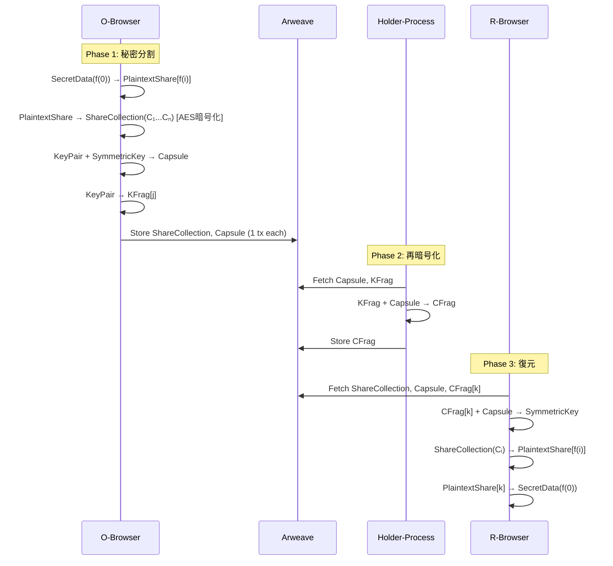

# Design Document: Client Domain Entities

## Overview

FORMIXクライアントライブラリのDomain層を、steering docsで定義された5エンティティ + Value Objects構造で再設計・実装する。現状の実装（process.rs, access_request.rs等）は無視し、PRDのフェーズ構造とsteering/structure.mdに準拠した新しい設計を適用する。

**対象ディレクトリ:** `client/src/domain/entities/`

## Steering Document Alignment

### Technical Standards (tech.md)

- **言語**: Rust 1.86.0（Edition 2024）
- **ターゲット**: wasm32-unknown-unknown
- **主要依存ライブラリ**:
  - `umbral-pre` 0.11 - 閾値プロキシ再暗号化
  - `zeroize` 1.8 - 秘密情報のメモリクリア
  - `serde` 1.0 - シリアライゼーション（Infrastructure層で使用）
- **セキュリティ要件**: Zeroize、constant-time、Clone禁止（秘密データ）

### Project Structure (structure.md)

```
client/src/domain/
├── mod.rs
├── errors.rs           # DomainError定義
├── entities/
│   ├── mod.rs          # Entity re-exports
│   ├── secret.rs       # Secret Entity（集約ルート）
│   ├── share_collection.rs  # ShareCollection Entity
│   ├── capsule.rs      # Capsule Entity
│   ├── kfrag.rs        # KFrag Entity
│   └── cfrag.rs        # CFrag Entity
└── value_objects/
    ├── mod.rs          # Value Object re-exports
    ├── ids.rs          # SecretId, ShareCollectionId, CapsuleId, KFragId, CFragId
    ├── secret_data.rs  # SecretData
    ├── key_pair.rs     # KeyPair
    └── symmetric_key.rs # SymmetricKey
```

## Code Reuse Analysis

### Existing Components to Leverage

- **現状のvalue_objects.rs**: ProcessRole, CryptoPhase等のenumは再利用可能
- **errors.rs**: DomainError定義は拡張して使用

### Integration Points

- **Service層 (CryptoService)**: Entity/Value Objectを使用して暗号操作を実行
- **Infrastructure層 (Repository)**: Entityの永続化を担当
- **UseCase層**: Entityを通じてドメインロジックにアクセス

## Architecture

### Modular Design Principles

- **Single File Responsibility**: 1ファイル = 1 Entity または 1 Value Object
- **Component Isolation**: Entity間の直接参照はIDのみ（Value Object経由）
- **Layer Separation**: Domain層は純粋、serde注釈はInfrastructure層で追加

```mermaid
graph TD
    subgraph "Domain Layer"
        subgraph "Entities"
            Secret[Secret<br/>集約ルート]
            ShareCollection[ShareCollection<br/>暗号化シェアコレクション]
            Capsule[Capsule<br/>PREカプセル]
            KFrag[KFrag<br/>鍵フラグメント]
            CFrag[CFrag<br/>再暗号化フラグメント]
        end

        subgraph "Value Objects"
            IDs[ID Types<br/>SecretId, ShareCollectionId, etc.]
            SecretData[SecretData<br/>f(0)=secret]
            KeyPair[KeyPair<br/>skₒ, pkₒ]
            SymmetricKey[SymmetricKey<br/>kₒ]
        end
    end

    Secret -->|contains| IDs
    ShareCollection -->|references| IDs
    Capsule -->|references| IDs
    KFrag -->|references| IDs
    CFrag -->|references| IDs
```

### PRDフェーズとの対応



## Components and Interfaces

### Entity 1: Secret（集約ルート）

```rust
pub struct Secret {
    id: SecretId,
    threshold_k: u8,
    threshold_n: u8,
    state: SecretState,
    capsule_id: Option<CapsuleId>,
    share_collection_id: Option<ShareCollectionId>,
    kfrag_ids: Vec<KFragId>,
    owner_public_key: Vec<u8>,
    requester_public_key: Option<Vec<u8>>,
    created_at: u64,
}

pub enum SecretState {
    Initialized,
    Split,
    Distributed,
    Recovered,
}
```

- **Purpose**: 秘密のメタデータと状態を管理（集約ルート）
- **Interfaces**:
  - `Secret::new(k, n, owner_pk) -> Result<Self, DomainError>`
  - `secret.id() -> &SecretId`
  - `secret.split(share_collection_id, capsule_id) -> Result<(), DomainError>`
  - `secret.distribute(kfrag_ids) -> Result<(), DomainError>`
  - `secret.state() -> SecretState`
- **Dependencies**: SecretId, ShareCollectionId, CapsuleId, KFragId
- **Reuses**: None (aggregate root)

### Entity 2: ShareCollection（暗号化シェアコレクション）

```rust
pub struct ShareCollection {
    id: ShareCollectionId,
    secret_id: SecretId,
    threshold_k: u8,
    threshold_n: u8,
    shares: Vec<EncryptedShareData>,  // n個のCᵢを保持
    arweave_tx_id: Option<String>,    // 1つのtxで一括保存
    created_at: u64,
}

/// 個別の暗号化シェアデータ（Value Object的な内部構造）
pub struct EncryptedShareData {
    index: u8,                 // 1 <= index <= n
    encrypted_data: Vec<u8>,   // Cᵢ = AES_GCM(kₒ, f(i))
}
```

- **Purpose**: n個の暗号化シャミアシェア（C₁...Cₙ）を1つのEntityとして管理。1つのArweave txで一括保存。
- **Interfaces**:
  - `ShareCollection::new(secret_id, k, n, shares) -> Result<Self, DomainError>`
  - `collection.id() -> &ShareCollectionId`
  - `collection.get_share(index) -> Option<&EncryptedShareData>`
  - `collection.get_shares_by_indices(indices: &[u8]) -> Vec<&EncryptedShareData>`
  - `collection.shares_count() -> usize`
  - `collection.set_arweave_tx_id(tx_id)`
- **Dependencies**: ShareCollectionId, SecretId
- **Reuses**: None

#### ShareCollection設計の理由

1. **アトミック性**: n個のシェアは同時に生成され、論理的に不可分
2. **効率性**: Arweave txコスト削減、フェッチ回数削減
3. **整合性**: 部分的な保存失敗のリスクがない
4. **Arweaveの分散性**: 1 tx内でもArweaveノードに分散保存される

### Entity 3: Capsule（PREカプセル）

```rust
pub struct Capsule {
    id: CapsuleId,
    secret_id: SecretId,
    capsule_data: Vec<u8>,  // Serialized umbral Capsule
    arweave_tx_id: Option<String>,
    created_at: u64,
}
```

- **Purpose**: Umbral PREカプセルを表現
- **Interfaces**:
  - `Capsule::new(secret_id, capsule_data) -> Result<Self, DomainError>`
  - `capsule.id() -> &CapsuleId`
  - `capsule.capsule_data() -> &[u8]`
  - `capsule.set_arweave_tx_id(tx_id)`
- **Dependencies**: CapsuleId, SecretId
- **Reuses**: None

### Entity 4: KFrag（鍵フラグメント）

```rust
#[derive(Zeroize, ZeroizeOnDrop)]
pub struct KFrag {
    id: KFragId,
    secret_id: SecretId,
    holder_index: u8,
    #[zeroize(skip)]
    holder_process_id: Option<String>,
    kfrag_data: Vec<u8>,  // Serialized umbral KeyFrag
    created_at: u64,
}
```

- **Purpose**: 再暗号化鍵フラグメントを表現
- **Interfaces**:
  - `KFrag::new(secret_id, holder_index, kfrag_data) -> Result<Self, DomainError>`
  - `kfrag.id() -> &KFragId`
  - `kfrag.kfrag_data() -> &[u8]`
  - `kfrag.set_holder_process_id(process_id)`
- **Dependencies**: KFragId, SecretId
- **Security**: Zeroize on drop

### Entity 5: CFrag（再暗号化フラグメント）

```rust
#[derive(Zeroize, ZeroizeOnDrop)]
pub struct CFrag {
    id: CFragId,
    secret_id: SecretId,
    kfrag_id: KFragId,
    holder_index: u8,
    cfrag_data: Vec<u8>,  // Serialized umbral CapsuleFrag
    created_at: u64,
}
```

- **Purpose**: 再暗号化されたフラグメントを表現
- **Interfaces**:
  - `CFrag::new(secret_id, kfrag_id, holder_index, cfrag_data) -> Result<Self, DomainError>`
  - `cfrag.id() -> &CFragId`
  - `cfrag.cfrag_data() -> &[u8]`
  - `cfrag.verify(capsule) -> Result<bool, DomainError>`
- **Dependencies**: CFragId, SecretId, KFragId
- **Security**: Zeroize on drop

### Value Object 1: ID Types

```rust
#[derive(Debug, Clone, PartialEq, Eq, Hash)]
pub struct SecretId(String);

#[derive(Debug, Clone, PartialEq, Eq, Hash)]
pub struct ShareCollectionId(String);

#[derive(Debug, Clone, PartialEq, Eq, Hash)]
pub struct CapsuleId(String);

#[derive(Debug, Clone, PartialEq, Eq, Hash)]
pub struct KFragId(String);

#[derive(Debug, Clone, PartialEq, Eq, Hash)]
pub struct CFragId(String);
```

- **Purpose**: 型安全なID（newtypeパターン）
- **Interfaces**: `::new()`, `::generate()`, `as_str()`

### Value Object 2: SecretData

```rust
#[derive(Zeroize, ZeroizeOnDrop)]
pub struct SecretData {
    data: Vec<u8>,
}
```

- **Purpose**: 秘密の実データ f(0)=secret
- **Interfaces**: `::new(data)`, `as_bytes()`
- **Security**: Zeroize on drop, no Clone

### Value Object 3: KeyPair

```rust
#[derive(Zeroize, ZeroizeOnDrop)]
pub struct KeyPair {
    secret_key: Vec<u8>,
    #[zeroize(skip)]
    public_key: Vec<u8>,
}
```

- **Purpose**: PRE鍵ペア（skₒ, pkₒ）
- **Interfaces**: `::generate()`, `public_key()`, `secret_key()`
- **Security**: Zeroize secret_key on drop, no Clone

### Value Object 4: SymmetricKey

```rust
#[derive(Zeroize, ZeroizeOnDrop)]
pub struct SymmetricKey {
    key: [u8; 32],  // AES-256
}
```

- **Purpose**: AES共通鍵 kₒ
- **Interfaces**: `::generate()`, `as_bytes()`
- **Security**: Zeroize on drop, no Clone

## Data Models

### Entity Relationships

```
Secret (1) ---- (1) ShareCollection
Secret (1) ---- (1) Capsule
Secret (1) ----< (n) KFrag
KFrag  (1) ---- (1) CFrag
```

### State Transitions

```mermaid
stateDiagram-v2
    [*] --> Initialized: Secret::new()
    Initialized --> Split: secret.split()
    Split --> Distributed: secret.distribute()
    Distributed --> Recovered: (Phase 3 complete)
```

## Error Handling

### DomainError

```rust
#[derive(Debug, thiserror::Error)]
pub enum DomainError {
    #[error("Invalid threshold: k={k} must be <= n={n} and k > 0")]
    InvalidThreshold { k: u8, n: u8 },

    #[error("Invalid index: {index} must be in range 1..={max}")]
    InvalidIndex { index: u8, max: u8 },

    #[error("Empty data not allowed for {field}")]
    EmptyData { field: String },

    #[error("Invalid state transition from {from:?} to {to:?}")]
    InvalidStateTransition { from: String, to: String },

    #[error("Entity not found: {entity_type} with id {id}")]
    NotFound { entity_type: String, id: String },

    #[error("Share count mismatch: expected {expected}, got {actual}")]
    ShareCountMismatch { expected: u8, actual: usize },
}
```

### Error Scenarios

1. **Invalid Threshold**
   - Handling: コンストラクタでk > n または k = 0をチェック
   - User Impact: Result::Errが返る

2. **Invalid Index**
   - Handling: EncryptedShareDataのindexが範囲外かチェック
   - User Impact: Result::Errが返る

3. **Empty Data**
   - Handling: 空のバイト列を拒否
   - User Impact: Result::Errが返る

4. **Share Count Mismatch**
   - Handling: ShareCollection生成時にshares.len() == nを確認
   - User Impact: Result::Errが返る

## Testing Strategy

### Unit Testing

各Entity/Value Objectに対して以下をテスト：

1. **コンストラクタテスト**
   - 有効な入力でのインスタンス生成
   - 無効な入力でのエラー返却

2. **Getter/Setterテスト**
   - 各フィールドへのアクセス

3. **ShareCollectionテスト**
   - n個のシェア生成と保持
   - インデックス指定でのシェア取得
   - 複数インデックス指定での部分取得

4. **状態遷移テスト（Secret）**
   - 有効な遷移の成功
   - 無効な遷移のエラー

5. **Zeroizeテスト**
   - Drop時のメモリクリア確認

### Integration Testing

- Entity間の参照整合性
- Repository経由での永続化・復元
- ShareCollectionの一括保存・取得

### End-to-End Testing

- Phase 1: Secret分割フロー全体（ShareCollection生成含む）
- Phase 3: Secret復元フロー全体（ShareCollectionからのシェア取得含む）
