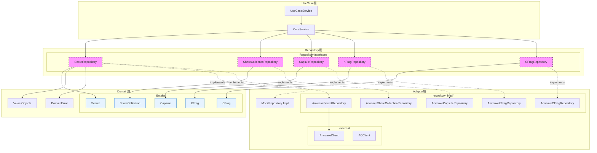

# Design Document: Client Domain Repository Interface

## Overview

FORMIXクライアントライブラリにRepository層を新設し、Repository Interfaceを実装する。このインターフェースは5つのドメインエンティティ（Secret, ShareCollection, Capsule, KFrag, CFrag）に対する永続化操作を抽象化し、依存性逆転原則（DIP）に基づいてAdapter層から分離する。

Repository層は`domain/`と同じレベル（`src/repositories/`）に配置され、Domain層のエンティティを参照する。Adapter層がこれらのRepository Interfaceを実装することで、ビジネスロジックが具体的なストレージ実装に依存しない設計を実現する。

クライアントライブラリはブラウザ/ローカル環境で実行されるため、全メソッドは`async fn`として定義し、`async_trait`クレートを使用してtrait内での非同期メソッドを実現する。

## Steering Document Alignment

### Technical Standards (tech.md)
- **Rust Edition**: 2024（既存設定を継承）
- **非同期サポート**: `async_trait`クレートを使用
- **エラーハンドリング**: 既存の`DomainResult<T>`と`DomainError`を活用
- **型安全性**: ジェネリクスと関連型を使用したRepository trait設計

### Project Structure (structure.md)
- **ファイル配置**: `client/src/repositories/`ディレクトリ（domain/と同じレベル）
- **モジュール構成**: エンティティごとに1ファイル + mod.rs
- **命名規則**: `{entity_name}_interface.rs`形式（例: `secret_interface.rs`, `share_interface.rs`）

## Code Reuse Analysis

### Existing Components to Leverage
- **DomainError / DomainResult**: `client/src/domain/errors.rs`の既存エラー型を使用
  - `NotFound`, `AlreadyExists`, `StorageError`, `SerializationError`を活用
- **ID Types**: `client/src/domain/value_objects/ids.rs`の既存ID型
  - `SecretId`, `ShareCollectionId`, `CapsuleId`, `KFragId`, `CFragId`
- **Entity Types**: `client/src/domain/entities/`の既存エンティティ
  - 各エンティティの`from_stored()`メソッドをRepository実装で使用

### Integration Points
- **Domain Layer**: entities/, value_objects/, errors.rsと統合
- **Repository Layer**: Repository InterfaceはDomain層のエンティティを参照
- **Adapter Layer**: 将来のArweave実装がこれらのRepository Interfaceを実装
- **UseCase Layer**: Repository traitをDI経由で使用

### Entity Reconstitution Pattern (from_stored メソッド)

DDD/Clean Architectureにおいて、エンティティの生成には2つのパターンがあります：

#### 1. `new()` コンストラクタ（ビジネス操作用）
- **目的**: 新規エンティティ作成時にドメイン不変条件（Invariants）を検証
- **使用箇所**: UseCase層でのビジネスロジック実行時
- **責務**: ビジネスルールの強制（例: threshold ≤ total_shares）

```rust
// UseCase層での使用例
let secret = Secret::new(
    SecretId::generate(),
    owner_pk,
    threshold,
    total_shares,
)?;  // 不変条件の検証あり
```

#### 2. `from_stored()` ファクトリメソッド（永続化復元用）
- **目的**: 永続化されたデータからエンティティを再構築（Reconstitution）
- **使用箇所**: Adapter層のRepository実装内のみ
- **責務**: バリデーションなしで信頼されたデータから復元
- **理由**: 保存時に既に検証済みのため再検証は不要

```rust
// Adapter層（Repository実装）での使用例
impl ArweaveSecretRepository {
    async fn find_by_id(&self, id: &SecretId) -> DomainResult<Option<Secret>> {
        let stored_data = self.client.fetch(id).await?;
        // from_stored()は検証をスキップ（保存時に検証済み）
        Ok(Some(Secret::from_stored(stored_data)))
    }
}
```

#### DDD/Clean Architectureにおける設計原則
- **依存性逆転原則（DIP）**: Domain層・Repository層はAdapter層に依存しない
- **エンティティの不変条件保護**: エンティティは自身の不変条件を保護する責務を持つ
- **Repositoryパターン**: 永続化の詳細を隠蔽し、エンティティを再構築する
- **信頼された再構築**: `from_stored()`は永続化層からの「信頼されたデータ」を前提とする

## Architecture

Repository Interfaceは依存性逆転原則（DIP）に基づき設計される。Repository層でインターフェースを定義し、Adapter層で実装することで、ビジネスロジックが具体的なストレージ実装に依存しない。



**Note**: 点線矢印（-.->）はDIPによる実装関係を示す。Adapter層がRepository層のRepository Interfaceを実装する。

### Modular Design Principles
- **Single File Responsibility**: 各Repositoryファイルは1つのエンティティの永続化操作のみを定義
- **Component Isolation**: 各Repository traitは独立してモック実装可能
- **Layer Separation**: Repository traitはRepository層、実装はAdapter層
- **Utility Modularity**: 基本Repository traitを定義し、各エンティティRepositoryが拡張

## Components and Interfaces

### Component 1: Base Repository Trait (`mod.rs`)

- **Purpose:** 共通のCRUD操作を抽象化した基本trait
- **Interfaces:**
  ```rust
  #[async_trait]
  pub trait Repository<T, ID>: Send + Sync
  where
      T: Send + Sync,
      ID: Send + Sync,
  {
      async fn save(&self, entity: &T) -> DomainResult<()>;
      async fn find_by_id(&self, id: &ID) -> DomainResult<Option<T>>;
      async fn delete(&self, id: &ID) -> DomainResult<()>;
      async fn exists(&self, id: &ID) -> DomainResult<bool>;
      async fn find_by_ids(&self, ids: &[ID]) -> DomainResult<Vec<T>>;
  }
  ```
- **Dependencies:** `async_trait`, `DomainResult`
- **Reuses:** `client/src/domain/errors.rs`

### Component 2: SecretRepository (`secret_interface.rs`)

- **Purpose:** Secret（集約ルート）の永続化操作
- **Interfaces:**
  ```rust
  #[async_trait]
  pub trait SecretRepository: Repository<Secret, SecretId> {
      // 基本Repository traitのメソッドを継承
      // 追加メソッドは必要に応じて定義
  }
  ```
- **Dependencies:** `Secret`, `SecretId`, `DomainResult`
- **Reuses:** Base Repository trait

### Component 3: ShareCollectionRepository (`share_interface.rs`)

- **Purpose:** ShareCollectionの永続化操作
- **Interfaces:**
  ```rust
  #[async_trait]
  pub trait ShareCollectionRepository: Repository<ShareCollection, ShareCollectionId> {
      async fn find_by_secret_id(&self, secret_id: &SecretId) -> DomainResult<Option<ShareCollection>>;
  }
  ```
- **Dependencies:** `ShareCollection`, `ShareCollectionId`, `SecretId`, `DomainResult`
- **Reuses:** Base Repository trait

### Component 4: CapsuleRepository (`capsule_interface.rs`)

- **Purpose:** Capsuleの永続化操作
- **Interfaces:**
  ```rust
  #[async_trait]
  pub trait CapsuleRepository: Repository<Capsule, CapsuleId> {
      async fn find_by_secret_id(&self, secret_id: &SecretId) -> DomainResult<Option<Capsule>>;
  }
  ```
- **Dependencies:** `Capsule`, `CapsuleId`, `SecretId`, `DomainResult`
- **Reuses:** Base Repository trait

### Component 5: KFragRepository (`kfrag_interface.rs`)

- **Purpose:** KFrag（鍵フラグメント）の永続化操作
- **Interfaces:**
  ```rust
  #[async_trait]
  pub trait KFragRepository: Repository<KFrag, KFragId> {
      async fn find_by_secret_id(&self, secret_id: &SecretId) -> DomainResult<Vec<KFrag>>;
      async fn find_by_holder_index(&self, secret_id: &SecretId, holder_index: u8) -> DomainResult<Option<KFrag>>;
      async fn delete_by_secret_id(&self, secret_id: &SecretId) -> DomainResult<()>;
  }
  ```
- **Dependencies:** `KFrag`, `KFragId`, `SecretId`, `DomainResult`
- **Reuses:** Base Repository trait

### Component 6: CFragRepository (`cfrag_interface.rs`)

- **Purpose:** CFrag（再暗号化フラグメント）の永続化操作
- **Interfaces:**
  ```rust
  #[async_trait]
  pub trait CFragRepository: Repository<CFrag, CFragId> {
      async fn find_by_secret_id(&self, secret_id: &SecretId) -> DomainResult<Vec<CFrag>>;
      async fn find_by_kfrag_id(&self, kfrag_id: &KFragId) -> DomainResult<Option<CFrag>>;
      async fn delete_by_secret_id(&self, secret_id: &SecretId) -> DomainResult<()>;
      async fn count_by_secret_id(&self, secret_id: &SecretId) -> DomainResult<usize>;
  }
  ```
- **Dependencies:** `CFrag`, `CFragId`, `SecretId`, `KFragId`, `DomainResult`
- **Reuses:** Base Repository trait

## Data Models

### Repository Trait Hierarchy
```
Repository<T, ID> (base trait)
    ├── SecretRepository
    ├── ShareCollectionRepository
    ├── CapsuleRepository
    ├── KFragRepository
    └── CFragRepository
```

### Entity-Repository Mapping
| Entity | Repository | ID Type | Parent Reference |
|--------|------------|---------|------------------|
| Secret | SecretRepository | SecretId | None (aggregate root) |
| ShareCollection | ShareCollectionRepository | ShareCollectionId | SecretId |
| Capsule | CapsuleRepository | CapsuleId | SecretId |
| KFrag | KFragRepository | KFragId | SecretId |
| CFrag | CFragRepository | CFragId | SecretId, KFragId |

## Error Handling

### Error Scenarios

1. **NotFound Error**
   - **Handling:** `find_by_id`で存在しないIDを指定した場合、`Ok(None)`を返す（Requirementsの設計変更）
   - **User Impact:** Service層で適切にハンドリング可能

2. **StorageError**
   - **Handling:** Adapter層でストレージ操作に失敗した場合、`DomainError::StorageError`を返す
   - **User Impact:** リトライまたはエラーメッセージ表示

3. **SerializationError**
   - **Handling:** シリアライズ/デシリアライズ失敗時、`DomainError::SerializationError`を返す
   - **User Impact:** データ破損の可能性を通知

4. **AlreadyExists Error**
   - **Handling:** `save`で重複保存時、上書き更新として処理（Requirementsの設計）
   - **User Impact:** 透過的に更新される

## File Structure

```
client/src/
├── lib.rs                        # 既存: repositoriesモジュールを追加
├── domain/                       # 既存: Domain層
│   ├── mod.rs
│   ├── entities/                 # エンティティ定義
│   ├── value_objects/            # 値オブジェクト定義
│   └── errors.rs                 # DomainError, DomainResult
│
├── repositories/                 # 新規: Repository層（domain/と同じレベル）
│   ├── mod.rs                    # 基本Repository trait + モジュールエクスポート
│   ├── secret_interface.rs       # SecretRepository trait
│   ├── share_interface.rs        # ShareCollectionRepository trait
│   ├── capsule_interface.rs      # CapsuleRepository trait
│   ├── kfrag_interface.rs        # KFragRepository trait
│   └── cfrag_interface.rs        # CFragRepository trait
│
└── adapter/                      # 将来実装: Adapter層
    ├── mod.rs
    ├── errors.rs                 # Adapter層エラー定義
    ├── repository_impl/          # Repository実装
    │   ├── mod.rs
    │   ├── secret_impl.rs        # ArweaveSecretRepository
    │   ├── share_impl.rs         # ArweaveShareCollectionRepository
    │   ├── capsule_impl.rs       # ArweaveCapsuleRepository
    │   ├── kfrag_impl.rs         # ArweaveKFragRepository
    │   └── cfrag_impl.rs         # ArweaveCFragRepository
    └── external/                 # 外部システムアダプター
        ├── mod.rs
        ├── arweave_client.rs     # ArweaveClient
        └── ao_client.rs          # AOClient
```

## Dependencies

### New Dependencies (client/Cargo.toml)
```toml
[dependencies]
async-trait = "0.1"
```

### Existing Dependencies Used
- `zeroize` (for KFrag, CFrag handling awareness)
- Entity types from `domain::entities`
- ID types from `domain::value_objects`
- Error types from `domain::errors`

## Testing Strategy

### Unit Testing (Implemented)

各Repository traitに対してインメモリモック実装を作成し、39件のテストを実装済み。

#### Mock Implementation Pattern
```rust
struct MockRepository {
    storage: RwLock<HashMap<ID, Entity>>,
}

#[async_trait]
impl Repository<Entity, ID> for MockRepository {
    async fn save(&self, entity: &Entity) -> DomainResult<()> {
        self.storage.write().unwrap().insert(entity.id().clone(), entity.clone());
        Ok(())
    }
    // ... other CRUD methods
}
```

#### Test Categories
1. **Send + Sync Verification**: コンパイル時の型制約確認
2. **NotFound Scenarios**: 存在しないエンティティの検索テスト
3. **CRUD Operations**: 保存・取得・削除・存在確認テスト
4. **Batch Retrieval**: 複数ID一括取得テスト
5. **Repository-Specific Methods**: 各Repository固有メソッドのテスト

### Test Coverage Summary

| File | Tests | Description |
|------|-------|-------------|
| mod.rs | 9 | Base Repository trait tests |
| secret_interface.rs | 4 | SecretRepository tests |
| share_interface.rs | 5 | ShareCollectionRepository tests |
| capsule_interface.rs | 5 | CapsuleRepository tests |
| kfrag_interface.rs | 7 | KFragRepository tests |
| cfrag_interface.rs | 9 | CFragRepository tests |
| **Total** | **39** | - |

### Test File Structure
```
client/src/repositories/
├── mod.rs                    # #[cfg(test)] mod tests ✅
├── secret_interface.rs       # #[cfg(test)] mod tests ✅
├── share_interface.rs        # #[cfg(test)] mod tests ✅
├── capsule_interface.rs      # #[cfg(test)] mod tests ✅
├── kfrag_interface.rs        # #[cfg(test)] mod tests ✅
└── cfrag_interface.rs        # #[cfg(test)] mod tests ✅
```

### Dev Dependencies
```toml
[dev-dependencies]
tokio = { version = "1", features = ["rt", "macros"] }
```

## Implementation Notes

### async_trait Usage Pattern
```rust
use async_trait::async_trait;
use crate::domain::errors::DomainResult;

#[async_trait]
pub trait Repository<T, ID>: Send + Sync
where
    T: Send + Sync,
    ID: Send + Sync,
{
    async fn save(&self, entity: &T) -> DomainResult<()>;
    // ...
}
```

### Trait Object Support
Repository traitは`dyn Trait`として使用可能に設計：
```rust
// Service層での使用例
pub struct SecretService {
    secret_repo: Box<dyn SecretRepository>,
    share_repo: Box<dyn ShareCollectionRepository>,
}
```

### Zeroize Consideration
KFragとCFragはZeroize + ZeroizeOnDropを実装している。Repository操作では：
- 取得時: デシリアライズ後、エンティティとして返却（Zeroize特性を維持）
- 保存時: シリアライズ時に一時的なデータ露出があるが、Adapter層の責務として最小化
