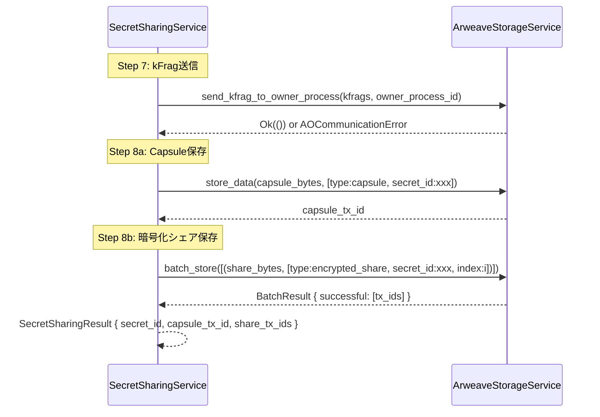
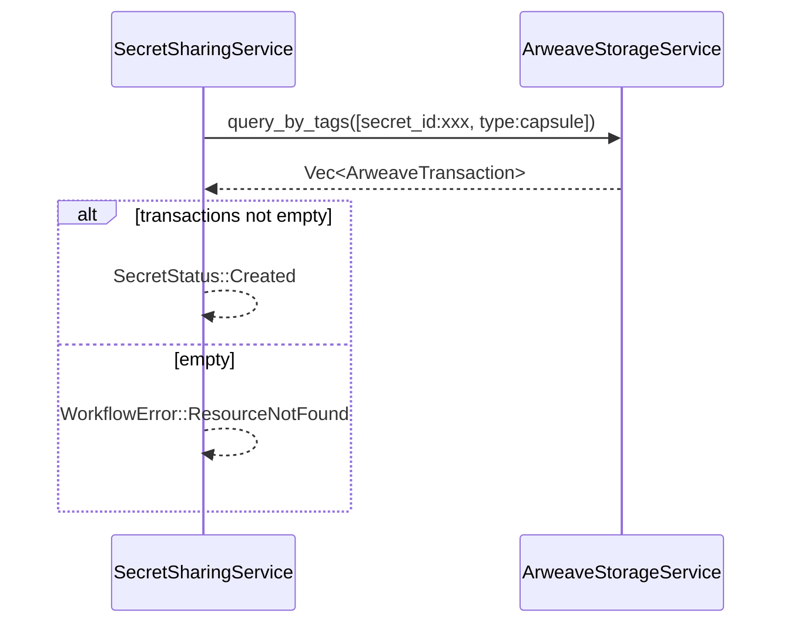

# Design Document: client-share-workflowservice-integration

## Overview

本設計書は、`SecretSharingWorkflowService` の `ArweaveStorageService` 統合を定義します。現在のプレースホルダ実装を実際のArweave/AO操作に置き換え、PHASE 1ワークフローを完成させます。

## Steering Document Alignment

### Technical Standards

1. **Clean Architecture**: WorkflowServiceはCore Service (`ArweaveStorageService`) 経由でのみストレージ操作を行う
2. **DIP**: `ArweaveStorageService` traitに依存し、具体実装には依存しない
3. **Zeroize**: kFragシリアライズの中間データは使用後にクリア

## Code Reuse Analysis

### Existing Components to Leverage

- **ArweaveStorageService** (`usecase/core/storage.rs`):
  - `store_data()` - 個別トランザクション保存
  - `batch_store()` - 一括保存
  - `query_by_tags()` - タグベースクエリ

### Required New Methods

**ArweaveStorageService拡張:**
```rust
/// kFragをOwner-Processに送信（AO通信）
fn send_kfrag_to_owner_process(
    &self,
    kfrags: &[KeyFragment],
    owner_process_id: &str,
) -> ServiceResult<()>;
```

## Architecture

### 変更前のデータフロー

```
SecretSharingWorkflowService
    ├── CryptoService (Steps 1-6) ✅
    └── [PLACEHOLDER] (Steps 7-8) ❌
        ├── kFrag送信: コメントアウト
        └── Arweave保存: プレースホルダtx_id生成
```

### 変更後のデータフロー

```
SecretSharingWorkflowService<C: CryptoService, S: ArweaveStorageService>
    ├── CryptoService (Steps 1-6) ✅
    └── ArweaveStorageService (Steps 7-8) ✅ [NEW]
        ├── send_kfrag_to_owner_process() → AO Network
        ├── store_data(capsule) → Arweave
        └── batch_store(encrypted_shares) → Arweave
```

### Step 7-8 詳細フロー



### get_secret_status() フロー



## Components and Interfaces

### Component 1: SecretSharingWorkflowServiceImpl (変更)

**変更内容:**

```rust
// Before
pub struct SecretSharingWorkflowServiceImpl<C: CryptoService> {
    crypto_service: Arc<C>,
}

// After
pub struct SecretSharingWorkflowServiceImpl<C: CryptoService, S: ArweaveStorageService> {
    crypto_service: Arc<C>,
    storage_service: Arc<S>,
}

impl<C: CryptoService, S: ArweaveStorageService> SecretSharingWorkflowServiceImpl<C, S> {
    pub fn new(crypto_service: Arc<C>, storage_service: Arc<S>) -> Self {
        Self {
            crypto_service,
            storage_service,
        }
    }
}
```

### Component 2: ArweaveStorageService trait (拡張)

**追加メソッド:**

```rust
pub trait ArweaveStorageService: Send + Sync {
    // ... existing methods ...

    /// kFragをOwner-Processに送信（AO通信）
    fn send_kfrag_to_owner_process(
        &self,
        kfrags: &[KeyFragment],
        owner_process_id: &str,
    ) -> ServiceResult<()>;
}
```

### Component 3: execute_secret_sharing (変更部分)

**Step 7 実装:**

```rust
// Step 7: Send kFrags to Owner-Process via AO
self.storage_service
    .send_kfrag_to_owner_process(&kfrags, &request.owner_process_id)
    .map_err(|e| WorkflowError::ao_communication(format!(
        "Failed to send kFrags to Owner-Process: {}", e
    )))?;
```

**Step 8 実装:**

```rust
// Step 8: Store Capsule and encrypted shares on Arweave
let secret_id = SecretId::generate();

// 8a: Store Capsule
let capsule_tags = vec![
    Tag { name: "type".to_string(), value: "capsule".to_string() },
    Tag { name: "secret_id".to_string(), value: secret_id.as_str().to_string() },
];
let capsule_tx_id = self.storage_service
    .store_data(&capsule_bytes, capsule_tags)
    .map_err(WorkflowError::storage)?;

// 8b: Store encrypted shares
let share_items: Vec<(Vec<u8>, Vec<Tag>)> = encrypted_shares
    .iter()
    .enumerate()
    .map(|(i, share)| {
        let tags = vec![
            Tag { name: "type".to_string(), value: "encrypted_share".to_string() },
            Tag { name: "secret_id".to_string(), value: secret_id.as_str().to_string() },
            Tag { name: "index".to_string(), value: i.to_string() },
        ];
        (share.clone(), tags)
    })
    .collect();

let batch_result = self.storage_service
    .batch_store(share_items)
    .map_err(WorkflowError::storage)?;

let share_tx_ids = batch_result.successful;
```

### Component 4: get_secret_status (変更)

```rust
fn get_secret_status(&self, secret_id: &SecretId) -> WorkflowResult<SecretStatus> {
    let params = QueryParams {
        tags: vec![
            Tag { name: "secret_id".to_string(), value: secret_id.as_str().to_string() },
            Tag { name: "type".to_string(), value: "capsule".to_string() },
        ],
        limit: Some(1),
        sort_by: None,
    };

    let results = self.storage_service
        .query_by_tags(params)
        .map_err(WorkflowError::storage)?;

    if results.is_empty() {
        return Err(WorkflowError::not_found(format!(
            "Secret {} not found",
            secret_id
        )));
    }

    Ok(SecretStatus::Created)
}
```

## Data Models

### Arweave Tag Convention

| Tag Name | Value | Description |
|----------|-------|-------------|
| `type` | `capsule` | PRE Capsuleトランザクション |
| `type` | `encrypted_share` | 暗号化シェアトランザクション |
| `secret_id` | `{SecretId}` | 秘密の一意識別子 |
| `index` | `{0..n}` | シェアのインデックス番号 |
| `protocol` | `formix` | プロトコル識別子 |

## Error Handling

### Error Mapping

| StorageService Error | WorkflowError | Context |
|---------------------|---------------|---------|
| `ServiceError::*` (kFrag送信) | `AOCommunicationError` | AO通信失敗 |
| `ServiceError::*` (store/batch) | `StorageError` | Arweave保存失敗 |
| `ServiceError::*` (query) | `StorageError` | クエリ失敗 |
| empty query result | `ResourceNotFound` | データ未発見 |

## Testing Strategy

### Unit Testing

**MockStorageServiceの定義:**

```rust
#[cfg(test)]
mod tests {
    use mockall::mock;

    mock! {
        StorageService {}
        impl ArweaveStorageService for StorageService {
            fn store_data(&self, data: &[u8], tags: Vec<Tag>) -> ServiceResult<String>;
            fn retrieve_data(&self, transaction_id: &str) -> ServiceResult<ArweaveTransaction>;
            fn query_by_tags(&self, params: QueryParams) -> ServiceResult<Vec<ArweaveTransaction>>;
            fn check_transaction_status(&self, transaction_id: &str) -> ServiceResult<TransactionStatus>;
            fn batch_store(&self, items: Vec<(Vec<u8>, Vec<Tag>)>) -> ServiceResult<BatchResult>;
            fn exists(&self, transaction_id: &str) -> ServiceResult<bool>;
            fn update_tags(&self, transaction_id: &str, new_tags: Vec<Tag>) -> ServiceResult<String>;
            fn send_kfrag_to_owner_process(&self, kfrags: &[KeyFragment], owner_process_id: &str) -> ServiceResult<()>;
        }
    }
}
```

### Test Categories

1. **StorageService DI**: インスタンス生成と依存注入の検証
2. **kFrag送信**: AO通信呼び出しの検証（成功/失敗）
3. **Arweave保存**: Capsule/シェア保存の検証（タグ、tx_id、エラー）
4. **get_secret_status()**: ステータス照会の検証（Found/NotFound/Error）
5. **既存テスト互換性**: 既存テストがMockStorageServiceで引き続きパス

## Security Considerations

### Memory Safety

- kFragシリアライズ時の中間バイト列は `Zeroizing<Vec<u8>>` でラップ
- StorageService呼び出し後の一時データは適切にドロップ

### Information Leakage Prevention

- Arweaveタグに秘密鍵やkFrag内容を含めない
- `secret_id` は公開識別子として安全に使用可能
- エラーメッセージにkFrag内容を含めない

## Implementation Dependencies

### Required Before Implementation

1. **ArweaveStorageService trait拡張**: `send_kfrag_to_owner_process()` メソッド追加
2. **Tag import**: `Tag` 型のインポートパス確認

### Implementation Order

1. ArweaveStorageService trait拡張 (Requirement 5)
2. SecretSharingWorkflowServiceImpl struct変更 (Requirement 1)
3. Step 7: kFrag送信実装 (Requirement 2)
4. Step 8: Arweave保存実装 (Requirement 3)
5. get_secret_status()実装 (Requirement 4)
6. DI Container更新 (Requirement 6)
7. テスト更新
