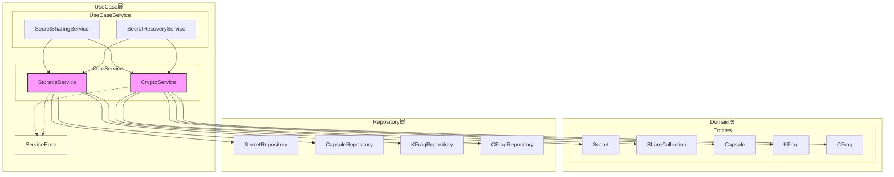
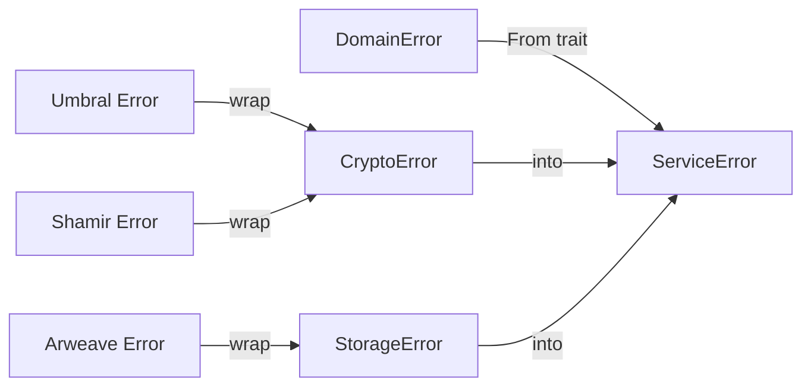

# Design Document: Client UseCase CoreService

## Overview

FORMIXクライアントライブラリのUseCase層にCoreService群を実装する。CoreServiceは複数のUseCaseService（SecretSharingService、SecretRecoveryService等）から呼び出される共通業務ロジックを提供し、tech.mdで定義された2つのサービスで構成される：

1. **CryptoService**: TPRE・Shamir・AES-GCM操作（純粋な暗号ロジック）
2. **StorageService**: Arweave操作（永続化ビジネスロジック）

CoreServiceはRepository Interfaceを通じてAdapter層と連携し、依存性逆転原則（DIP）に基づいて設計される。

## Steering Document Alignment

### Technical Standards (tech.md)

- **Rust Edition**: 2024（既存設定を継承）
- **暗号ライブラリ**:
  - `umbral-pre 0.11`: 閾値プロキシ再暗号化（Umbral）
  - `shamirsecretsharing 0.1`: シャミア秘密分散（k-of-n）
  - `aes-gcm`: シェア暗号化用対称暗号
  - `zeroize 1.8`: 秘密情報のメモリクリア
  - `subtle 2.6`: 定数時間暗号操作
- **エラーハンドリング**: `thiserror`による構造化エラー定義
- **シリアライゼーション**: `bincode`（バイナリ）、`serde_json`（メタデータ）

### Project Structure (structure.md)

- **ファイル配置**: `client/src/usecase/core/`ディレクトリ
- **モジュール構成**:
  - `mod.rs`: CoreServiceエクスポート
  - `crypto.rs`: CryptoService実装
  - `storage.rs`: StorageService実装
- **エラー定義**: `client/src/usecase/error.rs`

## Code Reuse Analysis

### Existing Components to Leverage

- **Domain Entities**: `client/src/domain/entities/`
  - `Secret`, `ShareCollection`, `Capsule`, `KFrag`, `CFrag`
- **Value Objects**: `client/src/domain/value_objects/ids.rs`
  - `SecretId`, `ShareCollectionId`, `CapsuleId`, `KFragId`, `CFragId`
- **Repository Interfaces**: `client/src/repositories/`
  - `SecretRepository`, `CapsuleRepository`, `KFragRepository`, `CFragRepository`
- **Domain Errors**: `client/src/domain/errors.rs`
  - `DomainError`, `DomainResult`

### Integration Points

- **UseCase Layer**: `SecretSharingService`, `SecretRecoveryService`がCoreServiceを呼び出す
- **Repository Layer**: Repository Interfaceを通じてデータ永続化
- **Adapter Layer**: ArweaveClient経由でArweave通信（将来実装）

## Architecture

CoreServiceはUseCase層の共通業務ロジックとして位置づけられ、責務の境界で分離された再利用可能な単位として構成される。



### Modular Design Principles

- **Single File Responsibility**: 各CoreServiceファイルは1つの責務（暗号/ストレージ）に特化
- **Component Isolation**: 各CoreServiceはtrait + 実装として分離され、テスト時にMock差し替え可能
- **Layer Separation**: CoreServiceはUseCase層、永続化詳細はAdapter層
- **Utility Modularity**: 暗号操作とストレージ操作を明確に分離

## Components and Interfaces

### Component 1: CryptoService (`crypto.rs`)

- **Purpose:** TPRE・Shamir・AES-GCM暗号操作を提供
- **Interfaces:**
  ```rust
  pub trait CryptoService: Send + Sync {
      // Shamir Secret Sharing
      fn split_secret_shamir(
          &self,
          secret: &[u8],
          threshold: u8,
          total_shares: u8,
      ) -> Result<Vec<ShamirShare>, ServiceError>;

      fn reconstruct_secret_shamir(
          &self,
          shares: &[ShamirShare],
      ) -> Result<Vec<u8>, ServiceError>;

      // Umbral TPRE
      fn generate_keypair(&self) -> Result<(SecretKey, PublicKey), ServiceError>;

      fn create_pre_capsule(
          &self,
          public_key: &PublicKey,
          plaintext: &[u8],
      ) -> Result<(Capsule, Vec<u8>), ServiceError>;

      fn generate_kfrags(
          &self,
          delegator_sk: &SecretKey,
          receiver_pk: &PublicKey,
          threshold: u8,
          total_frags: u8,
      ) -> Result<Vec<VerifiedKeyFrag>, ServiceError>;

      fn verify_cfrag(
          &self,
          cfrag: &VerifiedCapsuleFrag,
          capsule: &Capsule,
          delegator_pk: &PublicKey,
          receiver_pk: &PublicKey,
      ) -> Result<bool, ServiceError>;

      fn decrypt_original(
          &self,
          secret_key: &SecretKey,
          capsule: &Capsule,
          ciphertext: &[u8],
      ) -> Result<Vec<u8>, ServiceError>;

      fn decrypt_reencrypted(
          &self,
          receiver_sk: &SecretKey,
          delegator_pk: &PublicKey,
          capsule: &Capsule,
          cfrags: &[VerifiedCapsuleFrag],
          ciphertext: &[u8],
      ) -> Result<Vec<u8>, ServiceError>;

      // AES-GCM Symmetric Encryption
      fn encrypt_share(
          &self,
          share: &[u8],
          key: &[u8; 32],
      ) -> Result<Vec<u8>, ServiceError>;

      fn decrypt_share(
          &self,
          ciphertext: &[u8],
          key: &[u8; 32],
      ) -> Result<Vec<u8>, ServiceError>;
  }
  ```
- **Dependencies:** `umbral-pre`, `shamirsecretsharing`, `aes-gcm`, `zeroize`
- **Reuses:** Domain entities for type safety

### Component 2: StorageService (`storage.rs`)

- **Purpose:** Arweave永続化操作のビジネスロジックを提供
- **Interfaces:**
  ```rust
  #[async_trait]
  pub trait StorageService: Send + Sync {
      // Store operations
      async fn store_capsule(
          &self,
          capsule: &Capsule,
      ) -> Result<TransactionId, ServiceError>;

      async fn store_encrypted_share(
          &self,
          share: &EncryptedShare,
          secret_id: &SecretId,
      ) -> Result<TransactionId, ServiceError>;

      async fn store_kfrag(
          &self,
          kfrag: &KFrag,
      ) -> Result<TransactionId, ServiceError>;

      async fn store_cfrag(
          &self,
          cfrag: &CFrag,
      ) -> Result<TransactionId, ServiceError>;

      // Retrieve operations
      async fn retrieve_capsule(
          &self,
          capsule_id: &CapsuleId,
      ) -> Result<Capsule, ServiceError>;

      async fn retrieve_encrypted_shares(
          &self,
          secret_id: &SecretId,
      ) -> Result<Vec<EncryptedShare>, ServiceError>;

      async fn retrieve_kfrags(
          &self,
          secret_id: &SecretId,
      ) -> Result<Vec<KFrag>, ServiceError>;

      async fn retrieve_cfrags(
          &self,
          secret_id: &SecretId,
      ) -> Result<Vec<CFrag>, ServiceError>;

      // Query operations
      async fn query_by_tags(
          &self,
          tags: &[Tag],
      ) -> Result<Vec<TransactionInfo>, ServiceError>;

      async fn exists(
          &self,
          tx_id: &TransactionId,
      ) -> Result<bool, ServiceError>;
  }
  ```
- **Dependencies:** `async_trait`, Repository Interfaces
- **Reuses:** Repository layer for actual persistence

### Component 3: ServiceError (`error.rs`)

- **Purpose:** UseCase層の構造化エラー型を提供
- **Interfaces:**
  ```rust
  #[derive(Debug, thiserror::Error)]
  pub enum ServiceError {
      #[error("Business error: {0}")]
      Business(#[from] BusinessException),

      #[error("System error: {0}")]
      System(#[from] SystemException),
  }

  #[derive(Debug, thiserror::Error)]
  pub enum BusinessException {
      #[error("Validation error: {0}")]
      ValidationError(String),

      #[error("Resource not found: {0}")]
      ResourceNotFound(String),

      #[error("Threshold not met: required {required}, got {actual}")]
      ThresholdNotMet { required: u8, actual: u8 },

      #[error("Invalid operation: {0}")]
      InvalidOperation(String),
  }

  #[derive(Debug, thiserror::Error)]
  pub enum SystemException {
      #[error("Crypto error: {0}")]
      CryptoError(String),

      #[error("Storage error: {0}")]
      StorageError(String),

      #[error("Serialization error: {0}")]
      SerializationError(String),

      #[error("Internal error: {0}")]
      InternalError(String),
  }

  impl ServiceError {
      pub fn is_recoverable(&self) -> bool {
          matches!(self, ServiceError::Business(_))
      }
  }

  impl From<DomainError> for ServiceError {
      fn from(err: DomainError) -> Self {
          // DomainErrorからServiceErrorへの変換
      }
  }
  ```
- **Dependencies:** `thiserror`, `DomainError`
- **Reuses:** Domain layer error types

## Data Models

### CryptoService Types

```rust
// Shamir Secret Sharing
pub struct ShamirShare {
    pub index: u8,
    pub data: Vec<u8>,
}

// Umbral TPRE (from umbral-pre)
pub use umbral_pre::{
    SecretKey,
    PublicKey,
    Capsule,
    VerifiedKeyFrag,
    VerifiedCapsuleFrag,
};

// AES-GCM
pub struct EncryptedShare {
    pub ciphertext: Vec<u8>,
    pub nonce: [u8; 12],
}
```

### StorageService Types

```rust
pub struct TransactionId(String);

pub struct Tag {
    pub name: String,
    pub value: String,
}

pub struct TransactionInfo {
    pub id: TransactionId,
    pub tags: Vec<Tag>,
    pub timestamp: u64,
}
```

### Memory Safety Structures

```rust
use zeroize::{Zeroize, ZeroizeOnDrop};

#[derive(Zeroize, ZeroizeOnDrop)]
pub struct SecretKeyWrapper {
    inner: SecretKey,
}

#[derive(Zeroize, ZeroizeOnDrop)]
pub struct SymmetricKey {
    key: [u8; 32],
}
```

## Error Handling

### Error Scenarios

1. **ValidationError (Business)**
   - **Handling:** 閾値パラメータ不正（k > n, k < 1）時に発生
   - **User Impact:** パラメータ修正を促すメッセージ

2. **ThresholdNotMet (Business)**
   - **Handling:** 復元時にシェア/cFrag数が閾値未満の場合
   - **User Impact:** 追加のシェア/cFrag取得を促す

3. **CryptoError (System)**
   - **Handling:** 暗号操作失敗時（鍵生成失敗、復号失敗等）
   - **User Impact:** システムエラーとして報告

4. **StorageError (System)**
   - **Handling:** Arweave操作失敗時
   - **User Impact:** リトライまたはエラー報告

### Error Conversion Flow



## File Structure

```
client/src/
├── lib.rs                        # usecaseモジュールを追加
├── domain/                       # 既存: Domain層
│   ├── entities/
│   └── value_objects/
├── repositories/                 # 既存: Repository層
│
└── usecase/                      # 新規/拡張: UseCase層
    ├── mod.rs                    # UseCaseモジュールエクスポート
    ├── error.rs                  # ServiceError定義
    ├── core/                     # CoreService群
    │   ├── mod.rs                # CoreServiceエクスポート
    │   ├── crypto.rs             # CryptoService trait + impl
    │   └── storage.rs            # StorageService trait + impl
    ├── secret_sharing_service.rs # Phase 1 UseCaseService（将来）
    └── secret_recovery_service.rs # Phase 3 UseCaseService（将来）
```

## Dependencies

### New Dependencies (client/Cargo.toml)

```toml
[dependencies]
# 暗号ライブラリ
umbral-pre = "0.11"
shamirsecretsharing = "0.1"
aes-gcm = "0.10"

# メモリ安全性
zeroize = { version = "1.8", features = ["derive"] }
subtle = "2.6"

# シリアライゼーション
bincode = "1.3"
serde = { version = "1.0", features = ["derive"] }

# エラーハンドリング
thiserror = "1"

# 非同期サポート（StorageService用）
async-trait = "0.1"
```

### Existing Dependencies Used

- Domain entities from `domain::entities`
- ID types from `domain::value_objects`
- Repository traits from `repositories`
- Error types from `domain::errors`

## Testing Strategy

### Unit Testing

#### CryptoService Tests

```rust
#[cfg(test)]
mod tests {
    use super::*;

    // Shamir Secret Sharing
    #[test]
    fn test_shamir_split_and_reconstruct() {
        let crypto = CryptoServiceImpl::new();
        let secret = b"test secret data";
        let shares = crypto.split_secret_shamir(secret, 3, 5).unwrap();
        assert_eq!(shares.len(), 5);

        let reconstructed = crypto.reconstruct_secret_shamir(&shares[0..3]).unwrap();
        assert_eq!(reconstructed, secret);
    }

    #[test]
    fn test_shamir_invalid_threshold() {
        let crypto = CryptoServiceImpl::new();
        let result = crypto.split_secret_shamir(b"secret", 6, 5);
        assert!(matches!(result, Err(ServiceError::Business(_))));
    }

    // Umbral TPRE
    #[test]
    fn test_keypair_generation() {
        let crypto = CryptoServiceImpl::new();
        let (sk, pk) = crypto.generate_keypair().unwrap();
        assert!(sk.to_secret_scalar().is_some());
    }

    #[test]
    fn test_pre_encrypt_decrypt() {
        let crypto = CryptoServiceImpl::new();
        let (sk, pk) = crypto.generate_keypair().unwrap();
        let plaintext = b"test plaintext";

        let (capsule, ciphertext) = crypto.create_pre_capsule(&pk, plaintext).unwrap();
        let decrypted = crypto.decrypt_original(&sk, &capsule, &ciphertext).unwrap();

        assert_eq!(decrypted, plaintext);
    }

    // AES-GCM
    #[test]
    fn test_aes_gcm_encrypt_decrypt() {
        let crypto = CryptoServiceImpl::new();
        let key = [0u8; 32];
        let plaintext = b"share data";

        let ciphertext = crypto.encrypt_share(plaintext, &key).unwrap();
        let decrypted = crypto.decrypt_share(&ciphertext, &key).unwrap();

        assert_eq!(decrypted, plaintext);
    }
}
```

#### StorageService Tests

```rust
#[cfg(test)]
mod tests {
    use super::*;

    #[tokio::test]
    async fn test_store_and_retrieve_capsule() {
        let storage = MockStorageService::new();
        let capsule = create_test_capsule();

        let tx_id = storage.store_capsule(&capsule).await.unwrap();
        let retrieved = storage.retrieve_capsule(&capsule.id()).await.unwrap();

        assert_eq!(retrieved.id(), capsule.id());
    }

    #[tokio::test]
    async fn test_retrieve_not_found() {
        let storage = MockStorageService::new();
        let result = storage.retrieve_capsule(&CapsuleId::generate()).await;

        assert!(matches!(result, Err(ServiceError::Business(BusinessException::ResourceNotFound(_)))));
    }
}
```

#### ServiceError Tests

```rust
#[cfg(test)]
mod tests {
    use super::*;

    #[test]
    fn test_is_recoverable() {
        let business_err = ServiceError::Business(BusinessException::ValidationError("test".into()));
        let system_err = ServiceError::System(SystemException::CryptoError("test".into()));

        assert!(business_err.is_recoverable());
        assert!(!system_err.is_recoverable());
    }

    #[test]
    fn test_domain_error_conversion() {
        let domain_err = DomainError::NotFound("entity".into());
        let service_err: ServiceError = domain_err.into();

        assert!(matches!(service_err, ServiceError::Business(BusinessException::ResourceNotFound(_))));
    }
}
```

### Test Coverage Goals

| Component | Target Coverage | Test Focus |
|-----------|----------------|------------|
| CryptoService | 90%+ | Shamir, Umbral, AES-GCM operations |
| StorageService | 80%+ | CRUD operations, error scenarios |
| ServiceError | 100% | Error classification, conversion |

### Integration Testing

- CryptoService + Domain Entities連携
- StorageService + Repository Mock連携
- End-to-end暗号化フロー（split → encrypt → store → retrieve → decrypt → reconstruct）

## Implementation Notes

### Synchronous CryptoService

CryptoServiceはブラウザ/WASM環境での同期実行を前提とし、非同期メソッドを持たない：

```rust
// CryptoServiceは同期的
impl CryptoService for CryptoServiceImpl {
    fn split_secret_shamir(&self, ...) -> Result<Vec<ShamirShare>, ServiceError> {
        // 同期処理
    }
}

// StorageServiceは非同期（Arweave通信のため）
#[async_trait]
impl StorageService for StorageServiceImpl {
    async fn store_capsule(&self, ...) -> Result<TransactionId, ServiceError> {
        // 非同期処理
    }
}
```

### Zeroize Usage Pattern

秘密鍵を扱う構造体には必ずZeroize + ZeroizeOnDropを適用：

```rust
use zeroize::{Zeroize, ZeroizeOnDrop};

#[derive(Zeroize, ZeroizeOnDrop)]
pub struct SensitiveData {
    secret_key: Vec<u8>,
    #[zeroize(skip)] // 非秘密データはスキップ
    metadata: String,
}

// ドロップ時に自動的にメモリクリア
impl Drop for SensitiveData {
    fn drop(&mut self) {
        // ZeroizeOnDropが自動的に処理
    }
}
```

### Constant-Time Comparison

秘密データの比較にはsubtleクレートを使用：

```rust
use subtle::ConstantTimeEq;

fn verify_secret(a: &[u8], b: &[u8]) -> bool {
    a.ct_eq(b).into()
}
```

### Repository Integration Pattern

StorageServiceはRepository Interfaceを通じてAdapter層と連携：

```rust
pub struct StorageServiceImpl {
    capsule_repo: Box<dyn CapsuleRepository>,
    kfrag_repo: Box<dyn KFragRepository>,
    cfrag_repo: Box<dyn CFragRepository>,
}

impl StorageServiceImpl {
    pub fn new(
        capsule_repo: Box<dyn CapsuleRepository>,
        kfrag_repo: Box<dyn KFragRepository>,
        cfrag_repo: Box<dyn CFragRepository>,
    ) -> Self {
        Self { capsule_repo, kfrag_repo, cfrag_repo }
    }
}
```
