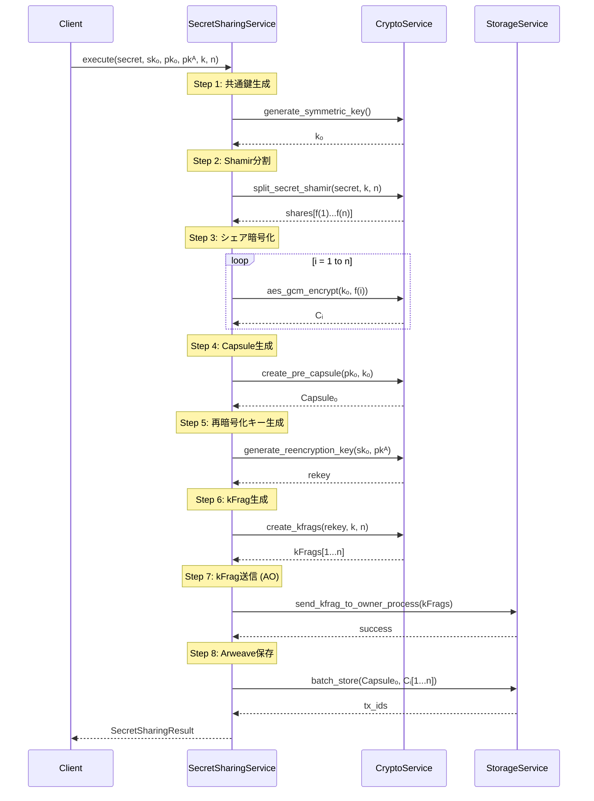
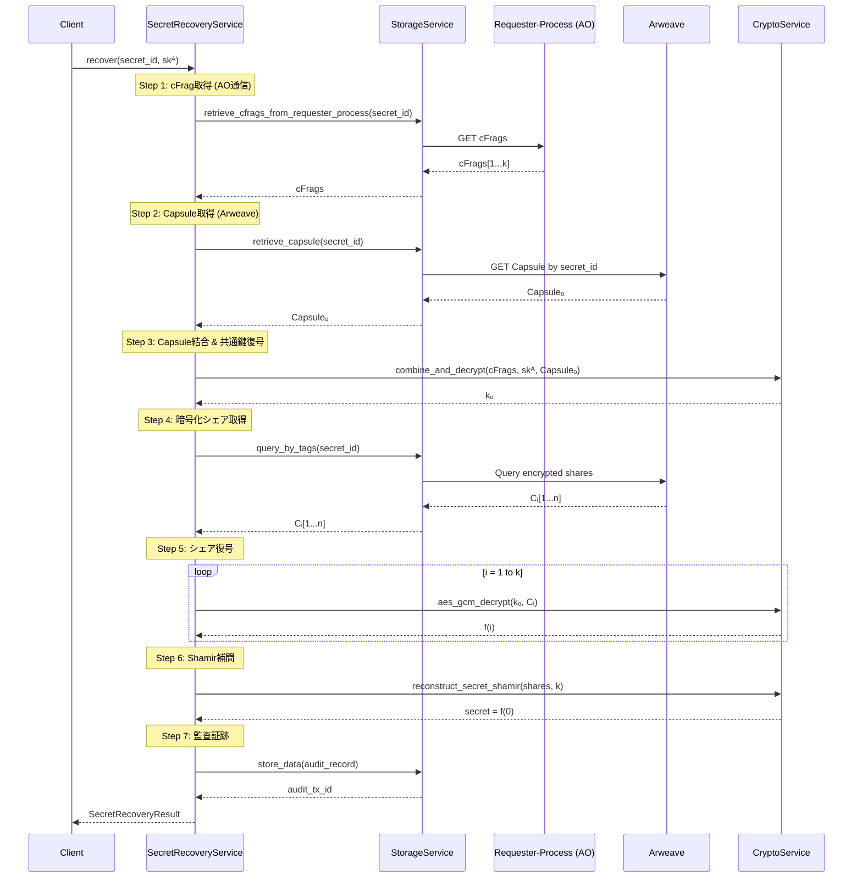

# Design Document: client-usecase-workflowservice

## Overview

本設計書は、D-TPRESクライアントライブラリのUseCase層におけるWorkflow Serviceの設計を定義します。SecretSharingWorkflowServiceとSecretRecoveryWorkflowServiceは、既存のCore Services（CryptoService、ArweaveStorageService）をオーケストレーションし、PHASE 1（秘密分割）とPHASE 3（秘密復元）のエンドツーエンドワークフローを実現します。

**SDKエンドポイント対応:**
```
dtpres.share()   → SecretSharingWorkflowService.execute()
dtpres.recover() → SecretRecoveryWorkflowService.execute()
```

## Steering Document Alignment

### Technical Standards (tech.md)

本設計は以下の技術標準に準拠します：

1. **Clean Architecture（6層構成）**: WorkflowServiceはUseCase層に配置され、Core Servicesを組み合わせてオーケストレーションを行う
2. **依存性逆転原則（DIP）**: WorkflowServiceはCryptoService/StorageServiceのtraitに依存し、具体実装には依存しない
3. **Zeroize**: 秘密データ（kₒ, シェア等）は使用後に確実にゼロ化

### Project Structure (structure.md)

実装ファイルは以下の構成に従います：

```
client/src/usecase/
├── mod.rs                          # モジュールエクスポート
├── error.rs                        # WorkflowError定義（既存ServiceErrorと統合）
├── secret_sharing_service.rs       # SecretSharingWorkflowService
├── secret_recovery_service.rs      # SecretRecoveryWorkflowService
└── core/
    ├── mod.rs
    ├── crypto.rs                   # CryptoService（既存）
    └── storage.rs                  # ArweaveStorageService（既存、拡張）
```

## Code Reuse Analysis

### Existing Components to Leverage

- **CryptoService** (`usecase/core/crypto.rs`):
  - `split_secret_shamir()` / `reconstruct_secret_shamir()` - Shamir分割・復元
  - `create_pre_capsule()` - PRE Capsule生成
  - `generate_reencryption_key()` / `create_kfrags()` - 再暗号化鍵・kFrag生成
  - `combine_and_decrypt()` - cFrag結合・復号
  - `generate_keypair()` - 鍵ペア生成

- **ArweaveStorageService** (`usecase/core/storage.rs`):
  - `store_data()` / `retrieve_data()` - Arweave保存・取得
  - `query_by_tags()` - タグベースクエリ
  - `batch_store()` - 一括保存

- **ServiceError** (`service/error.rs`):
  - 既存のエラー階層を拡張してWorkflowErrorを定義

### Required New Methods

**CryptoService拡張:**
```rust
// AES-GCM暗号化・復号（シェア暗号化用）
fn aes_gcm_encrypt(&self, key: &[u8], plaintext: &[u8]) -> ServiceResult<Vec<u8>>;
fn aes_gcm_decrypt(&self, key: &[u8], ciphertext: &[u8]) -> ServiceResult<Vec<u8>>;

// 対称鍵生成
fn generate_symmetric_key(&self) -> ServiceResult<Vec<u8>>;
```

**ArweaveStorageService拡張:**
```rust
// kFragをOwner-Processに送信（AO通信）
fn send_kfrag_to_owner_process(&self, kfrags: &[KeyFragment], owner_process_id: &str) -> ServiceResult<()>;

// Requester-ProcessからcFragを取得（AO通信）
fn retrieve_cfrags_from_requester_process(&self, secret_id: &SecretId, requester_process_id: &str) -> ServiceResult<Vec<CipherFragment>>;

// ArweaveからCapsuleを取得
fn retrieve_capsule(&self, secret_id: &SecretId) -> ServiceResult<Capsule>;
```

### Integration Points

- **Domain Entities**: `Secret`, `ShareCollection`, `Capsule`, `KFrag` エンティティを使用
- **Value Objects**: `SecretId`, `CapsuleId` 等のID型を使用
- **Repository Interface**: WorkflowServiceはRepository直接使用しない（Core Services経由）

## Architecture

### Layered Architecture

```
┌─────────────────────────────────────────────────────────────┐
│                     Actions層（Facade）                      │
│    share() ─────────────────────────────── recover()        │
└─────────────────────────────┬───────────────────────────────┘
                              │
┌─────────────────────────────▼───────────────────────────────┐
│                     Controller層                             │
│    ShareValidator ──────────────────── RecoverValidator     │
└─────────────────────────────┬───────────────────────────────┘
                              │
┌─────────────────────────────▼───────────────────────────────┐
│                     UseCase層                                │
│  ┌─────────────────────────────────────────────────────┐    │
│  │         SecretSharingWorkflowService                │    │
│  │  ┌─────────────────────────────────────────────┐   │    │
│  │  │ execute_secret_sharing()                     │   │    │
│  │  │   1. generate_symmetric_key()               │   │    │
│  │  │   2. split_secret_shamir()                  │   │    │
│  │  │   3. aes_gcm_encrypt() × n                  │   │    │
│  │  │   4. create_pre_capsule()                   │   │    │
│  │  │   5. generate_reencryption_key()            │   │    │
│  │  │   6. create_kfrags()                        │   │    │
│  │  │   7. send_kfrag_to_owner_process()          │   │    │
│  │  │   8. batch_store()                          │   │    │
│  │  └─────────────────────────────────────────────┘   │    │
│  └─────────────────────────────────────────────────────┘    │
│                                                              │
│  ┌─────────────────────────────────────────────────────┐    │
│  │         SecretRecoveryWorkflowService               │    │
│  │  ┌─────────────────────────────────────────────┐   │    │
│  │  │ recover_secret()                             │   │    │
│  │  │   1. retrieve_cfrags_from_requester_process()│   │    │
│  │  │   2. retrieve_capsule()                     │   │    │
│  │  │   3. combine_and_decrypt()                  │   │    │
│  │  │   4. query_by_tags()                        │   │    │
│  │  │   5. aes_gcm_decrypt() × k                  │   │    │
│  │  │   6. reconstruct_secret_shamir()            │   │    │
│  │  │   7. store_data() (audit)                   │   │    │
│  │  └─────────────────────────────────────────────┘   │    │
│  └─────────────────────────────────────────────────────┘    │
│                              │                               │
│  ┌───────────────────────────▼───────────────────────────┐  │
│  │                   CoreService                          │  │
│  │   CryptoService ────────────── ArweaveStorageService  │  │
│  └────────────────────────────────────────────────────────┘  │
└──────────────────────────────────────────────────────────────┘
```

### Data Flow - PHASE 1 (SecretSharingWorkflowService)



### Data Flow - PHASE 3 (SecretRecoveryWorkflowService)

**SDK呼び出し:**
```javascript
// === Phase 3: 秘密を復元（Requester側）===
const { secret } = await dtpres.recover(secretId, {
  requesterSecretKey: requesterKeyPair.secretKey  // Requester の PRE 秘密鍵 skᴬ（必須）
});
```

**注意:** cFragとCapsuleはWorkflowService内でAO/Arweaveから取得します。クライアントからは`secretId`と`requesterSecretKey`のみを受け取ります。



## Components and Interfaces

### Component 1: SecretSharingWorkflowService

- **Purpose:** PHASE 1の秘密分割・暗号化・kFrag生成・保存をオーケストレーション
- **Interfaces:**
  ```rust
  pub trait SecretSharingWorkflowService: Send + Sync {
      /// Phase 1ワークフローを実行
      fn execute_secret_sharing(
          &self,
          request: SecretSharingRequest,
      ) -> ServiceResult<SecretSharingResult>;

      /// 秘密のステータスを取得
      fn get_secret_status(&self, secret_id: &SecretId) -> ServiceResult<SecretStatus>;
  }
  ```
- **Dependencies:** CryptoService, ArweaveStorageService
- **Reuses:** CryptoServiceの暗号操作、StorageServiceの保存操作

### Component 2: SecretRecoveryWorkflowService

- **Purpose:** PHASE 3のCapsule結合・復号・秘密復元をオーケストレーション
- **Interfaces:**
  ```rust
  pub trait SecretRecoveryWorkflowService: Send + Sync {
      /// Phase 3ワークフローを実行
      fn recover_secret(
          &self,
          request: SecretRecoveryRequest,
      ) -> ServiceResult<SecretRecoveryResult>;

      /// 復元データの検証
      fn verify_recovered_data(&self, data: &[u8]) -> bool;
  }
  ```
- **Dependencies:** CryptoService, ArweaveStorageService
- **Reuses:** CryptoServiceの復号操作、StorageServiceの取得・クエリ操作

### Component 3: WorkflowError

- **Purpose:** Workflow層固有のエラー型を定義
- **Interfaces:**
  ```rust
  #[derive(Debug, thiserror::Error)]
  pub enum WorkflowError {
      #[error("Validation error: {0}")]
      ValidationError(String),

      #[error("Crypto operation failed: {0}")]
      CryptoError(#[from] CryptoServiceError),

      #[error("Storage operation failed: {0}")]
      StorageError(#[from] StorageServiceError),

      #[error("AO communication failed: {0}")]
      AOCommunicationError(String),

      #[error("Insufficient cFrags: need {required}, got {actual}")]
      InsufficientCFrags { required: u8, actual: u8 },

      #[error("Decryption failed at phase: {phase}")]
      DecryptionError { phase: String },

      #[error("Resource not found: {0}")]
      ResourceNotFound(String),
  }
  ```

## Data Models

### SecretSharingRequest

```rust
/// Phase 1実行リクエスト
#[derive(Debug)]
pub struct SecretSharingRequest {
    /// 分割する秘密データ
    pub secret: Vec<u8>,
    /// Owner秘密鍵（generateKeyPairで生成済み）
    pub owner_secret_key: SecretKey,
    /// Owner公開鍵（generateKeyPairで生成済み）
    pub owner_public_key: PublicKey,
    /// Requester公開鍵（generateKeyPairで生成済み）
    pub requester_public_key: PublicKey,
    /// 閾値 k
    pub threshold: u8,
    /// 総シェア数 n
    pub total_shares: u8,
    /// Owner-ProcessのID（AO送信先）
    pub owner_process_id: String,
    /// オプショナルメタデータ
    pub metadata: Option<SecretMetadata>,
}

impl Drop for SecretSharingRequest {
    fn drop(&mut self) {
        self.secret.zeroize();
    }
}
```

### SecretSharingResult

```rust
/// Phase 1実行結果
#[derive(Debug, Clone)]
pub struct SecretSharingResult {
    /// 生成された秘密ID
    pub secret_id: SecretId,
    /// CapsuleのArweaveトランザクションID
    pub capsule_tx_id: String,
    /// 暗号化シェアのトランザクションID一覧
    pub share_tx_ids: Vec<String>,
    /// 生成されたkFrag数
    pub kfrag_count: u8,
    /// Owner公開鍵（Requesterに共有用）
    pub owner_public_key: PublicKey,
}
```

### SecretRecoveryRequest

```rust
/// Phase 3実行リクエスト
///
/// cFragとCapsuleはWorkflowService内でAO/Arweaveから取得するため、
/// クライアントからは secret_id と requester_secret_key のみを受け取る
#[derive(Debug)]
pub struct SecretRecoveryRequest {
    /// 復元対象の秘密ID
    pub secret_id: SecretId,
    /// Requester秘密鍵 skᴬ（generateKeyPairで生成済み）
    pub requester_secret_key: SecretKey,
    /// Requester-ProcessのID（cFrag取得先、AO通信）
    pub requester_process_id: String,
}
```

### SecretRecoveryResult

```rust
/// Phase 3実行結果
#[derive(Debug, Zeroize, ZeroizeOnDrop)]
pub struct SecretRecoveryResult {
    /// 復元された秘密データ
    pub recovered_secret: Vec<u8>,
    /// 監査証跡のトランザクションID
    pub audit_tx_id: String,
}
```

### SecretStatus

```rust
/// 秘密のステータス
#[derive(Debug, Clone, PartialEq, Eq)]
pub enum SecretStatus {
    /// 作成済み（Phase 1完了）
    Created,
    /// kFrag配布済み（Phase 2進行中）
    KFragsDistributed,
    /// 復元済み
    Recovered,
    /// 無効化済み
    Revoked,
}
```

## Error Handling

### Error Scenarios

1. **ValidationError - 入力パラメータ不正**
   - **Handling:** 早期リターンでValidationErrorを返却
   - **User Impact:** 明確なエラーメッセージで何が不正か伝達

2. **CryptoError - 暗号操作失敗**
   - **Handling:** CryptoServiceからのエラーをWorkflowError::CryptoErrorに変換
   - **User Impact:** 暗号操作の具体的な失敗箇所を伝達（鍵情報は含めない）

3. **StorageError - Arweave操作失敗**
   - **Handling:** StorageServiceからのエラーをWorkflowError::StorageErrorに変換
   - **User Impact:** ストレージ操作の失敗を伝達、リトライ可能かどうかの情報付与

4. **AOCommunicationError - AO通信失敗**
   - **Handling:** kFrag送信失敗時に専用エラーを返却
   - **User Impact:** AO Network接続の問題を伝達

5. **InsufficientCFrags - cFrag不足**
   - **Handling:** cFrag数が閾値未満の場合に返却
   - **User Impact:** 必要数と現在数を明示

6. **DecryptionError - 復号失敗**
   - **Handling:** PRE復号またはAES復号失敗時に返却、監査ログに記録
   - **User Impact:** どの段階で失敗したか伝達

### Error Recovery Strategy

```rust
impl SecretSharingWorkflowServiceImpl {
    fn execute_with_recovery(&self, request: SecretSharingRequest) -> ServiceResult<SecretSharingResult> {
        // Phase 1の各ステップは依存関係があるため、シーケンシャルに実行
        // 失敗時は中間状態を残さないようにする

        let symmetric_key = self.crypto.generate_symmetric_key()?;
        let shares = self.crypto.split_secret_shamir(&request.secret, request.threshold, request.total_shares)?;

        // 暗号化シェアを生成（ここで失敗しても永続化前なのでロールバック不要）
        let encrypted_shares: Vec<Vec<u8>> = shares.iter()
            .map(|share| self.crypto.aes_gcm_encrypt(&symmetric_key, &share.data))
            .collect::<Result<Vec<_>, _>>()?;

        // Capsule生成
        let (capsule, _) = self.crypto.create_pre_capsule(&request.owner_public_key, &symmetric_key)?;

        // kFrag生成
        let rekey = self.crypto.generate_reencryption_key(&request.owner_secret_key, &request.requester_public_key)?;
        let kfrags = self.crypto.create_kfrags(&rekey, request.threshold, request.total_shares)?;

        // AO送信（失敗時はStorageErrorではなくAOCommunicationError）
        self.storage.send_kfrag_to_owner_process(&kfrags, &request.owner_process_id)
            .map_err(|e| WorkflowError::AOCommunicationError(e.to_string()))?;

        // Arweave保存（アトミックにbatch_store）
        // 失敗してもAOには既に送信されているが、Arweave保存はリトライ可能
        let result = self.storage.batch_store(/* ... */)?;

        Ok(SecretSharingResult { /* ... */ })
    }
}
```

## Testing Strategy

### Unit Testing

**対象コンポーネント:**
- `SecretSharingWorkflowServiceImpl` - Core Servicesのモック使用
- `SecretRecoveryWorkflowServiceImpl` - Core Servicesのモック使用
- `WorkflowError` - エラー変換とメッセージ生成

**テストパターン:**
```rust
#[cfg(test)]
mod tests {
    use super::*;
    use mockall::predicate::*;

    // モックCore Services
    mock! {
        CryptoService {}
        impl CryptoService for CryptoService {
            fn split_secret_shamir(&self, secret: &[u8], threshold: u8, total_shares: u8) -> ServiceResult<Vec<ShamirShare>>;
            // ... 他のメソッド
        }
    }

    mock! {
        StorageService {}
        impl ArweaveStorageService for StorageService {
            fn store_data(&self, data: &[u8], tags: Vec<Tag>) -> ServiceResult<String>;
            // ... 他のメソッド
        }
    }

    #[test]
    fn test_phase1_generates_symmetric_key() {
        let mut mock_crypto = MockCryptoService::new();
        mock_crypto.expect_generate_symmetric_key()
            .times(1)
            .returning(|| Ok(vec![0u8; 32]));
        // ...
    }
}
```

### Integration Testing

**対象フロー:**
- Phase 1完全フロー（mock Storage使用、実CryptoService使用）
- Phase 3完全フロー（mock Storage使用、実CryptoService使用）
- エラーケースの伝播

**テスト例:**
```rust
#[test]
fn test_phase1_complete_flow() {
    // 実際のCryptoServiceを使用
    let crypto = CryptoServiceImpl::new();
    let mock_storage = MockStorageService::new();

    let service = SecretSharingWorkflowServiceImpl::new(
        Arc::new(crypto),
        Arc::new(mock_storage),
    );

    let request = create_test_request();
    let result = service.execute_secret_sharing(request);

    assert!(result.is_ok());
    // ... 詳細検証
}
```

### End-to-End Testing

**対象シナリオ:**
1. 秘密の分割 → kFrag送信 → Arweave保存 → ステータス確認
2. cFrag収集（モック） → 秘密復元 → 監査記録確認
3. エラーケース: 閾値未満のcFragでの復元失敗

**テスト環境:**
- ローカルArweaveモック（ArLocal）
- AOプロセスモック

## Security Considerations

### Memory Safety

```rust
// 秘密データを含む構造体はすべてZeroize実装
#[derive(Zeroize, ZeroizeOnDrop)]
struct SecretWorkflowContext {
    symmetric_key: Vec<u8>,
    shares: Vec<Vec<u8>>,
}

// スコープ終了時に自動ゼロ化
impl SecretSharingWorkflowServiceImpl {
    fn execute_secret_sharing(&self, request: SecretSharingRequest) -> ServiceResult<SecretSharingResult> {
        // symmetric_keyはスコープ終了時にゼロ化される
        let symmetric_key = self.crypto.generate_symmetric_key()?;

        // ... 処理

        // symmetric_keyはここでdrop、Zeroize実行
    }
}
```

### Error Information Limitation

```rust
// エラーメッセージに秘密情報を含めない
fn validate_secret_key(key: &SecretKey) -> Result<(), WorkflowError> {
    if key.is_empty() {
        // 悪い例: return Err(WorkflowError::ValidationError(format!("Invalid key: {:?}", key)));
        // 良い例:
        return Err(WorkflowError::ValidationError("Invalid secret key provided".to_string()));
    }
    Ok(())
}
```

## Implementation Dependencies

### Required Before Implementation

1. **CryptoService拡張** - `aes_gcm_encrypt()`, `aes_gcm_decrypt()`, `generate_symmetric_key()` メソッドの追加
2. **StorageService拡張** - `send_kfrag_to_owner_process()` メソッドの追加（AOClient連携）

### Implementation Order

1. WorkflowError定義
2. Request/Result DTOモデル定義
3. SecretSharingWorkflowService trait + 実装
4. SecretRecoveryWorkflowService trait + 実装
5. ユニットテスト
6. 統合テスト
