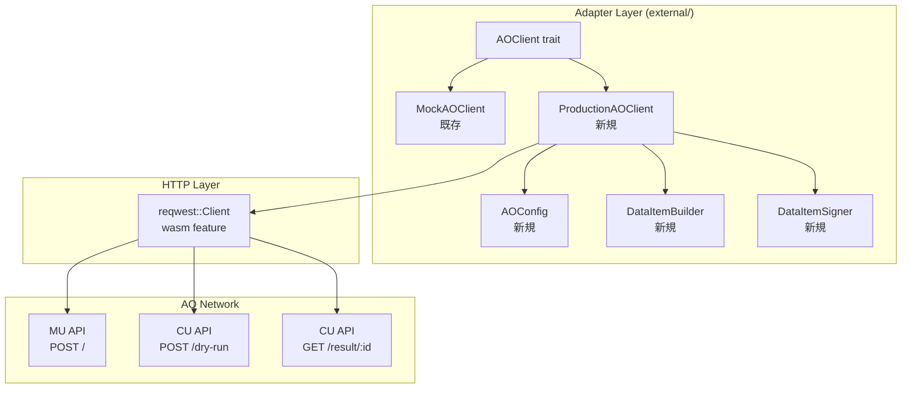
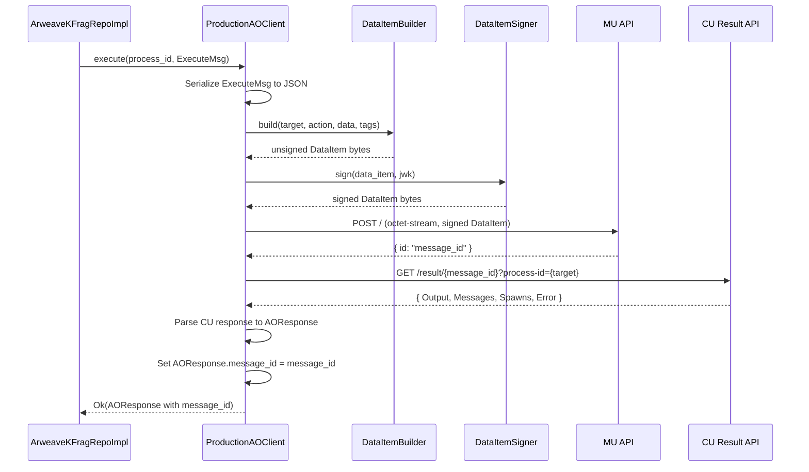
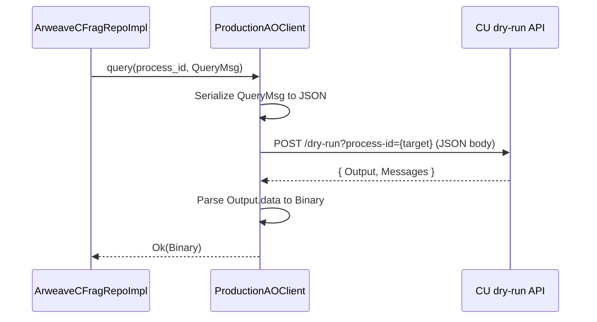

# Design Document: production-ao-client

## Overview

本設計はFORMIXクライアントライブラリの`ProductionAOClient`を実装する。既存のAOClient trait（ao-network-communication specで定義済み）を実装し、MU（Messenger Unit）とCU（Compute Unit）のHTTP APIを通じて実際のAO Networkと通信する。

**設計目標:**
- 既存AOClient traitをそのまま実装（MockAOClientとの差し替え互換性）
- reqwest（wasm feature）によるブラウザWASM対応HTTP通信
- ANS-104 DataItem形式でのAOメッセージ送信
- Arweave JWK署名による認証
- 構成可能なMU/CUエンドポイント
- AOResponseにmessage_idを含めAO Link検証対応
- ArLocal + AO Mainnet両環境でのE2Eテスト

## Steering Document Alignment

### Technical Standards (tech.md)

1. **Clean Architecture（6層構成）準拠**
   - ProductionAOClientはAdapter層の`external/`に配置
   - 既存のAOClient trait（ao-network-communication spec）をそのまま実装
   - Repository実装からの利用パターンは変更なし

2. **Rust 1.86.0 + wasm32-unknown-unknown**
   - reqwest wasm featureでブラウザWASM対応
   - async_traitパターンを継続

3. **エラーハンドリング**
   - 既存AOCommunicationError型を再利用
   - HTTP固有エラーは既存バリアントにマッピング

### Project Structure (structure.md)

新規ファイルの配置：

```
client/src/adapter/external/
├── ao_client.rs                  # 既存（AOClient trait + MockAOClient）
├── ao_message.rs                 # 既存（Message types）
├── production_ao_client.rs       # 新規: ProductionAOClient実装
├── ao_config.rs                  # 新規: AOConfig構造体
├── data_item.rs                  # 新規: DataItem構築・署名
└── mod.rs                        # 変更: 新モジュール公開
```

## Code Reuse Analysis

### Existing Components to Leverage

- **`ao_client.rs`**: AOClient trait - そのまま実装
- **`ao_message.rs`**: ExecuteMsg, QueryMsg, AOResponse, Binary - メッセージ型をそのまま使用
- **`errors.rs`**: AOCommunicationError - エラー型をそのまま使用
- **`kfrag_impl.rs` / `cfrag_impl.rs`**: ArweaveKFragRepository / ArweaveCFragRepository - AOClient generic parameterでProductionAOClientに差し替え

### Integration Points

- **Repository実装**: `ArweaveKFragRepository<C: AOClient>` / `ArweaveCFragRepository<C: AOClient>` のgeneric parameter `C` にProductionAOClientを渡す
- **DIコンテナ**: `client/src/di.rs`でfeature flag `production-ao`に応じてMockまたはProductionを切り替え
- **エラー変換**: 既存の `AOCommunicationError` → `AdapterError` → `DomainError` チェーンをそのまま利用

### New Dependencies (Cargo.toml)

```toml
[dependencies]
reqwest = { version = "0.12", features = ["json"], default-features = false }

[target.'cfg(target_arch = "wasm32")'.dependencies]
reqwest = { version = "0.12", features = ["json"], default-features = false }

[target.'cfg(not(target_arch = "wasm32"))'.dependencies]
reqwest = { version = "0.12", features = ["json", "rustls-tls"], default-features = false }

# DataItem構築に使用（調査結果に基づき選定）
# 候補: bundles-rs, arweave-rs, or minimal self-implementation
rsa = "0.9"             # RSA-PSS署名
sha2 = "0.10"           # SHA-256
base64 = "0.22"         # Base64エンコード
```

## Architecture

### Component Architecture



### Message Flow: execute()



### Message Flow: query() / dry_run()



## Components and Interfaces

### Component 1: AOConfig

- **Purpose:** AO Networkの接続設定を保持する構成構造体
- **Location:** `client/src/adapter/external/ao_config.rs`
- **Interfaces:**
  ```rust
  #[derive(Debug, Clone)]
  pub struct AOConfig {
      mu_url: String,
      cu_url: String,
      gateway_url: String,
      timeout_ms: u64,
  }

  impl AOConfig {
      pub fn new(mu_url: &str, cu_url: &str, gateway_url: &str, timeout_ms: u64) -> Result<Self, AOCommunicationError>;
      pub fn mu_url(&self) -> &str;
      pub fn cu_url(&self) -> &str;
      pub fn gateway_url(&self) -> &str;
      pub fn timeout_ms(&self) -> u64;
  }

  impl Default for AOConfig {
      fn default() -> Self {
          // MU: https://mu.ao-testnet.xyz
          // CU: https://cu.ao-testnet.xyz
          // Gateway: https://arweave.net
          // Timeout: 30000ms
      }
  }
  ```
- **Dependencies:** None (pure data)
- **Reuses:** None

### Component 2: ProductionAOClient

- **Purpose:** AOClient traitの本番実装。MU/CU HTTP APIと通信する
- **Location:** `client/src/adapter/external/production_ao_client.rs`
- **Interfaces:**
  ```rust
  pub struct ProductionAOClient {
      config: AOConfig,
      http_client: reqwest::Client,
      signer: DataItemSigner,
  }

  impl ProductionAOClient {
      pub fn new(config: AOConfig, jwk: ArweaveJWK) -> Result<Self, AOCommunicationError>;
  }

  #[async_trait]
  impl AOClient for ProductionAOClient {
      async fn execute(&self, process_id: &str, msg: ExecuteMsg) -> Result<AOResponse, AOCommunicationError>;
      async fn query(&self, process_id: &str, msg: QueryMsg) -> Result<Binary, AOCommunicationError>;
      async fn dry_run(&self, process_id: &str, msg: ExecuteMsg) -> Result<AOResponse, AOCommunicationError>;
  }
  ```
- **Dependencies:** `reqwest`, `AOConfig`, `DataItemBuilder`, `DataItemSigner`
- **Reuses:** AOClient trait, ExecuteMsg/QueryMsg, AOResponse, AOCommunicationError

### Component 3: DataItemBuilder

- **Purpose:** ExecuteMsg/QueryMsgをANS-104 DataItem形式に変換する
- **Location:** `client/src/adapter/external/data_item.rs`
- **Interfaces:**
  ```rust
  pub struct DataItemBuilder;

  impl DataItemBuilder {
      /// Build an unsigned DataItem from AO message components
      pub fn build_execute(
          target: &str,
          msg: &ExecuteMsg,
      ) -> Result<UnsignedDataItem, AOCommunicationError>;

      /// Build a dry-run request body (JSON, not DataItem)
      pub fn build_dry_run_body(
          target: &str,
          msg: &ExecuteMsg,
      ) -> Result<serde_json::Value, AOCommunicationError>;

      /// Build a dry-run request body for query
      pub fn build_query_body(
          target: &str,
          msg: &QueryMsg,
      ) -> Result<serde_json::Value, AOCommunicationError>;
  }

  pub struct UnsignedDataItem {
      pub target: Vec<u8>,
      pub anchor: Vec<u8>,
      pub tags: Vec<DataItemTag>,
      pub data: Vec<u8>,
  }

  pub struct DataItemTag {
      pub name: String,
      pub value: String,
  }
  ```
- **Dependencies:** `serde_json`, `base64`
- **Reuses:** ExecuteMsg, QueryMsg from ao_message.rs

### Component 4: DataItemSigner

- **Purpose:** DataItemにArweave JWK（RSA-PSS SHA-256）で署名する
- **Location:** `client/src/adapter/external/data_item.rs`（DataItemBuilderと同一ファイル）
- **Interfaces:**
  ```rust
  pub struct ArweaveJWK {
      n: String,   // modulus (base64url)
      e: String,   // exponent (base64url)
      d: String,   // private exponent (base64url)
      // ... other RSA components
  }

  pub struct DataItemSigner {
      jwk: ArweaveJWK,
  }

  impl DataItemSigner {
      pub fn new(jwk: ArweaveJWK) -> Result<Self, AOCommunicationError>;

      /// Sign a DataItem and return the complete signed bytes
      pub fn sign(&self, item: &UnsignedDataItem) -> Result<Vec<u8>, AOCommunicationError>;

      /// Get the owner address (base64url-encoded SHA-256 of public key)
      pub fn owner_address(&self) -> String;
  }
  ```
- **Dependencies:** `rsa`, `sha2`, `base64`
- **Reuses:** None (new crypto implementation)

### Component 5: CU Response Parser

- **Purpose:** CU APIのJSONレスポンスをAOResponse/Binary型に変換する
- **Location:** `client/src/adapter/external/production_ao_client.rs`（ProductionAOClient内のprivateメソッド）
- **Interfaces:**
  ```rust
  // ProductionAOClient内のprivateメソッド
  impl ProductionAOClient {
      /// Parse CU result API response to AOResponse
      fn parse_cu_result(&self, json: &serde_json::Value) -> Result<AOResponse, AOCommunicationError>;

      /// Parse CU dry-run API response to Binary (for query)
      fn parse_cu_dryrun_data(&self, json: &serde_json::Value) -> Result<Binary, AOCommunicationError>;

      /// Parse CU dry-run API response to AOResponse (for dry_run)
      fn parse_cu_dryrun_response(&self, json: &serde_json::Value) -> Result<AOResponse, AOCommunicationError>;
  }
  ```
- **Dependencies:** `serde_json`
- **Reuses:** AOResponse, AOEvent, AOAttribute, Binary from ao_message.rs

## Data Models

### Model 0: AOResponse modification (existing type)

```rust
// ao_message.rs — 既存AOResponseにmessage_idフィールドを追加
#[derive(Debug, Clone, Serialize, Deserialize)]
pub struct AOResponse {
    pub success: bool,
    pub data: Option<Binary>,
    pub events: Vec<AOEvent>,
    /// MU APIから返されたメッセージID（AO Link検証用）
    /// MockAOClientではNone、ProductionAOClientではSome(id)
    pub message_id: Option<String>,
}
```

### Model 1: AOConfig

```rust
#[derive(Debug, Clone)]
pub struct AOConfig {
    mu_url: String,
    cu_url: String,
    gateway_url: String,
    timeout_ms: u64,
}
```

### Model 2: ArweaveJWK

```rust
#[derive(Debug, Clone, Serialize, Deserialize)]
pub struct ArweaveJWK {
    pub kty: String,     // "RSA"
    pub n: String,       // modulus (base64url)
    pub e: String,       // public exponent (base64url)
    #[serde(skip_serializing)]
    pub d: String,       // private exponent (base64url)
    #[serde(skip_serializing)]
    pub p: String,       // first prime factor (base64url)
    #[serde(skip_serializing)]
    pub q: String,       // second prime factor (base64url)
    #[serde(skip_serializing)]
    pub dp: String,      // d mod (p-1) (base64url)
    #[serde(skip_serializing)]
    pub dq: String,      // d mod (q-1) (base64url)
    #[serde(skip_serializing)]
    pub qi: String,      // q^-1 mod p (base64url)
}
```

### Model 3: UnsignedDataItem / SignedDataItem

```rust
pub struct UnsignedDataItem {
    pub target: Vec<u8>,        // 32 bytes (decoded process ID)
    pub anchor: Vec<u8>,        // 32 bytes (random or empty)
    pub tags: Vec<DataItemTag>, // AO-specific tags
    pub data: Vec<u8>,          // Serialized message payload
}

pub struct DataItemTag {
    pub name: String,
    pub value: String,
}

// ANS-104 DataItem binary format (after signing):
// [signature_type: 2 bytes][signature: 512 bytes][owner: 512 bytes]
// [target_present: 1 byte][target: 0 or 32 bytes]
// [anchor_present: 1 byte][anchor: 0 or 32 bytes]
// [num_tags: 8 bytes][tags_bytes_length: 8 bytes][avro-encoded tags]
// [data]
```

### Model 4: CU API Response Structures

```rust
// CU Result API response (internal, for deserialization)
#[derive(Deserialize)]
struct CuResultResponse {
    #[serde(rename = "Output")]
    output: Option<CuOutput>,
    #[serde(rename = "Messages")]
    messages: Option<Vec<CuMessage>>,
    #[serde(rename = "Spawns")]
    spawns: Option<Vec<serde_json::Value>>,
    #[serde(rename = "Error")]
    error: Option<String>,
}

#[derive(Deserialize)]
struct CuOutput {
    data: Option<serde_json::Value>,
    tags: Option<Vec<CuTag>>,
}

#[derive(Deserialize)]
struct CuMessage {
    #[serde(rename = "Target")]
    target: String,
    #[serde(rename = "Tags")]
    tags: Vec<CuTag>,
    #[serde(rename = "Data")]
    data: Option<String>,
}

#[derive(Deserialize)]
struct CuTag {
    name: String,
    value: String,
}
```

## Error Handling

### Error Scenarios

1. **HTTP Connection Error**
   - **Handling:** reqwestのエラーを`AOCommunicationError::ConnectionError`にマッピング
   - **User Impact:** "Connection to AO Network failed: {details}"

2. **HTTP Timeout**
   - **Handling:** reqwestのタイムアウトを`AOCommunicationError::Timeout`にマッピング
   - **User Impact:** "Request timed out after {ms}ms: {operation}"

3. **HTTP 4xx/5xx**
   - **Handling:** HTTPステータスコードに応じたエラーマッピング
     - 404 → `ProcessNotFound`
     - その他 → `ExecutionError`
   - **User Impact:** ステータスコードとレスポンスボディを含むエラーメッセージ

4. **CU Error Field**
   - **Handling:** CUレスポンスのErrorフィールドを`ExecutionError`にマッピング
   - **User Impact:** AO Process実行エラーの詳細

5. **DataItem Serialization Failure**
   - **Handling:** `AOCommunicationError::SerializationError`
   - **User Impact:** メッセージ変換エラーの詳細

6. **JWK Signing Failure**
   - **Handling:** `AOCommunicationError::SerializationError`（署名をシリアライゼーションの一部として扱う）
   - **User Impact:** 署名エラーの詳細（鍵情報は含まない）

### Error Mapping: reqwest → AOCommunicationError

```rust
fn map_reqwest_error(err: reqwest::Error, operation: &str) -> AOCommunicationError {
    if err.is_timeout() {
        AOCommunicationError::Timeout {
            operation: operation.to_string(),
            timeout_ms: self.config.timeout_ms(),
        }
    } else if err.is_connect() {
        AOCommunicationError::ConnectionError {
            details: err.to_string(),
        }
    } else {
        AOCommunicationError::ConnectionError {
            details: format!("{}: {}", operation, err),
        }
    }
}
```

## Testing Strategy

### Unit Testing

ProductionAOClientの単体テストはモックHTTPサーバー（`wiremock` or inlineテスト用のHTTPハンドラー）を使用する。

- **AOConfig Tests**
  - `test_ao_config_default` - デフォルト値の検証
  - `test_ao_config_custom` - カスタム設定の検証
  - `test_ao_config_validation` - バリデーションエラーの検証

- **DataItemBuilder Tests**
  - `test_build_execute_data_item` - ExecuteMsg→DataItem変換
  - `test_build_ao_tags` - AOタグの付与
  - `test_build_all_message_variants` - 全メッセージバリアントの変換

- **DataItemSigner Tests**
  - `test_sign_data_item` - RSA-PSS署名の検証
  - `test_owner_address_derivation` - Ownerアドレス導出
  - `test_invalid_jwk` - 無効JWKの拒否

- **CU Response Parser Tests**
  - `test_parse_cu_result` - resultレスポンスのパース
  - `test_parse_cu_dryrun` - dry-runレスポンスのパース
  - `test_parse_cu_error` - エラーレスポンスのパース

### Integration Testing

- **Mock HTTP Server Tests**（reqwest + wiremock/mockito）
  - `test_execute_sends_to_mu` - MU APIへのPOST検証
  - `test_query_calls_cu_dryrun` - CU dry-run APIの呼び出し検証
  - `test_result_fetch_from_cu` - CU result APIからの結果取得
  - `test_connection_error_handling` - 接続エラー時のエラー型検証
  - `test_timeout_handling` - タイムアウト時のエラー型検証

### E2E Testing (ArLocal + AO Mainnet)

**Stage 1: ArLocal（自動化テスト）**
- `ao/scripts/start.js`でローカルAO環境起動（ArLocal:1984, MU:1995, SU:1996, CU:1997）
- `ao/scripts/deploy.js`でコントラクトWASMデプロイ → Module ID
- `ao/scripts/instantiate.js`でプロセス作成 → Process ID
- ProductionAOClientにローカルエンドポイント設定でE2E実行

**Stage 2: AO Mainnet（手動検証）**
- 同スクリプトでMainnetにデプロイ・インスタンス化
- ProductionAOClient（default config）でexecute()実行
- AOResponse.message_idとprocess_idをコンソール出力
- `https://ao.link/#/message/{message_id}`で手動検証

```rust
// E2E test example (Stage 2: AO Mainnet)
#[tokio::test]
#[ignore] // Manual: requires AO Mainnet deployment
async fn test_e2e_mainnet_execute_returns_message_id() {
    let config = AOConfig::default(); // mainnet endpoints
    let jwk = load_jwk("path/to/wallet.json").unwrap();
    let client = ProductionAOClient::new(config, jwk).unwrap();

    let response = client.execute(PROCESS_ID, msg).await.unwrap();
    let message_id = response.message_id.expect("message_id must be present");
    println!("=== AO Link Verification ===");
    println!("Process ID: {}", PROCESS_ID);
    println!("Message ID: {}", message_id);
    println!("AO Link: https://ao.link/#/message/{}", message_id);
}
```

### DI Integration Testing

```rust
#[tokio::test]
async fn test_repository_with_production_client() {
    let config = AOConfig::default();
    let jwk = test_jwk(); // テスト用JWK
    let production_client = Arc::new(
        ProductionAOClient::new(config, jwk).unwrap()
    );

    let kfrag_repo = ArweaveKFragRepository::new(
        production_client.clone(),
        mock_arweave_client(),
    );

    // Repository操作がProductionAOClient経由で動作することを確認
}
```

## File Modifications Summary

| File | Action | Description |
|------|--------|-------------|
| `client/src/adapter/external/production_ao_client.rs` | Create | ProductionAOClient + CU response parser |
| `client/src/adapter/external/ao_config.rs` | Create | AOConfig構造体 |
| `client/src/adapter/external/data_item.rs` | Create | DataItemBuilder + DataItemSigner + ArweaveJWK |
| `client/src/adapter/external/ao_message.rs` | Modify | AOResponseにmessage_idフィールド追加 |
| `client/src/adapter/external/mod.rs` | Modify | 新モジュール公開 |
| `client/src/di.rs` | Modify | feature flag切り替え |
| `client/Cargo.toml` | Modify | reqwest, rsa, sha2, base64 依存追加 |

## Design Decisions

### Decision 1: reqwest with wasm feature

**選択:** reqwest（wasm feature有効）をHTTPクライアントとして使用

**理由:**
- 既存コードベースのasync_traitパターンと整合性が高い
- ネイティブRust（テスト）とブラウザWASM（本番）の両方に対応
- 広く使われており信頼性が高い

**代替案却下:**
- gloo-net: ネイティブRustでテスト不可
- web-sys fetch直接: ボイラープレート過多

### Decision 2: Separate file for ProductionAOClient

**選択:** `production_ao_client.rs`を新規ファイルとして作成

**理由:**
- ao_client.rsは既に850行以上あり、追加すると管理困難
- Mock/Productionの責務分離が明確

### Decision 3: DataItem minimal self-implementation

**選択:** ANS-104 DataItem構築を最小限自前実装する方向で進め、既存crateが適合すれば活用

**理由:**
- bundles-rsのWASM互換性が未確認
- FORMIXで必要なDataItem操作は限定的（メッセージ送信のみ）
- ANS-104仕様のうちDataItem部分は比較的シンプル

### Decision 4: CU response parser as private methods

**選択:** CUレスポンスパーサーをProductionAOClient内のprivateメソッドとして実装

**理由:**
- CUレスポンス形式はProductionAOClient固有の関心事
- 外部に公開する必要がない
- テストは統合テストでカバー

### Decision 5: feature flag for DI switching

**選択:** `production-ao` feature flagでMock/Production切り替え

**理由:**
- コンパイル時の切り替えでバイナリサイズ最適化
- テスト時は常にMockを使用（デフォルト）
- 本番ビルド時のみreqwest依存を含める
