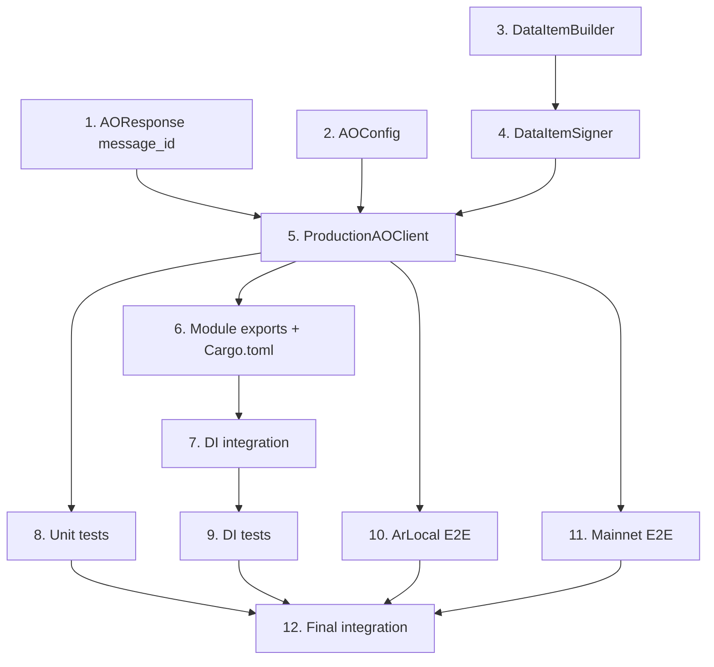

# Tasks Document: production-ao-client

## Overview

ProductionAOClient実装タスク。既存AOClient traitの本番実装を提供し、MU/CU HTTP APIを通じてAO Networkと通信する。AOResponseにmessage_idを追加し、ArLocal + AO MainnetでのE2E検証を行う。

---

- [x] 1. Add message_id field to AOResponse
  - File: `client/src/adapter/external/ao_message.rs`
  - Add `message_id: Option<String>` field to existing AOResponse struct
  - Update all existing AOResponse constructors/usages to include message_id: None
  - Purpose: Enable AO Link verification by exposing MU-returned message ID
  - _Leverage: `client/src/adapter/external/ao_message.rs` existing AOResponse_
  - _Requirements: 2.6_
  - _Prompt: |
      Implement the task for spec production-ao-client, first run spec-workflow-guide to get the workflow guide then implement the task:

      Role: Rust Developer with expertise in backward-compatible API changes
      Task: Add `message_id: Option<String>` field to the existing AOResponse struct in `client/src/adapter/external/ao_message.rs`. Update all existing code that constructs AOResponse to include `message_id: None` (MockAOClient, tests). This field will be set to Some(id) by ProductionAOClient when MU returns a message ID.
      Restrictions: Must maintain backward compatibility. MockAOClient should always return message_id: None. Do not change existing test assertions except to add the new field. Use `#[serde(skip_serializing_if = "Option::is_none")]` for JSON compatibility.
      _Leverage: `client/src/adapter/external/ao_message.rs` for AOResponse definition, `client/src/adapter/external/ao_client.rs` for MockAOClient usages
      _Requirements: 2.6 (message_id in AOResponse)
      Success: AOResponse has message_id field, all existing tests pass with message_id: None, serde serialization/deserialization works.
      Instructions: Before starting, mark this task as in-progress by changing `[ ]` to `[-]` in tasks.md. After completing, use log-implementation tool to record artifacts, then mark as complete `[x]`._

---

- [x] 2. Create AOConfig struct
  - File: `client/src/adapter/external/ao_config.rs`
  - Define AOConfig with MU URL, CU URL, Gateway URL, timeout_ms
  - Implement Default with aoconnect SDK endpoints
  - Implement validation (empty URL check)
  - Purpose: Configurable AO Network connection settings
  - _Leverage: design.md Component 1, `client/src/adapter/external/ao_client.rs` for patterns_
  - _Requirements: 1.1, 1.2, 1.3, 1.4, 1.5_
  - _Prompt: |
      Implement the task for spec production-ao-client, first run spec-workflow-guide to get the workflow guide then implement the task:

      Role: Rust Developer specializing in configuration and validation patterns
      Task: Create `client/src/adapter/external/ao_config.rs` with AOConfig struct. Fields: mu_url, cu_url, gateway_url (all String, private), timeout_ms (u64, private). Implement `new()` constructor with validation (empty URL → ConfigError). Implement `Default` with: MU=`https://mu.ao-testnet.xyz`, CU=`https://cu.ao-testnet.xyz`, Gateway=`https://arweave.net`, timeout=30000ms. Add getter methods. Add builder pattern for optional customization.
      Restrictions: Private fields with getters (entity encapsulation rule). Validate URLs are non-empty. Do not validate URL format beyond empty check. Use AOCommunicationError::ValidationError for config errors.
      _Leverage: design.md AOConfig component, `client/src/adapter/errors.rs` for error types
      _Requirements: 1.1 (fields), 1.2 (default endpoints), 1.3 (timeout), 1.4 (empty MU error), 1.5 (empty CU error)
      Success: AOConfig compiles, default() returns correct endpoints, validation rejects empty URLs, builder pattern works.
      Instructions: Before starting, mark this task as in-progress by changing `[ ]` to `[-]` in tasks.md. After completing, use log-implementation tool to record artifacts, then mark as complete `[x]`._

---

- [x] 3. Create DataItemBuilder and DataItemTag types
  - File: `client/src/adapter/external/data_item.rs`
  - Define UnsignedDataItem, DataItemTag structs
  - Implement DataItemBuilder with build_execute, build_dry_run_body, build_query_body
  - Add AO-specific tags (Data-Protocol, Variant, Type, SDK, Action, Target)
  - Purpose: Convert ExecuteMsg/QueryMsg to ANS-104 DataItem format for MU submission
  - _Leverage: design.md Component 3, ANS-104 spec, `ao_message.rs` for ExecuteMsg/QueryMsg_
  - _Requirements: 3.1, 3.2, 3.3, 3.4, 3.5, 3.6_
  - _Prompt: |
      Implement the task for spec production-ao-client, first run spec-workflow-guide to get the workflow guide then implement the task:

      Role: Rust Developer with expertise in binary serialization and Arweave protocol
      Task: Create `client/src/adapter/external/data_item.rs`. Define UnsignedDataItem struct (target: Vec<u8>, anchor: Vec<u8>, tags: Vec<DataItemTag>, data: Vec<u8>) and DataItemTag struct (name: String, value: String). Implement DataItemBuilder with: build_execute(target, msg) → builds ANS-104 DataItem with AO tags (Data-Protocol: ao, Variant: ao.TN.1, Type: Message, SDK: ao, Action: {msg_variant}, Target: process_id), build_dry_run_body(target, msg) → JSON body for CU dry-run API, build_query_body(target, msg) → JSON body for CU query API. Serialize message payload as JSON data field.
      Restrictions: Do not implement signing in this task (separate task). Use serde_json for JSON serialization. Map each ExecuteMsg variant to its Action tag name (DelegateKFrag, DelegateCapsule, etc.). Return AOCommunicationError::SerializationError on failure.
      _Leverage: design.md DataItemBuilder component, `ao/contracts/src/msg.rs` for message variant names, ANS-104 spec for DataItem binary format
      _Requirements: 3.1 (ANS-104 format), 3.2 (AO tags), 3.3 (DelegateKFrag action), 3.4 (GetCFrag action), 3.5 (Target tag), 3.6 (SerializationError)
      Success: DataItemBuilder creates correctly tagged DataItems for all ExecuteMsg/QueryMsg variants, JSON bodies are valid for CU API.
      Instructions: Before starting, mark this task as in-progress by changing `[ ]` to `[-]` in tasks.md. After completing, use log-implementation tool to record artifacts, then mark as complete `[x]`._

---

- [x] 4. Create DataItemSigner with Arweave JWK support
  - File: `client/src/adapter/external/data_item.rs` (continue)
  - Define ArweaveJWK struct for RSA key material
  - Implement DataItemSigner with RSA-PSS SHA-256 signing
  - Implement ANS-104 signed DataItem binary format assembly
  - Purpose: Sign DataItems with Arweave wallet for MU acceptance
  - _Leverage: design.md Component 4, RSA-PSS spec, ANS-104 binary format_
  - _Requirements: 4.1, 4.2, 4.3, 4.4, 4.5_
  - _Prompt: |
      Implement the task for spec production-ao-client, first run spec-workflow-guide to get the workflow guide then implement the task:

      Role: Rust Developer with expertise in cryptographic signing and Arweave protocol
      Task: Add to `client/src/adapter/external/data_item.rs`: ArweaveJWK struct (RSA key fields: kty, n, e, d, p, q, dp, dq, qi as base64url Strings, with serde skip_serializing for private fields). DataItemSigner struct with new(jwk) constructor (validates JWK format), sign(item) method (assembles ANS-104 binary: [sig_type:2][signature:512][owner:512][target_present:1][target:0|32][anchor_present:1][anchor:0|32][num_tags:8][tags_len:8][avro_tags][data]), owner_address() method (SHA-256 of public key, base64url encoded). Use rsa crate for RSA-PSS SHA-256 signing.
      Restrictions: Do not expose private key material in errors or logs. Validate JWK has all required fields. Use constant-time operations where possible. Return AOCommunicationError::ValidationError for invalid JWK, SerializationError for signing failures.
      _Leverage: design.md DataItemSigner component, `rsa` crate for signing, `sha2` for hashing, `base64` for encoding
      _Requirements: 4.1 (JWK wallet), 4.2 (RSA-PSS SHA-256), 4.3 (signature + owner fields), 4.4 (invalid JWK error), 4.5 (signing failure error)
      Success: DataItemSigner signs DataItems with valid RSA-PSS signatures, owner address is correctly derived, JWK validation works.
      Instructions: Before starting, mark this task as in-progress by changing `[ ]` to `[-]` in tasks.md. After completing, use log-implementation tool to record artifacts, then mark as complete `[x]`._

---

- [x] 5. Implement ProductionAOClient struct and AOClient trait
  - File: `client/src/adapter/external/production_ao_client.rs`
  - Create ProductionAOClient with AOConfig, reqwest::Client, DataItemSigner
  - Implement AOClient trait: execute (MU POST + CU result), query (CU dry-run), dry_run (CU dry-run)
  - Parse CU responses to AOResponse/Binary
  - Set message_id on AOResponse from MU response
  - Purpose: Production AO Network HTTP communication
  - _Leverage: design.md Component 2 + 5, `ao_client.rs` for trait, `ao_config.rs`, `data_item.rs`_
  - _Requirements: 2.1, 2.2, 2.3, 2.4, 2.5, 2.6, 2.7, 2.8, 2.9, 5.1, 5.2, 5.3, 5.4, 5.5_
  - _Prompt: |
      Implement the task for spec production-ao-client, first run spec-workflow-guide to get the workflow guide then implement the task:

      Role: Rust Developer with expertise in async HTTP communication and API integration
      Task: Create `client/src/adapter/external/production_ao_client.rs`. ProductionAOClient struct with config: AOConfig, http_client: reqwest::Client, signer: DataItemSigner. Constructor new(config, jwk) initializes reqwest client with timeout from config. Implement AOClient trait:
      - execute(): serialize ExecuteMsg → DataItemBuilder::build_execute → DataItemSigner::sign → POST to MU (octet-stream) → get message_id from response { id: "..." } → GET CU /result/{message_id}?process-id={target} → parse to AOResponse with message_id set
      - query(): serialize QueryMsg → build CU dry-run JSON body → POST to CU /dry-run?process-id={target} → parse Output.data to Binary
      - dry_run(): serialize ExecuteMsg → build CU dry-run JSON body → POST to CU /dry-run?process-id={target} → parse to AOResponse
      Add private methods: parse_cu_result(json) → AOResponse, parse_cu_dryrun_data(json) → Binary, parse_cu_dryrun_response(json) → AOResponse, map_reqwest_error(err, op) → AOCommunicationError.
      Restrictions: Map reqwest errors: is_timeout → Timeout, is_connect → ConnectionError, 404 → ProcessNotFound, other → ExecutionError. Check CU response Error field → ExecutionError. Do not expose HTTP internals in errors.
      _Leverage: design.md Component 2+5, `reqwest` for HTTP, `serde_json` for parsing
      _Requirements: 2.1 (new), 2.2 (execute MU POST), 2.3 (query CU dry-run), 2.4 (dry_run), 2.5 (CU result fetch), 2.6 (message_id), 2.7 (ConnectionError), 2.8 (Timeout), 2.9 (ExecutionError), 5.1-5.5 (CU response parsing)
      Success: ProductionAOClient implements AOClient trait, HTTP communication works with MU/CU, message_id is captured, errors properly mapped.
      Instructions: Before starting, mark this task as in-progress by changing `[ ]` to `[-]` in tasks.md. After completing, use log-implementation tool to record artifacts, then mark as complete `[x]`._

---

- [x] 6. Update external module exports and Cargo.toml dependencies
  - File: `client/src/adapter/external/mod.rs` (modify)
  - File: `client/Cargo.toml` (modify)
  - Add module declarations for ao_config, data_item, production_ao_client
  - Add reqwest, rsa, sha2, base64 dependencies with appropriate features
  - Purpose: Wire up new modules and dependencies
  - _Leverage: existing mod.rs patterns, design.md dependency section_
  - _Requirements: 1, 2, 3, 4_
  - _Prompt: |
      Implement the task for spec production-ao-client, first run spec-workflow-guide to get the workflow guide then implement the task:

      Role: Rust Developer with expertise in module organization and dependency management
      Task: Update `client/src/adapter/external/mod.rs` to add: `pub mod ao_config;`, `pub mod data_item;`, `#[cfg(feature = "production-ao")] pub mod production_ao_client;`. Re-export key types. Update `client/Cargo.toml` to add dependencies under [features] production-ao = ["reqwest", "rsa", "sha2", "base64"]. Add conditional dependencies: reqwest 0.12 (json feature, no default-features), rsa 0.9, sha2 0.10, base64 0.22. Add target-specific rustls-tls for non-wasm.
      Restrictions: Use feature flag `production-ao` to gate production dependencies. Keep default features minimal. Ensure wasm32 target compatibility.
      _Leverage: existing mod.rs pattern, design.md dependency section
      _Requirements: 1-4 (module structure for all components)
      Success: New modules compile, dependencies resolve, feature flag gates production code correctly.
      Instructions: Before starting, mark this task as in-progress by changing `[ ]` to `[-]` in tasks.md. After completing, use log-implementation tool to record artifacts, then mark as complete `[x]`._

---

- [ ] 7. Integrate ProductionAOClient with DI container
  - File: `client/src/di.rs` (modify)
  - Add feature flag `production-ao` conditional DI registration
  - Switch between MockAOClient (default) and ProductionAOClient
  - Purpose: Enable Mock/Production switching via feature flag
  - _Leverage: existing di.rs pattern, design.md Decision 5_
  - _Requirements: 6.1, 6.2, 6.3_
  - _Prompt: |
      Implement the task for spec production-ao-client, first run spec-workflow-guide to get the workflow guide then implement the task:

      Role: Rust Developer with expertise in dependency injection and feature flags
      Task: Modify `client/src/di.rs` to add conditional AOClient registration. When `production-ao` feature is enabled: create AOConfig (from environment or default), load ArweaveJWK, construct ProductionAOClient, register as Arc<dyn AOClient>. When feature is disabled (default): register MockAOClient as Arc<dyn AOClient>. Ensure KFragRepository and CFragRepository implementations receive the registered AOClient.
      Restrictions: Follow existing DI patterns. Do not hardcode JWK values. Use environment variables or config file for JWK path in production. Keep MockAOClient as default for test ergonomics.
      _Leverage: `client/src/di.rs` existing pattern, design.md Decision 5
      _Requirements: 6.1 (production-ao flag → ProductionAOClient), 6.2 (default → MockAOClient), 6.3 (Repository access)
      Success: DI container correctly switches between Mock/Production based on feature flag, repositories work with both.
      Instructions: Before starting, mark this task as in-progress by changing `[ ]` to `[-]` in tasks.md. After completing, use log-implementation tool to record artifacts, then mark as complete `[x]`._

---

- [ ] 8. Add unit tests for AOConfig, DataItem, Signer, ProductionAOClient
  - File: `client/src/adapter/external/ao_config.rs` (tests module)
  - File: `client/src/adapter/external/data_item.rs` (tests module)
  - File: `client/src/adapter/external/production_ao_client.rs` (tests module)
  - Write unit tests using mock HTTP server (wiremock)
  - Purpose: Verify all components work correctly in isolation
  - _Leverage: existing test patterns, wiremock for HTTP mocking_
  - _Requirements: 1.1-1.5, 2.1-2.9, 3.1-3.6, 4.1-4.5, 5.1-5.5_
  - _Prompt: |
      Implement the task for spec production-ao-client, first run spec-workflow-guide to get the workflow guide then implement the task:

      Role: QA Engineer with expertise in Rust unit testing and HTTP mocking
      Task: Add #[cfg(test)] mod tests to each file:
      - ao_config.rs: test_ao_config_fields, test_ao_config_default_endpoints, test_ao_config_custom_timeout, test_ao_config_invalid_mu_url, test_ao_config_invalid_cu_url, test_ao_config_custom_endpoints, test_ao_config_builder_pattern
      - data_item.rs: test_execute_msg_to_data_item, test_data_item_ao_tags, test_delegate_kfrag_data_item, test_get_cfrag_data_item, test_data_item_target_tag, test_data_item_serialization_error, test_data_item_rsa_pss_signature, test_signed_data_item_fields, test_invalid_jwk_format, test_owner_address_derivation
      - production_ao_client.rs: test_production_ao_client_new, test_production_ao_client_execute (wiremock MU+CU), test_production_ao_client_query, test_production_ao_client_dry_run, test_production_ao_client_result_fetch, test_production_ao_client_message_id_in_response, test_production_ao_client_connection_error, test_production_ao_client_timeout, test_production_ao_client_execution_error, test_production_ao_client_implements_ao_client_trait
      Restrictions: Use #[tokio::test] for async tests. Use wiremock for HTTP server mocking. Do not make real network calls. Test both success and error paths.
      _Leverage: existing test patterns in ao_client.rs, wiremock crate
      _Requirements: All AC from Requirements 1-5
      Success: All unit tests pass, coverage includes success/error/validation paths.
      Instructions: Before starting, mark this task as in-progress by changing `[ ]` to `[-]` in tasks.md. After completing, use log-implementation tool to record artifacts, then mark as complete `[x]`._

---

- [ ] 9. Add DI integration tests
  - File: `client/src/di.rs` (tests module)
  - Test feature flag switching between Mock and Production
  - Test repository access with ProductionAOClient
  - Purpose: Verify DI wiring works correctly
  - _Leverage: existing DI test patterns_
  - _Requirements: 6.1, 6.2, 6.3_
  - _Prompt: |
      Implement the task for spec production-ao-client, first run spec-workflow-guide to get the workflow guide then implement the task:

      Role: QA Engineer with expertise in integration testing and DI containers
      Task: Add tests to `client/src/di.rs`: test_di_production_ao_client (verify ProductionAOClient registration with production-ao feature), test_di_mock_ao_client_default (verify MockAOClient is default), test_di_repository_with_production_client (verify KFragRepository/CFragRepository work with ProductionAOClient).
      Restrictions: Use cfg(feature = "production-ao") for feature-gated tests. Mock HTTP server for production client tests.
      _Leverage: existing DI test patterns
      _Requirements: 6.1-6.3
      Success: DI tests verify correct client registration and repository access.
      Instructions: Before starting, mark this task as in-progress by changing `[ ]` to `[-]` in tasks.md. After completing, use log-implementation tool to record artifacts, then mark as complete `[x]`._

---

- [ ] 10. Create ArLocal E2E integration tests (Stage 1)
  - File: `client/tests/e2e_arlocal.rs` (new integration test file)
  - E2E tests against local AO environment (ArLocal + cwao-units)
  - Test execute, query, dry_run with real AO process
  - Purpose: Verify ProductionAOClient works with actual AO processes
  - _Leverage: `ao/scripts/` for environment setup, `ao/contracts/src/msg.rs` for message types_
  - _Requirements: 7.1, 7.2, 7.3, 7.4, 7.5, 7.6, 7.7_
  - _Prompt: |
      Implement the task for spec production-ao-client, first run spec-workflow-guide to get the workflow guide then implement the task:

      Role: QA Engineer with expertise in E2E testing and AO Network integration
      Task: Create `client/tests/e2e_arlocal.rs` with #[ignore] E2E tests that require local AO environment. Tests:
      - test_e2e_execute_to_local_mu: Send ExecuteMsg to local MU (localhost:1995)
      - test_e2e_delegate_kfrag_accepted: DelegateKFrag is accepted by AO process
      - test_e2e_delegate_capsule_reencryption: DelegateCapsule triggers reencryption pipeline
      - test_e2e_get_cfrag_query: GetCFrag query returns cFrag data via CU dry-run
      - test_e2e_list_capsules_pagination: ListCapsulesByKFrag returns paginated results
      - test_e2e_response_format_compatibility: Response format matches MockAOClient
      - test_e2e_invalid_process_error: Non-existent process returns appropriate error
      - test_e2e_full_kfrag_delegation_flow: Full flow kFrag→store→cFrag→retrieve
      - test_e2e_idempotency: Duplicate message handling
      Configure AOConfig with localhost endpoints (MU:1995, CU:1997).
      Restrictions: All tests must be #[ignore] (require manual environment setup). Use --test-threads=1 for sequential execution. Document setup steps in comments. Use test JWK wallet.
      _Leverage: `ao/scripts/start.js`, `ao/scripts/deploy.js`, `ao/scripts/instantiate.js`, `ao/test/utils.js` for environment setup
      _Requirements: 7.1-7.7 (Stage 1 ArLocal AC)
      Success: All E2E tests pass when local AO environment is running.
      Instructions: Before starting, mark this task as in-progress by changing `[ ]` to `[-]` in tasks.md. After completing, use log-implementation tool to record artifacts, then mark as complete `[x]`._

---

- [ ] 11. Create AO Mainnet E2E verification tests (Stage 2)
  - File: `client/tests/e2e_mainnet.rs` (new integration test file)
  - E2E tests against AO Mainnet with message_id/process_id output
  - Console output for AO Link manual verification
  - Purpose: Verify ProductionAOClient works on AO Mainnet with AO Link inspection
  - _Leverage: `ao/scripts/deploy.js`, `ao/scripts/instantiate.js`, AOConfig::default()_
  - _Requirements: 7.8, 7.9, 7.10_
  - _Prompt: |
      Implement the task for spec production-ao-client, first run spec-workflow-guide to get the workflow guide then implement the task:

      Role: QA Engineer with expertise in production verification and AO Network
      Task: Create `client/tests/e2e_mainnet.rs` with #[ignore] tests for AO Mainnet verification. Tests:
      - test_e2e_mainnet_deploy_and_instantiate: Verify deploy + instantiate via ao/ scripts produce valid Module ID and Process ID
      - test_e2e_mainnet_execute_returns_message_id: Execute message on Mainnet, verify AOResponse contains message_id
      - test_e2e_mainnet_ao_link_verification: Execute message, print message_id and process_id to console for AO Link verification
      - test_e2e_mainnet_full_flow: Full flow on Mainnet with AO Link URLs printed
      Each test should println! the AO Link URL: `https://ao.link/#/message/{message_id}` and `https://ao.link/#/entity/{process_id}`.
      Use AOConfig::default() for Mainnet endpoints.
      Restrictions: All tests must be #[ignore]. Require real Arweave wallet. Document wallet setup in comments. Print clear verification instructions to stdout.
      _Leverage: AOConfig::default() for mainnet endpoints, `ao/scripts/` for deployment
      _Requirements: 7.8 (Mainnet deploy), 7.9 (message_id return), 7.10 (AO Link verification)
      Success: Tests execute on Mainnet, message_id is captured, AO Link URLs are printed for manual verification.
      Instructions: Before starting, mark this task as in-progress by changing `[ ]` to `[-]` in tasks.md. After completing, use log-implementation tool to record artifacts, then mark as complete `[x]`._

---

- [x] 12. Final integration: make check, make lint, make test
  - Run `make check`, `make lint`, `make test`
  - Fix any compilation errors or warnings
  - Verify all modules properly export types
  - Verify feature flag gating works correctly
  - Purpose: Ensure all code compiles and tests pass
  - _Leverage: Makefile commands_
  - _Requirements: All_
  - _Prompt: |
      Implement the task for spec production-ao-client, first run spec-workflow-guide to get the workflow guide then implement the task:

      Role: Senior Rust Developer with expertise in code quality and CI/CD
      Task: Run `make check` to verify compilation (both default and --features production-ao). Run `make lint` to ensure no clippy warnings. Run `make test` to run all unit tests. Run `cargo test --features production-ao` to verify production feature compiles. Fix any issues found. Verify all new types are properly exported. Check backward compatibility with existing ao-network-communication spec code.
      Restrictions: Do not ignore warnings. Fix all clippy suggestions. Ensure MockAOClient behavior unchanged. Existing tests must still pass.
      _Leverage: Makefile, existing code patterns
      _Requirements: All requirements should be satisfied
      Success: `make check` passes, `make lint` passes, `make test` passes, `cargo test --features production-ao` passes.
      Instructions: Before starting, mark this task as in-progress by changing `[ ]` to `[-]` in tasks.md. After completing, use log-implementation tool to record artifacts, then mark as complete `[x]`._

---

## Task Dependencies

## Summary

| Task | Files | Requirements |
|------|-------|--------------|
| 1 | ao_message.rs | 2.6 |
| 2 | ao_config.rs | 1.1-1.5 |
| 3 | data_item.rs | 3.1-3.6 |
| 4 | data_item.rs | 4.1-4.5 |
| 5 | production_ao_client.rs | 2.1-2.9, 5.1-5.5 |
| 6 | mod.rs, Cargo.toml | 1-4 |
| 7 | di.rs | 6.1-6.3 |
| 8 | (test modules) | 1-5 |
| 9 | di.rs (tests) | 6.1-6.3 |
| 10 | e2e_arlocal.rs | 7.1-7.7 |
| 11 | e2e_mainnet.rs | 7.8-7.10 |
| 12 | (verification) | All |
