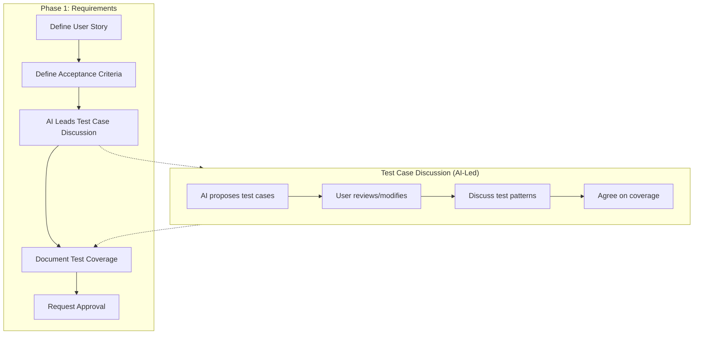

# SDD Workflow Guide: Test-Driven Specification

## Overview

This document defines the enhanced Specification-Driven Development (SDD) workflow that incorporates Test-Driven Development (TDD) principles. The key enhancement is the **Test Case Discussion Phase** that occurs during requirements definition.

## Workflow Enhancement



## Test Case Discussion Protocol

### 1. When to Initiate Discussion

AI MUST initiate test case discussion:
- After defining each Requirement's Acceptance Criteria
- Before moving to the next Requirement
- Before requesting approval for requirements.md

### 2. AI-Led Discussion Format

```markdown
## Test Case Discussion for Requirement X

Based on the Acceptance Criteria defined above, I propose the following test cases:

### Proposed Tests

| AC# | Test Function | Purpose | Pattern |
|-----|---------------|---------|---------|
| 1 | `test_xxx_valid` | Verify successful creation | Success |
| 2 | `test_xxx_error` | Verify error on invalid input | Validation |

### Discussion Points

1. **Success Path Coverage**
   - AC1 is covered by `test_xxx_valid`
   - Do you want additional success scenarios?

2. **Error Handling Coverage**
   - AC2 is covered by `test_xxx_error`
   - Should we add more error cases? (e.g., empty data, boundary values)

3. **Edge Cases**
   - I recommend adding: `test_xxx_boundary_case`
   - Are there other edge cases to consider?

4. **Security Considerations**
   - If sensitive data is involved: `test_xxx_debug_redacted`
   - Any other security tests needed?

### Questions for You

- [ ] Are the proposed test names clear and consistent?
- [ ] Do you want to add integration tests?
- [ ] Should we include performance-related tests?
- [ ] Any domain-specific tests to add?
```

### 3. Required Discussion Topics

For each Requirement, AI MUST cover:

1. **Success Path Tests**
   - At least one test per "WHEN...THEN" AC
   - Verify all getters return expected values

2. **Validation/Error Tests**
   - At least one test per error condition
   - Boundary value testing (0, max, max+1)
   - Empty/null data handling

3. **State Machine Tests** (if applicable)
   - Valid state transitions
   - Invalid state transition rejection
   - State persistence verification

4. **Security Tests** (if sensitive data)
   - Debug output redaction
   - Zeroize implementation (indirect via Debug)
   - Clone prevention (compile-time)

5. **Additional Tests**
   - Query/retrieval operations
   - Mutation operations with persistence
   - Integration points

## Test Naming Convention

```
test_{component}_{action}_{expected_outcome}
```

### Examples

| Pattern | Example | Description |
|---------|---------|-------------|
| Success | `test_secret_new_valid` | Valid creation |
| Validation | `test_secret_new_invalid_threshold_zero` | Reject k=0 |
| State | `test_secret_split_transition` | State change |
| Security | `test_kfrag_debug_redacted` | Data hiding |
| Query | `test_collection_get_share` | Retrieval |
| Mutation | `test_capsule_set_arweave_tx_id` | Setter |

## Test Coverage Requirements

### Minimum Coverage

- **Critical Path**: 100% AC coverage
- **Error Handling**: 1 test per error type
- **Security**: Debug redaction for sensitive data
- **State Machine**: All valid transitions + at least 1 invalid

### Coverage Tracking

Each Requirement MUST include:

```markdown
#### Test Coverage

| AC# | Test Function(s) | Status |
|-----|------------------|--------|
| 1 | `test_xxx_valid` | ✅ |
| 2 | `test_xxx_error` | ✅ |
| 3 | `test_xxx_zeroize` | ⚠️ Indirect |
```

### Summary Section

requirements.md MUST end with:

```markdown
## Test Coverage Summary

| Requirement | Total AC | Covered | Partial | Missing |
|-------------|----------|---------|---------|---------|
| 1. Name | 4 | 4 | 0 | 0 |
| 2. Name | 5 | 3 | 1 | 1 |
| **Total** | **9** | **7** | **1** | **1** |

**Coverage Rate: 77.8%**
```

## Integration with SDD Phases

### Phase 1: Requirements (Enhanced)

1. Define Introduction and Alignment
2. For each Requirement:
   a. Define User Story
   b. Define Acceptance Criteria
   c. **NEW: AI leads Test Case Discussion**
   d. **NEW: Document Test Coverage table**
3. Define Non-Functional Requirements
4. **NEW: Complete Test Coverage Summary**
5. Request Approval

### Phase 2: Design

- Reference Test Coverage from requirements.md
- Include test considerations in Testing Strategy section
- Map tests to components being designed

### Phase 3: Tasks

- Include test implementation in task breakdown
- Reference test functions in task descriptions
- Mark test implementation as part of task completion

### Phase 4: Implementation

- Implement tests alongside code
- Verify Test Coverage table accuracy
- Update requirements.md if new tests are added
- Log test implementations in implementation-log

## Example Discussion Flow

```
AI: "I've defined AC1-4 for the Secret Entity. Here are my proposed tests:

| AC# | Test Function | Purpose |
|-----|---------------|---------|
| 1 | `test_secret_new_valid` | Verify successful creation with Initialized state |
| 2 | `test_secret_new_invalid_threshold_zero` | Reject k=0 |
| 2 | `test_secret_new_invalid_k_greater_than_n` | Reject k>n |
| 3 | `test_secret_split_transition` | Verify state change to Split |
| 4 | `test_secret_capsule_id` | Verify capsule_id getter |

Questions:
1. Should we add a test for empty owner_public_key?
2. Do you want state machine tests for invalid transitions?
3. Any other edge cases to consider?"

User: "Yes, add empty public key test. Also add distribute() tests."

AI: "Understood. I'll add:
- `test_secret_new_empty_public_key` - Reject empty owner_public_key
- `test_secret_distribute_transition` - Verify Split → Distributed
- `test_secret_distribute_wrong_kfrag_count` - Reject mismatched count

Updated Test Coverage table:
..."
```

## Conclusion

This TDD-integrated SDD workflow ensures:
1. Test cases are designed at specification time, not implementation time
2. AI leads structured discussions to identify comprehensive test coverage
3. Test-AC mapping is explicit and trackable
4. Coverage gaps are identified early in the development cycle
