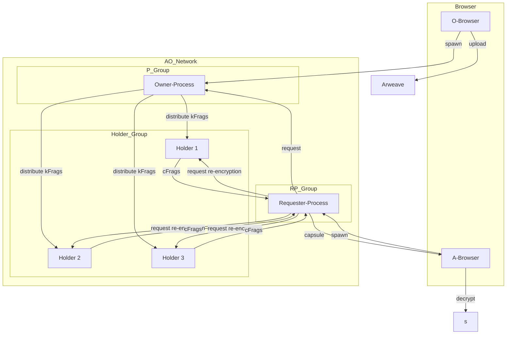

# FORMIX

**決定論的閾値プロキシ再暗号化システム**

[](https://www.rust-lang.org/)
[](https://doc.rust-lang.org/edition-guide/)
[](https://www.arweave.org/)
[](https://ao.arweave.net/)

[English](README.md)

Arweave上の暗号化データに対する安全でパーミッションレスなアクセス制御を実現する、分散型鍵管理システムです。閾値プロキシ再暗号化（TPRE）を実装しています。

## 概要

FORMIXは2つのインフラストラクチャレイヤーを組み合わせた分散型鍵管理システムです:

- **Arweave**: 暗号化データとカプセルの永続ストレージ
- **AO Network**: WebAssemblyベースの分散実行環境

データオーナーがArweave上にデータを暗号化・保存し、認可されたユーザーがk-of-n閾値プロキシ再暗号化によって復号できます。永続的な鍵管理サーバーは不要です。

## 主な特徴

### 閾値プロキシ再暗号化 (TPRE)
- Umbral PREライブラリによる暗号操作
- Shamirの秘密分散法によるk-of-n分散秘密共有
- 鍵管理における単一障害点なし

### 完全な分散化
- **パーミッションレス**: k-of-n閾値暗号がアクセス条件を決定論的に定義
- **ステートレス**: すべてのプロセスはエフェメラルで再作成可能
- **トラストレス**: 中央集権的な鍵サーバーなしの暗号アクセス制御

### マルチロールWebAssemblyアーキテクチャ
単一のRustコードベースがWebAssemblyにコンパイルされ、AO上で異なるロールで動作:
- **Owner-Process (P^O)**: 秘密鍵シェアの管理と再暗号化鍵の生成
- **Holder-Process (Hj)**: 鍵フラグメントの保存と再暗号化の実行
- **Requester-Process (R-Proc)**: アクセス要求の調整と暗号フラグメントの収集

## コンセプト図


## アーキテクチャ



## 暗号フロー

3つのフェーズで動作します:

### Phase 1: 秘密分割と初期配布（クライアント側）
- 1.1: オーナーがShamir秘密分散シェアを生成 (k-of-n)
- 1.2: Umbralカプセルを作成し、kFrag（再暗号化鍵フラグメント）を生成
- 1.3: 暗号化データとカプセルをArweaveに保存

### Phase 2: 鍵フラグメント分散管理（AO Network）
- 2.1: Owner-ProcessがHolderを選択し、kFragを配布
- 2.2: Holder-ProcessがkFragを保存し、プロキシ再暗号化を実行
- 2.3: cFragの生成と保存

### Phase 3: 秘密復元（クライアント側）
- 3.1: Requester-ProcessがHolderからcFragを収集
- 3.2: カプセル復号とフラグメント結合
- 3.3: Shamir補間による元の秘密の復元

## 使い方

### インストール

`Cargo.toml` に追加:

```toml
[dependencies]
formix = { version = "0.1" }
tokio = { version = "1", features = ["rt", "macros"] }
```

デフォルトでは `FormixClient` はローカル開発用のモックAOバックエンドを使用します。
本番AO Networkに接続する場合は `features = ["production-ao"]` を追加してください（[本番セットアップ](#本番セットアップ)参照）。

### クイックスタート（ローカル開発）

モックバックエンドを使用すると、外部サービスなしでPhase 1のワークフロー全体をローカルでテストできます。

```rust
use std::sync::Arc;

use formix::actions::FormixClient;
use formix::adapter::external::mock_ao::MockAOClient;
use formix::usecase::core::contract_storage::ContractStorageImpl;
use formix::usecase::core::storage::ArweaveStorageServiceImpl;

#[tokio::main(flavor = "current_thread")]
async fn main() -> Result<(), Box<dyn std::error::Error>> {
    // 1. モックストレージでクライアントを作成
    let mock_ao = Arc::new(MockAOClient::new());
    let arweave = Arc::new(ArweaveStorageServiceImpl::default());
    let contract = Arc::new(ContractStorageImpl::new(mock_ao));

    let client = FormixClient::with_storage(
        "my_process".to_string(),
        "my_wallet".to_string(),
        "https://ao.arweave.net".to_string(),
        "https://arweave.net".to_string(),
        arweave,
        contract,
    );

    // 2. 鍵ペアを生成
    let (owner_sk, owner_pk) = client.generate_keypair()?;
    let (_, requester_pk) = client.generate_keypair()?;

    // 3. 3-of-5閾値で秘密を共有
    let result = client.share()
        .secret(b"Hello, FORMIX!".to_vec())
        .threshold(3)            // k: 復元に必要な最小シェア数
        .total_shares(5)         // n: 生成するシェアの総数
        .owner_key(owner_sk)     // ムーブされる — 以降使用不可
        .requester_key(requester_pk)
        .execute()               // async
        .await?;

    println!("Secret ID:   {}", result.secret_id.as_str());
    println!("Capsule TX:  {}", result.capsule_tx_id);
    println!("kFrag count: {}", result.kfrag_count);

    Ok(())
}
```

リポジトリに実行可能なサンプルが含まれています:

```bash
cargo run --example basic_usage
```

> **モックバックエンドの制限**: Phase 1（share）はインメモリで完全に動作します。
> Phase 3（recover）はAO HolderプロセスからのcFragが必要なため、
> モックバックエンドでは `recover()` は `ResourceNotFound` を返します。

### 本番セットアップ

#### 1. FORMIX WASMモジュールのデプロイとプロセスのspawn

FORMIXのAOプロセスは [cwao](https://github.com/nicholasgasior/cwao)（CosmWasm on AO）を使用します。`ao/` ディレクトリのスクリプトを使います:

```bash
cd ao
yarn install

# ウォレット生成（未作成の場合）
yarn keygen my-wallet

# WASMモジュールをArweaveにデプロイ → module_idが出力される
yarn deploy --wallet my-wallet

# AOプロセスをspawn → process_idが出力される
yarn instantiate --wallet my-wallet --module_id <MODULE_ID> --scheduler <SCHEDULER_ADDRESS>
```

#### 2. 設定ファイルの作成

**`deploy.json`** — ステップ1で取得したIDを記載（[サンプル](deploy.example.json)):

```json
{
  "module_id": "MODULE_ID_FROM_DEPLOY",
  "process_id": "PROCESS_ID_FROM_INSTANTIATE",
  "gateways": {
    "ao_mu": "https://mu.ao-testnet.xyz",
    "ao_cu": "https://cu.ao-testnet.xyz",
    "arweave": "https://arweave.net"
  }
}
```

`gateways` フィールドは省略可能です。省略時はtestnetのデフォルト値が使われます。

**`wallet.json`** — Arweave JWKウォレットファイル（ステップ1で使用したものと同じ。`ao/.cwao/accounts/<name>.json` に生成されます）

#### 3. 本番クライアントの初期化

```rust
use formix::actions::ProductionFormixClient;

let client = ProductionFormixClient::from_deploy_file(
    "deploy.json",
    "wallet.json",
)?;
```

### APIリファレンス

#### `generate_keypair()` — 鍵ペア生成

```rust
let (secret_key, public_key) = client.generate_keypair()?;
```

Umbral PRE鍵ペアを返します。オーナーとリクエスターのロールには別々のペアを使用してください。

#### `share()` — Phase 1: 秘密の分割と配布

```rust
let (owner_sk, owner_pk) = client.generate_keypair()?;
let (_, requester_pk) = client.generate_keypair()?;

let result = client.share()
    .secret(b"my secret data".to_vec())
    .threshold(3)            // k: 復元に必要な最小シェア数
    .total_shares(5)         // n: 生成するシェアの総数
    .owner_key(owner_sk)     // オーナーの秘密鍵（ムーブされる）
    .requester_key(requester_pk)
    .execute()               // async
    .await?;

// result.secret_id   — 復元時に使用するID
// result.kfrag_count — 配布された鍵フラグメント数
```

#### `recover()` — Phase 3: 秘密の復元

```rust
let recovered = client.recover()
    .secret_id(&secret_id)        // share結果のSecretId
    .requester_key(requester_sk)  // リクエスターの秘密鍵（ムーブされる）
    .owner_key(owner_pk)          // オーナーの公開鍵
    .execute()                    // async
    .await?;

// recovered.recovered_secret — 元のバイト列（ドロップ時にZeroize）
```

### エラーハンドリング

すべての操作は `Result<T, ActionError>` を返します。主なエラーバリアント:

```rust
use formix::actions::ActionError;

match result {
    Ok(value) => { /* 成功 */ }
    Err(ActionError::ValidationFailed { code, message }) => {
        // 入力バリデーション失敗（空の秘密、無効な閾値など）
    }
    Err(ActionError::CryptoError { message }) => {
        // 暗号操作の失敗
    }
    Err(ActionError::ResourceNotFound { resource }) => {
        // 秘密またはプロセスが見つからない
    }
    Err(ActionError::WorkflowFailed { message }) => {
        // ワークフロー実行の失敗（ストレージ、ネットワークなど）
    }
    Err(ActionError::PartialStorageFailure { .. }) => {
        // 一部のシェアストレージ操作が失敗（Arweaveは不変、ロールバック不可）
    }
}
```

### 重要な注意事項

- **`SecretKey` はムーブ専用**: `Zeroize + ZeroizeOnDrop` を実装し、`Clone` は実装**していません**。`owner_key()` や `requester_key()` に渡すと再利用できません。各ロールに別々の鍵ペアを生成してください。
- **`PublicKey` はクローン可能**: 公開鍵は自由にコピー・共有できます。
- **閾値の範囲**: `2 <= threshold <= total_shares <= 20`。この範囲外の値は `ValidationFailed` を返します。
- **非同期実行**: `share().execute()` と `recover().execute()` は `async` です。tokioランタイムが必要です。
- **メモリ安全性**: `SecretRecoveryResult.recovered_secret` はドロップ時に自動的にゼロ化されます。

### 環境変数

本番デプロイでは、ゲートウェイURLを `deploy.json` で設定するか、AOクライアント構築時に直接指定できます:

| 変数 | デフォルト | 説明 |
|------|---------|------|
| `ao_mu` | `https://mu.ao-testnet.xyz` | AO Messenger Unit URL |
| `ao_cu` | `https://cu.ao-testnet.xyz` | AO Compute Unit URL |
| `arweave` | `https://arweave.net` | Arweaveゲートウェイ URL |

これらは `deploy.json` の `gateways` フィールドで設定します。タイムアウトのデフォルトは30,000msです。

### Feature Flags

| Feature | 説明 |
|---------|------|
| *(デフォルト)* | ローカル開発・テスト用のモックAOバックエンド |
| `production-ao` | HTTP経由の本番AO Network接続（MU/CUエンドポイント） |

## 開発

### 前提条件

- Rust 1.86.0（`rust-toolchain.toml` で管理）
- Make

### コマンド

```bash
# コンパイルチェック
make check

# コードフォーマット
make fmt

# リンター実行
make clippy

# フォーマット + リント
make lint

# テスト実行
make test

# 全チェック実行
make all
```

## 技術スタック

| コンポーネント | 技術 | 用途 |
|------------|------|------|
| 暗号 | `umbral-pre`, `sssa`, `aes-gcm` | 閾値PRE、秘密分散、暗号化 |
| ランタイム | AO + HyperBEAM | WebAssembly実行環境 |
| ストレージ | Arweave, ao-sqlite | データと状態の永続化 |
| フロントエンド | WebCrypto API | ブラウザベースの鍵生成と暗号処理 |
| デプロイ | ao-deploy | Arweaveプロセスのデプロイ |

## セキュリティ

### セキュリティ特性
- **機密性**: 離散対数問題に基づくIND-CPAセキュリティ (X25519, 128-bit)
- **閾値耐障害性**: Shamir(k,n)分散によりk-1ノード障害に耐性
- **共謀耐性**: 鍵の再構築にはkフラグメントが必要
- **非転送性**: 再暗号化鍵は特定の公開鍵にバインド
- **前方秘匿性**: エフェメラルプロセスと即時鍵消去

### セキュリティ前提
- TPRE (Umbral) セキュリティ: RLWE 128-bit / ECC X25519
- AES-GCM 128-bit 対称暗号
- Ed25519 署名によるメッセージ完全性
- Umbral研究論文による形式的セキュリティ証明 (Bermudez et al.)

## 現在のステータス

**全体進捗**: 45% — Phase 1 (MVP) 開発中。ドメイン層完了、サービス層ほぼ実装済み、アクション/コントローラー実装済み、60テスト通過。

| コンポーネント | 状態 | 備考 |
|------------|------|------|
| プロジェクト構成 | ✅ | ドキュメント、コード構成、CI/CD基盤 |
| Rustツールチェーン | ✅ | バージョン1.86.0、Edition 2024 |
| コアアーキテクチャ | ✅ | マルチロールWebAssembly設計、レイヤードアーキテクチャ |
| ドメイン層 | ✅ | エンティティ5種 (Secret, Capsule, KFrag, CFrag, ShareCollection)、値オブジェクト、リポジトリインターフェース |
| 暗号サービス | ✅ | Shamir SSS、Umbral PRE、kFrag/cFrag生成・復号、全テスト通過 |
| ストレージサービス | ✅ | ArweaveStorageService + ContractStorage (AO) 実装済み |
| ワークフローサービス | ✅ | SecretSharingWorkflow + SecretRecoveryWorkflow 実装済み |
| アプリケーション層 | ✅ | Actions (share, recover, generateKeyPair)、Controller (validators, extractors) |
| インフラ層 | 🟡 | ArweaveClient、AOClient (Production + Mock)、リポジトリ実装 |
| ブラウザフロントエンド | ⬜️ | WebCrypto API統合を予定 |
| テスト | 🟡 | 60テスト通過（ユニット + 統合）、カバレッジ拡大を予定 |

凡例: ✅ 完了 / 🟡 進行中 / ⬜️ 未着手

## ドキュメント

- [製品要件定義書](docs/PRD.md) - システム要件と仕様の詳細
- [開発ステータス](docs/status.md) - 進捗とマイルストーン
- [アーキテクチャ](docs/architecture/) - システムアーキテクチャと設計思想
- **クライアントライブラリ** (`docs/client/`)
  - [Domain](docs/client/domain.md) - エンティティ、値オブジェクト、エラー型
  - [Repositories](docs/client/repositories.md) - リポジトリインターフェース
  - [UseCase](docs/client/usecase.md) - Core / Service / Workflow レイヤー
  - [Controller](docs/client/controller.md) - バリデーター、エクストラクター
  - [Actions](docs/client/actions.md) - 公開API、ビルダー、DIコンテナ
  - [Adapter](docs/client/adapter.md) - Arweave/AOインフラ
- **AOコントラクト** - [概要](docs/contracts/contracts_overview.md)

## コントリビューション

1. Rust 1.86.0 をインストール
2. `make all` でセットアップを確認
3. 既存のコード規約とフォーマットルールに従う
4. すべてのコントリビューションはリントとテストに通過する必要あり

## ライセンス

MIT — [LICENSE](LICENSE) を参照

## 謝辞

以下の技術を基盤として構築:
- [Umbral Proxy Re-Encryption](https://github.com/nucypher/umbral-pre)
- [Arweave](https://www.arweave.org/) 永続ストレージ
- [AO Network](https://ao.arweave.net/) 分散コンピュート
