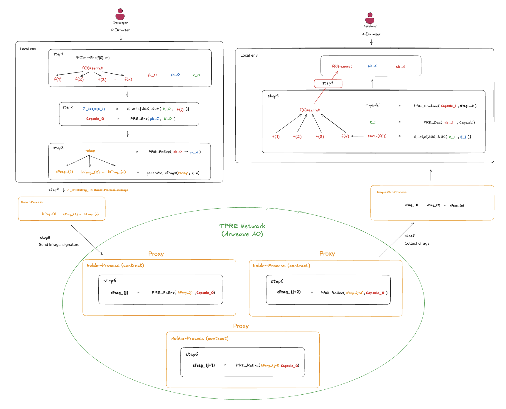
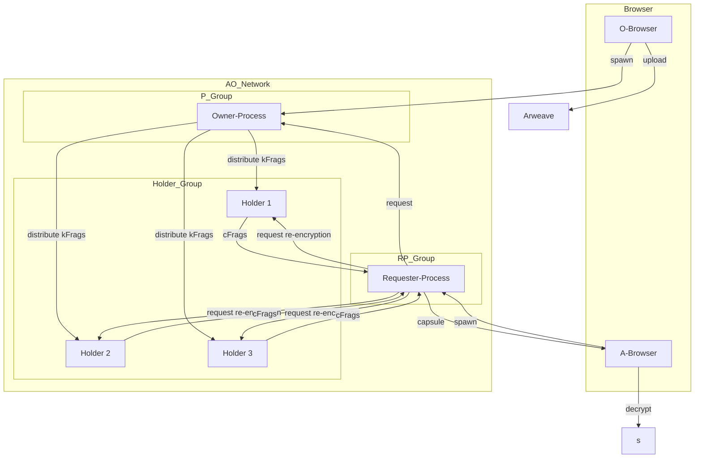

# FORMIX

**Deterministic Threshold Proxy Re-Encryption System**

[](https://www.rust-lang.org/)
[](https://doc.rust-lang.org/edition-guide/)
[](https://www.arweave.org/)
[](https://ao.arweave.net/)

[日本語](README.ja.md)

A decentralized key management system that implements threshold proxy re-encryption for secure, permissionless access control over encrypted data stored on Arweave.

## Overview

FORMIX combines two distinct infrastructure layers to create a truly decentralized key management system:

- **Arweave**: Immutable storage for encrypted data and capsules
- **AO Network**: WebAssembly-based distributed execution environment

The system enables data owners to encrypt and store data on Arweave while allowing authorized users to decrypt it through a k-of-n threshold proxy re-encryption scheme, all without requiring persistent key management servers.

## Key Features

### Threshold Proxy Re-Encryption (TPRE)
- Uses Umbral PRE library for cryptographic operations
- k-of-n distributed secret sharing using Shamir's Secret Sharing
- No single point of failure for key management

### Fully Decentralized
- **Permissionless**: k-of-n threshold cryptography defines access conditions deterministically
- **Stateless**: All processes are ephemeral and can be recreated
- **Trustless**: Cryptographic access control without centralized key servers

### Multi-Role WebAssembly Architecture
Single Rust codebase compiles to WebAssembly and runs on AO with different roles:
- **Owner-Process (P<)**: Manages secret key shares and re-encryption key generation
- **Holder-Process (H|)**: Stores key fragments and performs re-encryption  
- **Requester-Process (R-Proc)**: Coordinates access requests and collects cipher fragments

## Concept diagram




## Architecture



## Cryptographic Flow

The system operates through 3 main phases:

### Phase 1: Secret Splitting & Initial Distribution (Client-side)
- 1.1: Owner generates Shamir secret shares (k-of-n)
- 1.2: Creates Umbral capsules and generates kFrags (re-encryption key fragments)
- 1.3: Stores encrypted data and capsules on Arweave

### Phase 2: Key Fragment Distributed Management (AO Network)
- 2.1: Owner-Process selects Holders and distributes kFrags
- 2.2: Holder-Process stores kFrags and performs proxy re-encryption
- 2.3: cFrag generation and storage

### Phase 3: Secret Recovery (Client-side)
- 3.1: Requester-Process collects cFrags from Holders
- 3.2: Capsule decryption and fragment combination
- 3.3: Shamir interpolation to recover the original secret

## Usage

### Installation

Add to your `Cargo.toml`:

```toml
[dependencies]
formix = { version = "0.1" }
tokio = { version = "1", features = ["rt", "macros"] }
```

By default, `FormixClient` uses a mock AO backend suitable for local development.
Add `features = ["production-ao"]` when deploying against the real AO Network (see [Production Setup](#production-setup)).

### Quick Start (Local Development)

The mock backend lets you test the full Phase 1 workflow locally without any external services.

```rust
use std::sync::Arc;

use formix::actions::FormixClient;
use formix::adapter::external::mock_ao::MockAOClient;
use formix::usecase::core::contract_storage::ContractStorageImpl;
use formix::usecase::core::storage::ArweaveStorageServiceImpl;

#[tokio::main(flavor = "current_thread")]
async fn main() -> Result<(), Box<dyn std::error::Error>> {
    // 1. Create a client with mock storage
    let mock_ao = Arc::new(MockAOClient::new());
    let arweave = Arc::new(ArweaveStorageServiceImpl::default());
    let contract = Arc::new(ContractStorageImpl::new(mock_ao));

    let client = FormixClient::with_storage(
        "my_process".to_string(),
        "my_wallet".to_string(),
        "https://ao.arweave.net".to_string(),
        "https://arweave.net".to_string(),
        arweave,
        contract,
    );

    // 2. Generate key pairs
    let (owner_sk, owner_pk) = client.generate_keypair()?;
    let (_, requester_pk) = client.generate_keypair()?;

    // 3. Share a secret with 3-of-5 threshold
    let result = client.share()
        .secret(b"Hello, FORMIX!".to_vec())
        .threshold(3)
        .total_shares(5)
        .owner_key(owner_sk)   // moved — cannot be used after this
        .requester_key(requester_pk)
        .execute()
        .await?;

    println!("Secret ID:   {}", result.secret_id.as_str());
    println!("Capsule TX:  {}", result.capsule_tx_id);
    println!("kFrag count: {}", result.kfrag_count);

    Ok(())
}
```

A runnable version of this example is included in the repository:

```bash
cargo run --example basic_usage
```

> **Mock backend limitations**: Phase 1 (share) works fully in-memory.
> Phase 3 (recover) requires cFrags from AO Holder processes,
> so `recover()` will return `ResourceNotFound` with the mock backend.

### Production Setup

#### 1. Deploy the FORMIX WASM module and spawn a process

FORMIX AO processes use [cwao](https://github.com/nicholasgasior/cwao) (CosmWasm on AO). Use the scripts in the `ao/` directory:

```bash
cd ao
yarn install

# Generate a wallet (if you don't have one)
yarn keygen my-wallet

# Deploy the WASM module to Arweave → outputs module_id
yarn deploy --wallet my-wallet

# Spawn an AO process → outputs process_id
yarn instantiate --wallet my-wallet --module_id <MODULE_ID> --scheduler <SCHEDULER_ADDRESS>
```

#### 2. Create config files

**`deploy.json`** — Save the IDs from step 1 ([example](deploy.example.json)):

```json
{
  "module_id": "MODULE_ID_FROM_DEPLOY",
  "process_id": "PROCESS_ID_FROM_INSTANTIATE",
  "gateways": {
    "ao_mu": "https://mu.ao-testnet.xyz",
    "ao_cu": "https://cu.ao-testnet.xyz",
    "arweave": "https://arweave.net"
  }
}
```

The `gateways` field is optional — testnet defaults are used when omitted.

**`wallet.json`** — Your Arweave JWK wallet file (the same one used in step 1, located at `ao/.cwao/accounts/<name>.json`).

#### 3. Initialize the production client

```rust
use formix::actions::ProductionFormixClient;

let client = ProductionFormixClient::from_deploy_file(
    "deploy.json",
    "wallet.json",
)?;
```

### API Reference

#### `generate_keypair()` — Key pair generation

```rust
let (secret_key, public_key) = client.generate_keypair()?;
```

Returns an Umbral PRE key pair. Use separate pairs for owner and requester roles.

#### `share()` — Phase 1: Secret splitting and distribution

```rust
let (owner_sk, owner_pk) = client.generate_keypair()?;
let (_, requester_pk) = client.generate_keypair()?;

let result = client.share()
    .secret(b"my secret data".to_vec())
    .threshold(3)            // k: minimum shares for recovery
    .total_shares(5)         // n: total shares generated
    .owner_key(owner_sk)     // owner's secret key (moved)
    .requester_key(requester_pk)
    .execute()               // async
    .await?;

// result.secret_id   — save this for recovery
// result.kfrag_count — number of key fragments distributed
```

#### `recover()` — Phase 3: Secret recovery

```rust
let recovered = client.recover()
    .secret_id(&secret_id)        // SecretId from share result
    .requester_key(requester_sk)  // requester's secret key (moved)
    .owner_key(owner_pk)          // owner's public key
    .execute()                    // async
    .await?;

// recovered.recovered_secret — the original bytes (Zeroize on drop)
```

### Error Handling

All operations return `Result<T, ActionError>`. The main error variants:

```rust
use formix::actions::ActionError;

match result {
    Ok(value) => { /* success */ }
    Err(ActionError::ValidationFailed { code, message }) => {
        // Input validation failed (e.g., empty secret, invalid threshold)
    }
    Err(ActionError::CryptoError { message }) => {
        // Cryptographic operation failed
    }
    Err(ActionError::ResourceNotFound { resource }) => {
        // Secret or process not found
    }
    Err(ActionError::WorkflowFailed { message }) => {
        // Workflow execution failed (storage, network, etc.)
    }
    Err(ActionError::PartialStorageFailure { .. }) => {
        // Some share storage operations failed (Arweave is immutable, no rollback)
    }
}
```

### Important Notes

- **`SecretKey` is move-only**: It implements `Zeroize + ZeroizeOnDrop` and does **not** implement `Clone`. Once passed to `owner_key()` or `requester_key()`, it cannot be reused. Generate separate key pairs for each role.
- **`PublicKey` is cloneable**: You can freely copy and share public keys.
- **Threshold range**: `2 <= threshold <= total_shares <= 20`. Values outside this range will return `ValidationFailed`.
- **Async execution**: `share().execute()` and `recover().execute()` are `async` — a tokio runtime is required.
- **Memory safety**: `SecretRecoveryResult.recovered_secret` is automatically zeroized when dropped.

### Environment Variables

For production deployments, gateway URLs can be configured in `deploy.json` or passed directly when constructing the AO client:

| Variable | Default | Description |
|----------|---------|-------------|
| `ao_mu` | `https://mu.ao-testnet.xyz` | AO Messenger Unit URL |
| `ao_cu` | `https://cu.ao-testnet.xyz` | AO Compute Unit URL |
| `arweave` | `https://arweave.net` | Arweave gateway URL |

These are set in the `gateways` field of `deploy.json`. The timeout defaults to 30,000ms.

### Feature Flags

| Feature | Description |
|---------|-------------|
| *(default)* | Mock AO backend for local development and testing |
| `production-ao` | Real AO Network connectivity via HTTP (MU/CU endpoints) |

## Development

### Prerequisites

- Rust 1.86.0 (managed via `rust-toolchain.toml`)
- Make

### Commands

```bash
# Check compilation
make check

# Format code  
make fmt

# Run linter
make clippy

# Format and lint
make lint

# Run tests
make test

# Run all checks
make all
```

### Individual Cargo Commands

```bash
cargo check
cargo fmt --all
cargo clippy -- -A dead_code -A clippy::module_inception -A unused_variables -A unused_imports -A unused_mut -A unused_assignments -D warnings
cargo test
```

## Technology Stack

| Component | Technology | Purpose |
|-----------|------------|---------|
| Cryptography | `umbral-pre`, `sssa`, `aes-gcm` | Threshold PRE, secret sharing, encryption |
| Runtime | AO + HyperBEAM | WebAssembly execution environment |
| Storage | Arweave, ao-sqlite | Persistent data and state storage |
| Frontend | WebCrypto API | Browser-based key generation and cryptography |
| Deployment | ao-deploy | Arweave process deployment |

## Security

### Security Properties
- **Confidentiality**: IND-CPA security based on discrete logarithm problem (X25519, 128-bit)
- **Threshold Fault Tolerance**: Supports up to k-1 node failures with Shamir(k,n) sharing
- **Collusion Resistance**: Requires k fragments to reconstruct keys
- **Non-transferability**: Re-encryption keys are bound to specific public keys
- **Perfect Forward Secrecy**: Ephemeral processes with immediate key wiping

### Security Assumptions
- TPRE (Umbral) security based on RLWE 128-bit / ECC X25519
- AES-GCM 128-bit symmetric encryption
- Ed25519 signatures for message integrity
- Formal security proofs from Umbral research (Berm�dez et al.)

## Current Status

**Overall Progress**: 45% — Phase 1 (MVP) under development. Domain layer complete, service layer mostly implemented, actions/controller implemented, 60 tests passing.

| Component | Status | Notes |
|-----------|--------|-------|
| Project Structure | ✅ | Documentation, code organization, CI/CD foundation |
| Rust Toolchain | ✅ | Version 1.86.0, Edition 2024 |
| Core Architecture | ✅ | Multi-role WebAssembly design, layered architecture |
| Domain Layer | ✅ | 5 entities (Secret, Capsule, KFrag, CFrag, ShareCollection), value objects, repository interfaces |
| Crypto Service | ✅ | Shamir SSS, Umbral PRE, kFrag/cFrag generation & decryption, all tests passing |
| Storage Service | ✅ | ArweaveStorageService + ContractStorage (AO) implemented |
| Workflow Services | ✅ | SecretSharingWorkflow + SecretRecoveryWorkflow implemented |
| Application Layer | ✅ | Actions (share, recover, generateKeyPair), Controller (validators, extractors) |
| Infrastructure Layer | 🟡 | ArweaveClient, AOClient (Production + Mock), repository implementations |
| Browser Frontend | ⬜️ | WebCrypto API integration planned |
| Tests | 🟡 | 60 tests passing (unit + integration), coverage expansion planned |

Legend:
- ✅ Completed
- 🟡 In Progress
- ⬜️ Not Started

## Documentation

- [Product Requirements Document](docs/PRD.md) - Detailed system requirements and specifications
- [Development Status](docs/status.md) - Current progress and milestones
- [Architecture](docs/architecture/) - System architecture and design philosophy
- **Client Library** (`docs/client/`)
  - [Domain](docs/client/domain.md) - Entities, value objects, error types
  - [Repositories](docs/client/repositories.md) - Repository interfaces
  - [UseCase](docs/client/usecase.md) - Core, Service, and Workflow layers
  - [Controller](docs/client/controller.md) - Validators and extractors
  - [Actions](docs/client/actions.md) - Public API, builders, DI container
  - [Adapter](docs/client/adapter.md) - Arweave/AO infrastructure
- **AO Contracts** - [Overview](docs/contracts/contracts_overview.md)

## Contributing

1. Ensure Rust 1.86.0 is installed
2. Run `make all` to verify setup
3. Follow existing code conventions and formatting rules
4. All contributions must pass linting and tests

## License

MIT — see [LICENSE](LICENSE)

## Acknowledgments

Built on top of:
- [Umbral Proxy Re-Encryption](https://github.com/nucypher/umbral-pre)
- [Arweave](https://www.arweave.org/) permanent storage
- [AO Network](https://ao.arweave.net/) distributed compute
