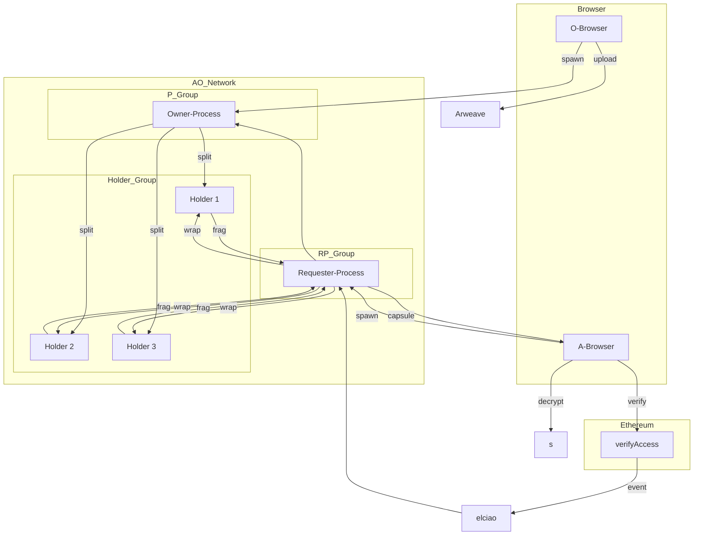

# D-TPRES

**Deterministic Threshold Proxy Re-Encryption System**

[](https://www.rust-lang.org/)
[](https://doc.rust-lang.org/edition-guide/)
[](https://www.arweave.org/)
[](https://ao.arweave.net/)

A decentralized key management system that implements threshold proxy re-encryption for secure, permissionless access control over encrypted data stored on Arweave.

## Overview

D-TPRES combines three distinct infrastructure layers to create a truly decentralized key management system:

- **Arweave**: Immutable storage for encrypted data and capsules
- **AO Network**: WebAssembly-based distributed execution environment  
- **EVM Smart Contracts**: Deterministic access control verification

The system enables data owners to encrypt and store data on Arweave while allowing authorized users to decrypt it through a k-of-n threshold proxy re-encryption scheme, all without requiring persistent key management servers.

## Key Features

### = Threshold Proxy Re-Encryption (TPRE)
- Uses Umbral PRE library for cryptographic operations
- k-of-n distributed secret sharing using Shamir's Secret Sharing
- No single point of failure for key management

### < Fully Decentralized
- **Permissionless**: EVM smart contracts define access conditions deterministically
- **Stateless**: All processes are ephemeral and can be recreated
- **Trustless**: Consensus unified across storage and access control layers

### = Multi-Role WebAssembly Architecture
Single Rust codebase compiles to WebAssembly and runs on AO with different roles:
- **Owner-Process (P<)**: Manages secret key shares and re-encryption key generation
- **Holder-Process (H|)**: Stores key fragments and performs re-encryption  
- **Requester-Process (R-Proc)**: Coordinates access requests and collects cipher fragments

## Concept diagram


## Architecture



## Cryptographic Flow

The system operates through 6 distinct phases:

### Phase 0: Process Spawning & Key Preparation
Users spawn identical WebAssembly processes on AO with role-specific configurations.

### Phase 1: Secret Splitting & Public Storage  
- Owner generates Shamir secret shares (k-of-n)
- Creates encrypted capsules using Proxy Re-Encryption
- Stores capsules and encrypted shares on Arweave

### Phase 2: Access Request & EVM Verification
- Accessor generates key pair and submits verification to EVM smart contract
- Contract verifies conditions (e.g., token ownership) and emits verification event
- elciao bridge captures event and creates ProofPkg for AO processes

### Phase 3: Re-encryption Key Fragmentation
- Owner-Process generates re-encryption key from secret key to accessor's public key
- Splits re-encryption key into k-fragments using Shamir sharing
- Distributes fragments to online Holder processes

### Phase 4: k-of-n Proxy Re-encryption
- Requester-Process coordinates with Holder processes
- Each Holder performs proxy re-encryption on their key fragment
- Returns cipher fragments to Requester-Process

### Phase 5: Client Decryption & Secret Reconstruction
- Accessor collects k cipher fragments and original capsules
- Combines fragments to reconstruct the re-encrypted capsule
- Decrypts with private key to recover the original secret

## Development

### Prerequisites

- Rust 1.86.0 (managed via `rust-toolchain.toml`)
- Make

### Commands

```bash
# Check compilation
make check

# Format code  
make fmt

# Run linter
make clippy

# Format and lint
make lint

# Run tests
make test

# Run all checks
make all
```

### Individual Cargo Commands

```bash
cargo check
cargo fmt --all
cargo clippy -- -A dead_code -A clippy::module_inception -A unused_variables -A unused_imports -A unused_mut -A unused_assignments -D warnings
cargo test
```

## Technology Stack

| Component | Technology | Purpose |
|-----------|------------|---------|
| Cryptography | `umbral-pre`, `sssa`, `aes-gcm` | Threshold PRE, secret sharing, encryption |
| Runtime | AO + HyperBEAM | WebAssembly execution environment |
| Storage | Arweave, ao-sqlite | Persistent data and state storage |
| Blockchain Bridge | elciao | EVM event integration with Arweave |
| Frontend | WebCrypto API, ethers.js | Browser-based key generation and cryptography |
| Deployment | ao-deploy | Arweave process deployment |

## Security

### Security Properties
- **Confidentiality**: IND-CPA security based on discrete logarithm problem (X25519, 128-bit)
- **Threshold Fault Tolerance**: Supports up to k-1 node failures with Shamir(k,n) sharing
- **Collusion Resistance**: Requires k fragments to reconstruct keys
- **Non-transferability**: Re-encryption keys are bound to specific public keys
- **Perfect Forward Secrecy**: Ephemeral processes with immediate key wiping

### Security Assumptions
- TPRE (Umbral) security based on RLWE 128-bit / ECC X25519
- AES-GCM 128-bit symmetric encryption
- Ed25519 signatures for message integrity
- Formal security proofs from Umbral research (Berm�dez et al.)

## Current Status

This project is in early development phase. The current implementation includes:

 Project structure and documentation  
 Rust toolchain configuration  
 Core architectural design  
= Cryptographic primitives integration  
= AO process implementation  
� EVM smart contract development  
� Browser frontend integration  
� End-to-end testing framework  

## Documentation

- [Product Requirements Document](docs/PRD.md) - Detailed system requirements and specifications
- [Development Status](docs/development/status.md) - Current progress and milestones  
- [Domain Model](docs/development/models/domain_model.md) - System entities and relationships
- [Service Documentation](docs/development/services/) - Individual component specifications

## Contributing

1. Ensure Rust 1.86.0 is installed
2. Run `make all` to verify setup
3. Follow existing code conventions and formatting rules
4. All contributions must pass linting and tests

## License

[License information to be added]

## Acknowledgments

Built on top of:
- [Umbral Proxy Re-Encryption](https://github.com/nucypher/umbral-pre)
- [Arweave](https://www.arweave.org/) permanent storage
- [AO Network](https://ao.arweave.net/) distributed compute
- [elciao](https://github.com/weaveVM/elciao) EVM bridge
