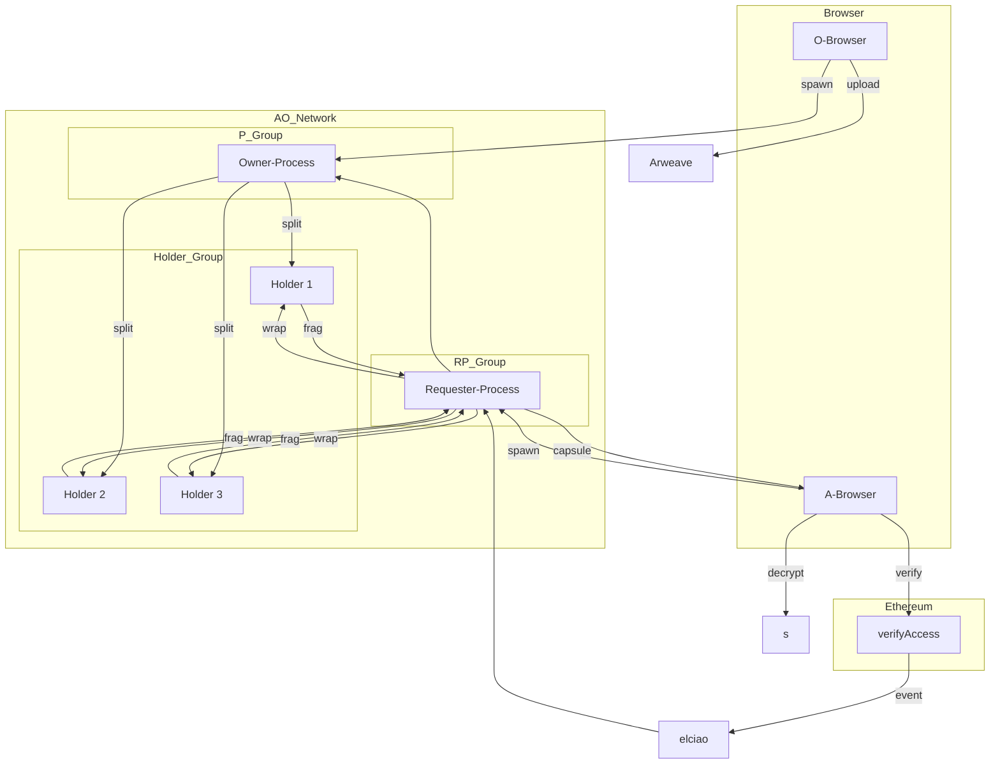

# D-TPRES

**決定論的閾値プロキシ再暗号化システム**

[](https://www.rust-lang.org/)
[](https://doc.rust-lang.org/edition-guide/)
[](https://www.arweave.org/)
[](https://ao.arweave.net/)

Arweaveに保存された暗号化データに対する安全で許可不要なアクセス制御を実現する閾値プロキシ再暗号化を実装した分散型鍵管理システムです。

## 概要

D-TPRESは、真に分散型の鍵管理システムを作成するために3つの異なるインフラストラクチャレイヤーを組み合わせています：

- **Arweave**: 暗号化データとカプセルの不変ストレージ
- **AO Network**: WebAssemblyベースの分散実行環境
- **EVMスマートコントラクト**: 決定論的アクセス制御検証

このシステムにより、データ所有者はArweaveにデータを暗号化して保存しながら、k-of-n閾値プロキシ再暗号化スキームを通じて認可されたユーザーが復号できるようになり、永続的な鍵管理サーバーを必要としません。

## 主要機能

### 閾値プロキシ再暗号化（TPRE）
- 暗号化操作にUmbral PREライブラリを使用
- Shamirの秘密分散を使用したk-of-n分散秘密分散
- 鍵管理における単一障害点なし

### 完全分散型
- **許可不要**: EVMスマートコントラクトが決定論的にアクセス条件を定義
- **ステートレス**: すべてのプロセスは一時的で再作成可能
- **信頼不要**: ストレージとアクセス制御レイヤー間で統一されたコンセンサス

### マルチロールWebAssemblyアーキテクチャ
単一のRustコードベースがWebAssemblyにコンパイルされ、AOで異なるロールで実行：
- **Owner-Process (P<)**: 秘密鍵共有と再暗号化鍵生成を管理
- **Holder-Process (H|)**: 鍵フラグメントを保存し再暗号化を実行
- **Requester-Process (R-Proc)**: アクセス要求を調整し暗号フラグメントを収集

## コンセプト図


## アーキテクチャ



## 暗号化フロー

システムは6つの異なるフェーズで動作します：

### フェーズ0: プロセス生成と鍵準備
ユーザーはロール固有の設定でAO上に同一のWebAssemblyプロセスを生成します。

### フェーズ1: 秘密分散と公開ストレージ
- 所有者がShamir秘密共有（k-of-n）を生成
- プロキシ再暗号化を使用して暗号化カプセルを作成
- カプセルと暗号化された共有をArweaveに保存

### フェーズ2: アクセス要求とEVM検証
- アクセサーが鍵ペアを生成し、EVMスマートコントラクトに検証を提出
- コントラクトが条件（例：トークン所有権）を検証し、検証イベントを発行
- elciaoブリッジがイベントをキャプチャし、AOプロセス用のProofPkgを作成

### フェーズ3: 再暗号化鍵フラグメンテーション
- Owner-Processが秘密鍵からアクセサーの公開鍵への再暗号化鍵を生成
- Shamir共有を使用して再暗号化鍵をkフラグメントに分割
- オンラインHolderプロセスにフラグメントを配布

### フェーズ4: k-of-nプロキシ再暗号化
- Requester-ProcessがHolderプロセスと調整
- 各Holderが鍵フラグメントでプロキシ再暗号化を実行
- 暗号フラグメントをRequester-Processに返却

### フェーズ5: クライアント復号と秘密再構築
- アクセサーがk個の暗号フラグメントと元のカプセルを収集
- フラグメントを結合して再暗号化されたカプセルを再構築
- 秘密鍵で復号して元の秘密を回復

## 開発

### 前提条件

- Rust 1.86.0（`rust-toolchain.toml`で管理）
- Make

### コマンド

```bash
# コンパイルチェック
make check

# コードフォーマット
make fmt

# リンター実行
make clippy

# フォーマットとリント
make lint

# テスト実行
make test

# 全チェック実行
make all
```

### 個別Cargoコマンド

```bash
cargo check
cargo fmt --all
cargo clippy -- -A dead_code -A clippy::module_inception -A unused_variables -A unused_imports -A unused_mut -A unused_assignments -D warnings
cargo test
```

## 技術スタック

| コンポーネント | 技術 | 目的 |
|-----------|------------|---------|
| 暗号化 | `umbral-pre`, `sssa`, `aes-gcm` | 閾値PRE、秘密分散、暗号化 |
| ランタイム | AO + HyperBEAM | WebAssembly実行環境 |
| ストレージ | Arweave, ao-sqlite | 永続データと状態ストレージ |
| ブロックチェーンブリッジ | elciao | ArweaveとのEVMイベント統合 |
| フロントエンド | WebCrypto API, ethers.js | ブラウザベースの鍵生成と暗号化 |
| デプロイメント | ao-deploy | Arweaveプロセスデプロイメント |

## セキュリティ

### セキュリティ特性
- **機密性**: 離散対数問題に基づくIND-CPAセキュリティ（X25519、128ビット）
- **閾値フォールトトレランス**: Shamir(k,n)共有で最大k-1ノード障害をサポート
- **共謀耐性**: 鍵の再構築にk個のフラグメントが必要
- **非譲渡性**: 再暗号化鍵は特定の公開鍵にバインド
- **完全前方秘匿性**: 即座の鍵消去による一時的プロセス

### セキュリティ仮定
- TPRE（Umbral）セキュリティはRLWE 128ビット/ECC X25519に基づく
- AES-GCM 128ビット対称暗号化
- メッセージ整合性のためのEd25519署名
- Umbral研究からの形式的セキュリティ証明（Bermúdez et al.）

## 現在の状況

このプロジェクトは初期開発段階です。現在の実装には以下が含まれます：

| コンポーネント | 状況 | 備考 |
|-----------|--------|-------|
| プロジェクト構造 | ✅ | 基本ドキュメントとコード構成 |
| Rustツールチェーン | ✅ | バージョン1.86.0設定 |
| コアアーキテクチャ | ✅ | マルチロールWebAssembly設計 |
| 暗号化プリミティブ | 🟡 | Umbral-PRE統合進行中 |
| AOプロセス実装 | 🟡 | 基本プロセス生成実装済み |
| EVMスマートコントラクト | ⬜️ | アクセス制御コントラクト保留中 |
| ブラウザフロントエンド | ⬜️ | WebCrypto API統合予定 |
| エンドツーエンドテスト | ⬜️ | テストフレームワーク設定保留中 |

凡例：
- ✅ 完了
- 🟡 進行中
- ⬜️ 未開始

## ドキュメント

- [製品要件ドキュメント](docs/PRD.md) - 詳細なシステム要件と仕様
- [開発状況](docs/development/status.md) - 現在の進捗とマイルストーン
- [ドメインモデル](docs/development/models/domain_model.md) - システムエンティティと関係
- [サービスドキュメント](docs/development/services/) - 個別コンポーネント仕様

## 貢献

1. Rust 1.86.0がインストールされていることを確認
2. セットアップを検証するために`make all`を実行
3. 既存のコード規約とフォーマットルールに従う
4. すべての貢献はリンティングとテストを通過する必要がある

## ライセンス

[ライセンス情報は追加予定]

## 謝辞

以下を基盤として構築：
- [Umbral Proxy Re-Encryption](https://github.com/nucypher/umbral-pre)
- [Arweave](https://www.arweave.org/) 永続ストレージ
- [AO Network](https://ao.arweave.net/) 分散コンピューティング
- [elciao](https://github.com/weaveVM/elciao) EVMブリッジ 
