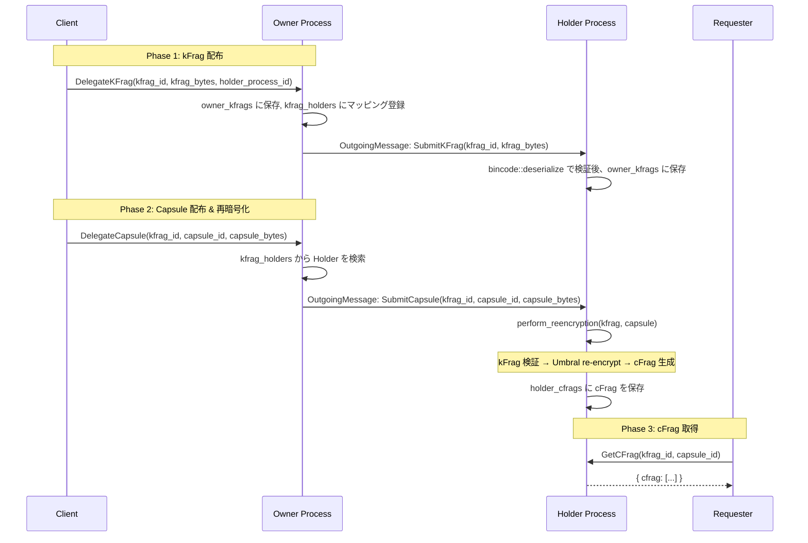

# ao/ — HyperBEAM-native AO Contract

AO-native Rust WASMコントラクト。旧来の`ao_cwao/`（CosmWasm版）をHyperBEAM (`~wasm64@1.0`) 向けに再設計。

Umbral Proxy Re-Encryption (PRE) をオンチェーンで実行し、閾値分散鍵管理を実現する。
クライアントライブラリ (`client/`) の `AOExecuteMsg` / `AOQueryMsg` がこのコントラクトのメッセージインターフェースに対応する。
kFrag ペイロードは `bincode::serialize::<StoredKeyFrag>(...)` 形式で送信する必要がある（詳細は `client/src/usecase/core/contract_storage.rs` の `StoredKeyFragPayload` を参照）。

---

## 旧バージョンとの違い

| 項目 | `ao_cwao/` (legacy) | `ao/` (this) |
|------|---------------------|--------------|
| フレームワーク | CosmWasm | AO-native WASM |
| デプロイツール | `cwao` v0.5.3 | `@permaweb/aoconnect` ^0.0.93 |
| ネットワーク | ao-testnet.xyz (廃止) | HyperBEAM |
| ストレージ | `cosmwasm_std::Storage` (KVS) | WASM global statics (メモリスナップショット) |
| エントリポイント | `instantiate/execute/query/reply` | `handle(msg_ptr, msg_len) -> result_ptr` |
| 状態管理 | CosmWasm CU が永続化 | HyperBEAM が WASM メモリを snapshot/restore |
| クロスコントラクト | `SubMsg` (同期) | `OutgoingMessage` (AO async message) |
| 暗号ライブラリ | `umbral-pre` (unchanged) | `umbral-pre` (unchanged) |

---

## ディレクトリ構成

```
ao/
├── contracts/              # Rust WASM contract
│   ├── Cargo.toml
│   └── src/
│       ├── lib.rs              # WASM entry point (handle fn)
│       ├── handlers.rs         # Business logic (dispatch + 9 handlers)
│       ├── state.rs            # ProcessState, ProcessRole, StoredKeyFrag, StoredCFrag
│       ├── message.rs          # AOMessage / AOResponse / OutgoingMessage
│       └── getrandom_impl.rs   # Custom WASM getrandom (placeholder)
└── scripts/
    └── deploy.js           # HyperBEAM deployment via @permaweb/aoconnect
```

---

## プロセスロール

各 AO プロセスは `Init` メッセージで以下のいずれかのロールを割り当てられる。

| ロール | 説明 | 許可アクション |
|--------|------|----------------|
| **Owner** | 秘密鍵の保持者。kFrag/Capsule を Holder に委任する | `DelegateKFrag`, `DelegateCapsule` |
| **Holder** | kFrag を受領し、再暗号化を実行する | `SubmitKFrag`, `SubmitCapsule`, `Reencrypt` |
| **Requester** | cFrag を取得する（将来拡張用） | Query のみ |
| **Combined** | Owner + Holder の全アクションを許可 | 上記すべて |

Query アクション (`GetCFrag`, `ListCapsules`) は初期化済みの全ロールで利用可能。

### Combined ロール

単一プロセスで Owner と Holder の両方の機能を実行するモード。

**ユースケース:**
- テスト・開発環境でのシンプルな構成
- 少数ノード環境（Holder を別プロセスに分離するオーバーヘッドが不要な場合）
- クライアントの `ContractStorageImpl::new_single_process()` が使用するデフォルトモード

**制約:**
- セキュリティ上、本番環境では Owner と Holder を分離することを推奨（PRD §4）
- Combined プロセスは全 Owner/Holder アクションを受け付けるため、ロール分離による権限制限が無効になる

---

## WASM ABI & 状態管理

### エントリポイント

| 関数 | シグネチャ | 説明 |
|------|-----------|------|
| `handle` | `(msg_ptr: i32, msg_len: i32) -> i32` | メインエントリ。JSON メッセージを受け取り、JSON レスポンスのポインタを返す |
| `alloc` | `(size: i32) -> i32` | ホストがメッセージ書き込み用にWASMメモリを確保する |
| `dealloc` | `(ptr: i32, size: i32)` | ホストが確保したメモリを解放する |
| `response_len` | `() -> i32` | 最後のレスポンスのバイト長を返す（ホストが ptr..ptr+len を読む） |

### 状態管理: SyncCell パターン

HyperBEAM の `~wasm64@1.0` デバイスは、各メッセージ処理後に WASM リニアメモリ全体をスナップショットし、次のメッセージ処理前に復元する。これにより **Rust の `static` グローバル変数がメッセージ間で永続化される**。

```rust
// Safety: WASM はシングルスレッド。並行アクセスは発生しない。
// UnsafeCell + 手動 Sync で Rust 2024 の static_mut_refs 禁止ルールに対応。
struct SyncCell<T>(UnsafeCell<T>);
unsafe impl<T> Sync for SyncCell<T> {}

static PROCESS_STATE: SyncCell<Option<ProcessState>> = SyncCell(UnsafeCell::new(None));
static RESPONSE_BUF: SyncCell<Vec<u8>> = SyncCell(UnsafeCell::new(Vec::new()));
```

**Safety 根拠:**
- WASM は仕様上シングルスレッド実行。`Send`/`Sync` の並行性保証は不要
- `UnsafeCell` により `&mut` アクセスが可能。`static mut` を直接使わないことで Rust 2024 edition の `static_mut_refs` lint に準拠
- `get_state()` は遅延初期化パターン: 初回アクセス時に `ProcessState::new()` を生成

**ao_cwao/ との違い:**
- ao_cwao/ では毎メッセージで `db_read`/`db_write` による明示的な状態ロード/保存が必要だった
- ao/ では HyperBEAM がメモリスナップショットを管理するため、明示的な永続化コードは不要

---

## メッセージフロー

### 再暗号化フロー (Owner → Holder → cFrag 生成)



### Combined モード (単一プロセス)

Combined モードでは、Owner と Holder が同一プロセスのため `OutgoingMessage` による転送が不要。
クライアントが直接 `SubmitKFrag` → `SubmitCapsule` → `Reencrypt` → `GetCFrag` を順次呼び出す。

---

## ハンドラー API 一覧

### Execute アクション

| アクション | ロール | 必須フィールド | レスポンス | 説明 |
|------------|--------|----------------|------------|------|
| `Init` | (未初期化) | `role`: string, `from`: string | `{ initialized, role }` | プロセス初期化。ロール設定と owner_id 登録 |
| `DelegateKFrag` | Owner/Combined | `kfrag_id`, `kfrag`: byte[], `holder_process_id` | `{ kfrag_id, delegated }` + OutgoingMessage | kFrag を保存し Holder に SubmitKFrag を送信 |
| `DelegateCapsule` | Owner/Combined | `kfrag_id`, `capsule_id`, `capsule`: byte[] | `{ capsule_id, delegated }` + OutgoingMessage | Capsule を保存し Holder に SubmitCapsule を送信 |
| `SubmitKFrag` | Holder/Combined | `kfrag_id`, `kfrag`: byte[] | `{ kfrag_id, stored }` | kFrag を bincode 検証後に保存（冪等） |
| `SubmitCapsule` | Holder/Combined | `kfrag_id`, `capsule_id`, `capsule`: byte[] | `{ capsule_id, cfrag_ready }` | Capsule 受領 → 即座に再暗号化を実行 |
| `Reencrypt` | Holder/Combined | `kfrag_id`, `capsule_id` | `{ capsule_id, cfrag_ready }` | 既存 Capsule の再暗号化を再試行 |

### Query アクション

| アクション | ロール | 必須フィールド | レスポンス | 説明 |
|------------|--------|----------------|------------|------|
| `GetCFrag` | 全ロール | `kfrag_id`, `capsule_id` | `{ kfrag_id, capsule_id, cfrag }` | 生成済み cFrag を取得 |
| `ListCapsules` | 全ロール | `kfrag_id` | `{ kfrag_id, capsule_ids }` | 指定 kFrag に紐づく Capsule ID 一覧 |

### メッセージ形式

```json
// Request (AOMessage)
{
  "action": "DelegateKFrag",
  "from": "owner-wallet-address",
  "id": "msg-001",
  "data": {
    "kfrag_id": "secret-1_0",
    "kfrag": [1, 2, 3, ...],
    "holder_process_id": "holder-process-xyz"
  }
}

// Response (AOResponse)
{
  "ok": true,
  "data": { "kfrag_id": "secret-1_0", "delegated": true },
  "messages": [{
    "target": "holder-process-xyz",
    "action": "SubmitKFrag",
    "data": { "kfrag_id": "secret-1_0", "kfrag": [1, 2, 3, ...] }
  }]
}
```

---

## セキュリティ

### 認可モデル

- `Init` メッセージの `from` フィールドが `owner_id` として登録される
- 以降の Execute アクション（Query を除く）は `from == owner_id` を検証
- 不一致の場合は `"Unauthorized"` エラーで即拒否

### 秘密鍵メモリ管理

| 型 | Zeroize | ZeroizeOnDrop | 用途 |
|----|---------|---------------|------|
| `StoredKeyFrag` | Yes | Yes | kFrag の中間デシリアライズ。使用後にメモリクリア |
| `StoredCFrag` | Yes | Yes | cFrag の中間デシリアライズ。使用後にメモリクリア |

WASM リニアメモリ上の鍵素材は `Zeroize` + `ZeroizeOnDrop` により、変数のスコープ終了時に自動的にゼロ化される。

### kFrag 検証 (PRD §6.1)

再暗号化 (`perform_reencryption`) 実行前に以下を検証:

1. `StoredKeyFrag` の bincode デシリアライズが成功すること
2. `key_data` / `verification_data` が空でないこと
3. `VerificationData` から公開鍵 (`verifying_pk`, `delegating_pk`, `receiving_pk`) をデシリアライズ
4. `umbral_pre::KeyFrag::verify()` による暗号学的検証が成功すること

検証に失敗した kFrag による再暗号化は拒否され、改竄検知として機能する。

---

## ビルド

```bash
# Rust WASM binary
cd contracts
cargo build --target wasm32-unknown-unknown --release
# Output: target/wasm32-unknown-unknown/release/formix_contract.wasm

# wasm64 (Memory-64) の場合 (experimental)
# cargo build --target wasm64-unknown-unknown --release
```

## デプロイ

```bash
npm install
node scripts/deploy.js --wallet /path/to/wallet.json
```

---

## 残課題 (TODO)

1. **WASM ABI検証**: HyperBEAMのbeamrが `handle(ptr, len)` を呼ぶ正確な方法をPoC検証
   - [実装済み] `handle`, `alloc`, `dealloc`, `response_len` のエクスポートは完了
   - [未検証] HyperBEAM 実環境での動作確認が必要
2. **wasm32 vs wasm64**: `~wasm64@1.0`がMemory-64要求の場合 `wasm64-unknown-unknown` ターゲットが必要（experimental）
   - [pending] HyperBEAM の実際のターゲット要件を確認中
3. **SubMsg → async messaging**: `OutgoingMessage` の HyperBEAM ルーティング検証
   - [実装済み] `AOResponse.messages` に `OutgoingMessage` を格納する仕組みは完了
   - [未検証] HyperBEAM が `messages` 配列を実際にルーティングするか要確認
4. **getrandom entropy**: 決定論的な placeholder → 本番用エントロピー注入に変更
   - [pending] 現在は `(i * 7 + 42) % 256` の決定論的値。本番ではメッセージコンテキスト or ブロックハッシュからのエントロピー注入が必要
5. **テスト**: `cw-multi-test` の代替テスト基盤構築
   - [pending] クライアント側の MockAOClient による間接テストは存在。コントラクト単体のユニットテスト基盤は未構築
