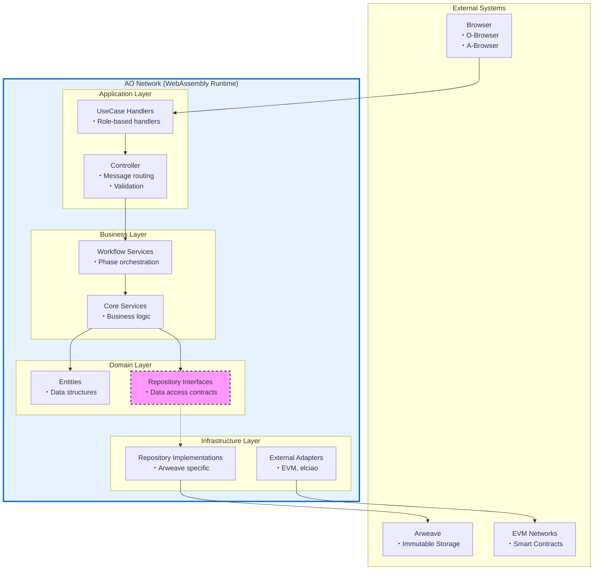

# D-TPRES アーキテクチャ設計思想

## 1. はじめに

本ドキュメントは、D-TPRES（Deterministic Threshold Proxy Re-Encryption System）が採用する「**依存性逆転を取り入れたレイヤードアーキテクチャ**」について、その設計思想と技術的制約への適応を明確に説明します。

### 1.1 設計思想の要約

D-TPRESは、純粋なクリーンアーキテクチャでもレイヤードアーキテクチャでもなく、両者の利点を実用的に組み合わせたハイブリッドアプローチを採用しています。これは、AO Network、Arweave、WebAssemblyという特殊な技術スタックの制約に最適化された、意図的な設計選択です。

## 2. 技術的制約と課題

### 2.1 AO Network の制約

```rust
// AOの実行モデル：各メッセージは独立した実行単位
pub async fn handle_message(msg: Message) -> Response {
    // 1. 状態は毎回Arweaveから読み込む必要がある
    let state = load_state_from_arweave().await?;
    
    // 2. 処理実行
    let result = process_message(state, msg);
    
    // 3. 状態の永続化
    save_state_to_arweave(&result.new_state).await?;
    
    // 4. メモリ上の状態は次回実行時には存在しない
    result.response
}
```

**課題：**
- ステートレス実行モデル
- 各メッセージ処理での完全な再初期化
- メモリ上のキャッシュが使えない

### 2.2 Arweave の制約

```rust
// Arweaveは追記専用、更新は新しいトランザクションとして実装
impl ArweaveRepository {
    async fn update(&self, entity: &Entity) -> Result<(), Error> {
        // 更新ではなく、新バージョンとして追加
        let versioned_entity = VersionedEntity {
            entity: entity.clone(),
            version: self.get_next_version(&entity.id).await?,
            previous_tx: self.get_latest_tx(&entity.id).await?,
        };
        
        self.create_transaction(versioned_entity).await
    }
}
```

**課題：**
- 不変ストレージ（追記専用）
- 更新操作のコスト
- クエリの複雑性

### 2.3 WebAssembly の制約

```rust
// 動的ディスパッチのオーバーヘッドが大きい
trait Repository {
    async fn find(&self, id: &str) -> Result<Entity, Error>;
}

// 実行時の型解決コスト
let repo: Box<dyn Repository> = get_repository();  // コストが高い
```

**課題：**
- メモリサイズの制限
- 動的ディスパッチのパフォーマンスコスト
- 限定的なランタイム機能

## 3. D-TPRES のハイブリッドアーキテクチャ

### 3.1 アーキテクチャ構造



### 3.2 依存性逆転の適用箇所

**Domain層にRepository Interfaceを配置する理由：**

```rust
// Domain層：ビジネスに必要なデータアクセスの契約を定義
pub trait ProcessEntityRepository {
    async fn find_by_id(&self, id: &ProcessId) -> Result<Option<ProcessEntity>, RepositoryError>;
    async fn find_by_role(&self, role: ProcessRole) -> Result<Vec<ProcessEntity>, RepositoryError>;
    async fn save(&self, entity: &ProcessEntity) -> Result<ProcessId, RepositoryError>;
}

// Infrastructure層：技術的な実装詳細
pub struct ProcessEntityRepositoryImpl {
    arweave_client: ArweaveClient,
    tag_builder: TagBuilder,
    cache: MessageScopeCache,  // 単一メッセージ処理内のみ有効
}

impl ProcessEntityRepository for ProcessEntityRepositoryImpl {
    async fn find_by_id(&self, id: &ProcessId) -> Result<Option<ProcessEntity>, RepositoryError> {
        // Arweave特有のタグベース検索
        let tags = self.tag_builder.build_id_query(id);
        let tx = self.arweave_client.find_by_tags(tags).await?;
        
        // デシリアライズとキャッシュ
        if let Some(data) = tx {
            let entity = self.deserialize(data)?;
            self.cache.set(id, &entity);
            Ok(Some(entity))
        } else {
            Ok(None)
        }
    }
}
```

## 4. なぜハイブリッドアプローチなのか

### 4.1 純粋なクリーンアーキテクチャの問題点

```rust
// 純粋なクリーンアーキテクチャでは...
// Use Case層
pub struct GetProcessUseCase {
    gateway: Box<dyn ProcessGateway>,  // Interface Adapters層のゲートウェイ
}

// Interface Adapters層
pub trait ProcessGateway {
    async fn find_process(&self, id: &str) -> Result<ProcessDTO, Error>;
}

// 問題：DTOへの変換が必要で、AOの制約下では非効率
```

**AO環境での課題：**
- 過度な抽象化によるオーバーヘッド
- DTO変換の繰り返しによるメモリ使用
- WebAssemblyでの動的ディスパッチコスト

### 4.2 純粋なレイヤードアーキテクチャの問題点

```rust
// 純粋なレイヤードアーキテクチャでは...
pub struct ProcessService {
    // 直接実装に依存
    repository: ArweaveProcessRepository,
}

impl ProcessService {
    pub async fn get_process(&self, id: &str) -> Result<Process, Error> {
        // Arweave特有のコードがService層に漏れる
        let tags = vec![
            ("Type", "Process"),
            ("ProcessId", id),
        ];
        let result = arweave::query_with_tags(tags).await?;
        // ...
    }
}
```

**問題点：**
- テストが困難（実際のArweave接続が必要）
- 技術的詳細がビジネスロジックに混入
- 永続化層の変更が全層に影響

## 5. D-TPRES ハイブリッドアプローチの利点

### 5.1 実用的な依存性逆転

```rust
// Service層はインターフェースのみに依存
pub struct SecretSharingWorkflowService {
    process_repo: Arc<dyn ProcessEntityRepository>,
    share_repo: Arc<dyn ShareEntityRepository>,
    crypto_service: Arc<CryptoService>,
}

impl SecretSharingWorkflowService {
    pub async fn split_secret(&self, params: SplitParams) -> Result<SplitResult, Error> {
        // ビジネスロジックは技術詳細から独立
        let process = self.process_repo.find_by_id(&params.owner_id).await?;
        
        // 暗号化処理
        let shares = self.crypto_service.shamir_split(&params.secret, params.k, params.n)?;
        
        // 永続化（実装詳細は知らない）
        for share in shares {
            self.share_repo.save(&share).await?;
        }
        
        Ok(SplitResult { ... })
    }
}
```

### 5.2 AO制約への適応

```rust
// 軽量な初期化
pub struct ServiceContainer {
    // 事前に構築されたサービスインスタンス
    services: HashMap<TypeId, Arc<dyn Any>>,
}

impl ServiceContainer {
    // メッセージ処理ごとの高速初期化
    pub fn initialize() -> Self {
        let mut container = Self::new();
        
        // Repository実装の注入（軽量）
        let arweave_client = ArweaveClient::new();
        container.register(ProcessEntityRepositoryImpl::new(arweave_client.clone()));
        
        // Service層の構築（依存関係は解決済み）
        container.register(SecretSharingWorkflowService::new(
            container.resolve::<dyn ProcessEntityRepository>(),
            container.resolve::<dyn ShareEntityRepository>(),
        ));
        
        container
    }
}
```

## 6. 各層の責務と実装指針

### 6.1 層の責務マトリクス

| 層 | 責務 | 依存先 | 実装内容 |
|---|------|--------|---------|
| **UseCase** | AOメッセージ処理 | Controller | Role-based handlers |
| **Controller** | リクエスト処理・検証 | Service | MessageHandler, Router, Validator |
| **Service** | ビジネスロジック | Domain (Entities + Interfaces) | Workflow/Core Services |
| **Domain** | ビジネスルール定義 | なし | Entities, Repository Interfaces |
| **Infrastructure** | 技術的実装 | Domain Interfaces | Arweave実装, 外部連携 |

### 6.2 実装ガイドライン

```rust
// ✅ 推奨：Domain層のインターフェース
pub trait CapsuleEntityRepository {
    // ビジネス視点の命名
    async fn find_by_secret_id(&self, secret_id: &SecretId) -> Result<Option<CapsuleEntity>, RepositoryError>;
    
    // 技術詳細を含まない
    async fn save(&self, capsule: &CapsuleEntity) -> Result<CapsuleId, RepositoryError>;
}

// ❌ 非推奨：技術詳細の漏洩
pub trait CapsuleRepository {
    // Arweave特有の概念が露出
    async fn query_by_tags(&self, tags: Vec<(&str, &str)>) -> Result<ArweaveTransaction, Error>;
    
    // トランザクションIDは実装詳細
    async fn get_by_tx_id(&self, tx_id: &str) -> Result<CapsuleData, Error>;
}
```

## 7. トレードオフと正当化

### 7.1 理論的純粋性 vs 実用性

| 観点 | 理論的純粋性 | D-TPRES の選択 | 理由 |
|-----|-------------|---------------|------|
| **Repository配置** | Interface Adapters層 | Domain層 | AOでの軽量初期化のため |
| **Service層** | Use Cases層に統合 | 独立した層 | 複雑なワークフローの管理 |
| **DTO変換** | 各層境界で実施 | 最小限に抑制 | WebAssemblyメモリ制約 |
| **依存性注入** | 完全な抽象化 | 実用的な抽象化 | パフォーマンスとのバランス |

### 7.2 設計決定の正当化

1. **Repository InterfaceのDomain層配置**
   - ビジネスが必要とするデータアクセスパターンの定義
   - Service層の純粋性を保ちつつ、過度な抽象化を回避
   - AO環境での高速初期化を実現

2. **Service層の独立**
   - Phase別の複雑なワークフロー管理
   - Core ServiceとWorkflow Serviceの明確な分離
   - 再利用性と保守性の向上

3. **限定的なDTO使用**
   - Controller層の入出力のみでDTO使用
   - 内部層間はEntityを直接使用
   - メモリ効率とパフォーマンスの最適化

## 8. まとめ

D-TPRESの「依存性逆転を取り入れたレイヤードアーキテクチャ」は、以下の特徴を持ちます：

1. **実用的な依存性逆転**
   - 必要な箇所（Repository）にのみDIPを適用
   - テスタビリティと実装の簡潔性のバランス

2. **技術制約への適応**
   - AO: ステートレス実行に最適化された初期化
   - Arweave: 不変性を考慮したRepository設計
   - WebAssembly: 最小限の動的ディスパッチ

3. **明確な責務分離**
   - 各層の役割が明確で理解しやすい
   - ビジネスロジックと技術詳細の適切な分離

この設計は、理論的な純粋性よりも、D-TPRESが直面する具体的な技術的課題の解決を優先した、実用的かつ意図的な選択です。

---

**Document Status**: Architecture Design Philosophy  
**Version**: 1.0  
**Last Updated**: 2025-01-09
