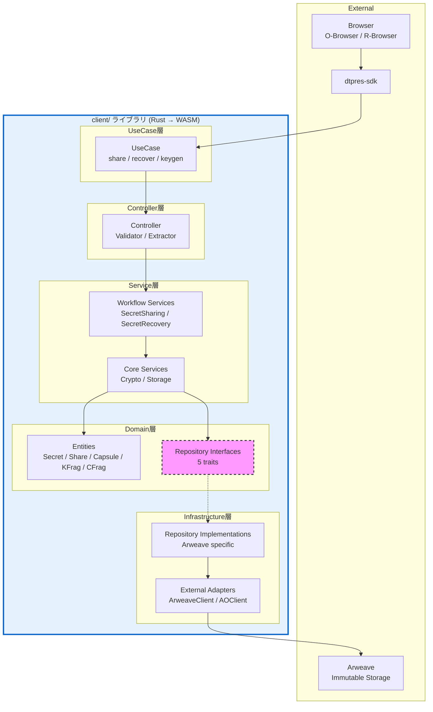

# D-TPRES クライアントライブラリ アーキテクチャ設計思想

## 1. はじめに

本ドキュメントは、D-TPRES client/ ライブラリが採用する「**依存性逆転を取り入れた5層レイヤードアーキテクチャ**」について、その設計思想と技術的制約への適応を説明します。

### 1.1 設計思想の要約

client/ ライブラリは、純粋なクリーンアーキテクチャでもレイヤードアーキテクチャでもなく、両者の利点を実用的に組み合わせたハイブリッドアプローチを採用しています。これは、Arweave（不変ストレージ）とWebAssembly（ブラウザ実行）という技術スタックの制約に最適化された、意図的な設計選択です。

### 1.2 client/ の位置づけ

```
D-TPRES システム全体
┌─────────────────────────────────────────────────────────────┐
│                                                             │
│  ┌─────────────────┐    ┌─────────────────┐                │
│  │   O-Browser     │    │   R-Browser     │                │
│  │   (Phase 1)     │    │   (Phase 3)     │                │
│  └────────┬────────┘    └────────┬────────┘                │
│           │                      │                          │
│           ▼                      ▼                          │
│  ┌─────────────────────────────────────────┐               │
│  │           client/ ライブラリ             │ ← 本ドキュメント│
│  │         (Rust → WASM)                   │               │
│  └─────────────────────────────────────────┘               │
│                      │                                      │
│           ┌─────────┴─────────┐                            │
│           ▼                   ▼                            │
│  ┌─────────────┐    ┌─────────────────────┐               │
│  │  Arweave    │    │   ao/ コントラクト   │               │
│  │ (Storage)   │    │   (Phase 2)         │               │
│  └─────────────┘    └─────────────────────┘               │
│                                                             │
└─────────────────────────────────────────────────────────────┘
```

**重要**: client/ は**ローカルで動作する暗号処理ライブラリ**です。AO Network 上で動作するのは ao/ コントラクトであり、client/ ではありません。

## 2. 技術的制約と課題

### 2.1 Arweave の制約

```rust
// Arweaveは追記専用、更新は新しいトランザクションとして実装
impl ArweaveSecretRepository {
    fn update(&self, secret: &Secret) -> Result<SecretId, RepositoryError> {
        // 更新ではなく、新バージョンとして追加
        let versioned_secret = VersionedSecret {
            secret: secret.clone(),
            version: self.get_next_version(&secret.id())?,
            previous_tx: self.get_latest_tx(&secret.id())?,
        };

        self.create_transaction(versioned_secret)
    }
}
```

**課題:**
- 不変ストレージ（追記専用）
- 更新操作のコスト
- クエリの複雑性

### 2.2 WebAssembly の制約

```rust
// 動的ディスパッチのオーバーヘッドが大きい
trait Repository {
    fn find(&self, id: &str) -> Result<Entity, Error>;
}

// 実行時の型解決コスト
let repo: Box<dyn Repository> = get_repository();  // コストが高い
```

**課題:**
- メモリサイズの制限
- 動的ディスパッチのパフォーマンスコスト
- 限定的なランタイム機能

### 2.3 暗号処理の制約

```rust
// 秘密鍵は使用後に必ずゼロ化
use zeroize::{Zeroize, ZeroizeOnDrop};

#[derive(Zeroize, ZeroizeOnDrop)]
struct SecretKeyWrapper {
    key: Vec<u8>,
}

impl Drop for SecretKeyWrapper {
    fn drop(&mut self) {
        self.key.zeroize();
    }
}
```

**課題:**
- メモリ上の秘密情報管理
- サイドチャネル攻撃への対策
- 暗号処理の正確性保証

## 3. 5層レイヤードアーキテクチャ

### 3.1 アーキテクチャ構造



### 3.2 依存性逆転の適用箇所

**Domain層にRepository Interfaceを配置する理由:**

```rust
// Domain層：ビジネスに必要なデータアクセスの契約を定義
pub trait SecretRepository {
    fn find_by_id(&self, id: &SecretId) -> Result<Option<Secret>, RepositoryError>;
    fn save(&self, secret: &Secret) -> Result<SecretId, RepositoryError>;
}

pub trait ShareRepository {
    fn find_by_secret_id(&self, secret_id: &SecretId) -> Result<Vec<Share>, RepositoryError>;
    fn save_batch(&self, shares: &[Share]) -> Result<Vec<ShareId>, RepositoryError>;
}

// Infrastructure層：技術的な実装詳細
pub struct ArweaveSecretRepository {
    arweave_client: ArweaveClient,
    tag_builder: TagBuilder,
}

impl SecretRepository for ArweaveSecretRepository {
    fn find_by_id(&self, id: &SecretId) -> Result<Option<Secret>, RepositoryError> {
        // Arweave特有のタグベース検索
        let tags = self.tag_builder.build_id_query(id);
        let tx = self.arweave_client.find_by_tags(tags)?;

        if let Some(data) = tx {
            let secret = self.deserialize(data)?;
            Ok(Some(secret))
        } else {
            Ok(None)
        }
    }

    fn save(&self, secret: &Secret) -> Result<SecretId, RepositoryError> {
        let data = self.serialize(secret)?;
        let tags = self.tag_builder.build_secret_tags(secret);
        self.arweave_client.upload(data, tags)
    }
}
```

## 4. なぜハイブリッドアプローチなのか

### 4.1 純粋なクリーンアーキテクチャの問題点

```rust
// 純粋なクリーンアーキテクチャでは...
// Use Case層
pub struct ShareSecretUseCase {
    gateway: Box<dyn SecretGateway>,  // Interface Adapters層のゲートウェイ
}

// Interface Adapters層
pub trait SecretGateway {
    fn save_secret(&self, dto: SecretDTO) -> Result<String, Error>;
}

// 問題：DTOへの変換が必要で、WASMの制約下では非効率
```

**WASM環境での課題:**
- 過度な抽象化によるオーバーヘッド
- DTO変換の繰り返しによるメモリ使用
- WebAssemblyでの動的ディスパッチコスト

### 4.2 純粋なレイヤードアーキテクチャの問題点

```rust
// 純粋なレイヤードアーキテクチャでは...
pub struct SecretSharingService {
    // 直接実装に依存
    repository: ArweaveSecretRepository,
}

impl SecretSharingService {
    pub fn split_secret(&self, params: SplitParams) -> Result<SplitResult, Error> {
        // Arweave特有のコードがService層に漏れる
        let tags = vec![
            ("Type", "Secret"),
            ("SecretId", &params.secret_id),
        ];
        let result = self.repository.arweave_query_with_tags(tags)?;
        // ...
    }
}
```

**問題点:**
- テストが困難（実際のArweave接続が必要）
- 技術的詳細がビジネスロジックに混入
- 永続化層の変更が全層に影響

## 5. ハイブリッドアプローチの利点

### 5.1 実用的な依存性逆転

```rust
// Service層はインターフェースのみに依存
pub struct SecretSharingWorkflowService {
    secret_repo: Arc<dyn SecretRepository>,
    share_repo: Arc<dyn ShareRepository>,
    capsule_repo: Arc<dyn CapsuleRepository>,
    kfrag_repo: Arc<dyn KFragRepository>,
    crypto_service: Arc<CryptoService>,
}

impl SecretSharingWorkflowService {
    pub fn split_secret(&self, params: SplitParams) -> Result<SplitResult, Error> {
        // ビジネスロジックは技術詳細から独立

        // 1. 暗号化処理
        let (capsule, encrypted_key) = self.crypto_service.tpre_encrypt(
            &params.symmetric_key,
            &params.owner_public_key
        )?;

        // 2. Shamir分割
        let shares = self.crypto_service.shamir_split(
            &encrypted_key,
            params.threshold,
            params.total_shares
        )?;

        // 3. kFrag生成
        let kfrags = self.crypto_service.generate_kfrags(
            &params.owner_secret_key,
            &params.requester_public_key,
            params.threshold,
            params.total_shares
        )?;

        // 4. 永続化（実装詳細は知らない）
        let secret = Secret::new(params)?;
        self.secret_repo.save(&secret)?;
        self.share_repo.save_batch(&shares)?;
        self.capsule_repo.save(&capsule)?;
        self.kfrag_repo.save_batch(&kfrags)?;

        Ok(SplitResult { secret_id: secret.id() })
    }
}
```

### 5.2 テスタビリティの確保

```rust
// テスト時はモックリポジトリを注入
#[cfg(test)]
mod tests {
    use super::*;

    struct MockSecretRepository {
        secrets: RefCell<HashMap<SecretId, Secret>>,
    }

    impl SecretRepository for MockSecretRepository {
        fn find_by_id(&self, id: &SecretId) -> Result<Option<Secret>, RepositoryError> {
            Ok(self.secrets.borrow().get(id).cloned())
        }

        fn save(&self, secret: &Secret) -> Result<SecretId, RepositoryError> {
            self.secrets.borrow_mut().insert(secret.id(), secret.clone());
            Ok(secret.id())
        }
    }

    #[test]
    fn test_split_secret() {
        let mock_repo = Arc::new(MockSecretRepository::new());
        let service = SecretSharingWorkflowService::new(mock_repo, ...);

        let result = service.split_secret(test_params());
        assert!(result.is_ok());
    }
}
```

## 6. 各層の責務と実装指針

### 6.1 層の責務マトリクス

| 層 | 責務 | 依存先 | 実装内容 |
|---|------|--------|---------|
| **UseCase** | 開発者向けAPIエンドポイント | Controller | share.rs, recover.rs, keygen.rs |
| **Controller** | 入力検証・DTO変換 | Service | Validator, Extractor |
| **Service** | ビジネスロジック | Domain (Entities + Interfaces) | Workflow/Core Services |
| **Domain** | ビジネスルール定義 | なし | 5 Entities, 5 Repository Interfaces |
| **Infrastructure** | 技術的実装 | Domain Interfaces | Arweave実装, 外部連携 |

### 6.2 実装ガイドライン

```rust
// 推奨：Domain層のインターフェース
pub trait CapsuleRepository {
    // ビジネス視点の命名
    fn find_by_secret_id(&self, secret_id: &SecretId) -> Result<Option<Capsule>, RepositoryError>;

    // 技術詳細を含まない
    fn save(&self, capsule: &Capsule) -> Result<CapsuleId, RepositoryError>;
}

// 非推奨：技術詳細の漏洩
pub trait CapsuleRepository {
    // Arweave特有の概念が露出
    fn query_by_tags(&self, tags: Vec<(&str, &str)>) -> Result<ArweaveTransaction, Error>;

    // トランザクションIDは実装詳細
    fn get_by_tx_id(&self, tx_id: &str) -> Result<CapsuleData, Error>;
}
```

## 7. トレードオフと正当化

### 7.1 理論的純粋性 vs 実用性

| 観点 | 理論的純粋性 | client/ の選択 | 理由 |
|-----|-------------|---------------|------|
| **Repository配置** | Interface Adapters層 | Domain層 | WASMでの軽量初期化のため |
| **Service層** | Use Cases層に統合 | 独立した層 | 複雑なワークフローの管理 |
| **DTO変換** | 各層境界で実施 | 最小限に抑制 | WebAssemblyメモリ制約 |
| **依存性注入** | 完全な抽象化 | 実用的な抽象化 | パフォーマンスとのバランス |

### 7.2 設計決定の正当化

1. **Repository InterfaceのDomain層配置**
   - ビジネスが必要とするデータアクセスパターンの定義
   - Service層の純粋性を保ちつつ、過度な抽象化を回避
   - WASM環境での高速初期化を実現

2. **Service層の独立**
   - Phase別の複雑なワークフロー管理（Phase 1, Phase 3）
   - Core ServiceとWorkflow Serviceの明確な分離
   - 再利用性と保守性の向上

3. **限定的なDTO使用**
   - Controller層の入出力のみでDTO使用
   - 内部層間はEntityを直接使用
   - メモリ効率とパフォーマンスの最適化

## 8. まとめ

client/ ライブラリの「依存性逆転を取り入れた5層レイヤードアーキテクチャ」は、以下の特徴を持ちます：

1. **実用的な依存性逆転**
   - 必要な箇所（Repository）にのみDIPを適用
   - テスタビリティと実装の簡潔性のバランス

2. **技術制約への適応**
   - Arweave: 不変性を考慮したRepository設計
   - WebAssembly: 最小限の動的ディスパッチ
   - 暗号処理: 安全なメモリ管理

3. **明確な責務分離**
   - 5層による明確な責務分離
   - ビジネスロジックと技術詳細の適切な分離
   - Phase 1（秘密分割）とPhase 3（秘密復元）の独立管理

この設計は、理論的な純粋性よりも、client/ ライブラリが直面する具体的な技術的課題の解決を優先した、実用的かつ意図的な選択です。

---

**Document Status**: Architecture Design Philosophy
**Version**: 2.0
**Last Updated**: 2025-01
