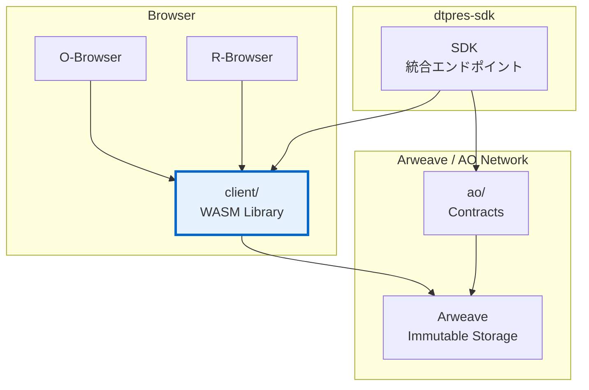
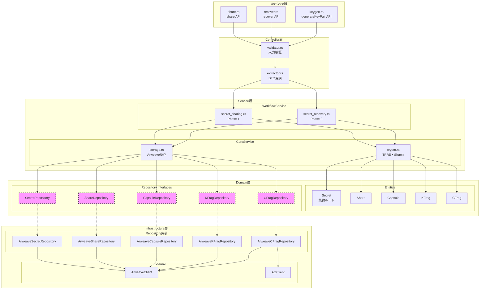

# D-TPRES クライアントライブラリ アーキテクチャ概要

> **目的**: client/ ライブラリの5層レイヤードアーキテクチャ設計

---

## 1. システム概要

client/ は D-TPRES システムにおけるローカル暗号処理ライブラリです。Rust で実装され、WebAssembly としてブラウザで動作します。

### 1.1 責務

client/ ライブラリは以下の2つのフェーズを担当します：

| Phase | 処理 | 実行環境 | 説明 |
|-------|------|---------|------|
| **Phase 1** | 秘密分割 | O-Browser | TPRE暗号化、Shamir分割、kFrag生成 |
| **Phase 3** | 秘密復元 | R-Browser | cFrag結合、TPRE復号、Shamir補間 |

**Note**: Phase 2（kFrag配布・再暗号化）は ao/ コントラクトが自律的に処理します。

### 1.2 システム全体の中での位置づけ



### 1.3 暗号化フロー

```
Phase 1: 秘密分割 (O-Browser)
┌─────────────────────────────────────────────────────────────┐
│ 1. 鍵ペア生成 (sk_O, pk_O)                                   │
│ 2. 秘密データを対称鍵 k_O で AES-GCM 暗号化                    │
│ 3. k_O を pk_O で TPRE 暗号化 → Capsule 生成                  │
│ 4. Shamir Secret Sharing で k_O を n シェアに分割             │
│ 5. kFrag を生成 (sk_O → pk_R への再暗号化鍵フラグメント)       │
│ 6. Capsule, 暗号化シェア, kFrag を Arweave に保存             │
└─────────────────────────────────────────────────────────────┘

Phase 2: kFrag配布・再暗号化 (ao/)
┌─────────────────────────────────────────────────────────────┐
│ ※ ao/ コントラクトが自律的に処理                              │
│ - Holder選出 (RandAO)                                        │
│ - kFrag配布                                                  │
│ - 再暗号化 (kFrag → cFrag)                                   │
└─────────────────────────────────────────────────────────────┘

Phase 3: 秘密復元 (R-Browser)
┌─────────────────────────────────────────────────────────────┐
│ 1. cFrag を収集 (k-of-n 以上)                                 │
│ 2. Capsule + cFrag を結合                                    │
│ 3. sk_R で TPRE 復号 → k_O を復元                            │
│ 4. Shamir 補間で k_O を再構築                                 │
│ 5. k_O で AES-GCM 復号 → 秘密データを復元                     │
└─────────────────────────────────────────────────────────────┘
```

## 2. 5層レイヤードアーキテクチャ

### 2.1 アーキテクチャ構造



### 2.2 ディレクトリ構造

```
client/src/
├── lib.rs                      # ライブラリエントリーポイント
├── di.rs                       # 依存性注入コンテナ
│
├── usecase/                    # UseCase層（Facade）
│   ├── mod.rs
│   ├── share.rs               # share() API
│   ├── recover.rs             # recover() API
│   └── keygen.rs              # generateKeyPair() API
│
├── controller/                 # Controller層
│   ├── mod.rs
│   ├── validator.rs           # 入力の妥当性検証
│   └── extractor.rs           # Service層向けDTO変換
│
├── service/                    # Service層
│   ├── mod.rs
│   ├── error.rs               # Service層エラー定義
│   ├── workflow/              # WorkflowService
│   │   ├── mod.rs
│   │   ├── secret_sharing.rs  # Phase 1処理
│   │   └── secret_recovery.rs # Phase 3処理
│   └── core/                  # CoreService
│       ├── mod.rs
│       ├── crypto.rs          # CryptoService（TPRE・Shamir）
│       └── storage.rs         # StorageService
│
├── domain/                     # Domain層
│   ├── mod.rs
│   ├── errors.rs              # Domain層エラー定義
│   ├── entities/              # エンティティ（5つ）
│   │   ├── mod.rs
│   │   ├── secret.rs          # Secret（集約ルート）
│   │   ├── share.rs           # Share（Shamirシェア）
│   │   ├── capsule.rs         # Capsule（PREカプセル）
│   │   ├── kfrag.rs           # KFrag（鍵フラグメント）
│   │   └── cfrag.rs           # CFrag（再暗号化フラグメント）
│   └── repositories/          # Repository Interface（5トレイト）
│       ├── mod.rs
│       ├── secret.rs          # SecretRepository trait
│       ├── share.rs           # ShareRepository trait
│       ├── capsule.rs         # CapsuleRepository trait
│       ├── kfrag.rs           # KFragRepository trait
│       └── cfrag.rs           # CFragRepository trait
│
└── infrastructure/             # Infrastructure層
    ├── mod.rs
    ├── errors.rs              # Infrastructure層エラー定義
    ├── repositories/          # Repository実装（Arweave永続化）
    │   ├── mod.rs
    │   ├── secret_impl.rs     # ArweaveSecretRepository
    │   ├── share_impl.rs      # ArweaveShareRepository
    │   ├── capsule_impl.rs    # ArweaveCapsuleRepository
    │   ├── kfrag_impl.rs      # ArweaveKFragRepository
    │   └── cfrag_impl.rs      # ArweaveCFragRepository
    └── external/              # 外部システムアダプター
        ├── mod.rs
        ├── arweave_client.rs  # ArweaveClient（Arweave通信）
        └── ao_client.rs       # AOClient（AO通信）
```

### 2.3 各層の責務

| 層 | 責務 | 依存先 |
|---|------|-------|
| **UseCase** | 開発者向けAPIエンドポイント（Facade） | Controller |
| **Controller** | 入力検証、Service層向けDTO変換 | Service |
| **Service** | ビジネスロジック（暗号処理オーケストレーション） | Domain |
| **Domain** | エンティティ定義、Repository Interface | なし |
| **Infrastructure** | 技術的実装（Arweave永続化、外部通信） | Domain Interface |

### 2.4 依存関係フロー

```
UseCase層 (share, recover, keygen)
    │
    ↓ 呼び出し
Controller層 (Validator, Extractor)
    │
    ↓ 検証済みDTO
Service層
    ├── WorkflowService (オーケストレーション)
    │       │
    │       ↓ 使用
    └── CoreService (CryptoService, StorageService)
            │
            ↓ 使用
Domain層
    ├── Entities (Secret, Share, Capsule, KFrag, CFrag)
    └── Repository Interface (traits)
            │
            ↓ 実装 (DIP)
Infrastructure層
    ├── Repository実装 (Arweave永続化)
    │       │
    │       ↓ 使用
    └── External (ArweaveClient, AOClient)
```

## 3. エンティティ設計

### 3.1 エンティティ一覧

| エンティティ | 説明 | 集約 |
|------------|------|------|
| **Secret** | 秘密メタデータ | 集約ルート |
| **Share** | Shamirシェア | Secret配下 |
| **Capsule** | PREカプセル | Secret配下 |
| **KFrag** | 鍵フラグメント（Owner→Holder） | Secret配下 |
| **CFrag** | 再暗号化フラグメント（Holder→Requester） | Secret配下 |

### 3.2 エンティティ構造

#### Secret（集約ルート）
```rust
pub struct Secret {
    id: SecretId,
    owner_public_key: PublicKey,
    threshold: u8,           // k
    total_shares: u8,        // n
    requester_public_key: PublicKey,
    status: SecretStatus,
    metadata: Option<SecretMetadata>,
    created_at: u64,
}
```

#### Share
```rust
pub struct Share {
    id: ShareId,
    secret_id: SecretId,
    index: u8,
    encrypted_data: Vec<u8>,
    integrity_hash: [u8; 32],
}
```

#### Capsule
```rust
pub struct Capsule {
    id: CapsuleId,
    secret_id: SecretId,
    capsule_data: Vec<u8>,
    owner_public_key: PublicKey,
}
```

#### KFrag
```rust
pub struct KFrag {
    id: KFragId,
    secret_id: SecretId,
    index: u8,
    kfrag_data: Vec<u8>,
    holder_process_id: Option<String>,
}
```

#### CFrag
```rust
pub struct CFrag {
    id: CFragId,
    secret_id: SecretId,
    kfrag_id: KFragId,
    cfrag_data: Vec<u8>,
    holder_process_id: String,
}
```

## 4. API設計

### 4.1 UseCase層 API

```rust
// usecase/keygen.rs
pub fn generate_key_pair() -> Result<KeyPair, DtpresError>;

// usecase/share.rs
pub fn share(
    secret: &[u8],
    owner_secret_key: &SecretKey,
    requester_public_key: &PublicKey,
    threshold: u8,
    total_shares: u8,
) -> Result<ShareResult, DtpresError>;

// usecase/recover.rs
pub fn recover(
    secret_id: &SecretId,
    requester_secret_key: &SecretKey,
) -> Result<Vec<u8>, DtpresError>;
```

### 4.2 dtpres-sdk からの呼び出し

```typescript
// dtpres-sdk/src/dtpres.ts
class DTPRES {
  async generateKeyPair(): Promise<KeyPair> {
    return await this.wasmModule.generate_key_pair();
  }

  async share(options: ShareOptions): Promise<ShareResult> {
    return await this.wasmModule.share(
      options.secret,
      options.ownerSecretKey,
      options.requesterPublicKey,
      options.threshold,
      options.totalShares
    );
  }

  async recover(options: RecoverOptions): Promise<Uint8Array> {
    return await this.wasmModule.recover(
      options.secretId,
      options.requesterSecretKey
    );
  }
}
```

## 5. 技術スタック

| カテゴリ | 技術 |
|---------|-----|
| **言語** | Rust |
| **ターゲット** | WebAssembly (wasm32-unknown-unknown) |
| **暗号ライブラリ** | umbral-pre, sssa, aes-gcm |
| **シリアライズ** | serde, borsh |
| **WASM バインディング** | wasm-bindgen |
| **永続化** | Arweave |

## 6. ビルド設定

### 6.1 Cargo.toml

```toml
[package]
name = "dtpres-client"
version = "0.1.0"
edition = "2024"

[lib]
crate-type = ["cdylib", "rlib"]

[dependencies]
umbral-pre = { version = "0.13", features = ["wasm"] }
serde = { version = "1.0", features = ["derive"] }
wasm-bindgen = "0.2"
getrandom = { version = "0.2", features = ["js"] }

[profile.release]
opt-level = "s"
lto = true
```

### 6.2 ビルドコマンド

```bash
# WASMビルド
make wasm

# テスト
make test

# リント
make lint
```

---

**Document Status**: Architecture Overview
**Version**: 2.0
**Last Updated**: 2025-01
