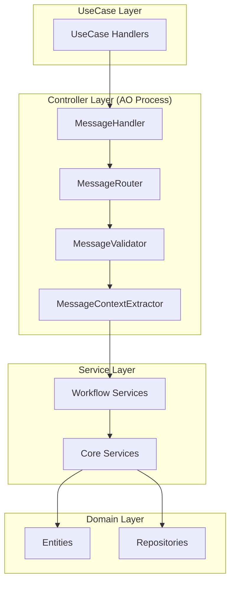
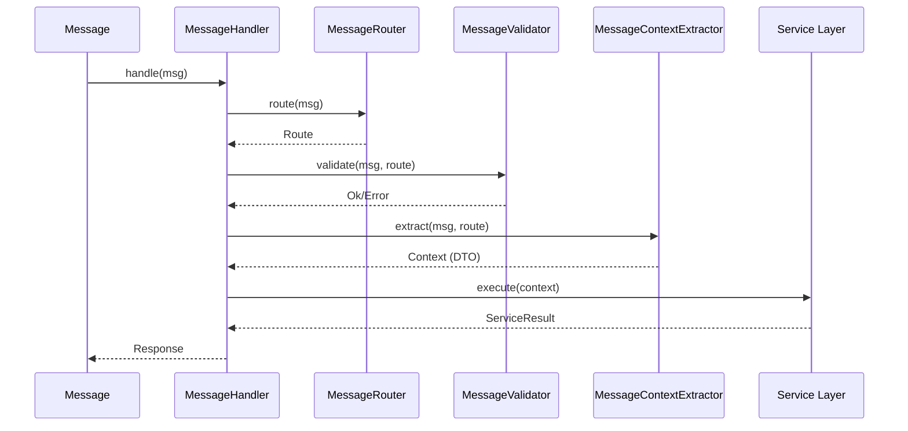

# D-TPRES Controller層設計概要

## 1. はじめに

本ドキュメントは、D-TPRES（Deterministic Threshold Proxy Re-Encryption System）のController層の設計と実装指針を定義します。Controller層は、TERASOLUNAガイドラインに基づき、AO Process環境においてメッセージ処理とService層への委譲を担当します。

### 1.1 Controller層の位置づけ



### 1.2 TERASOLUNAガイドライン準拠の責務

Controller層は以下の4つの責務を確実に実装します：

1. **入力検証（リクエストデータの妥当性確認）**
   - AOメッセージの形式検証
   - 必須フィールドの存在確認
   - データ型・範囲の妥当性検証

2. **型変換（Service層が扱うDTOへの変換）**
   - メッセージからコンテキストオブジェクトへの変換
   - Service層が期待する構造化データの生成
   - 型安全性の確保

3. **Service呼び出し（ビジネスロジックの実行委譲）**
   - 適切なService層メソッドの呼び出し
   - エラーハンドリング
   - トランザクション境界の管理

4. **レスポンス生成（実行結果の適切なフォーマット変換）**
   - Service層の結果をAOメッセージ形式に変換
   - エラーレスポンスの標準化
   - メタデータの付与

## 2. Controller層アーキテクチャ

### 2.1 全体構成

Controller層は、AO Process環境で動作し、以下のコンポーネントで構成されます：

| コンポーネント | 責務 |
|-------------|------|
| MessageHandler | メッセージ処理の統括・フロー制御 |
| MessageRouter | アクションタグによるルーティング |
| MessageValidator | メッセージの妥当性検証 |
| MessageContextExtractor | メッセージからDTOへの変換 |
| ServiceContainer | Service層インスタンスの管理 |

### 2.2 AO環境特有の考慮事項

#### ステートレス実行モデル
- 各メッセージは独立した実行単位
- 状態はArweaveから毎回読み込み
- メモリ上の状態は保持されない

#### WebAssembly制約
- 限られたランタイム環境
- 効率的なメモリ使用
- 同期的なI/O操作の制限

#### メッセージ駆動アーキテクチャ
- すべての処理はメッセージハンドラーとして実装
- 非同期メッセージングによるプロセス間通信
- イベントドリブンな処理フロー

## 3. MessageHandlerコアアーキテクチャ

### 3.1 基本構造

```rust
/// AOメッセージハンドラーの中核実装
/// Controller層のエントリーポイント
pub struct MessageHandler {
    router: MessageRouter,
    validator: MessageValidator,
    context_extractor: MessageContextExtractor,
    service_container: ServiceContainer,
}

impl MessageHandler {
    /// メッセージ処理のメインフロー
    pub async fn handle(&mut self, msg: Message) -> Response {
        // 1. メッセージルーティング
        let route = match self.router.route(&msg) {
            Ok(route) => route,
            Err(e) => return Self::routing_error_response(e),
        };
        
        // 2. 入力検証
        if let Err(e) = self.validator.validate(&msg, &route) {
            return Self::validation_error_response(e);
        }
        
        // 3. コンテキスト抽出（DTO変換）
        let context = match self.context_extractor.extract(&msg, &route) {
            Ok(ctx) => ctx,
            Err(e) => return Self::extraction_error_response(e),
        };
        
        // 4. Service層への委譲
        match self.delegate_to_service(&route, context).await {
            Ok(result) => Self::success_response(&route, result),
            Err(e) => Self::service_error_response(e),
        }
    }
    
    /// Service層への処理委譲
    async fn delegate_to_service(
        &mut self,
        route: &Route,
        context: Box<dyn Any>
    ) -> Result<ServiceResult, ServiceError> {
        match route {
            Route::SplitSecret => {
                let ctx = context.downcast::<SplitSecretContext>()
                    .map_err(|_| ServiceError::InvalidContext)?;
                self.service_container
                    .secret_sharing_workflow
                    .execute_split_secret(*ctx)
                    .await
            }
            Route::AccessRequest => {
                let ctx = context.downcast::<AccessRequestContext>()
                    .map_err(|_| ServiceError::InvalidContext)?;
                self.service_container
                    .access_request_workflow
                    .execute_access_request(*ctx)
                    .await
            }
            // 他のルートも同様に実装
            _ => Err(ServiceError::NotImplemented)
        }
    }
}
```

### 3.2 処理フローの詳細



## 4. MessageRouter設計

### 4.1 ルーティング戦略

```rust
pub struct MessageRouter {
    routes: HashMap<String, Route>,
}

impl MessageRouter {
    pub fn new() -> Self {
        let mut routes = HashMap::new();
        
        // Phase別ルート定義
        // Phase 1: 秘密分割
        routes.insert("Split-Secret".to_string(), Route::SplitSecret);
        
        // Phase 2: アクセス要求
        routes.insert("Access-Request".to_string(), Route::AccessRequest);
        routes.insert("Verify-Access".to_string(), Route::VerifyAccess);
        
        // Phase 3: 再暗号化キー配布
        routes.insert("Generate-ReKey".to_string(), Route::GenerateReKey);
        routes.insert("Distribute-KFrag".to_string(), Route::DistributeKFrag);
        routes.insert("Store-KFrag".to_string(), Route::StoreKFrag);
        
        // Phase 4: プロキシ再暗号化
        routes.insert("Request-Reencryption".to_string(), Route::RequestReencryption);
        routes.insert("Perform-Reencryption".to_string(), Route::PerformReencryption);
        routes.insert("Collect-CFrags".to_string(), Route::CollectCFrags);
        
        // Phase 5: 秘密復元
        routes.insert("Recover-Secret".to_string(), Route::RecoverSecret);
        
        Self { routes }
    }
    
    pub fn route(&self, msg: &Message) -> Result<Route, RoutingError> {
        let action = msg.tags.get("Action")
            .ok_or(RoutingError::MissingAction)?;
        
        self.routes.get(action)
            .cloned()
            .ok_or(RoutingError::UnknownAction(action.clone()))
    }
}

#[derive(Debug, Clone, PartialEq)]
pub enum Route {
    // Phase 1
    SplitSecret,
    
    // Phase 2
    AccessRequest,
    VerifyAccess,
    
    // Phase 3
    GenerateReKey,
    DistributeKFrag,
    StoreKFrag,
    
    // Phase 4
    RequestReencryption,
    PerformReencryption,
    CollectCFrags,
    
    // Phase 5
    RecoverSecret,
}
```

### 4.2 ルーティングエラー処理

```rust
#[derive(Debug, thiserror::Error)]
pub enum RoutingError {
    #[error("Missing Action tag in message")]
    MissingAction,
    
    #[error("Unknown action: {0}")]
    UnknownAction(String),
    
    #[error("Invalid route configuration")]
    InvalidConfiguration,
}
```

## 5. MessageValidator設計

### 5.1 検証フレームワーク

```rust
pub struct MessageValidator {
    validators: HashMap<Route, Box<dyn Validator>>,
}

impl MessageValidator {
    pub fn new() -> Self {
        let mut validators: HashMap<Route, Box<dyn Validator>> = HashMap::new();
        
        // Route別バリデーター登録
        validators.insert(Route::SplitSecret, Box::new(SplitSecretValidator));
        validators.insert(Route::AccessRequest, Box::new(AccessRequestValidator));
        validators.insert(Route::DistributeKFrag, Box::new(DistributeKFragValidator));
        // ... 他のバリデーター
        
        Self { validators }
    }
    
    pub fn validate(&self, msg: &Message, route: &Route) -> Result<(), ValidationError> {
        // 共通検証
        self.validate_common_fields(msg)?;
        
        // ルート固有検証
        if let Some(validator) = self.validators.get(route) {
            validator.validate(msg)?;
        }
        
        Ok(())
    }
    
    fn validate_common_fields(&self, msg: &Message) -> Result<(), ValidationError> {
        // Process IDの存在確認
        if msg.process_id.is_empty() {
            return Err(ValidationError::MissingProcessId);
        }
        
        // タイムスタンプの妥当性
        let current_time = current_timestamp();
        if msg.timestamp > current_time + ALLOWED_CLOCK_DRIFT {
            return Err(ValidationError::InvalidTimestamp);
        }
        
        Ok(())
    }
}
```

### 5.2 Phase別バリデーター実装例

```rust
pub trait Validator: Send + Sync {
    fn validate(&self, msg: &Message) -> Result<(), ValidationError>;
}

/// Phase 1: 秘密分割バリデーター
pub struct SplitSecretValidator;

impl Validator for SplitSecretValidator {
    fn validate(&self, msg: &Message) -> Result<(), ValidationError> {
        // 必須タグの確認
        let required_tags = ["Secret-Id", "Threshold-K", "Threshold-N"];
        for tag in required_tags {
            if !msg.tags.contains_key(tag) {
                return Err(ValidationError::MissingRequiredTag(tag.to_string()));
            }
        }
        
        // 閾値パラメータの検証
        let k = msg.tags.get("Threshold-K")
            .and_then(|v| v.parse::<u8>().ok())
            .ok_or(ValidationError::InvalidThreshold)?;
            
        let n = msg.tags.get("Threshold-N")
            .and_then(|v| v.parse::<u8>().ok())
            .ok_or(ValidationError::InvalidThreshold)?;
            
        if k > n || k == 0 || n == 0 {
            return Err(ValidationError::InvalidThresholdConfig { k, n });
        }
        
        // データペイロードの検証
        if msg.data.is_empty() {
            return Err(ValidationError::MissingSecretData);
        }
        
        Ok(())
    }
}
```

### 5.3 検証エラー定義

```rust
#[derive(Debug, thiserror::Error)]
pub enum ValidationError {
    #[error("Missing required tag: {0}")]
    MissingRequiredTag(String),
    
    #[error("Invalid threshold configuration: k={k}, n={n}")]
    InvalidThresholdConfig { k: u8, n: u8 },
    
    #[error("Missing process ID")]
    MissingProcessId,
    
    #[error("Invalid timestamp")]
    InvalidTimestamp,
    
    #[error("Invalid threshold value")]
    InvalidThreshold,
    
    #[error("Missing secret data")]
    MissingSecretData,
    
    #[error("Invalid data format: {0}")]
    InvalidDataFormat(String),
}
```

## 6. MessageContextExtractor設計

### 6.1 コンテキスト抽出フレームワーク

```rust
pub struct MessageContextExtractor {
    extractors: HashMap<Route, Box<dyn ContextExtractor>>,
}

impl MessageContextExtractor {
    pub fn new() -> Self {
        let mut extractors: HashMap<Route, Box<dyn ContextExtractor>> = HashMap::new();
        
        // Route別エクストラクター登録
        extractors.insert(Route::SplitSecret, Box::new(SplitSecretExtractor));
        extractors.insert(Route::AccessRequest, Box::new(AccessRequestExtractor));
        // ... 他のエクストラクター
        
        Self { extractors }
    }
    
    pub fn extract(&self, msg: &Message, route: &Route) -> Result<Box<dyn Any>, ExtractionError> {
        let extractor = self.extractors.get(route)
            .ok_or(ExtractionError::NoExtractorForRoute)?;
            
        extractor.extract(msg)
    }
}

pub trait ContextExtractor: Send + Sync {
    fn extract(&self, msg: &Message) -> Result<Box<dyn Any>, ExtractionError>;
}
```

### 6.2 DTO変換実装例

```rust
/// Phase 1: 秘密分割コンテキスト
#[derive(Debug, Clone)]
pub struct SplitSecretContext {
    pub secret_id: String,
    pub threshold_k: u8,
    pub threshold_n: u8,
    pub secret_data: Vec<u8>,
    pub owner_public_key: PublicKey,
    pub access_conditions: Vec<String>,
    pub metadata: HashMap<String, String>,
}

pub struct SplitSecretExtractor;

impl ContextExtractor for SplitSecretExtractor {
    fn extract(&self, msg: &Message) -> Result<Box<dyn Any>, ExtractionError> {
        let context = SplitSecretContext {
            secret_id: msg.tags.get("Secret-Id")
                .ok_or(ExtractionError::MissingTag("Secret-Id"))?
                .clone(),
            threshold_k: msg.tags.get("Threshold-K")
                .and_then(|s| s.parse().ok())
                .ok_or(ExtractionError::InvalidFormat("Threshold-K"))?,
            threshold_n: msg.tags.get("Threshold-N")
                .and_then(|s| s.parse().ok())
                .ok_or(ExtractionError::InvalidFormat("Threshold-N"))?,
            secret_data: msg.data.clone(),
            owner_public_key: self.extract_public_key(msg)?,
            access_conditions: self.extract_access_conditions(msg)?,
            metadata: self.extract_metadata(msg),
        };
        
        Ok(Box::new(context))
    }
}

impl SplitSecretExtractor {
    fn extract_public_key(&self, msg: &Message) -> Result<PublicKey, ExtractionError> {
        let key_str = msg.tags.get("Owner-Public-Key")
            .ok_or(ExtractionError::MissingTag("Owner-Public-Key"))?;
        
        let key_bytes = base64::decode(key_str)
            .map_err(|_| ExtractionError::InvalidFormat("Owner-Public-Key"))?;
            
        PublicKey::from_bytes(&key_bytes)
            .map_err(|_| ExtractionError::InvalidPublicKey)
    }
    
    fn extract_access_conditions(&self, msg: &Message) -> Result<Vec<String>, ExtractionError> {
        msg.tags.get("Access-Conditions")
            .map(|s| s.split(',').map(|c| c.trim().to_string()).collect())
            .ok_or(ExtractionError::MissingTag("Access-Conditions"))
    }
    
    fn extract_metadata(&self, msg: &Message) -> HashMap<String, String> {
        msg.tags.iter()
            .filter(|(k, _)| k.starts_with("Meta-"))
            .map(|(k, v)| (k.strip_prefix("Meta-").unwrap().to_string(), v.clone()))
            .collect()
    }
}
```

## 7. レスポンス生成

### 7.1 成功レスポンス

```rust
impl MessageHandler {
    fn success_response(route: &Route, result: ServiceResult) -> Response {
        let (status, data) = match result {
            ServiceResult::SplitSecret(r) => (
                "Split-Secret-Success",
                ResponseData::SplitSecret {
                    secret_id: r.secret_id,
                    share_count: r.shares.len() as u8,
                    capsule_tx_id: r.capsule_tx_id,
                }
            ),
            ServiceResult::AccessRequest(r) => (
                "Access-Request-Success",
                ResponseData::AccessRequest {
                    request_id: r.request_id,
                    status: r.status,
                    proof_package_tx_id: r.proof_package_tx_id,
                }
            ),
            // ... 他の結果タイプ
            _ => ("Success", ResponseData::Generic),
        };
        
        Response {
            tags: vec![
                ("Status", status),
                ("Timestamp", &current_timestamp().to_string()),
            ],
            data: serde_json::to_vec(&data).unwrap_or_default(),
        }
    }
}
```

### 7.2 エラーレスポンス

```rust
impl MessageHandler {
    fn validation_error_response(error: ValidationError) -> Response {
        Response {
            tags: vec![
                ("Status", "Error"),
                ("Error-Type", "Validation"),
                ("Error-Code", error.code()),
                ("Error-Message", &error.to_string()),
            ],
            data: vec![],
        }
    }
    
    fn service_error_response(error: ServiceError) -> Response {
        let (error_type, error_code, message) = match &error {
            ServiceError::Business(e) => ("Business", e.code(), e.to_string()),
            ServiceError::System(e) => {
                // システムエラーの詳細はログに記録
                log::error!("System error: {:?}", e);
                ("System", "SYSTEM_ERROR", "Internal server error".to_string())
            }
        };
        
        Response {
            tags: vec![
                ("Status", "Error"),
                ("Error-Type", error_type),
                ("Error-Code", error_code),
                ("Error-Message", &message),
            ],
            data: vec![],
        }
    }
}
```

## 8. エラーハンドリング戦略

### 8.1 エラー分類

```rust
#[derive(Debug, thiserror::Error)]
pub enum ControllerError {
    #[error("Routing error: {0}")]
    Routing(#[from] RoutingError),
    
    #[error("Validation error: {0}")]
    Validation(#[from] ValidationError),
    
    #[error("Extraction error: {0}")]
    Extraction(#[from] ExtractionError),
    
    #[error("Service error: {0}")]
    Service(#[from] ServiceError),
}
```

### 8.2 ロギングとモニタリング

```rust
impl MessageHandler {
    pub async fn handle_with_logging(&mut self, msg: Message) -> Response {
        let start = std::time::Instant::now();
        let msg_id = msg.tags.get("Message-Id").cloned().unwrap_or_default();
        let action = msg.tags.get("Action").cloned().unwrap_or_default();
        
        log::info!("Processing message: id={}, action={}", msg_id, action);
        
        let response = self.handle(msg).await;
        let duration = start.elapsed();
        
        match response.tags.iter().find(|(k, _)| k == &"Status") {
            Some((_, status)) if status.contains("Success") => {
                log::info!(
                    "Message processed successfully: id={}, action={}, duration={:?}",
                    msg_id, action, duration
                );
            }
            _ => {
                log::error!(
                    "Message processing failed: id={}, action={}, duration={:?}",
                    msg_id, action, duration
                );
            }
        }
        
        response
    }
}
```

## 9. セキュリティ設計

### 9.1 入力サニタイゼーション

```rust
impl MessageValidator {
    fn sanitize_string(&self, input: &str) -> Result<String, ValidationError> {
        // 最大長チェック
        if input.len() > MAX_STRING_LENGTH {
            return Err(ValidationError::InputTooLong);
        }
        
        // 制御文字の除去
        let sanitized = input.chars()
            .filter(|c| !c.is_control())
            .collect::<String>();
        
        // SQLインジェクション対策（必要に応じて）
        if sanitized.contains(['\'', '"', ';', '-', '/', '*']) {
            return Err(ValidationError::InvalidCharacters);
        }
        
        Ok(sanitized)
    }
}
```

### 9.2 Rate Limiting

```rust
pub struct RateLimiter {
    limits: HashMap<ProcessId, TokenBucket>,
}

impl RateLimiter {
    pub fn check_limit(&mut self, process_id: &ProcessId) -> Result<(), RateLimitError> {
        let bucket = self.limits.entry(process_id.clone())
            .or_insert_with(|| TokenBucket::new(100, Duration::from_secs(60)));
        
        if bucket.try_consume(1) {
            Ok(())
        } else {
            Err(RateLimitError::LimitExceeded)
        }
    }
}
```

## 10. パフォーマンス最適化

### 10.1 非同期処理の活用

```rust
impl MessageHandler {
    async fn delegate_to_service_parallel(
        &mut self,
        requests: Vec<(Route, Box<dyn Any>)>
    ) -> Vec<Result<ServiceResult, ServiceError>> {
        let mut futures = Vec::new();
        
        for (route, context) in requests {
            let future = self.delegate_to_service(&route, context);
            futures.push(future);
        }
        
        futures::future::join_all(futures).await
    }
}
```

### 10.2 バリデーションキャッシュ

```rust
pub struct CachingValidator<V: Validator> {
    inner: V,
    cache: LruCache<MessageHash, ValidationResult>,
}

impl<V: Validator> Validator for CachingValidator<V> {
    fn validate(&self, msg: &Message) -> Result<(), ValidationError> {
        let hash = self.compute_hash(msg);
        
        if let Some(cached) = self.cache.get(&hash) {
            return cached.clone();
        }
        
        let result = self.inner.validate(msg);
        self.cache.put(hash, result.clone());
        
        result
    }
}
```

## 11. テスト戦略

### 11.1 単体テスト

```rust
#[cfg(test)]
mod tests {
    use super::*;
    
    #[test]
    fn test_message_routing() {
        let router = MessageRouter::new();
        let msg = Message {
            tags: vec![("Action".to_string(), "Split-Secret".to_string())].into_iter().collect(),
            ..Default::default()
        };
        
        let route = router.route(&msg).unwrap();
        assert_eq!(route, Route::SplitSecret);
    }
    
    #[test]
    fn test_split_secret_validation() {
        let validator = SplitSecretValidator;
        let valid_msg = create_valid_split_secret_message();
        
        assert!(validator.validate(&valid_msg).is_ok());
    }
    
    #[tokio::test]
    async fn test_message_handler_flow() {
        let mut handler = MessageHandler::new(test_dependencies());
        let msg = create_test_message("Split-Secret");
        
        let response = handler.handle(msg).await;
        assert!(response.tags.iter().any(|(k, v)| k == "Status" && v.contains("Success")));
    }
}
```

### 11.2 統合テスト

```rust
#[cfg(test)]
mod integration_tests {
    use super::*;
    
    #[tokio::test]
    async fn test_end_to_end_split_secret() {
        let mut handler = create_test_handler();
        let msg = create_split_secret_message();
        
        let response = handler.handle(msg).await;
        
        // レスポンス検証
        assert_eq!(get_status(&response), "Split-Secret-Success");
        assert!(get_secret_id(&response).is_some());
    }
}
```

## 12. まとめ

D-TPRES Controller層は、TERASOLUNAガイドラインの4つの責務を確実に実装し、AO Process環境に最適化された設計となっています。

### 主要な設計原則

1. **責務の明確な分離**: 各コンポーネントが単一責任原則に従う
2. **ビジネスロジックの排除**: すべてのビジネスロジックはService層に委譲
3. **拡張性の確保**: 新しいPhaseやアクションの追加が容易
4. **エラーハンドリングの一貫性**: 標準化されたエラーレスポンス
5. **AO環境への最適化**: ステートレス設計とメッセージ駆動アーキテクチャ

### 次のステップ

- [AOメッセージハンドラー詳細設計](./ao_message_handler.md)
- [UseCase層ハンドラー設計](../usecase/handler_overview.md)

---

**Document Status**: Controller Layer Design Specification  
**Version**: 1.0  
**Last Updated**: 2025-01-07