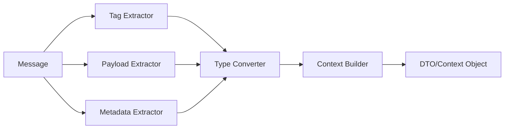

# MessageContextExtractor詳細設計

## 1. 概要

MessageContextExtractorは、AOメッセージからService層が必要とするコンテキストオブジェクト（DTO）を抽出・生成するコンポーネントです。Controller層における型変換の責務を担い、メッセージの生データを構造化されたビジネスオブジェクトに変換します。

### 1.1 責務と目的

MessageContextExtractorの主要な責務：

1. **データ抽出**
   - メッセージタグからの値取得
   - ペイロードのパース
   - メタデータの収集

2. **型変換**
   - 文字列から適切な型への変換
   - Base64デコード
   - JSON/バイナリデータのデシリアライズ

3. **コンテキスト生成**
   - Service層DTOの構築
   - デフォルト値の設定
   - 関連データの結合

### 1.2 設計原則

- **型安全性**: コンパイル時の型チェック
- **エラー処理**: 変換失敗時の明確なエラー
- **拡張性**: 新しいコンテキストタイプの追加が容易
- **パフォーマンス**: 効率的な変換処理

## 2. アーキテクチャ

### 2.1 抽出フロー



### 2.2 コンポーネント構成

| コンポーネント | 責務 | 実装詳細 |
|--------------|------|---------|
| TagExtractor | タグからの値抽出 | キー・バリューアクセス |
| PayloadExtractor | ペイロードの解析 | デシリアライゼーション |
| MetadataExtractor | メタデータ収集 | 追加情報の抽出 |
| TypeConverter | 型変換処理 | 文字列→各種型 |
| ContextBuilder | DTOの組み立て | ビルダーパターン |
| ExtractorRegistry | 抽出器の管理 | Route別の登録 |

## 3. コンテキスト（DTO）仕様

### 3.1 基本コンテキスト構造

すべてのコンテキストが継承する基本構造：

```rust
pub trait MessageContext: Send + Sync {
    /// コンテキストの種別
    fn context_type(&self) -> &'static str;
    
    /// 検証メソッド
    fn validate(&self) -> Result<(), ValidationError>;
    
    /// デバッグ用の文字列表現
    fn debug_info(&self) -> String;
}

#[derive(Debug, Clone)]
pub struct BaseContext {
    /// メッセージID
    pub message_id: String,
    
    /// プロセスID
    pub process_id: ProcessId,
    
    /// タイムスタンプ
    pub timestamp: SystemTime,
    
    /// 送信元情報
    pub sender: Option<ProcessId>,
    
    /// トレース情報
    pub trace_id: Option<String>,
}
```

### 3.2 Phase別コンテキスト定義

#### Phase 1: 秘密分割

```rust
#[derive(Debug, Clone)]
pub struct SplitSecretContext {
    /// 基本情報
    pub base: BaseContext,
    
    /// 秘密識別子
    pub secret_id: String,
    
    /// 閾値パラメータ
    pub threshold_k: u8,
    pub threshold_n: u8,
    
    /// 秘密データ
    pub secret_data: Vec<u8>,
    
    /// 所有者公開鍵
    pub owner_public_key: PublicKey,
    
    /// アクセス条件
    pub access_conditions: AccessConditions,
    
    /// メタデータ
    pub metadata: HashMap<String, String>,
    
    /// オプション設定
    pub options: SplitSecretOptions,
}

#[derive(Debug, Clone, Default)]
pub struct SplitSecretOptions {
    /// シェアの暗号化を有効化
    pub encrypt_shares: bool,
    
    /// カスタムシェアID生成
    pub custom_share_ids: Option<Vec<String>>,
    
    /// 有効期限
    pub expiration: Option<SystemTime>,
}
```

#### Phase 2: アクセス要求

```rust
#[derive(Debug, Clone)]
pub struct AccessRequestContext {
    /// 基本情報
    pub base: BaseContext,
    
    /// 対象秘密ID
    pub secret_id: String,
    
    /// リクエスター情報
    pub requester_id: ProcessId,
    pub requester_address: EthereumAddress,
    pub requester_public_key: PublicKey,
    
    /// アクセス条件の証明
    pub access_proof: AccessProof,
    
    /// 要求の詳細
    pub request_details: RequestDetails,
}

#[derive(Debug, Clone)]
pub struct AccessProof {
    /// 証明タイプ
    pub proof_type: ProofType,
    
    /// 証明データ
    pub proof_data: serde_json::Value,
    
    /// 署名
    pub signature: Option<Signature>,
    
    /// 外部検証結果
    pub external_verification: Option<ExternalVerification>,
}
```

#### Phase 3: 再暗号化キー配布

```rust
#[derive(Debug, Clone)]
pub struct DistributeKFragContext {
    /// 基本情報
    pub base: BaseContext,
    
    /// アクセス要求ID
    pub access_request_id: String,
    
    /// 再暗号化キー
    pub reencryption_key: ReencryptionKey,
    
    /// 選択されたホルダー
    pub selected_holders: Vec<HolderInfo>,
    
    /// 配布戦略
    pub distribution_strategy: DistributionStrategy,
}

#[derive(Debug, Clone)]
pub struct HolderInfo {
    /// ホルダープロセスID
    pub process_id: ProcessId,
    
    /// 信頼スコア
    pub trust_score: f64,
    
    /// 可用性指標
    pub availability: f64,
    
    /// 地理的情報
    pub geo_info: Option<GeoInfo>,
}
```

### 3.3 共通データ構造

```rust
/// アクセス条件
#[derive(Debug, Clone)]
pub enum AccessConditions {
    /// 時間ベース
    TimeBasedAccess {
        not_before: SystemTime,
        not_after: SystemTime,
    },
    
    /// トークンゲート
    TokenGated {
        contract_address: EthereumAddress,
        required_balance: U256,
    },
    
    /// ホワイトリスト
    Whitelist {
        allowed_addresses: Vec<EthereumAddress>,
    },
    
    /// カスタム条件
    Custom {
        condition_type: String,
        parameters: serde_json::Value,
    },
}

/// プロセスID
#[derive(Debug, Clone, PartialEq, Eq, Hash)]
pub struct ProcessId(String);

/// Ethereumアドレス
#[derive(Debug, Clone)]
pub struct EthereumAddress([u8; 20]);
```

## 4. 抽出パターン

### 4.1 抽出器インターフェース

```rust
pub trait ContextExtractor: Send + Sync {
    /// 抽出可能なコンテキストタイプ
    type Context: MessageContext;
    
    /// メッセージからコンテキストを抽出
    fn extract(&self, msg: &Message) -> Result<Self::Context, ExtractionError>;
    
    /// 必要なタグのリスト
    fn required_tags(&self) -> &[&'static str];
    
    /// オプショナルタグのリスト
    fn optional_tags(&self) -> &[&'static str];
}
```

### 4.2 汎用抽出ヘルパー

```rust
pub struct ExtractionHelpers;

impl ExtractionHelpers {
    /// 文字列タグの抽出
    pub fn extract_string(
        msg: &Message, 
        tag: &str
    ) -> Result<String, ExtractionError> {
        msg.tags.get(tag)
            .cloned()
            .ok_or_else(|| ExtractionError::MissingTag(tag.to_string()))
    }
    
    /// 数値タグの抽出
    pub fn extract_number<T: FromStr>(
        msg: &Message, 
        tag: &str
    ) -> Result<T, ExtractionError> 
    where
        T::Err: std::error::Error + Send + Sync + 'static,
    {
        let value = Self::extract_string(msg, tag)?;
        value.parse::<T>()
            .map_err(|e| ExtractionError::ParseError {
                tag: tag.to_string(),
                value,
                error: Box::new(e),
            })
    }
    
    /// Base64エンコードされたバイナリの抽出
    pub fn extract_base64_bytes(
        msg: &Message, 
        tag: &str
    ) -> Result<Vec<u8>, ExtractionError> {
        let value = Self::extract_string(msg, tag)?;
        base64::decode(&value)
            .map_err(|e| ExtractionError::DecodeError {
                tag: tag.to_string(),
                encoding: "base64",
                error: e.to_string(),
            })
    }
    
    /// JSONタグの抽出
    pub fn extract_json<T: DeserializeOwned>(
        msg: &Message, 
        tag: &str
    ) -> Result<T, ExtractionError> {
        let value = Self::extract_string(msg, tag)?;
        serde_json::from_str(&value)
            .map_err(|e| ExtractionError::JsonError {
                tag: tag.to_string(),
                error: e.to_string(),
            })
    }
}
```

### 4.3 コンテキストビルダー

```rust
pub struct ContextBuilder<T: MessageContext> {
    context: T,
    errors: Vec<ExtractionError>,
}

impl<T: MessageContext> ContextBuilder<T> {
    pub fn new(context: T) -> Self {
        Self {
            context,
            errors: Vec::new(),
        }
    }
    
    /// フィールド設定（エラーを蓄積）
    pub fn try_set<F>(mut self, setter: F) -> Self 
    where
        F: FnOnce(&mut T) -> Result<(), ExtractionError>
    {
        if let Err(e) = setter(&mut self.context) {
            self.errors.push(e);
        }
        self
    }
    
    /// オプショナルフィールド設定
    pub fn maybe_set<F>(mut self, setter: F) -> Self 
    where
        F: FnOnce(&mut T) -> Result<(), ExtractionError>
    {
        // エラーは無視
        let _ = setter(&mut self.context);
        self
    }
    
    /// ビルド完了
    pub fn build(self) -> Result<T, ExtractionError> {
        if self.errors.is_empty() {
            self.context.validate()?;
            Ok(self.context)
        } else {
            Err(ExtractionError::MultipleErrors(self.errors))
        }
    }
}
```

## 5. 型変換仕様

### 5.1 基本型変換

| 元の型 | 変換先 | 変換メソッド | エラー処理 |
|--------|--------|------------|-----------|
| String | u8/u16/u32/u64 | parse() | ParseIntError |
| String | bool | "true"/"false" | InvalidBool |
| String | SystemTime | RFC3339パース | InvalidTimestamp |
| String | Vec<u8> | Base64/Hex | DecodeError |
| String | PublicKey | 鍵形式パース | InvalidKeyFormat |

### 5.2 複合型変換

```rust
/// カンマ区切り文字列からリストへ
pub fn parse_string_list(value: &str) -> Vec<String> {
    value.split(',')
        .map(|s| s.trim().to_string())
        .filter(|s| !s.is_empty())
        .collect()
}

/// キー=値形式からHashMapへ
pub fn parse_key_value_pairs(value: &str) -> HashMap<String, String> {
    value.split(';')
        .filter_map(|pair| {
            let parts: Vec<&str> = pair.split('=').collect();
            if parts.len() == 2 {
                Some((parts[0].trim().to_string(), parts[1].trim().to_string()))
            } else {
                None
            }
        })
        .collect()
}

/// ネストしたJSON構造
pub fn parse_nested_structure<T: DeserializeOwned>(
    value: &str
) -> Result<T, serde_json::Error> {
    serde_json::from_str(value)
}
```

### 5.3 カスタム型変換

D-TPRES特有の型変換：

```rust
/// Umbral公開鍵の変換
pub fn parse_umbral_public_key(value: &str) -> Result<PublicKey, CryptoError> {
    let bytes = base64::decode(value)?;
    PublicKey::from_bytes(&bytes)
}

/// Ethereumアドレスの変換
pub fn parse_ethereum_address(value: &str) -> Result<EthereumAddress, AddressError> {
    if !value.starts_with("0x") || value.len() != 42 {
        return Err(AddressError::InvalidFormat);
    }
    
    let bytes = hex::decode(&value[2..])?;
    Ok(EthereumAddress::from_slice(&bytes))
}

/// 閾値パラメータの検証付き変換
pub fn parse_threshold_params(
    k_str: &str, 
    n_str: &str
) -> Result<(u8, u8), ThresholdError> {
    let k = k_str.parse::<u8>()?;
    let n = n_str.parse::<u8>()?;
    
    if k == 0 || k > n {
        return Err(ThresholdError::InvalidValues { k, n });
    }
    
    Ok((k, n))
}
```

## 6. エラーハンドリング

### 6.1 エラー階層

```rust
#[derive(Debug, thiserror::Error)]
pub enum ExtractionError {
    #[error("Missing required tag: {0}")]
    MissingTag(String),
    
    #[error("Parse error for tag '{tag}': {error}")]
    ParseError {
        tag: String,
        value: String,
        #[source]
        error: Box<dyn std::error::Error + Send + Sync>,
    },
    
    #[error("Decode error for tag '{tag}' with encoding '{encoding}': {error}")]
    DecodeError {
        tag: String,
        encoding: &'static str,
        error: String,
    },
    
    #[error("JSON parse error for tag '{tag}': {error}")]
    JsonError {
        tag: String,
        error: String,
    },
    
    #[error("Invalid format for tag '{tag}': expected {expected}, got {actual}")]
    InvalidFormat {
        tag: String,
        expected: String,
        actual: String,
    },
    
    #[error("Multiple extraction errors: {0:?}")]
    MultipleErrors(Vec<ExtractionError>),
    
    #[error("Context validation failed: {0}")]
    ValidationFailed(String),
}
```

### 6.2 エラーリカバリー

```rust
pub struct ResilientExtractor<E: ContextExtractor> {
    inner: E,
    defaults: HashMap<String, String>,
}

impl<E: ContextExtractor> ResilientExtractor<E> {
    /// デフォルト値を使用してエラーを回復
    pub fn with_defaults(mut self, defaults: HashMap<String, String>) -> Self {
        self.defaults = defaults;
        self
    }
    
    /// 部分的な抽出を許可
    pub fn allow_partial(&self) -> bool {
        true
    }
}
```

## 7. パフォーマンス最適化

### 7.1 最適化戦略

1. **遅延評価**
   - 必要になるまで変換を遅延
   - 大きなペイロードの段階的処理

2. **キャッシング**
   - 頻繁に使用される変換結果のキャッシュ
   - 特に暗号系の型変換

3. **並列処理**
   - 独立したフィールドの並列抽出
   - 非同期I/Oの活用

### 7.2 ベンチマーク指標

| 操作 | 目標性能 | 実測値 |
|------|---------|--------|
| 基本型変換 | < 100ns | - |
| JSON パース (1KB) | < 10μs | - |
| Base64 デコード (10KB) | < 100μs | - |
| 完全なコンテキスト抽出 | < 1ms | - |

## 8. 拡張性設計

### 8.1 カスタム抽出器の登録

```rust
pub struct ExtractorRegistry {
    extractors: HashMap<Route, Box<dyn DynamicExtractor>>,
}

impl ExtractorRegistry {
    pub fn register<E: ContextExtractor + 'static>(
        &mut self,
        route: Route,
        extractor: E,
    ) {
        self.extractors.insert(route, Box::new(extractor));
    }
    
    pub fn extract(
        &self,
        route: &Route,
        msg: &Message,
    ) -> Result<Box<dyn Any>, ExtractionError> {
        let extractor = self.extractors.get(route)
            .ok_or(ExtractionError::NoExtractorForRoute)?;
        
        extractor.extract_dynamic(msg)
    }
}
```

### 8.2 プラグイン可能な変換器

```rust
pub trait TypeTransformer<T> {
    fn transform(&self, value: &str) -> Result<T, TransformError>;
}

pub struct TransformerRegistry {
    transformers: HashMap<TypeId, Box<dyn Any>>,
}
```

## 9. デバッグとトレース

### 9.1 抽出トレース

```rust
pub struct TracingExtractor<E: ContextExtractor> {
    inner: E,
    traces: Vec<ExtractionTrace>,
}

#[derive(Debug)]
pub struct ExtractionTrace {
    pub tag: String,
    pub raw_value: Option<String>,
    pub converted_value: Option<String>,
    pub duration: Duration,
    pub result: Result<(), String>,
}
```

### 9.2 デバッグ出力

```rust
impl<T: MessageContext> fmt::Debug for ContextBuilder<T> {
    fn fmt(&self, f: &mut fmt::Formatter<'_>) -> fmt::Result {
        f.debug_struct("ContextBuilder")
            .field("context_type", &self.context.context_type())
            .field("errors", &self.errors)
            .field("partial_context", &self.context.debug_info())
            .finish()
    }
}
```

## 10. テスト戦略

### 10.1 単体テスト

```rust
#[cfg(test)]
mod tests {
    #[test]
    fn test_basic_extraction() {
        let msg = create_test_message(vec![
            ("Secret-Id", "test-123"),
            ("Threshold-K", "3"),
            ("Threshold-N", "5"),
        ]);
        
        let extractor = SplitSecretExtractor::new();
        let context = extractor.extract(&msg).unwrap();
        
        assert_eq!(context.secret_id, "test-123");
        assert_eq!(context.threshold_k, 3);
        assert_eq!(context.threshold_n, 5);
    }
    
    #[test]
    fn test_missing_required_tag() {
        let msg = create_test_message(vec![
            ("Secret-Id", "test-123"),
            // Threshold-K is missing
            ("Threshold-N", "5"),
        ]);
        
        let extractor = SplitSecretExtractor::new();
        let result = extractor.extract(&msg);
        
        assert!(matches!(
            result,
            Err(ExtractionError::MissingTag(tag)) if tag == "Threshold-K"
        ));
    }
}
```

### 10.2 プロパティベーステスト

```rust
use proptest::prelude::*;

proptest! {
    #[test]
    fn test_threshold_extraction_preserves_order(
        k in 1u8..=255,
        n in 1u8..=255,
    ) {
        let msg = create_test_message(vec![
            ("Threshold-K", &k.to_string()),
            ("Threshold-N", &n.to_string()),
        ]);
        
        let extractor = ThresholdExtractor::new();
        if let Ok((extracted_k, extracted_n)) = extractor.extract(&msg) {
            assert_eq!(extracted_k, k);
            assert_eq!(extracted_n, n);
        }
    }
}
```

## 11. まとめ

MessageContextExtractorは、メッセージとService層の橋渡しをする重要なコンポーネントです：

1. **型安全な変換**: コンパイル時の型チェックによる安全性
2. **柔軟な抽出**: 様々なデータ形式に対応
3. **エラー処理**: 明確で詳細なエラー情報
4. **高い拡張性**: 新しいコンテキストタイプの追加が容易
5. **デバッグ支援**: トレースとログによる問題解析

これらの特性により、AOメッセージからService層が必要とする構造化データへの確実な変換を実現します。