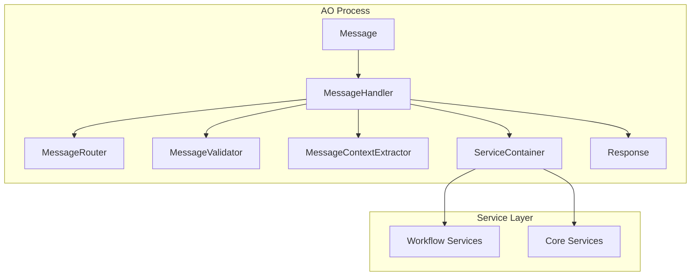

# MessageHandler詳細設計

## 1. 概要

MessageHandlerは、D-TPRES Controller層の中核コンポーネントです。AOプロセスに到着したメッセージを受け取り、適切な処理フローを制御し、レスポンスを生成する責務を持ちます。

### 1.1 位置づけと役割



### 1.2 主要な責務

1. **メッセージ処理の統括**
   - 処理フローの制御
   - エラーハンドリング
   - ロギングとモニタリング

2. **コンポーネント間の調整**
   - Router、Validator、ContextExtractorの呼び出し
   - Service層への委譲
   - レスポンスの生成

3. **非機能要件の実装**
   - パフォーマンス計測
   - セキュリティチェック
   - Rate Limiting

## 2. 設計詳細

### 2.1 クラス構造

MessageHandlerは、依存性注入により他のコンポーネントを受け取る設計となっています。

```rust
pub struct MessageHandler {
    // コアコンポーネント
    router: MessageRouter,
    validator: MessageValidator,
    context_extractor: MessageContextExtractor,
    service_container: ServiceContainer,
    
    // 補助コンポーネント
    rate_limiter: Option<RateLimiter>,
    metrics_collector: Option<MetricsCollector>,
    
    // 設定
    config: MessageHandlerConfig,
}
```

### 2.2 処理フローの詳細

MessageHandlerの処理は、以下の明確な段階に分かれています：

#### 2.2.1 前処理（Pre-processing）

```
1. Rate Limiting チェック
   - プロセスIDベースの制限
   - 過剰なリクエストの拒否

2. メトリクス開始
   - 処理開始時刻の記録
   - リクエストカウンターの更新
```

#### 2.2.2 メイン処理（Main Processing）

```
3. ルーティング
   - MessageRouterを使用してRouteを決定
   - 未知のアクションの早期エラー返却

4. バリデーション
   - 共通フィールドの検証
   - Route固有の検証ルール適用

5. コンテキスト抽出
   - メッセージからDTOへの変換
   - Service層が期待する形式への整形

6. Service層呼び出し
   - 適切なWorkflow Serviceの選択
   - ビジネスロジックの実行
```

#### 2.2.3 後処理（Post-processing）

```
7. レスポンス生成
   - Service結果の変換
   - メタデータの付与

8. メトリクス記録
   - 処理時間の計測
   - 成功/失敗の記録
```

### 2.3 エラーハンドリング戦略

MessageHandlerは、各処理段階で発生する可能性のあるエラーを適切に処理します：

#### エラーの分類と処理

| エラー種別 | 発生箇所 | 処理方法 | レスポンス |
|-----------|----------|----------|------------|
| Rate Limit超過 | 前処理 | 即座に拒否 | 429 Too Many Requests |
| ルーティングエラー | ルーティング | エラーレスポンス | 404 Unknown Action |
| バリデーションエラー | バリデーション | 詳細エラー情報 | 400 Bad Request |
| コンテキスト抽出エラー | 抽出処理 | 変換失敗の詳細 | 400 Bad Request |
| ビジネスエラー | Service層 | ビジネスエラー情報 | 200 with error details |
| システムエラー | Service層 | 一般的エラーメッセージ | 500 Internal Error |

### 2.4 ライフサイクル管理

#### 2.4.1 初期化

MessageHandlerの初期化時には、すべての依存コンポーネントが正しく設定されていることを確認します：

```
1. 設定の読み込みと検証
2. 必須コンポーネントの存在確認
3. オプショナルコンポーネントの設定
4. ヘルスチェック実行
```

#### 2.4.2 実行時

各メッセージ処理は独立したコンテキストで実行されます：

```
- スレッドセーフな実装
- 状態を持たない設計（ステートレス）
- リソースの適切な管理
```

#### 2.4.3 シャットダウン

グレースフルシャットダウンをサポートします：

```
1. 新規メッセージの受付停止
2. 処理中のメッセージの完了待機
3. リソースのクリーンアップ
4. メトリクスの最終フラッシュ
```

## 3. インターフェース設計

### 3.1 公開インターフェース

MessageHandlerが外部に公開する主要なインターフェース：

```rust
impl MessageHandler {
    /// メッセージ処理のメインエントリーポイント
    pub async fn handle(&mut self, msg: Message) -> Response
    
    /// ロギング付きメッセージ処理
    pub async fn handle_with_logging(&mut self, msg: Message) -> Response
    
    /// バッチ処理のサポート
    pub async fn handle_batch(&mut self, messages: Vec<Message>) -> Vec<Response>
    
    /// ヘルスチェック
    pub fn health_check(&self) -> HealthStatus
}
```

### 3.2 内部インターフェース

内部的に使用される重要なメソッド：

```rust
impl MessageHandler {
    /// Service層への委譲
    async fn delegate_to_service(&mut self, route: &Route, context: Box<dyn Any>) -> Result<ServiceResult, ServiceError>
    
    /// レスポンス生成ヘルパー
    fn success_response(route: &Route, result: ServiceResult) -> Response
    fn error_response(error: ControllerError) -> Response
    
    /// メトリクス記録
    fn record_metrics(&self, start_time: Instant, success: bool)
}
```

## 4. 設定と拡張性

### 4.1 設定項目

MessageHandlerConfigで管理される設定項目：

| 設定項目 | 説明 | デフォルト値 |
|---------|------|------------|
| enable_rate_limiting | Rate Limitingの有効化 | true |
| rate_limit_requests | 分あたりのリクエスト数上限 | 100 |
| enable_metrics | メトリクス収集の有効化 | true |
| request_timeout | リクエストタイムアウト | 30秒 |
| max_batch_size | バッチ処理の最大サイズ | 100 |
| log_level | ログレベル | INFO |

### 4.2 拡張ポイント

MessageHandlerは以下の点で拡張可能な設計となっています：

1. **ミドルウェアパターン**
   - 処理の前後にカスタムロジックを挿入可能
   - 認証、監査、キャッシングなどの横断的関心事に対応

2. **プラガブルコンポーネント**
   - Router、Validator、ContextExtractorは差し替え可能
   - インターフェースに準拠した実装を提供

3. **イベントフック**
   - 処理の各段階でイベントを発火
   - 外部システムとの連携が可能

## 5. パフォーマンス考慮事項

### 5.1 最適化戦略

1. **非同期処理の活用**
   - I/O待機時間の最小化
   - 並列処理による高速化

2. **リソースプーリング**
   - Service層インスタンスの再利用
   - コネクションプールの活用

3. **早期リターン**
   - エラー条件の早期チェック
   - 不要な処理のスキップ

### 5.2 パフォーマンス指標

監視すべき主要指標：

| 指標 | 目標値 | アラート閾値 |
|------|--------|------------|
| 平均レスポンス時間 | < 100ms | > 500ms |
| P99レスポンス時間 | < 500ms | > 2000ms |
| エラー率 | < 1% | > 5% |
| スループット | > 1000 req/min | < 100 req/min |

## 6. セキュリティ考慮事項

### 6.1 入力検証

- すべての入力データのサニタイゼーション
- SQLインジェクション対策
- XSS対策
- パストラバーサル対策

### 6.2 認証・認可

- プロセスIDベースの認証
- アクション単位の認可チェック
- 署名検証のサポート

### 6.3 監査ログ

- すべてのリクエストの記録
- エラーの詳細なロギング
- セキュリティイベントの追跡

## 7. テスト戦略

### 7.1 単体テスト

各メソッドの独立したテスト：
- 正常系のフロー
- エラー処理
- エッジケース

### 7.2 統合テスト

コンポーネント間の連携テスト：
- Router → Validator → ContextExtractor → Service
- エラー伝播の確認
- レスポンス形式の検証

### 7.3 性能テスト

- 負荷テスト
- ストレステスト
- メモリリークの確認

## 8. まとめ

MessageHandlerは、Controller層の中核として以下の特徴を持ちます：

1. **明確な責務分離**: 処理フローの制御に特化
2. **拡張可能な設計**: プラガブルなアーキテクチャ
3. **堅牢なエラーハンドリング**: 各段階での適切な処理
4. **高いテスタビリティ**: 依存性注入による疎結合
5. **パフォーマンス最適化**: 非同期処理と効率的なリソース管理

これらの設計により、保守性と拡張性に優れたController層を実現します。