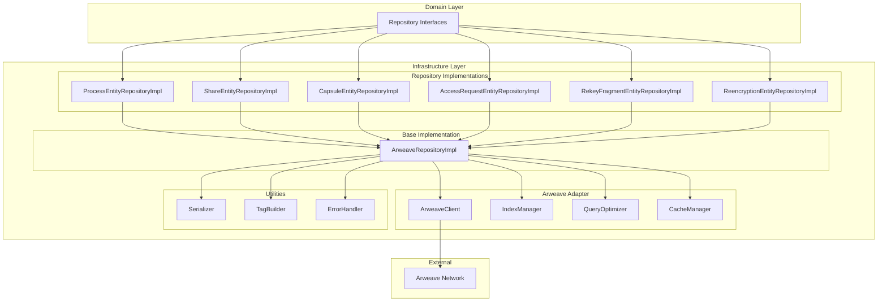

# D-TPRES Repository Implementation詳細設計

## 1. 概要

### 1.1 環境特性

- **状態の永続性**: AOプロセスはメッセージ処理ごとに異なるCompute Unit（CU）で実行され、メモリ上の状態は保持されない
- **データの不変性**: Arweaveは追記専用ストレージ
- **パフォーマンス要求**: 分散環境での高速データアクセス

### 1.2 責務分離

- **Entity**: データ構造定義のみ（メソッドを持たない）
- **Repository Interface**: CRUD操作の抽象定義
- **Repository Implementation**: Arweave永続化の具体実装

## 2. アーキテクチャ概要

### 2.1 実装層の構造



### 2.2 設計原則

1. **不変性への対応**: Arweaveの追記専用特性に対応し、更新は新バージョンとして実装
2. **効率的なクエリ**: タグベースインデックスによる高速検索
3. **キャッシュ戦略**: 単一メッセージ処理内でのメモリキャッシュ
4. **エラー処理**: 自動リトライとネットワーク障害対応
5. **型安全性**: ジェネリクスによる厳密な型管理

### 2.3 AOステートレス実行環境対応

#### データアクセスパターン

```rust
// バッチ処理
let entities = repo.find_by_ids(&ids).await?;

// インデックス活用
let index = process_repo.get_secret_index(process_id, secret_id).await?;
if index.status == "active" {
    let details = details_repo.find_by_id(&index.details_id).await?;
}

// 選択的ロード
match action {
    "List" => load_indices_only(),
    "Update" => load_full_entity(),
}
```

```rust
pub struct AOMessageContext {
    pub process_id: String,
    pub action: String,
    pub tags: HashMap<String, String>,
}

impl AOMessageContext {
    pub fn required_entities(&self) -> Vec<EntityType> {
        match self.action.as_str() {
            "Split-Secret" => vec![EntityType::Process],
            "Access-Request" => vec![
                EntityType::Process,
                EntityType::SecretDetails,
            ],
            "Re-Encrypt" => vec![
                EntityType::Process,
                EntityType::Share,
                EntityType::Capsule,
                EntityType::RekeyFragment,
            ],
            _ => vec![EntityType::Process],
        }
    }
}
```

#### Repository最適化パターン

```rust
let tags = HashMap::from([
    ("App-Name", "D-TPRES"),
    ("Entity-Type", "ShareEntity"),
    ("Entity-Id", "share_001"),
    ("Timestamp", "1703001600"),
    ("Secret-Id", "secret_001"),
    ("Owner-Id", "owner_001"),
]);

let (shares, capsules, details) = tokio::join!(
    share_repo.find_by_ids(&share_ids),
    capsule_repo.find_by_ids(&capsule_ids),
    details_repo.find_by_id(&details_id)
);
```

## 3. ArweaveClient

### 3.1 インターフェース

```rust
use async_trait::async_trait;
use std::collections::HashMap;
use thiserror::Error;

/// エラー型
#[derive(Debug, Error)]
pub enum ArweaveError {
    #[error("Network error: {0}")]
    Network(String),
    
    #[error("Transaction not found: {tx_id}")]
    TransactionNotFound { tx_id: String },
    
    #[error("Invalid data format")]
    InvalidData,
    
    #[error("Insufficient balance")]
    InsufficientBalance,
    
    #[error("Transaction rejected: {reason}")]
    TransactionRejected { reason: String },
    
    #[error("Timeout after {seconds} seconds")]
    Timeout { seconds: u64 },
}

/// トランザクション状態
#[derive(Debug, Clone, PartialEq)]
pub enum TransactionStatus {
    Pending,
    Confirmed { block_height: u64 },
    Failed { reason: String },
}

/// ArweaveClient trait
#[async_trait]
pub trait ArweaveClient: Send + Sync {
    /// Store data to Arweave
    async fn store_data(
        &self,
        data: Vec<u8>,
        tags: HashMap<String, String>,
    ) -> Result<String, ArweaveError>;
    
    /// Get data by transaction ID
    async fn get_data(&self, tx_id: &str) -> Result<Vec<u8>, ArweaveError>;
    
    /// Query by tags
    async fn query_by_tags(
        &self,
        tags: HashMap<String, String>,
    ) -> Result<Vec<String>, ArweaveError>;
    
    /// Check transaction status
    async fn get_transaction_status(
        &self,
        tx_id: &str,
    ) -> Result<TransactionStatus, ArweaveError>;
    
    /// Batch data retrieval
    async fn get_batch_data(
        &self,
        tx_ids: &[String],
    ) -> Result<Vec<(String, Vec<u8>)>, ArweaveError>;
    
    /// Get AO process state
    async fn get_process_state(
        &self,
        process_id: &str,
        message_id: Option<&str>,
    ) -> Result<Vec<u8>, ArweaveError>;
    
    /// Send AO message
    async fn send_ao_message(
        &self,
        target_process: &str,
        action: &str,
        data: Vec<u8>,
        tags: HashMap<String, String>,
    ) -> Result<String, ArweaveError>;
}

/// Implementation
pub struct ArweaveClientImpl {
    gateway_url: String,
    wallet_key: Vec<u8>,
    timeout_seconds: u64,
    retry_config: RetryConfig,
}

/// Retry configuration
#[derive(Debug, Clone)]
pub struct RetryConfig {
    pub max_attempts: u32,
    pub initial_delay_ms: u64,
    pub max_delay_ms: u64,
    pub exponential_base: f64,
}

impl ArweaveClientImpl {
    pub fn new(
        gateway_url: String,
        wallet_key: Vec<u8>,
        timeout_seconds: u64,
    ) -> Self {
        Self {
            gateway_url,
            wallet_key,
            timeout_seconds,
            retry_config: RetryConfig {
                max_attempts: 3,
                initial_delay_ms: 1000,
                max_delay_ms: 30000,
                exponential_base: 2.0,
            },
        }
    }
    
    /// Validate tags
    fn validate_tags(&self, tags: &HashMap<String, String>) -> Result<(), ArweaveError> {
        for (key, value) in tags {
            if key.len() > 1024 || value.len() > 3072 {
                return Err(ArweaveError::InvalidData);
            }
        }
        Ok(())
    }
    
    /// Execute with retry
    async fn execute_with_retry<F, T>(&self, operation: F) -> Result<T, ArweaveError>
    where
        F: Fn() -> futures::future::BoxFuture<'static, Result<T, ArweaveError>>,
    {
        let mut attempt = 0;
        let mut delay_ms = self.retry_config.initial_delay_ms;
        
        loop {
            match operation().await {
                Ok(result) => return Ok(result),
                Err(e) if attempt < self.retry_config.max_attempts => {
                    attempt += 1;
                    tokio::time::sleep(tokio::time::Duration::from_millis(delay_ms)).await;
                    delay_ms = (delay_ms as f64 * self.retry_config.exponential_base) as u64;
                    delay_ms = delay_ms.min(self.retry_config.max_delay_ms);
                }
                Err(e) => return Err(e),
            }
        }
    }
}

#[async_trait]
impl ArweaveClient for ArweaveClientImpl {
    async fn store_data(
        &self,
        data: Vec<u8>,
        tags: HashMap<String, String>,
    ) -> Result<String, ArweaveError> {
        // タグ検証
        self.validate_tags(&tags)?;
        
        // トランザクション作成
        let tx = self.create_transaction(data, tags).await?;
        
        // 署名
        let signed_tx = self.sign_transaction(tx).await?;
        
        // 送信（リトライ付き）
        let tx_id = self.execute_with_retry(|| {
            Box::pin(self.submit_transaction(signed_tx.clone()))
        }).await?;
        
        Ok(tx_id)
    }
    
    async fn get_data(&self, tx_id: &str) -> Result<Vec<u8>, ArweaveError> {
        let url = format!("{}/tx/{}/data", self.gateway_url, tx_id);
        
        self.execute_with_retry(|| {
            Box::pin(async move {
                let response = reqwest::get(&url)
                    .await
                    .map_err(|e| ArweaveError::Network(e.to_string()))?;
                
                if response.status() == 404 {
                    return Err(ArweaveError::TransactionNotFound {
                        tx_id: tx_id.to_string(),
                    });
                }
                
                response.bytes()
                    .await
                    .map(|b| b.to_vec())
                    .map_err(|e| ArweaveError::Network(e.to_string()))
            })
        }).await
    }
    
    async fn query_by_tags(
        &self,
        tags: HashMap<String, String>,
    ) -> Result<Vec<String>, ArweaveError> {
        // GraphQLクエリ構築
        let query = self.build_graphql_query(&tags);
        
        // クエリ実行
        let results = self.execute_graphql_query(&query).await?;
        
        Ok(results)
    }
    
    async fn get_transaction_status(
        &self,
        tx_id: &str,
    ) -> Result<TransactionStatus, ArweaveError> {
        let url = format!("{}/tx/{}/status", self.gateway_url, tx_id);
        
        let status = self.execute_with_retry(|| {
            Box::pin(async move {
                let response = reqwest::get(&url)
                    .await
                    .map_err(|e| ArweaveError::Network(e.to_string()))?;
                
                // ステータスコードに基づく判定
                match response.status().as_u16() {
                    200 => {
                        let block_info: BlockInfo = response.json().await
                            .map_err(|_| ArweaveError::InvalidData)?;
                        Ok(TransactionStatus::Confirmed {
                            block_height: block_info.block_height,
                        })
                    }
                    202 => Ok(TransactionStatus::Pending),
                    404 => Err(ArweaveError::TransactionNotFound {
                        tx_id: tx_id.to_string(),
                    }),
                    _ => Ok(TransactionStatus::Failed {
                        reason: "Unknown status".to_string(),
                    }),
                }
            })
        }).await?;
        
        Ok(status)
    }
    
    async fn get_batch_data(
        &self,
        tx_ids: &[String],
    ) -> Result<Vec<(String, Vec<u8>)>, ArweaveError> {
        use futures::future::join_all;
        
        let futures = tx_ids.iter().map(|tx_id| {
            let tx_id = tx_id.clone();
            async move {
                match self.get_data(&tx_id).await {
                    Ok(data) => Ok((tx_id, data)),
                    Err(e) => Err(e),
                }
            }
        });
        
        let results = join_all(futures).await;
        
        // Return first error if any
        for result in &results {
            if let Err(e) = result {
                return Err(e.clone());
            }
        }
        
        Ok(results.into_iter().filter_map(Result::ok).collect())
    }
    
    async fn get_process_state(
        &self,
        process_id: &str,
        message_id: Option<&str>,
    ) -> Result<Vec<u8>, ArweaveError> {
        // Get AO process state
        let tags = if let Some(msg_id) = message_id {
            HashMap::from([
                ("Process-Id".to_string(), process_id.to_string()),
                ("Message-Id".to_string(), msg_id.to_string()),
                ("Type".to_string(), "Process-State".to_string()),
            ])
        } else {
            HashMap::from([
                ("Process-Id".to_string(), process_id.to_string()),
                ("Type".to_string(), "Process-State".to_string()),
            ])
        };
        
        let tx_ids = self.query_by_tags(tags).await?;
        
        if let Some(latest_tx) = tx_ids.first() {
            self.get_data(latest_tx).await
        } else {
            Err(ArweaveError::TransactionNotFound {
                tx_id: process_id.to_string(),
            })
        }
    }
    
    async fn send_ao_message(
        &self,
        target_process: &str,
        action: &str,
        data: Vec<u8>,
        mut tags: HashMap<String, String>,
    ) -> Result<String, ArweaveError> {
        // Add AO message tags
        tags.insert("Target".to_string(), target_process.to_string());
        tags.insert("Action".to_string(), action.to_string());
        tags.insert("From-Process".to_string(), self.get_current_process_id()?);
        tags.insert("Timestamp".to_string(), current_timestamp().to_string());
        
        // Send message
        self.store_data(data, tags).await
    }
}

// Private implementation methods
impl ArweaveClientImpl {
    async fn create_transaction(
        &self,
        data: Vec<u8>,
        tags: HashMap<String, String>,
    ) -> Result<Transaction, ArweaveError> {
        todo!()
    }
    
    async fn sign_transaction(
        &self,
        tx: Transaction,
    ) -> Result<SignedTransaction, ArweaveError> {
        todo!()
    }
    
    async fn submit_transaction(
        &self,
        tx: SignedTransaction,
    ) -> Result<String, ArweaveError> {
        todo!()
    }
    
    fn build_graphql_query(&self, tags: &HashMap<String, String>) -> String {
        let mut tag_filters = Vec::new();
        for (key, value) in tags {
            tag_filters.push(format!(
                r#"{{ name: "{}", values: ["{}"] }}"#,
                key, value
            ));
        }
        
        format!(
            r#"
            query {{
                transactions(
                    tags: [{}]
                    first: 100
                    sort: HEIGHT_DESC
                ) {{
                    edges {{
                        node {{
                            id
                            tags {{
                                name
                                value
                            }}
                        }}
                    }}
                }}
            }}
            "#,
            tag_filters.join(", ")
        )
    }
    
    async fn execute_graphql_query(&self, query: &str) -> Result<Vec<String>, ArweaveError> {
        todo!()
    }
    
    fn get_current_process_id(&self) -> Result<String, ArweaveError> {
        todo!()
    }
}
```

## 4. ArweaveRepositoryImpl

### 4.1 概要

全てのRepository実装の基底クラス。共通のCRUD操作を実装。

### 4.2 実装

```rust
use async_trait::async_trait;
use serde::{Serialize, Deserialize};
use std::marker::PhantomData;
use std::sync::Arc;

pub struct ArweaveRepositoryImpl<T, ID> {
    arweave_client: Arc<dyn ArweaveClient>,
    entity_type: &'static str,
    index_manager: Arc<IndexManager>,
    cache_manager: Arc<CacheManager>,
    query_optimizer: Arc<QueryOptimizer>,
    _phantom: PhantomData<(T, ID)>,
}

impl<T, ID> ArweaveRepositoryImpl<T, ID>
where
    T: Serialize + for<'de> Deserialize<'de> + Clone + Send + Sync + 'static,
    ID: ToString + Clone + Send + Sync + 'static,
{
    pub fn new(
        arweave_client: Arc<dyn ArweaveClient>,
        entity_type: &'static str,
        index_manager: Arc<IndexManager>,
        cache_manager: Arc<CacheManager>,
        query_optimizer: Arc<QueryOptimizer>,
    ) -> Self {
        Self {
            arweave_client,
            entity_type,
            index_manager,
            cache_manager,
            query_optimizer,
            _phantom: PhantomData,
        }
    }
    
    async fn persist_entity(
        &self,
        entity: &T,
        id: &ID,
        operation: PersistOperation,
    ) -> Result<String, RepositoryError> {
        let json_data = serde_json::to_vec(entity)
            .map_err(RepositoryError::Serialization)?;
        
        let metadata = EntityMetadata {
            version: 1,
            created_at: current_timestamp(),
            operation: operation.clone(),
            content_type: "application/json".to_string(),
        };
        
        let wrapped_data = WrappedEntity {
            metadata,
            entity: json_data,
        };
        
        let final_data = serde_json::to_vec(&wrapped_data)
            .map_err(RepositoryError::Serialization)?;
        
        let tags = self.create_storage_tags(id, &operation);
        
        let tx_id = self.arweave_client
            .store_data(final_data, tags)
            .await
            .map_err(|e| RepositoryError::Storage(Box::new(e)))?;
        
        self.index_manager
            .update_index(self.entity_type, &id.to_string(), &tx_id)
            .await?;
        
        if operation != PersistOperation::Delete {
            self.cache_manager
                .set(&id.to_string(), entity.clone())
                .await;
        } else {
            self.cache_manager
                .invalidate(&id.to_string())
                .await;
        }
        
        Ok(tx_id)
    }
    
    async fn retrieve_entity(&self, id: &ID) -> Result<Option<T>, RepositoryError> {
        let id_str = id.to_string();
        
        if let Some(cached) = self.cache_manager.get::<T>(&id_str).await {
            return Ok(Some(cached));
        }
        
        let tx_id = match self.index_manager.get_latest_tx(&id_str).await? {
            Some(tx_id) => tx_id,
            None => return Ok(None),
        };
        
        let data = self.arweave_client
            .get_data(&tx_id)
            .await
            .map_err(|e| RepositoryError::Storage(Box::new(e)))?;
        
        let wrapped: WrappedEntity = serde_json::from_slice(&data)
            .map_err(RepositoryError::Serialization)?;
        
        if wrapped.metadata.operation == PersistOperation::Delete {
            return Ok(None);
        }
        
        let entity: T = serde_json::from_slice(&wrapped.entity)
            .map_err(RepositoryError::Serialization)?;
        
        self.cache_manager.set(&id_str, entity.clone()).await;
        
        Ok(Some(entity))
    }
    
    fn create_storage_tags(
        &self,
        id: &ID,
        operation: &PersistOperation,
    ) -> HashMap<String, String> {
        let mut tags = HashMap::new();
        
        tags.insert("App-Name".to_string(), "D-TPRES".to_string());
        tags.insert("Entity-Type".to_string(), self.entity_type.to_string());
        tags.insert("Entity-Id".to_string(), id.to_string());
        tags.insert("Operation".to_string(), operation.to_string());
        tags.insert("Timestamp".to_string(), current_timestamp().to_string());
        
        self.add_entity_specific_tags(&mut tags, id);
        
        tags
    }
    
    fn add_entity_specific_tags(&self, tags: &mut HashMap<String, String>, id: &ID) {
        // Default implementation does nothing
    }
}

#[derive(Debug, Clone, PartialEq, Serialize, Deserialize)]
enum PersistOperation {
    Create,
    Update,
    Delete,
}

impl ToString for PersistOperation {
    fn to_string(&self) -> String {
        match self {
            PersistOperation::Create => "CREATE",
            PersistOperation::Update => "UPDATE",
            PersistOperation::Delete => "DELETE",
        }.to_string()
    }
}

#[derive(Debug, Clone, Serialize, Deserialize)]
struct EntityMetadata {
    version: u32,
    created_at: u64,
    operation: PersistOperation,
    content_type: String,
}

#[derive(Debug, Clone, Serialize, Deserialize)]
struct WrappedEntity {
    metadata: EntityMetadata,
    entity: Vec<u8>,
}

#[async_trait]
impl<T, ID> Repository<T, ID> for ArweaveRepositoryImpl<T, ID>
where
    T: Serialize + for<'de> Deserialize<'de> + Clone + Send + Sync + 'static,
    ID: ToString + Clone + Send + Sync + 'static,
{
    type Error = RepositoryError;
    
    async fn create(&self, entity: &T) -> Result<(), Self::Error> {
        let id = self.extract_entity_id(entity)?;
        
        if self.exists(&id).await? {
            return Err(RepositoryError::AlreadyExists {
                id: id.to_string(),
            });
        }
        
        self.persist_entity(entity, &id, PersistOperation::Create).await?;
        Ok(())
    }
    
    async fn find_by_id(&self, id: &ID) -> Result<Option<T>, Self::Error> {
        self.retrieve_entity(id).await
    }
    
    async fn update(&self, entity: &T) -> Result<(), Self::Error> {
        let id = self.extract_entity_id(entity)?;
        
        if !self.exists(&id).await? {
            return Err(RepositoryError::NotFound {
                id: id.to_string(),
            });
        }
        
        if let Some(existing) = self.find_by_id(&id).await? {
            self.check_version_conflict(&existing, entity)?;
        }
        
        self.persist_entity(entity, &id, PersistOperation::Update).await?;
        Ok(())
    }
    
    async fn delete(&self, id: &ID) -> Result<(), Self::Error> {
        let deletion_marker = self.create_deletion_marker(id);
        self.persist_entity(&deletion_marker, id, PersistOperation::Delete).await?;
        Ok(())
    }
    
    async fn find_all(&self) -> Result<Vec<T>, Self::Error> {
        let query_plan = self.query_optimizer
            .optimize_find_all_query(self.entity_type)
            .await?;
        
        let tx_ids = self.execute_optimized_query(query_plan).await?;
        
        let mut entities = Vec::new();
        for chunk in tx_ids.chunks(50) {
            let batch_data = self.arweave_client
                .get_batch_data(chunk)
                .await
                .map_err(|e| RepositoryError::Storage(Box::new(e)))?;
            
            for (_, data) in batch_data {
                let wrapped: WrappedEntity = serde_json::from_slice(&data)
                    .map_err(RepositoryError::Serialization)?;
                
                if wrapped.metadata.operation != PersistOperation::Delete {
                    let entity: T = serde_json::from_slice(&wrapped.entity)
                        .map_err(RepositoryError::Serialization)?;
                    entities.push(entity);
                }
            }
        }
        
        Ok(entities)
    }
    
    async fn exists(&self, id: &ID) -> Result<bool, Self::Error> {
        Ok(self.find_by_id(id).await?.is_some())
    }
    
    async fn count(&self) -> Result<usize, Self::Error> {
        Ok(self.find_all().await?.len())
    }
    
    async fn find_by_ids(&self, ids: &[ID]) -> Result<Vec<T>, Self::Error> {
        let mut entities = Vec::new();
        
        for chunk in ids.chunks(50) {
            let futures: Vec<_> = chunk.iter()
                .map(|id| self.find_by_id(id))
                .collect();
            
            let results = futures::future::join_all(futures).await;
            
            for result in results {
                if let Ok(Some(entity)) = result {
                    entities.push(entity);
                }
            }
        }
        
        Ok(entities)
    }
    
    async fn create_batch(&self, entities: &[T]) -> Result<(), Self::Error> {
        for entity in entities {
            self.create(entity).await?;
        }
        Ok(())
    }
    
    async fn update_batch(&self, entities: &[T]) -> Result<(), Self::Error> {
        for entity in entities {
            self.update(entity).await?;
        }
        Ok(())
    }
}

fn current_timestamp() -> u64 {
    use std::time::{SystemTime, UNIX_EPOCH};
    SystemTime::now()
        .duration_since(UNIX_EPOCH)
        .unwrap_or_default()
        .as_secs()
}
```

## 5. IndexManager

```rust
pub struct IndexManager {
    storage: Arc<dyn ArweaveClient>,
    local_index: Arc<RwLock<HashMap<String, IndexEntry>>>,
    update_queue: Arc<Mutex<Vec<IndexUpdate>>>,
}

#[derive(Debug, Clone, Serialize, Deserialize)]
struct IndexEntry {
    entity_id: String,
    entity_type: String,
    latest_tx_id: String,
    version: u64,
    updated_at: u64,
    previous_tx_ids: Vec<String>,
}

#[derive(Debug, Clone)]
struct IndexUpdate {
    entity_type: String,
    entity_id: String,
    tx_id: String,
    timestamp: u64,
}

impl IndexManager {
    pub async fn update_index(
        &self,
        entity_type: &str,
        entity_id: &str,
        tx_id: &str,
    ) -> Result<(), RepositoryError> {
        let mut index = self.local_index.write().await;
        let key = format!("{}:{}", entity_type, entity_id);
        
        let entry = index.entry(key.clone()).or_insert(IndexEntry {
            entity_id: entity_id.to_string(),
            entity_type: entity_type.to_string(),
            latest_tx_id: tx_id.to_string(),
            version: 0,
            updated_at: current_timestamp(),
            previous_tx_ids: vec![],
        });
        
        entry.previous_tx_ids.push(entry.latest_tx_id.clone());
        entry.latest_tx_id = tx_id.to_string();
        entry.version += 1;
        entry.updated_at = current_timestamp();
        
        let update = IndexUpdate {
            entity_type: entity_type.to_string(),
            entity_id: entity_id.to_string(),
            tx_id: tx_id.to_string(),
            timestamp: current_timestamp(),
        };
        
        self.update_queue.lock().await.push(update);
        
        if self.update_queue.lock().await.len() >= 100 {
            self.flush_updates().await?;
        }
        
        Ok(())
    }
    
    pub async fn get_latest_tx(
        &self,
        entity_id: &str,
    ) -> Result<Option<String>, RepositoryError> {
        let index = self.local_index.read().await;
        
        for (_, entry) in index.iter() {
            if entry.entity_id == entity_id {
                return Ok(Some(entry.latest_tx_id.clone()));
            }
        }
        
        self.load_from_arweave(entity_id).await
    }
    
    async fn flush_updates(&self) -> Result<(), RepositoryError> {
        let updates = {
            let mut queue = self.update_queue.lock().await;
            std::mem::take(&mut *queue)
        };
        
        if updates.is_empty() {
            return Ok(());
        }
        
        let manifest = IndexManifest {
            updates,
            timestamp: current_timestamp(),
        };
        
        let data = serde_json::to_vec(&manifest)
            .map_err(RepositoryError::Serialization)?;
        
        let tags = HashMap::from([
            ("App-Name".to_string(), "D-TPRES".to_string()),
            ("Type".to_string(), "INDEX_MANIFEST".to_string()),
            ("Timestamp".to_string(), current_timestamp().to_string()),
        ]);
        
        self.storage
            .store_data(data, tags)
            .await
            .map_err(|e| RepositoryError::Storage(Box::new(e)))?;
        
        Ok(())
    }
    
    async fn load_from_arweave(
        &self,
        entity_id: &str,
    ) -> Result<Option<String>, RepositoryError> {
        let tags = HashMap::from([
            ("App-Name".to_string(), "D-TPRES".to_string()),
            ("Entity-Id".to_string(), entity_id.to_string()),
        ]);
        
        let tx_ids = self.storage
            .query_by_tags(tags)
            .await
            .map_err(|e| RepositoryError::Storage(Box::new(e)))?;
        
        Ok(tx_ids.first().cloned())
    }
}

#[derive(Debug, Serialize, Deserialize)]
struct IndexManifest {
    updates: Vec<IndexUpdate>,
    timestamp: u64,
}
```

## 6. CacheManager

```rust
use lru::LruCache;
use std::num::NonZeroUsize;

pub struct CacheManager {
    memory_cache: Arc<Mutex<LruCache<String, CachedItem>>>,
    stats: Arc<RwLock<CacheStats>>,
    default_ttl_seconds: u64,
}

#[derive(Debug, Clone)]
struct CachedItem {
    data: Vec<u8>,
    cached_at: u64,
    ttl: u64,
}

#[derive(Debug, Default)]
struct CacheStats {
    hits: u64,
    misses: u64,
    evictions: u64,
}

impl CacheManager {
    pub fn new(capacity: usize, default_ttl_seconds: u64) -> Self {
        Self {
            memory_cache: Arc::new(Mutex::new(
                LruCache::new(NonZeroUsize::new(capacity).unwrap())
            )),
            stats: Arc::new(RwLock::new(CacheStats::default())),
            default_ttl_seconds,
        }
    }
    
    pub async fn get<T>(&self, key: &str) -> Option<T>
    where
        T: for<'de> Deserialize<'de>,
    {
        let mut cache = self.memory_cache.lock().await;
        
        if let Some(item) = cache.get_mut(key) {
            if current_timestamp() > item.cached_at + item.ttl {
                cache.pop(key);
                self.stats.write().await.misses += 1;
                return None;
            }
            
            if let Ok(value) = serde_json::from_slice(&item.data) {
                self.stats.write().await.hits += 1;
                return Some(value);
            }
        }
        
        self.stats.write().await.misses += 1;
        None
    }
    
    pub async fn set<T>(&self, key: &str, value: T)
    where
        T: Serialize,
    {
        if let Ok(data) = serde_json::to_vec(&value) {
            let item = CachedItem {
                data,
                cached_at: current_timestamp(),
                ttl: self.default_ttl_seconds,
            };
            
            let mut cache = self.memory_cache.lock().await;
            if cache.push(key.to_string(), item).is_some() {
                self.stats.write().await.evictions += 1;
            }
        }
    }
    
    pub async fn invalidate(&self, key: &str) {
        self.memory_cache.lock().await.pop(key);
    }
    
    pub async fn clear(&self) {
        self.memory_cache.lock().await.clear();
    }
    
    pub async fn get_stats(&self) -> CacheStats {
        self.stats.read().await.clone()
    }
}
```

## 7. QueryOptimizer

```rust
pub struct QueryOptimizer {
    query_stats: Arc<RwLock<HashMap<String, QueryStats>>>,
    optimization_rules: Vec<Box<dyn OptimizationRule>>,
}

#[derive(Debug, Clone)]
struct QueryStats {
    execution_count: u64,
    total_duration_ms: u64,
    average_result_size: usize,
    last_executed: u64,
}

#[derive(Debug, Clone)]
pub struct QueryPlan {
    pub query_type: QueryType,
    pub filters: Vec<QueryFilter>,
    pub optimizations: Vec<Optimization>,
    pub estimated_cost: u64,
}

#[derive(Debug, Clone)]
pub enum QueryType {
    FindAll,
    FindByTags(HashMap<String, String>),
    FindByRange { start: u64, end: u64 },
}

#[derive(Debug, Clone)]
pub struct QueryFilter {
    pub field: String,
    pub operator: FilterOperator,
    pub value: String,
}

#[derive(Debug, Clone)]
pub enum FilterOperator {
    Equals,
    Contains,
    GreaterThan,
    LessThan,
}

#[derive(Debug, Clone)]
pub enum Optimization {
    UseIndex(String),
    BatchFetch(usize),
    ParallelExecution(usize),
    CacheHint(u64),
}

trait OptimizationRule: Send + Sync {
    fn apply(&self, plan: &mut QueryPlan) -> Result<(), RepositoryError>;
}

impl QueryOptimizer {
    pub fn new() -> Self {
        Self {
            query_stats: Arc::new(RwLock::new(HashMap::new())),
            optimization_rules: vec![
                Box::new(IndexUsageRule),
                Box::new(BatchSizeRule),
                Box::new(ParallelizationRule),
            ],
        }
    }
    
    pub async fn optimize_find_all_query(
        &self,
        entity_type: &str,
    ) -> Result<QueryPlan, RepositoryError> {
        let mut plan = QueryPlan {
            query_type: QueryType::FindAll,
            filters: vec![
                QueryFilter {
                    field: "Entity-Type".to_string(),
                    operator: FilterOperator::Equals,
                    value: entity_type.to_string(),
                },
            ],
            optimizations: vec![],
            estimated_cost: 100,
        };
        
        if let Some(stats) = self.query_stats.read().await.get(entity_type) {
            if stats.average_result_size > 1000 {
                plan.optimizations.push(Optimization::BatchFetch(100));
            }
            if stats.average_result_size > 10000 {
                plan.optimizations.push(Optimization::ParallelExecution(4));
            }
        }
        
        for rule in &self.optimization_rules {
            rule.apply(&mut plan)?;
        }
        
        Ok(plan)
    }
}

struct IndexUsageRule;

impl OptimizationRule for IndexUsageRule {
    fn apply(&self, plan: &mut QueryPlan) -> Result<(), RepositoryError> {
        for filter in &plan.filters {
            if filter.field == "Entity-Type" {
                plan.optimizations.push(Optimization::UseIndex("entity_type_index".to_string()));
                plan.estimated_cost = plan.estimated_cost.saturating_sub(20);
            }
        }
        Ok(())
    }
}

struct BatchSizeRule;

impl OptimizationRule for BatchSizeRule {
    fn apply(&self, plan: &mut QueryPlan) -> Result<(), RepositoryError> {
        if !plan.optimizations.iter().any(|o| matches!(o, Optimization::BatchFetch(_))) {
            plan.optimizations.push(Optimization::BatchFetch(50));
        }
        Ok(())
    }
}

struct ParallelizationRule;

impl OptimizationRule for ParallelizationRule {
    fn apply(&self, plan: &mut QueryPlan) -> Result<(), RepositoryError> {
        if plan.estimated_cost > 500 {
            plan.optimizations.push(Optimization::ParallelExecution(2));
        }
        Ok(())
    }
}
```

## 8. SecretDetailsEntityRepositoryImpl

```rust
use crate::domain::entity::{SecretDetailsEntity, AccessRecord};
use crate::domain::repository::SecretDetailsEntityRepository;

pub struct SecretDetailsEntityRepositoryImpl {
    base: Arc<ArweaveRepositoryImpl<SecretDetailsEntity, String>>,
}

impl SecretDetailsEntityRepositoryImpl {
    pub fn new(
        arweave_client: Arc<dyn ArweaveClient>,
        index_manager: Arc<IndexManager>,
        cache_manager: Arc<CacheManager>,
        query_optimizer: Arc<QueryOptimizer>,
    ) -> Self {
        Self {
            base: Arc::new(ArweaveRepositoryImpl::new(
                arweave_client,
                "SecretDetailsEntity",
                index_manager,
                cache_manager,
                query_optimizer,
            )),
        }
    }
}

#[async_trait]
impl Repository<SecretDetailsEntity, String> for SecretDetailsEntityRepositoryImpl {
    type Error = RepositoryError;
    
    // Base CRUD operations
    async fn create(&self, entity: &SecretDetailsEntity) -> Result<(), Self::Error> {
        self.base.create(entity).await
    }
    
    async fn find_by_id(&self, id: &String) -> Result<Option<SecretDetailsEntity>, Self::Error> {
        self.base.find_by_id(id).await
    }
    
    async fn update(&self, entity: &SecretDetailsEntity) -> Result<(), Self::Error> {
        self.base.update(entity).await
    }
    
    async fn delete(&self, id: &String) -> Result<(), Self::Error> {
        self.base.delete(id).await
    }
    
    async fn find_all(&self) -> Result<Vec<SecretDetailsEntity>, Self::Error> {
        self.base.find_all().await
    }
    
    async fn exists(&self, id: &String) -> Result<bool, Self::Error> {
        self.base.exists(id).await
    }
    
    async fn count(&self) -> Result<usize, Self::Error> {
        self.base.count().await
    }
    
    async fn find_by_ids(&self, ids: &[String]) -> Result<Vec<SecretDetailsEntity>, Self::Error> {
        self.base.find_by_ids(ids).await
    }
    
    async fn create_batch(&self, entities: &[SecretDetailsEntity]) -> Result<(), Self::Error> {
        self.base.create_batch(entities).await
    }
    
    async fn update_batch(&self, entities: &[SecretDetailsEntity]) -> Result<(), Self::Error> {
        self.base.update_batch(entities).await
    }
}

#[async_trait]
impl SecretDetailsEntityRepository for SecretDetailsEntityRepositoryImpl {
    async fn find_by_secret_id(&self, secret_id: &str) -> Result<Option<SecretDetailsEntity>, Self::Error> {
        let tags = HashMap::from([
            ("App-Name".to_string(), "D-TPRES".to_string()),
            ("Entity-Type".to_string(), "SecretDetailsEntity".to_string()),
            ("Secret-Id".to_string(), secret_id.to_string()),
        ]);
        
        let tx_ids = self.base.arweave_client
            .query_by_tags(tags)
            .await
            .map_err(|e| RepositoryError::Storage(Box::new(e)))?;
        
        if let Some(tx_id) = tx_ids.first() {
            let data = self.base.arweave_client
                .get_data(tx_id)
                .await
                .map_err(|e| RepositoryError::Storage(Box::new(e)))?;
            
            let wrapped: WrappedEntity = serde_json::from_slice(&data)
                .map_err(RepositoryError::Serialization)?;
            
            let entity: SecretDetailsEntity = serde_json::from_slice(&wrapped.entity)
                .map_err(RepositoryError::Serialization)?;
            
            Ok(Some(entity))
        } else {
            Ok(None)
        }
    }
    
    async fn find_by_access_control_condition(
        &self,
        condition: &str,
    ) -> Result<Vec<SecretDetailsEntity>, Self::Error> {
        // Filter all results
        let all_details = self.find_all().await?;
        
        Ok(all_details.into_iter()
            .filter(|d| d.access_control_conditions.contains(&condition.to_string()))
            .collect())
    }
    
    async fn find_expired_secrets(&self, current_time: u64) -> Result<Vec<SecretDetailsEntity>, Self::Error> {
        let all_details = self.find_all().await?;
        
        Ok(all_details.into_iter()
            .filter(|d| d.expires_at.map(|exp| exp < current_time).unwrap_or(false))
            .collect())
    }
    
    async fn add_access_record(
        &self,
        details_id: &str,
        access_record: &AccessRecord,
    ) -> Result<(), Self::Error> {
        if let Some(mut details) = self.find_by_id(&details_id.to_string()).await? {
            details.access_history.push(access_record.clone());
            details.updated_at = current_timestamp();
            details.version += 1;
            
            self.update(&details).await?;
        } else {
            return Err(RepositoryError::NotFound {
                id: details_id.to_string(),
            });
        }
        
        Ok(())
    }
    
    async fn update_kfrags_for_condition(
        &self,
        details_id: &str,
        condition: &str,
        kfrag_ids: &[String],
    ) -> Result<(), Self::Error> {
        if let Some(mut details) = self.find_by_id(&details_id.to_string()).await? {
            details.generated_kfrags_by_condition
                .insert(condition.to_string(), kfrag_ids.to_vec());
            details.updated_at = current_timestamp();
            details.version += 1;
            
            self.update(&details).await?;
        } else {
            return Err(RepositoryError::NotFound {
                id: details_id.to_string(),
            });
        }
        
        Ok(())
    }
    
    async fn update_metadata(
        &self,
        details_id: &str,
        metadata: &HashMap<String, String>,
    ) -> Result<(), Self::Error> {
        if let Some(mut details) = self.find_by_id(&details_id.to_string()).await? {
            for (key, value) in metadata {
                details.metadata.insert(key.clone(), value.clone());
            }
            details.updated_at = current_timestamp();
            details.version += 1;
            
            self.update(&details).await?;
        } else {
            return Err(RepositoryError::NotFound {
                id: details_id.to_string(),
            });
        }
        
        Ok(())
    }
    
    async fn find_active_details(&self) -> Result<Vec<SecretDetailsEntity>, Self::Error> {
        let current = current_timestamp();
        let all_details = self.find_all().await?;
        
        Ok(all_details.into_iter()
            .filter(|d| d.expires_at.map(|exp| exp > current).unwrap_or(true))
            .collect())
    }
    
    async fn find_by_access_frequency_desc(
        &self,
        limit: usize,
        time_range: u64,
    ) -> Result<Vec<SecretDetailsEntity>, Self::Error> {
        let current = current_timestamp();
        let cutoff = current.saturating_sub(time_range);
        
        let mut all_details = self.find_all().await?;
        
        all_details.sort_by(|a, b| {
            let count_a = a.access_history.iter()
                .filter(|r| r.accessed_at >= cutoff)
                .count();
            let count_b = b.access_history.iter()
                .filter(|r| r.accessed_at >= cutoff)
                .count();
            
            count_b.cmp(&count_a)
        });
        
        all_details.truncate(limit);
        Ok(all_details)
    }
    
    async fn get_kfrag_statistics(&self) -> Result<Vec<(String, usize)>, Self::Error> {
        let all_details = self.find_all().await?;
        let mut stats: HashMap<String, usize> = HashMap::new();
        
        for details in all_details {
            for (condition, kfrags) in details.generated_kfrags_by_condition {
                *stats.entry(condition).or_insert(0) += kfrags.len();
            }
        }
        
        Ok(stats.into_iter().collect())
    }
}

impl ArweaveRepositoryImpl<SecretDetailsEntity, String> {
    fn extract_entity_id(&self, entity: &SecretDetailsEntity) -> Result<String, RepositoryError> {
        Ok(entity.details_id.clone())
    }
    
    fn check_version_conflict(
        &self,
        existing: &SecretDetailsEntity,
        new: &SecretDetailsEntity,
    ) -> Result<(), RepositoryError> {
        if existing.version >= new.version {
            return Err(RepositoryError::ConcurrentModification {
                id: existing.details_id.clone(),
            });
        }
        Ok(())
    }
    
    fn create_deletion_marker(&self, id: &String) -> SecretDetailsEntity {
        SecretDetailsEntity {
            details_id: id.clone(),
            secret_id: format!("DELETED_{}", id),
            access_control_conditions: vec![],
            generated_kfrags_by_condition: HashMap::new(),
            access_history: vec![],
            metadata: HashMap::new(),
            description: None,
            expires_at: Some(current_timestamp()),
            created_at: current_timestamp(),
            updated_at: current_timestamp(),
            version: u64::MAX,
        }
    }
    
    fn add_entity_specific_tags(&self, tags: &mut HashMap<String, String>, entity: &SecretDetailsEntity) {
        tags.insert("Secret-Id".to_string(), entity.secret_id.clone());
        if let Some(expires_at) = entity.expires_at {
            tags.insert("Expires-At".to_string(), expires_at.to_string());
        }
    }
}
```

## 9. Entity別Repository実装

```rust
use crate::domain::entity::{ProcessEntity, OwnerData, HolderData, RequesterData, SecretIndex};
use crate::domain::repository::ProcessEntityRepository;

pub struct ProcessEntityRepositoryImpl {
    base: Arc<ArweaveRepositoryImpl<ProcessEntity, String>>,
}

impl ProcessEntityRepositoryImpl {
    pub fn new(
        arweave_client: Arc<dyn ArweaveClient>,
        index_manager: Arc<IndexManager>,
        cache_manager: Arc<CacheManager>,
        query_optimizer: Arc<QueryOptimizer>,
    ) -> Self {
        Self {
            base: Arc::new(ArweaveRepositoryImpl::new(
                arweave_client,
                "ProcessEntity",
                index_manager,
                cache_manager,
                query_optimizer,
            )),
        }
    }
}

#[async_trait]
impl Repository<ProcessEntity, String> for ProcessEntityRepositoryImpl {
    type Error = RepositoryError;
    
    async fn create(&self, entity: &ProcessEntity) -> Result<(), Self::Error> {
        self.base.create(entity).await
    }
    
    async fn find_by_id(&self, id: &String) -> Result<Option<ProcessEntity>, Self::Error> {
        self.base.find_by_id(id).await
    }
    
    async fn update(&self, entity: &ProcessEntity) -> Result<(), Self::Error> {
        self.base.update(entity).await
    }
    
    async fn delete(&self, id: &String) -> Result<(), Self::Error> {
        self.base.delete(id).await
    }
    
    async fn find_all(&self) -> Result<Vec<ProcessEntity>, Self::Error> {
        self.base.find_all().await
    }
    
    async fn exists(&self, id: &String) -> Result<bool, Self::Error> {
        self.base.exists(id).await
    }
    
    async fn count(&self) -> Result<usize, Self::Error> {
        self.base.count().await
    }
}

#[async_trait]
impl ProcessEntityRepository for ProcessEntityRepositoryImpl {
    async fn find_by_name(&self, name: &str) -> Result<Option<ProcessEntity>, Self::Error> {
        let tags = HashMap::from([
            ("App-Name".to_string(), "D-TPRES".to_string()),
            ("Entity-Type".to_string(), "ProcessEntity".to_string()),
            ("Process-Name".to_string(), name.to_string()),
        ]);
        
        let tx_ids = self.base.arweave_client
            .query_by_tags(tags)
            .await
            .map_err(|e| RepositoryError::Storage(Box::new(e)))?;
        
        if let Some(tx_id) = tx_ids.first() {
            let data = self.base.arweave_client
                .get_data(tx_id)
                .await
                .map_err(|e| RepositoryError::Storage(Box::new(e)))?;
            
            let entity = serde_json::from_slice(&data)
                .map_err(RepositoryError::Serialization)?;
            
            Ok(Some(entity))
        } else {
            Ok(None)
        }
    }
    
    async fn find_by_active_role(&self, role: &str) -> Result<Vec<ProcessEntity>, Self::Error> {
        let all_processes = self.find_all().await?;
        
        Ok(all_processes.into_iter()
            .filter(|p| p.active_roles.contains(&role.to_string()))
            .collect())
    }
    
    async fn find_processes_with_owner_capability(&self) -> Result<Vec<ProcessEntity>, Self::Error> {
        let all_processes = self.find_all().await?;
        
        Ok(all_processes.into_iter()
            .filter(|p| p.owner_data.is_some())
            .collect())
    }
    
    async fn find_processes_with_holder_capability(&self) -> Result<Vec<ProcessEntity>, Self::Error> {
        let all_processes = self.find_all().await?;
        
        Ok(all_processes.into_iter()
            .filter(|p| p.holder_data.is_some())
            .collect())
    }
    
    async fn find_processes_with_requester_capability(&self) -> Result<Vec<ProcessEntity>, Self::Error> {
        let all_processes = self.find_all().await?;
        
        Ok(all_processes.into_iter()
            .filter(|p| p.requester_data.is_some())
            .collect())
    }
    
    async fn find_holders_by_reliability_desc(&self, limit: usize) -> Result<Vec<ProcessEntity>, Self::Error> {
        let mut holders = self.find_processes_with_holder_capability().await?;
        
        holders.sort_by(|a, b| {
            let score_a = a.holder_data.as_ref().map(|h| h.reliability_score).unwrap_or(0.0);
            let score_b = b.holder_data.as_ref().map(|h| h.reliability_score).unwrap_or(0.0);
            score_b.partial_cmp(&score_a).unwrap_or(std::cmp::Ordering::Equal)
        });
        
        holders.truncate(limit);
        Ok(holders)
    }
    
    async fn find_holders_by_load_asc(&self, max_load: u64) -> Result<Vec<ProcessEntity>, Self::Error> {
        let mut holders = self.find_processes_with_holder_capability().await?;
        
        holders.retain(|p| {
            p.holder_data.as_ref()
                .map(|h| h.current_load <= max_load)
                .unwrap_or(false)
        });
        
        holders.sort_by_key(|p| {
            p.holder_data.as_ref()
                .map(|h| h.current_load)
                .unwrap_or(u64::MAX)
        });
        
        Ok(holders)
    }
    
    async fn find_by_crypto_operation(&self, operation: &str) -> Result<Vec<ProcessEntity>, Self::Error> {
        let all_processes = self.find_all().await?;
        
        Ok(all_processes.into_iter()
            .filter(|p| p.supported_crypto_operations.contains(&operation.to_string()))
            .collect())
    }
    
    async fn update_performance_metrics(
        &self,
        process_id: &str,
        metrics: &PerformanceMetrics,
    ) -> Result<(), Self::Error> {
        if let Some(mut process) = self.find_by_id(&process_id.to_string()).await? {
            process.performance_metrics = metrics.clone();
            process.updated_at = current_timestamp();
            process.version += 1;
            
            self.update(&process).await?;
        } else {
            return Err(RepositoryError::NotFound {
                id: process_id.to_string(),
            });
        }
        
        Ok(())
    }
    
    async fn update_owner_data(
        &self,
        process_id: &str,
        owner_data: &OwnerData,
    ) -> Result<(), Self::Error> {
        if let Some(mut process) = self.find_by_id(&process_id.to_string()).await? {
            process.owner_data = Some(owner_data.clone());
            if !process.active_roles.contains(&"owner".to_string()) {
                process.active_roles.push("owner".to_string());
            }
            process.updated_at = current_timestamp();
            process.version += 1;
            
            self.update(&process).await?;
        } else {
            return Err(RepositoryError::NotFound {
                id: process_id.to_string(),
            });
        }
        
        Ok(())
    }
    
    async fn update_holder_data(
        &self,
        process_id: &str,
        holder_data: &HolderData,
    ) -> Result<(), Self::Error> {
        if let Some(mut process) = self.find_by_id(&process_id.to_string()).await? {
            process.holder_data = Some(holder_data.clone());
            if !process.active_roles.contains(&"holder".to_string()) {
                process.active_roles.push("holder".to_string());
            }
            process.updated_at = current_timestamp();
            process.version += 1;
            
            self.update(&process).await?;
        } else {
            return Err(RepositoryError::NotFound {
                id: process_id.to_string(),
            });
        }
        
        Ok(())
    }
    
    async fn update_requester_data(
        &self,
        process_id: &str,
        requester_data: &RequesterData,
    ) -> Result<(), Self::Error> {
        if let Some(mut process) = self.find_by_id(&process_id.to_string()).await? {
            process.requester_data = Some(requester_data.clone());
            if !process.active_roles.contains(&"requester".to_string()) {
                process.active_roles.push("requester".to_string());
            }
            process.updated_at = current_timestamp();
            process.version += 1;
            
            self.update(&process).await?;
        } else {
            return Err(RepositoryError::NotFound {
                id: process_id.to_string(),
            });
        }
        
        Ok(())
    }
    
    async fn add_secret_index(
        &self,
        process_id: &str,
        secret_id: &str,
        index: &SecretIndex,
    ) -> Result<(), Self::Error> {
        if let Some(mut process) = self.find_by_id(&process_id.to_string()).await? {
            if let Some(owner_data) = &mut process.owner_data {
                owner_data.secret_indices.insert(secret_id.to_string(), index.clone());
                process.updated_at = current_timestamp();
                process.version += 1;
                
                self.update(&process).await?;
            } else {
                return Err(RepositoryError::ValidationError {
                    message: "Process does not have owner capability".to_string(),
                });
            }
        } else {
            return Err(RepositoryError::NotFound {
                id: process_id.to_string(),
            });
        }
        
        Ok(())
    }
    
    async fn get_secret_index(
        &self,
        process_id: &str,
        secret_id: &str,
    ) -> Result<Option<SecretIndex>, Self::Error> {
        if let Some(process) = self.find_by_id(&process_id.to_string()).await? {
            Ok(process.owner_data
                .and_then(|od| od.secret_indices.get(secret_id).cloned()))
        } else {
            Ok(None)
        }
    }
    
    async fn list_secret_indices(
        &self,
        process_id: &str,
    ) -> Result<Vec<(String, SecretIndex)>, Self::Error> {
        if let Some(process) = self.find_by_id(&process_id.to_string()).await? {
            if let Some(owner_data) = process.owner_data {
                Ok(owner_data.secret_indices.into_iter().collect())
            } else {
                Ok(vec![])
            }
        } else {
            Err(RepositoryError::NotFound {
                id: process_id.to_string(),
            })
        }
    }
    
    async fn list_active_secret_indices(
        &self,
        process_id: &str,
    ) -> Result<Vec<(String, SecretIndex)>, Self::Error> {
        let indices = self.list_secret_indices(process_id).await?;
        
        Ok(indices.into_iter()
            .filter(|(_, index)| index.status == "active")
            .collect())
    }
    
    async fn update_secret_index(
        &self,
        process_id: &str,
        secret_id: &str,
        index: &SecretIndex,
    ) -> Result<(), Self::Error> {
        if let Some(mut process) = self.find_by_id(&process_id.to_string()).await? {
            if let Some(owner_data) = &mut process.owner_data {
                if owner_data.secret_indices.contains_key(secret_id) {
                    owner_data.secret_indices.insert(secret_id.to_string(), index.clone());
                    process.updated_at = current_timestamp();
                    process.version += 1;
                    
                    self.update(&process).await?;
                } else {
                    return Err(RepositoryError::NotFound {
                        id: format!("{}/{}", process_id, secret_id),
                    });
                }
            } else {
                return Err(RepositoryError::ValidationError {
                    message: "Process does not have owner capability".to_string(),
                });
            }
        } else {
            return Err(RepositoryError::NotFound {
                id: process_id.to_string(),
            });
        }
        
        Ok(())
    }
}

impl ArweaveRepositoryImpl<ProcessEntity, String> {
    fn extract_entity_id(&self, entity: &ProcessEntity) -> Result<String, RepositoryError> {
        Ok(entity.process_id.clone())
    }
    
    fn check_version_conflict(
        &self,
        existing: &ProcessEntity,
        new: &ProcessEntity,
    ) -> Result<(), RepositoryError> {
        if existing.version >= new.version {
            return Err(RepositoryError::ConcurrentModification {
                id: existing.process_id.clone(),
            });
        }
        Ok(())
    }
    
    fn create_deletion_marker(&self, id: &String) -> ProcessEntity {
        ProcessEntity {
            process_id: id.clone(),
            process_name: format!("DELETED_{}", id),
            active_roles: vec![],
            owner_data: None,
            holder_data: None,
            requester_data: None,
            configuration: HashMap::new(),
            supported_crypto_operations: vec![],
            performance_metrics: PerformanceMetrics {
                successful_operations: 0,
                failed_operations: 0,
                average_response_time_ms: 0,
                last_updated_at: current_timestamp(),
            },
            created_at: current_timestamp(),
            updated_at: current_timestamp(),
            version: u64::MAX,
        }
    }
}
```

## 10. AOメッセージハンドラーでのRepository使用

```rust
use crate::domain::entity::{ProcessEntity, SecretIndex, EntityBundle, MessageContext};
use crate::domain::repository::*;

pub struct AORepositoryManager {
    repositories: RepositoryContainer,
    metrics: Arc<MetricsCollector>,
}

pub struct RepositoryContainer {
    pub process_repo: Arc<dyn ProcessEntityRepository>,
    pub share_repo: Arc<dyn ShareEntityRepository>,
    pub capsule_repo: Arc<dyn CapsuleEntityRepository>,
    pub access_request_repo: Arc<dyn AccessRequestEntityRepository>,
    pub rekey_fragment_repo: Arc<dyn RekeyFragmentEntityRepository>,
    pub reencryption_repo: Arc<dyn ReencryptionEntityRepository>,
    pub secret_details_repo: Arc<dyn SecretDetailsEntityRepository>,
}

impl AORepositoryManager {
    pub async fn load_entities_for_message(
        &self,
        process_id: &str,
        message: &AOMessage,
    ) -> Result<HandlerContext, RepositoryError> {
        let start = std::time::Instant::now();
        
        let context = MessageContext::from_ao_message(message)?;
        
        let process = self.repositories.process_repo
            .find_by_id(&process_id.to_string())
            .await?
            .ok_or(RepositoryError::NotFound { 
                id: process_id.to_string() 
            })?;
        
        let secret_index = if let Some(secret_id) = &context.secret_id {
            self.repositories.process_repo
                .get_secret_index(process_id, secret_id)
                .await?
        } else {
            None
        };
        
        let entity_bundle = match context.action.as_str() {
            "Split-Secret" => {
                EntityBundle::minimal(secret_index.as_ref())
            },
            
            "Access-Request" => {
                if let Some(index) = &secret_index {
                    let details = self.repositories.secret_details_repo
                        .find_by_id(&index.entity_references.details_entity_id)
                        .await?;
                    
                    EntityBundle {
                        secret_details: details,
                        ..EntityBundle::minimal(Some(index))
                    }
                } else {
                    return Err(RepositoryError::ValidationError { 
                        message: "Secret ID required for access request".to_string() 
                    });
                }
            },
            
            "Distribute-KFrag" => {
                if let Some(index) = &secret_index {
                    let (requests, details) = tokio::join!(
                        self.repositories.access_request_repo
                            .find_by_ids(&index.entity_references.active_requests),
                        self.repositories.secret_details_repo
                            .find_by_id(&index.entity_references.details_entity_id)
                    );
                    
                    EntityBundle {
                        requests: Some(requests?),
                        secret_details: details?,
                        ..EntityBundle::minimal(Some(index))
                    }
                } else {
                    return Err(RepositoryError::ValidationError { 
                        message: "Secret ID required for kFrag distribution".to_string() 
                    });
                }
            },
            
            "Re-Encrypt" => {
                if let Some(index) = &secret_index {
                    let (shares, capsules, details) = tokio::join!(
                        self.repositories.share_repo
                            .find_by_ids(&index.entity_references.share_ids),
                        self.repositories.capsule_repo
                            .find_by_ids(&index.entity_references.capsule_ids),
                        self.repositories.secret_details_repo
                            .find_by_id(&index.entity_references.details_entity_id)
                    );
                    
                    EntityBundle::full(shares?, capsules?, details?.unwrap())
                } else {
                    return Err(RepositoryError::ValidationError { 
                        message: "Secret ID required for re-encryption".to_string() 
                    });
                }
            },
            
            _ => EntityBundle::empty(),
        };
        
        self.metrics.record_operation(
            "load_entities_for_message",
            start.elapsed(),
        ).await;
        
        Ok(HandlerContext {
            process,
            secret_index,
            entity_bundle,
            context,
            repositories: self.repositories.clone(),
        })
    }
    
    pub async fn persist_secret_split_result(
        &self,
        process_id: &str,
        split_result: SecretSplitResult,
    ) -> Result<(), RepositoryError> {
        let start = std::time::Instant::now();
        
        let secret_details = SecretDetailsEntity {
            details_id: format!("details_{}", split_result.secret_id),
            secret_id: split_result.secret_id.clone(),
            access_control_conditions: split_result.access_conditions,
            generated_kfrags_by_condition: HashMap::new(),
            access_history: vec![],
            metadata: split_result.metadata,
            description: split_result.description,
            expires_at: split_result.expires_at,
            created_at: current_timestamp(),
            updated_at: current_timestamp(),
            version: 1,
        };
        
        let (share_result, capsule_result, details_result) = tokio::join!(
            self.repositories.share_repo.create_batch(&split_result.shares),
            self.repositories.capsule_repo.create_batch(&split_result.capsules),
            self.repositories.secret_details_repo.create(&secret_details),
        );
        
        share_result?;
        capsule_result?;
        details_result?;
        
        let secret_index = SecretIndex {
            secret_id: split_result.secret_id.clone(),
            status: "active".to_string(),
            entity_references: EntityReferences {
                share_ids: split_result.shares.iter()
                    .map(|s| s.share_id.clone())
                    .collect(),
                capsule_ids: split_result.capsules.iter()
                    .map(|c| c.capsule_id.clone())
                    .collect(),
                active_requests: vec![],
                details_entity_id: secret_details.details_id.clone(),
            },
            last_updated: current_timestamp(),
            shamir_threshold: split_result.threshold,
            shamir_total_shares: split_result.total_shares,
        };
        
        self.repositories.process_repo
            .add_secret_index(process_id, &split_result.secret_id, &secret_index)
            .await?;
        
        self.metrics.record_operation(
            "persist_secret_split_result",
            start.elapsed(),
        ).await;
        
        Ok(())
    }
    
    pub async fn update_secret_status(
        &self,
        process_id: &str,
        secret_id: &str,
        new_status: &str,
    ) -> Result<(), RepositoryError> {
        let mut index = self.repositories.process_repo
            .get_secret_index(process_id, secret_id)
            .await?
            .ok_or(RepositoryError::NotFound { 
                id: secret_id.to_string() 
            })?;
        
        index.status = new_status.to_string();
        index.last_updated = current_timestamp();
        
        self.repositories.process_repo
            .update_secret_index(process_id, secret_id, &index)
            .await
    }
}

pub struct HandlerContext {
    pub process: ProcessEntity,
    pub secret_index: Option<SecretIndex>,
    pub entity_bundle: EntityBundle,
    pub context: MessageContext,
    pub repositories: RepositoryContainer,
}

pub struct SecretSplitResult {
    pub secret_id: String,
    pub shares: Vec<ShareEntity>,
    pub capsules: Vec<CapsuleEntity>,
    pub access_conditions: Vec<String>,
    pub metadata: HashMap<String, String>,
    pub description: Option<String>,
    pub expires_at: Option<u64>,
    pub threshold: u8,
    pub total_shares: u8,
}

/// AOメッセージ
pub struct AOMessage {
    pub id: String,
    pub target: String,
    pub action: String,
    pub tags: HashMap<String, String>,
    pub data: Vec<u8>,
}

impl MessageContext {
    /// AOメッセージからコンテキスト抽出
    pub fn from_ao_message(msg: &AOMessage) -> Result<Self, RepositoryError> {
        Ok(Self {
            action: msg.action.clone(),
            secret_id: msg.tags.get("Secret-Id").cloned(),
            entity_ids: msg.tags.get("Entity-Ids")
                .map(|s| s.split(',').map(|id| id.to_string()).collect())
                .unwrap_or_default(),
            tags: msg.tags.clone(),
        })
    }
}
```

## 11. エラー処理とリトライ戦略

### 11.1 包括的エラー処理

```rust
use thiserror::Error;

/// Repository層のエラー型
#[derive(Debug, Error)]
pub enum RepositoryError {
    /// エンティティが見つからない
    #[error("Entity not found: {id}")]
    NotFound { id: String },
    
    /// エンティティが既に存在する
    #[error("Entity already exists: {id}")]
    AlreadyExists { id: String },
    
    /// 楽観ロックエラー
    #[error("Concurrent modification detected for entity: {id}")]
    ConcurrentModification { id: String },
    
    /// バリデーションエラー
    #[error("Validation error: {message}")]
    ValidationError { message: String },
    
    /// ストレージエラー
    #[error("Storage error: {0}")]
    Storage(#[from] Box<dyn Error + Send + Sync>),
    
    /// シリアライゼーションエラー
    #[error("Serialization error: {0}")]
    Serialization(#[from] serde_json::Error),
    
    /// インデックスエラー
    #[error("Index error: {message}")]
    IndexError { message: String },
    
    /// キャッシュエラー
    #[error("Cache error: {message}")]
    CacheError { message: String },
    
    /// タイムアウト
    #[error("Operation timed out after {seconds} seconds")]
    Timeout { seconds: u64 },
    
    /// ネットワークエラー
    #[error("Network error: {message}")]
    Network { message: String },
    
    /// 内部エラー
    #[error("Internal error: {0}")]
    Internal(String),
}

/// リトライ可能なエラーの判定
impl RepositoryError {
    pub fn is_retryable(&self) -> bool {
        matches!(
            self,
            RepositoryError::Network { .. } |
            RepositoryError::Timeout { .. } |
            RepositoryError::Storage(_)
        )
    }
}
```

## 12. パフォーマンス最適化

### 12.1 バッチ処理最適化

```rust
/// バッチ処理ユーティリティ
pub struct BatchProcessor {
    max_batch_size: usize,
    max_concurrent_batches: usize,
}

impl BatchProcessor {
    pub async fn process_in_batches<T, F, R>(
        &self,
        items: Vec<T>,
        processor: F,
    ) -> Result<Vec<R>, RepositoryError>
    where
        T: Send + 'static,
        F: Fn(Vec<T>) -> futures::future::BoxFuture<'static, Result<Vec<R>, RepositoryError>> + Clone + Send + Sync,
        R: Send + 'static,
    {
        use futures::stream::{self, StreamExt};
        
        let batches: Vec<Vec<T>> = items
            .chunks(self.max_batch_size)
            .map(|chunk| chunk.to_vec())
            .collect();
        
        let results: Vec<Result<Vec<R>, RepositoryError>> = stream::iter(batches)
            .map(|batch| {
                let processor = processor.clone();
                async move { processor(batch).await }
            })
            .buffer_unordered(self.max_concurrent_batches)
            .collect()
            .await;
        
        let mut all_results = Vec::new();
        for result in results {
            match result {
                Ok(mut batch_results) => all_results.append(&mut batch_results),
                Err(e) => return Err(e),
            }
        }
        
        Ok(all_results)
    }
}
```

## 13. 監視とメトリクス

### 13.1 パフォーマンスメトリクス収集

```rust
/// メトリクス収集器
pub struct MetricsCollector {
    operation_durations: Arc<RwLock<HashMap<String, Vec<Duration>>>>,
    error_counts: Arc<RwLock<HashMap<String, u64>>>,
}

impl MetricsCollector {
    pub async fn record_operation(
        &self,
        operation: &str,
        duration: Duration,
    ) {
        let mut durations = self.operation_durations.write().await;
        durations.entry(operation.to_string())
            .or_insert_with(Vec::new)
            .push(duration);
    }
    
    pub async fn record_error(&self, operation: &str) {
        let mut counts = self.error_counts.write().await;
        *counts.entry(operation.to_string()).or_insert(0) += 1;
    }
    
    pub async fn get_metrics(&self) -> PerformanceReport {
        let durations = self.operation_durations.read().await;
        let errors = self.error_counts.read().await;
        
        let mut operations = Vec::new();
        
        for (op, times) in durations.iter() {
            if !times.is_empty() {
                let avg = times.iter().sum::<Duration>() / times.len() as u32;
                let min = times.iter().min().cloned().unwrap_or_default();
                let max = times.iter().max().cloned().unwrap_or_default();
                
                operations.push(OperationMetrics {
                    operation: op.clone(),
                    count: times.len() as u64,
                    avg_duration: avg,
                    min_duration: min,
                    max_duration: max,
                    error_count: errors.get(op).cloned().unwrap_or(0),
                });
            }
        }
        
        PerformanceReport {
            timestamp: current_timestamp(),
            operations,
        }
    }
}

/// パフォーマンスレポート
#[derive(Debug, Serialize)]
pub struct PerformanceReport {
    pub timestamp: u64,
    pub operations: Vec<OperationMetrics>,
}

/// 操作メトリクス
#[derive(Debug, Serialize)]
pub struct OperationMetrics {
    pub operation: String,
    pub count: u64,
    pub avg_duration: Duration,
    pub min_duration: Duration,
    pub max_duration: Duration,
    pub error_count: u64,
}
```

## 14. 実装ガイドライン

### 14.1 Repository実装チェックリスト

- [ ] 基底実装（ArweaveRepositoryImpl）の継承
- [ ] Entity固有のクエリメソッド実装
- [ ] 適切なタグ設計
- [ ] キャッシュ戦略の決定
- [ ] エラーハンドリング
- [ ] パフォーマンスメトリクス統合
- [ ] 単体テスト作成
- [ ] 統合テスト作成

### 14.2 Arweaveタグ設計ベストプラクティス

```rust
// 推奨タグ構造
let tags = HashMap::from([
    // 必須タグ
    ("App-Name", "D-TPRES"),
    ("Entity-Type", "ShareEntity"),
    ("Entity-Id", "share_001"),
    ("Operation", "CREATE"),
    ("Timestamp", "1703001600"),
    
    // Entity固有タグ
    ("Data-Id", "data_001"),
    ("Secret-Id", "secret_001"),
    ("Owner-Key", "0xabcd..."),
    
    // インデックス用タグ
    ("Index-Version", "1"),
    ("Index-Type", "primary"),
]);
```

## 15. トラブルシューティングガイド

### よくある問題と解決方法

#### 問題1：データが見つからない
```rust
// エラー: Entity not found
```

**原因と解決策**：
1. **IDの不一致**
   ```rust
   // ❌ 間違い：スペースや大文字小文字に注意
   repo.find_by_id("Process_001").await?;
   
   // ✅ 正しい
   repo.find_by_id("process_001").await?;
   ```

2. **タイミングの問題**
   ```rust
   // データ保存直後は確認を待つ
   let tx_id = repo.create(&entity).await?;
   wait_for_confirmation(tx_id).await?;
   ```

#### 問題2：パフォーマンスが遅い
**原因と解決策**：
1. **個別取得の繰り返し**
   ```rust
   // ❌ 遅い
   for id in ids { get_one(id).await?; }
   
   // ✅ 速い
   get_batch(ids).await?;
   ```

2. **不要なデータの取得**
   ```rust
   // インデックスだけで十分な場合は軽量データを使用
   let indices = repo.get_secret_indices().await?;
   ```

#### 問題3：メモリ不足
**原因と解決策**：
```rust
// ❌ 全データをメモリに載せる
let all_data = repo.find_all().await?;

// ✅ ストリーミング処理
let stream = repo.find_all_stream().await?;
while let Some(batch) = stream.next().await {
    process_batch(batch)?;
}
```

### デバッグのコツ

#### 1. ログの活用
```rust
// 環境変数でログレベルを設定
RUST_LOG=debug cargo run

// 重要な操作にログを追加
log::debug!("Storing entity with ID: {}", entity.id);
log::info!("Transaction confirmed: {}", tx_id);
```

#### 2. Arweaveトランザクションの確認
```bash
# トランザクションの状態を確認
curl https://arweave.net/tx/{TX_ID}/status

# データの内容を確認
curl https://arweave.net/{TX_ID}
```

#### 3. メトリクスの監視
```rust
// パフォーマンスメトリクスを定期的に出力
let metrics = metrics_collector.get_metrics().await;
log::info!("Average response time: {:?}", metrics.avg_duration);
```

## 16. まとめ

D-TPRES Repository Implementation層は以下の特徴を持ちます：

1. **Arweave最適化**: 不変ストレージの特性を活かした設計
2. **高性能**: 多層キャッシュとクエリ最適化
3. **信頼性**: 包括的エラー処理とリトライ戦略
4. **拡張性**: 新しいEntityの追加が容易
5. **監視可能性**: 詳細なメトリクス収集
6. **AOステートレス対応**:
   - ArweaveClientのAOメッセージング拡張
   - 軽量化されたProcessEntityとSecretIndex管理
   - SecretDetailsEntityRepositoryImplの追加
   - 効率的なEntityバンドル戦略
   - AOメッセージハンドラーでの最適化されたRepository利用

この実装により、Arweaveの永続性とAOのステートレス実行環境の両方に対応し、D-TPRESの要求する高速かつスケーラブルなデータアクセスを実現します。

### 次のステップ

1. **実装を始める前に**：
   - クイックスタートガイドを再度確認
   - 開発環境のセットアップ
   - テスト環境の準備

2. **実装中は**：
   - 設計原則を常に意識
   - エラー処理を丁寧に
   - パフォーマンスメトリクスを計測

3. **実装後は**：
   - 単体テストの作成
   - 統合テストの実行
   - ドキュメントの更新

---

**Document Status**: Repository Implementation Specification  
**Version**: 2.0  
**Updates**:
- AOステートレス実行環境への対応（セクション2.3追加）
- ArweaveClientにAOメッセージング機能追加
- SecretDetailsEntityRepositoryImpl追加（セクション8）
- ProcessEntityRepositoryImplにSecretIndex管理メソッド追加
- AOメッセージハンドラーでの効率的なRepository使用例追加（セクション10）
**Next Steps**: 各Entity別Repository実装の開発開始
