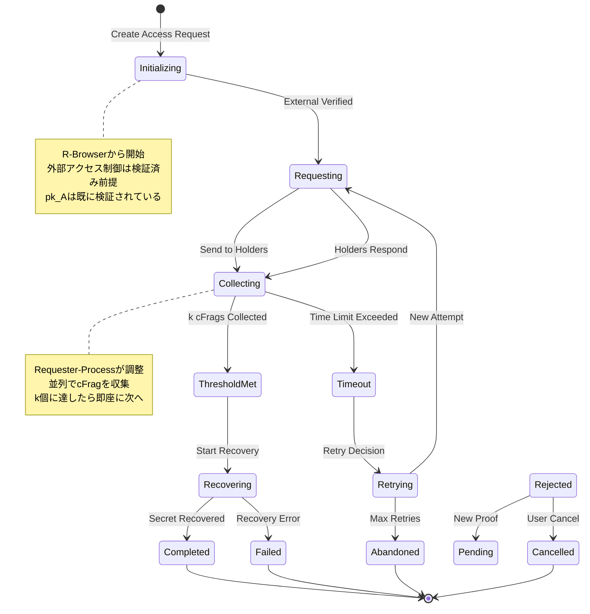

# D-TPRES アクセス要求ライフサイクル詳細

## 1. はじめに

本ドキュメントは、D-TPRES（分散型暗号学的秘密管理ライブラリ）におけるアクセス要求のライフサイクルを詳細に定義します。アクセス要求の作成から完了までの全フェーズ、外部アクセス制御との連携、cFrag収集、エラー処理について説明します。

### 1.1 アクセス要求の重要性

アクセス要求は、D-TPRESライブラリの中核的なワークフローです：

- **認可制御**: 外部アクセス制御システムとの連携（検証済み前提）
- **プライバシー保護**: 必要最小限の情報開示
- **監査可能性**: D-TPRES内部処理の追跡と検証
- **耐障害性**: k-of-n閾値による可用性保証
- **AOステートレス対応**: メッセージベースの状態管理

## 2. アクセス要求ライフサイクル全体像

### 2.1 状態遷移図



### 2.2 フェーズ定義

| PRDフェーズ | 状態 | 説明 | 責任コンポーネント | タイムアウト |
|-----------|------|------|--------------------|------------|
| **PHASE 3** | Initializing | R-Browserでアクセス要求初期化 | R-Browser | - |
| **PHASE 3** | Requesting | Requester-ProcessでHolder要求 | Requester-Process | - |
| **PHASE 3** | Collecting | cFrag収集中 | Requester-Process | 10分 |
| **PHASE 3** | ThresholdMet | 閾値達成 | Requester-Process | - |
| **PHASE 3** | Recovering | R-Browserで秘密復元中 | R-Browser | 5分 |
| **PHASE 3** | Completed | 復元完了 | R-Browser | - |
| **管理** | Timeout | タイムアウト | System | - |
| **管理** | Retrying | リトライ中 | Requester-Process | - |
| **エラー** | Failed | 失敗 | System | - |
| **エラー** | Abandoned | 放棄 | System | - |
| **エラー** | Cancelled | キャンセル | R-Browser | - |

### 2.3 外部アクセス制御との連携

D-TPRESライブラリでは、アクセス制御（pk_A検証）は外部システムで完了済みとして処理します：

- **外部システムの責任**: Requesterの公開鍵pk_Aの正当性検証
- **D-TPRES内処理**: 検証済みpk_Aを使用した暗号化処理のみ
- **責任分界**: アクセス制御ロジックは外部、暗号学的処理はD-TPRES内部

## 3. PHASE 3: 秘密の復元（PRD PHASE 3）

PRD.mdのPHASE 3に対応：R-Browserでのアクセス要求、cFrag収集、秘密復元を実行します。

### 3.1 R-Browserでのアクセス要求作成

```rust
/// R-Browserでのアクセス要求作成 - PRD Step 3-1
pub fn create_access_request_in_browser(
    requester_private_key: &SigningKey,
    requester_public_key: &VerifyingKey, // 外部アクセス制御で検証済みのpk_A
    secret_id: &SecretId,
) -> Result<AccessRequest, RequestError> {
    // 外部アクセス制御は完了済み前提
    // pk_Aは既に検証されているものとする

    let access_request = AccessRequest {
        request_id: generate_request_id(),
        secret_id: secret_id.clone(),
        requester_private_key: requester_private_key.clone(),
        requester_public_key: requester_public_key.clone(),
        created_at: current_timestamp(),
        session_id: generate_session_id(),
    };

    Ok(access_request)
}

```

### 3.2 Requester-Processでのメッセージ送信

```rust
/// RequesterのspawnとcFrag収集要求 - PRD Step 3-2
pub fn send_cfrag_collection_request(
    access_request: &AccessRequest,
    requester_process_id: &ProcessId,
) -> Result<CollectionRequest, MessageError> {
    // Requester-Processにcfrag収集メッセージを送信
    let collection_message = AOMessage {
        process_id: requester_process_id.clone(),
        action: "collect-cfrags".to_string(),
        role: "requester".to_string(),
        data: serde_json::to_vec(&CollectCFragsData {
            secret_id: access_request.secret_id.clone(),
            requester_public_key: access_request.requester_public_key.clone(),
            session_id: access_request.session_id.clone(),
            threshold_required: get_secret_threshold(&access_request.secret_id)?,
        })?,
        timestamp: current_timestamp(),
    };

    send_ao_message(collection_message)?;

    Ok(CollectionRequest {
        request_id: access_request.request_id.clone(),
        sent_at: current_timestamp(),
        expected_response_timeout: COLLECTION_TIMEOUT,
    })
}
```

## 4. Requester-ProcessでのcFrag収集（AO Network）

### 4.1 cFrag収集メッセージハンドラー

```rust
/// Requester-ProcessでのcFrag収集 - PRD Step 3-2
pub fn handle_requester_collect_cfrags(
    msg: AOMessage,
    repository: &dyn Repository,
) -> Result<AOResponse, HandlerError> {
    let collection_data: CollectCFragsData = serde_json::from_slice(&msg.data)?;

    // 利用可能なHolder-Processを特定
    let available_holders = repository.find_holders_with_kfrags(&collection_data.secret_id)?;

    // k個以上のHolder-Processから cFragⱼ を収集
    let mut collected_cfrags = Vec::new();
    let required_threshold = collection_data.threshold_required;

    for holder_id in available_holders.iter() {
        if collected_cfrags.len() >= required_threshold as usize {
            break;
        }

        // Holder-Processにcfrag生成を要求
        let cfrag_request = create_cfrag_request(
            &collection_data.secret_id,
            &collection_data.requester_public_key,
            &msg.process_id
        )?;

        match send_ao_message(holder_id, cfrag_request) {
            Ok(response) => {
                if let Some(cfrag_id) = extract_cfrag_id(&response) {
                    collected_cfrags.push(cfrag_id);
                }
            }
            Err(e) => {
                // ログ記録して次のHolderを試行
                log_holder_error(holder_id, &e);
            }
        }
    }

    // 閾値チェック
    if collected_cfrags.len() < required_threshold as usize {
        return Err(HandlerError::InsufficientCFrags {
            required: required_threshold,
            collected: collected_cfrags.len(),
        });
    }

    Ok(AOResponse::success_with_data(
        "cFrags collected successfully",
        &collected_cfrags
    ))
}
```

### 4.2 R-Browserへのデータ送信

```rust
/// Requester-ProcessからR-Browserへのデータ送信 - PRD Step 3-3
pub fn handle_requester_send_to_browser(
    msg: AOMessage,
    repository: &dyn Repository,
) -> Result<AOResponse, HandlerError> {
    let send_request: SendToBrowserRequest = serde_json::from_slice(&msg.data)?;

    // Capsuleₒの取得
    let capsule = repository.load_capsule(&send_request.secret_id)?;

    // 収集されたcFragsの取得
    let cfrags = repository.load_cfrags_by_ids(&send_request.cfrag_ids)?;

    // データパッケージの作成
    let recovery_package = RecoveryPackage {
        capsule: capsule.clone(),
        cfrags: cfrags.clone(),
        secret_id: send_request.secret_id.clone(),
        threshold_met: cfrags.len() >= send_request.required_threshold as usize,
        package_id: generate_package_id(),
    };

    // R-Browserへの配信（実装は環境依存）
    deliver_to_browser(&send_request.browser_endpoint, recovery_package)?;

    Ok(AOResponse::success("Recovery package sent to R-Browser"))
}
```

## 5. R-Browserでの秘密復元（PRD PHASE 3完了）

### 5.1 秘密復元処理

```rust
/// 再暗号化要求ハンドラー
pub async fn handle_request_reencryption(msg: Message) -> Response {
    let request_id = extract_request_id(&msg)?;
    let request = load_approved_request(&request_id).await?;
    
    // 状態確認
    if request.state != AccessState::Approved {
        return error_response("Access not approved");
    }
    
    // 準備フェーズ
    update_access_state(&request_id, AccessState::Preparing).await?;
    
    // 再暗号化コンテキストの準備
    let context = match prepare_reencryption_context(&request).await {
        Ok(ctx) => ctx,
        Err(e) => {
            update_access_state(&request_id, AccessState::Failed).await;
            return error_response(e);
        }
    };
    
    // Holder選択と要求送信
    match coordinate_reencryption_requests(request, context).await {
        Ok(coordination_result) => {
            update_access_state(&request_id, AccessState::Requesting).await;
            
            // 収集フェーズを開始
            start_cfrag_collection(&request_id, &coordination_result).await;
            
            success_response(ReencryptionStarted {
                request_id: request_id.clone(),
                target_holders: coordination_result.selected_holders.len(),
                threshold_required: coordination_result.threshold,
                collection_timeout: COLLECTION_TIMEOUT,
            })
        }
        Err(e) => {
            update_access_state(&request_id, AccessState::Failed).await;
            error_response(e)
        }
    }
}

/// 再暗号化の調整
async fn coordinate_reencryption_requests(
    request: AccessRequestEntity,
    context: ReencryptionContext,
) -> Result<CoordinationResult, CoordinationError> {
    // 利用可能なHolderの取得
    let available_holders = find_available_holders(&request.secret_id).await?;
    
    // 必要数の確認
    let required_count = (request.threshold as usize) + REDUNDANCY_FACTOR;
    if available_holders.len() < required_count {
        return Err(CoordinationError::InsufficientHolders {
            available: available_holders.len(),
            required: required_count,
        });
    }
    
    // Holder選択（パフォーマンスと信頼性を考慮）
    let selected_holders = select_optimal_holders(
        available_holders,
        required_count,
        &context.network_metrics,
    ).await?;
    
    // 並列リクエスト送信
    let request_futures: Vec<_> = selected_holders
        .iter()
        .map(|holder| {
            send_reencryption_request_to_holder(
                holder.clone(),
                request.request_id.clone(),
                request.requester_public_key.clone(),
                context.capsule.clone(),
            )
        })
        .collect();
    
    // 非同期で送信（完了を待たない）
    tokio::spawn(async move {
        futures::future::join_all(request_futures).await;
    });
    
    Ok(CoordinationResult {
        request_id: request.request_id,
        selected_holders,
        threshold: request.threshold,
        started_at: SystemTime::now(),
    })
}

/// Holderへの再暗号化要求送信
async fn send_reencryption_request_to_holder(
    holder: HolderInfo,
    request_id: AccessRequestId,
    requester_public_key: PublicKey,
    capsule: Capsule,
) -> Result<(), SendError> {
    let message = Message {
        target: holder.process_id.clone(),
        tags: vec![
            ("Action", "Perform-Reencryption"),
            ("Request-Id", &request_id.to_string()),
            ("Secret-Id", &holder.secret_id.to_string()),
            ("Requester-Public-Key", &base64::encode(&requester_public_key)),
        ].into_iter()
        .map(|(k, v)| (k.to_string(), v.to_string()))
        .collect(),
        data: serialize_capsule(&capsule)?,
        ..Default::default()
    };
    
    // 送信（応答は別途Collect-CFragで受信）
    send_message(message).await?;
    
    // Holder要求の記録
    record_holder_request(&request_id, &holder.process_id).await?;
    
    Ok(())
}
```

### 4.2 Collect cFrags

```rust
/// cFrag収集ハンドラー
pub async fn handle_collect_cfrag(msg: Message) -> Response {
    // cFragデータの抽出
    let cfrag_data = extract_cfrag_data(&msg)?;
    
    // 対応するアクセス要求の確認
    let request = match verify_cfrag_association(&cfrag_data).await {
        Ok(req) => req,
        Err(e) => return error_response(e),
    };
    
    // 状態確認
    match request.state {
        AccessState::Requesting | AccessState::Collecting => {},
        _ => return error_response("Not collecting cFrags"),
    }
    
    // 初回のcFragの場合、状態を更新
    if request.state == AccessState::Requesting {
        update_access_state(&request.request_id, AccessState::Collecting).await;
    }
    
    // cFragの検証と保存
    match process_received_cfrag(request, cfrag_data).await {
        Ok(collection_status) => {
            handle_collection_status(collection_status).await
        }
        Err(e) => error_response(e)
    }
}

/// 受信したcFragの処理
async fn process_received_cfrag(
    mut request: AccessRequestEntity,
    cfrag_data: CFragData,
) -> Result<CollectionStatus, ProcessingError> {
    // 暗号学的検証
    verify_cfrag_cryptography(&cfrag_data, &request).await?;
    
    // 重複チェック
    if request.collected_cfrags.contains_key(&cfrag_data.holder_id) {
        return Err(ProcessingError::DuplicateCFrag);
    }
    
    // cFragの保存
    request.collected_cfrags.insert(
        cfrag_data.holder_id.clone(),
        CollectedCFrag {
            cfrag: cfrag_data.cfrag.clone(),
            received_at: SystemTime::now(),
            verified: true,
        },
    );
    
    // アクセス要求の更新
    request.updated_at = SystemTime::now();
    update_access_request(&request).await?;
    
    // 収集状況の確認
    let status = CollectionStatus {
        request_id: request.request_id.clone(),
        total_collected: request.collected_cfrags.len(),
        threshold: request.threshold as usize,
        threshold_met: request.collected_cfrags.len() >= request.threshold as usize,
        missing: (request.threshold as usize).saturating_sub(request.collected_cfrags.len()),
        timeout_at: request.created_at + COLLECTION_TIMEOUT,
    };
    
    Ok(status)
}

/// 収集状況に応じた処理
async fn handle_collection_status(status: CollectionStatus) -> Response {
    if status.threshold_met {
        // 閾値達成
        update_access_state(&status.request_id, AccessState::ThresholdMet).await;
        
        // 復元フェーズへの自動遷移
        schedule_recovery(&status.request_id).await;
        
        success_response(ThresholdReached {
            request_id: status.request_id,
            cfrags_collected: status.total_collected,
            ready_for_recovery: true,
        })
    } else {
        // 収集継続
        success_response(CFragCollected {
            request_id: status.request_id,
            total_collected: status.total_collected,
            missing: status.missing,
            timeout_at: status.timeout_at,
        })
    }
}

/// cFragの暗号学的検証
async fn verify_cfrag_cryptography(
    cfrag_data: &CFragData,
    request: &AccessRequestEntity,
) -> Result<(), CryptoError> {
    // 署名検証
    let holder_public_key = get_holder_public_key(&cfrag_data.holder_id).await?;
    verify_signature(
        &cfrag_data.cfrag,
        &cfrag_data.signature,
        &holder_public_key,
    )?;
    
    // cFragの妥当性検証（Umbral）
    let capsule = load_capsule(&request.capsule_id).await?;
    verify_cfrag(
        &cfrag_data.cfrag,
        &capsule,
        &request.requester_public_key,
    )?;
    
    // タイムスタンプ検証
    if cfrag_data.generated_at < request.created_at {
        return Err(CryptoError::InvalidTimestamp);
    }
    
    Ok(())
}
```

### 4.3 Timeout Handling

```rust
/// タイムアウトハンドラー
pub async fn handle_collection_timeout(request_id: AccessRequestId) -> Result<(), TimeoutError> {
    let request = load_access_request(&request_id).await?;
    
    match request.state {
        AccessState::Collecting => {
            // タイムアウト状態に更新
            update_access_state(&request_id, AccessState::Timeout).await?;
            
            // 収集状況の確認
            let collected = request.collected_cfrags.len();
            let required = request.threshold as usize;
            
            if collected >= required {
                // 実は閾値に達していた場合
                update_access_state(&request_id, AccessState::ThresholdMet).await?;
                schedule_recovery(&request_id).await?;
            } else {
                // リトライ判定
                handle_timeout_recovery(&request_id, collected, required).await?;
            }
        }
        _ => {
            // 既に別の状態に遷移済み
        }
    }
    
    Ok(())
}

/// タイムアウト後のリカバリー処理
async fn handle_timeout_recovery(
    request_id: &AccessRequestId,
    collected: usize,
    required: usize,
) -> Result<(), RecoveryError> {
    let mut request = load_access_request(request_id).await?;
    
    // リトライ可能性の判定
    if request.attempts >= MAX_RETRY_ATTEMPTS {
        // 最大試行回数に達した
        update_access_state(request_id, AccessState::Abandoned).await?;
        
        // 監査ログ
        audit_access_abandoned(&request, "Max retries exceeded").await?;
        
        return Ok(());
    }
    
    // 部分的な成功の場合
    if collected > 0 {
        // 追加のHolderを探す
        let missing = required - collected;
        let additional_holders = find_additional_holders(
            &request.secret_id,
            missing,
            &request.collected_cfrags.keys().cloned().collect(),
        ).await?;
        
        if additional_holders.len() >= missing {
            // リトライ実行
            update_access_state(request_id, AccessState::Retrying).await?;
            request.attempts += 1;
            update_access_request(&request).await?;
            
            // 追加リクエストの送信
            send_additional_reencryption_requests(
                &request,
                additional_holders,
            ).await?;
            
            // 収集を再開
            update_access_state(request_id, AccessState::Requesting).await?;
            return Ok(());
        }
    }
    
    // リトライ不可
    update_access_state(request_id, AccessState::Abandoned).await?;
    audit_access_abandoned(&request, "Insufficient holders for retry").await?;
    
    Ok(())
}
```

## 5. Phase 5: 秘密の復元

### 5.1 Recover Secret

```rust
/// 秘密復元ハンドラー
pub async fn handle_recover_secret(msg: Message) -> Response {
    let request_id = extract_request_id(&msg)?;
    let request = load_access_request(&request_id).await?;
    
    // 状態確認
    if request.state != AccessState::ThresholdMet {
        return error_response("Threshold not met");
    }
    
    // 復元開始
    update_access_state(&request_id, AccessState::Recovering).await?;
    
    // 復元パラメータの抽出
    let recovery_params = match extract_recovery_params(&msg) {
        Ok(params) => params,
        Err(e) => {
            update_access_state(&request_id, AccessState::Failed).await;
            return error_response(e);
        }
    };
    
    // 秘密復元の実行
    match execute_secret_recovery(request, recovery_params).await {
        Ok(recovery_result) => {
            update_access_state(&request_id, AccessState::Completed).await;
            
            success_response(SecretRecovered {
                request_id: request_id.clone(),
                recovery_proof: recovery_result.proof,
                completed_at: SystemTime::now(),
            })
        }
        Err(e) => {
            update_access_state(&request_id, AccessState::Failed).await;
            error_response(e)
        }
    }
}

/// 秘密復元の実行
async fn execute_secret_recovery(
    request: AccessRequestEntity,
    params: RecoveryParams,
) -> Result<RecoveryResult, RecoveryError> {
    // 必要なデータの収集
    let recovery_data = collect_recovery_data(&request).await?;
    
    // cFragsの準備
    let cfrags: Vec<_> = request.collected_cfrags
        .values()
        .map(|c| &c.cfrag)
        .collect();
    
    // Umbral復号
    let decrypted_key = umbral_decrypt_reencrypted(
        &recovery_data.capsule,
        &cfrags,
        &params.requester_private_key,
    )?;
    
    // シェアの復号
    let decrypted_shares = decrypt_shares_with_key(
        &recovery_data.encrypted_shares,
        &decrypted_key,
    ).await?;
    
    // Shamir復元
    let recovered_secret = shamir_reconstruct_secret(
        &decrypted_shares,
        request.threshold,
    )?;
    
    // 復元結果の検証
    verify_recovery_result(&recovered_secret, &recovery_data).await?;
    
    // 復元記録の作成
    let recovery_record = create_recovery_record(
        &request,
        &recovered_secret,
        SystemTime::now(),
    ).await?;
    
    // 監査ログ
    audit_successful_recovery(&request, &recovery_record).await?;
    
    Ok(RecoveryResult {
        proof: generate_recovery_proof(&recovery_record)?,
        record_id: recovery_record.id,
    })
}

/// 復元データの収集
async fn collect_recovery_data(
    request: &AccessRequestEntity,
) -> Result<RecoveryData, DataError> {
    // カプセルの取得
    let capsule = load_capsule(&request.capsule_id).await?;
    
    // 暗号化されたシェアの取得
    let share_ids = get_share_ids_for_secret(&request.secret_id).await?;
    let encrypted_shares = load_encrypted_shares(&share_ids).await?;
    
    // 検証データの取得
    let verification_data = load_verification_data(&request.secret_id).await?;
    
    Ok(RecoveryData {
        capsule,
        encrypted_shares,
        verification_data,
        cfrags_used: request.collected_cfrags.len(),
    })
}
```

## 6. エラー処理とリカバリー

### 6.1 エラー状態の管理

```rust
/// アクセス要求のエラー分類
#[derive(Debug, Clone)]
pub enum AccessError {
    /// 一時的なエラー（リトライ可能）
    Transient {
        error: String,
        retry_after: Duration,
    },
    
    /// 権限エラー（修正可能）
    Authorization {
        error: String,
        required_conditions: Vec<String>,
    },
    
    /// ネットワークエラー（リトライ可能）
    Network {
        error: String,
        failed_holders: Vec<ProcessId>,
    },
    
    /// 致命的エラー（リトライ不可）
    Fatal {
        error: String,
        reason: FatalReason,
    },
}

#[derive(Debug, Clone)]
pub enum FatalReason {
    SecretDestroyed,
    InvalidCryptography,
    MaxRetriesExceeded,
    SecurityViolation,
}

/// エラーからのリカバリー戦略
pub async fn determine_recovery_strategy(
    request_id: &AccessRequestId,
    error: AccessError,
) -> RecoveryStrategy {
    match error {
        AccessError::Transient { retry_after, .. } => {
            RecoveryStrategy::RetryAfter {
                delay: retry_after,
                max_attempts: 3,
            }
        }
        AccessError::Authorization { required_conditions, .. } => {
            RecoveryStrategy::UpdateConditions {
                conditions: required_conditions,
                notify_user: true,
            }
        }
        AccessError::Network { failed_holders, .. } => {
            RecoveryStrategy::UseAlternativeHolders {
                exclude: failed_holders,
                additional_count: REDUNDANCY_FACTOR,
            }
        }
        AccessError::Fatal { reason, .. } => {
            RecoveryStrategy::Abandon {
                reason,
                cleanup_required: true,
            }
        }
    }
}
```

### 6.2 部分的成功の処理

```rust
/// 部分的なcFrag収集の処理
pub struct PartialCollectionHandler {
    threshold: usize,
    redundancy_factor: usize,
}

impl PartialCollectionHandler {
    pub async fn handle_partial_collection(
        &self,
        request: &AccessRequestEntity,
    ) -> Result<PartialRecoveryAction, PartialError> {
        let collected = request.collected_cfrags.len();
        let required = self.threshold;
        
        if collected >= required {
            // 実際には成功
            return Ok(PartialRecoveryAction::ProceedToRecovery);
        }
        
        let missing = required - collected;
        let progress_ratio = collected as f64 / required as f64;
        
        if progress_ratio >= 0.8 {
            // 80%以上収集済み - 積極的にリトライ
            Ok(PartialRecoveryAction::AggressiveRetry {
                missing_count: missing,
                priority: RetryPriority::High,
            })
        } else if progress_ratio >= 0.5 {
            // 50%以上収集済み - 通常リトライ
            Ok(PartialRecoveryAction::NormalRetry {
                missing_count: missing,
                expand_holder_set: true,
            })
        } else {
            // 50%未満 - 戦略の見直し
            Ok(PartialRecoveryAction::ChangeStrategy {
                reason: "Insufficient initial response",
                recommendation: "Verify holder availability",
            })
        }
    }
    
    /// 追加Holderの選択
    pub async fn select_additional_holders(
        &self,
        secret_id: &SecretId,
        count: usize,
        exclude: &[ProcessId],
    ) -> Result<Vec<HolderInfo>, SelectionError> {
        // 全Holderのリスト取得
        let all_holders = get_all_holders_for_secret(secret_id).await?;
        
        // 除外リストとパフォーマンスでフィルタリング
        let candidates: Vec<_> = all_holders
            .into_iter()
            .filter(|h| !exclude.contains(&h.process_id))
            .filter(|h| h.performance_score >= MIN_PERFORMANCE_SCORE)
            .collect();
        
        if candidates.len() < count {
            return Err(SelectionError::InsufficientCandidates);
        }
        
        // スコアでソートして上位を選択
        let mut sorted = candidates;
        sorted.sort_by(|a, b| {
            b.performance_score.partial_cmp(&a.performance_score).unwrap()
        });
        
        Ok(sorted.into_iter().take(count).collect())
    }
}
```

## 7. パフォーマンス最適化

### 7.1 並列処理とバッチング

```rust
/// 並列cFrag収集の最適化
pub struct OptimizedCollector {
    /// 同時接続数の制限
    semaphore: Arc<Semaphore>,
    /// バッチサイズ
    batch_size: usize,
    /// タイムアウト設定
    timeout_config: TimeoutConfig,
}

impl OptimizedCollector {
    pub async fn collect_cfrags_optimized(
        &self,
        request_id: &AccessRequestId,
        holders: Vec<HolderInfo>,
        threshold: usize,
    ) -> Result<Vec<CipherFragment>, CollectionError> {
        let (tx, mut rx) = mpsc::channel(holders.len());
        let collected = Arc::new(Mutex::new(Vec::new()));
        let threshold_reached = Arc::new(AtomicBool::new(false));
        
        // Holder要求を並列実行
        let mut handles = vec![];
        for batch in holders.chunks(self.batch_size) {
            let batch_handles: Vec<_> = batch
                .iter()
                .map(|holder| {
                    let tx = tx.clone();
                    let sem = self.semaphore.clone();
                    let threshold_reached = threshold_reached.clone();
                    let holder = holder.clone();
                    let request_id = request_id.clone();
                    let timeout = self.timeout_config.for_holder(&holder);
                    
                    tokio::spawn(async move {
                        // 既に閾値に達していれば中断
                        if threshold_reached.load(Ordering::Relaxed) {
                            return;
                        }
                        
                        let _permit = sem.acquire().await.unwrap();
                        
                        match timeout(
                            timeout,
                            request_cfrag_from_holder(&holder, &request_id)
                        ).await {
                            Ok(Ok(cfrag)) => {
                                let _ = tx.send(Ok(cfrag)).await;
                            }
                            Ok(Err(e)) => {
                                let _ = tx.send(Err(e)).await;
                            }
                            Err(_) => {
                                let _ = tx.send(Err(CollectionError::Timeout)).await;
                            }
                        }
                    })
                })
                .collect();
            
            handles.extend(batch_handles);
        }
        
        // 結果の収集（閾値に達したら早期終了）
        drop(tx);
        while let Some(result) = rx.recv().await {
            if let Ok(cfrag) = result {
                let mut collected_guard = collected.lock().await;
                collected_guard.push(cfrag);
                
                if collected_guard.len() >= threshold {
                    threshold_reached.store(true, Ordering::Relaxed);
                    break;
                }
            }
        }
        
        // 残りのタスクをキャンセル
        for handle in handles {
            handle.abort();
        }
        
        let final_collected = collected.lock().await.clone();
        
        if final_collected.len() >= threshold {
            Ok(final_collected)
        } else {
            Err(CollectionError::ThresholdNotMet {
                collected: final_collected.len(),
                required: threshold,
            })
        }
    }
}

/// 動的タイムアウト設定
pub struct TimeoutConfig {
    base_timeout: Duration,
    network_metrics: Arc<RwLock<NetworkMetrics>>,
}

impl TimeoutConfig {
    pub async fn for_holder(&self, holder: &HolderInfo) -> Duration {
        let metrics = self.network_metrics.read().await;
        
        // Holderの過去のレスポンス時間から計算
        if let Some(holder_metrics) = metrics.get_holder_metrics(&holder.process_id) {
            let avg_response = holder_metrics.average_response_time();
            let std_dev = holder_metrics.response_time_std_dev();
            
            // 平均 + 2標準偏差でタイムアウト設定
            Duration::from_millis(
                (avg_response + 2.0 * std_dev) as u64
            ).min(self.base_timeout * 2)
        } else {
            self.base_timeout
        }
    }
}
```

### 7.2 キャッシングとプリフェッチ

```rust
/// アクセスパターンに基づくプリフェッチ
pub struct AccessPatternOptimizer {
    /// アクセス履歴
    access_history: Arc<RwLock<AccessHistory>>,
    /// プリフェッチキャッシュ
    prefetch_cache: Arc<RwLock<PrefetchCache>>,
}

impl AccessPatternOptimizer {
    /// アクセスパターンの分析
    pub async fn analyze_pattern(
        &self,
        requester_id: &ProcessId,
    ) -> AccessPattern {
        let history = self.access_history.read().await;
        
        let recent_accesses = history.get_recent_accesses(requester_id, 100);
        
        AccessPattern {
            frequent_secrets: Self::find_frequent_secrets(&recent_accesses),
            access_times: Self::analyze_access_times(&recent_accesses),
            typical_threshold: Self::calculate_typical_threshold(&recent_accesses),
        }
    }
    
    /// プリフェッチの実行
    pub async fn prefetch_for_likely_access(
        &self,
        pattern: &AccessPattern,
    ) -> Result<(), PrefetchError> {
        for secret_id in &pattern.frequent_secrets {
            // Holder情報のプリフェッチ
            let holders = get_holders_for_secret(secret_id).await?;
            
            // ネットワークメトリクスの更新
            for holder in &holders {
                ping_holder(&holder.process_id).await;
            }
            
            // キャッシュに保存
            self.prefetch_cache.write().await
                .store_holder_info(secret_id, holders);
        }
        
        Ok(())
    }
}
```

## 8. セキュリティ実装

### 8.1 アクセス制御の多層防御

```rust
/// 多層アクセス制御
pub struct MultiLayerAccessControl {
    /// Layer 1: 基本的な認証
    authentication: AuthenticationLayer,
    /// Layer 2: 条件ベースの認可
    authorization: AuthorizationLayer,
    /// Layer 3: 暗号学的検証
    cryptographic: CryptographicLayer,
    /// Layer 4: 行動分析
    behavioral: BehavioralLayer,
}

impl MultiLayerAccessControl {
    pub async fn verify_access(
        &self,
        request: &AccessRequestEntity,
        context: &AccessContext,
    ) -> Result<AccessDecision, AccessError> {
        // Layer 1: 認証
        self.authentication.verify_identity(
            &request.requester_id,
            &context.credentials,
        ).await?;
        
        // Layer 2: 認可
        let auth_result = self.authorization.check_permissions(
            &request.requester_id,
            &request.secret_id,
            &request.access_conditions,
        ).await?;
        
        if !auth_result.is_authorized {
            return Ok(AccessDecision::Denied {
                reason: auth_result.denial_reason,
                suggestions: auth_result.suggestions,
            });
        }
        
        // Layer 3: 暗号学的検証
        self.cryptographic.verify_cryptographic_proofs(
            &request.proof_commitment,
            &context.proofs,
        ).await?;
        
        // Layer 4: 行動分析
        let risk_score = self.behavioral.analyze_behavior(
            &request.requester_id,
            &context.access_pattern,
        ).await?;
        
        if risk_score > RISK_THRESHOLD {
            return Ok(AccessDecision::RequireAdditionalVerification {
                risk_score,
                required_verifications: vec!["MFA", "Admin approval"],
            });
        }
        
        Ok(AccessDecision::Approved {
            validity_period: calculate_validity_period(&auth_result, risk_score),
            conditions: merge_conditions(&auth_result.conditions, &context.conditions),
        })
    }
}
```

### 8.2 リプレイ攻撃防止

```rust
/// リプレイ攻撃防止メカニズム
pub struct ReplayProtection {
    /// 使用済みナンスの追跡
    used_nonces: Arc<RwLock<HashSet<Nonce>>>,
    /// タイムスタンプ検証
    timestamp_validator: TimestampValidator,
}

impl ReplayProtection {
    pub async fn verify_request_freshness(
        &self,
        request: &AccessRequestEntity,
        message: &Message,
    ) -> Result<(), ReplayError> {
        // ナンスの確認
        let nonce = extract_nonce(message)?;
        
        let mut nonces = self.used_nonces.write().await;
        if nonces.contains(&nonce) {
            return Err(ReplayError::NonceReused);
        }
        
        // タイムスタンプの検証
        let timestamp = extract_timestamp(message)?;
        self.timestamp_validator.verify(timestamp)?;
        
        // リクエストIDの一意性確認
        if has_request_been_processed(&request.request_id).await? {
            return Err(ReplayError::DuplicateRequest);
        }
        
        // ナンスを記録
        nonces.insert(nonce);
        
        // 古いナンスの削除（メモリ管理）
        if nonces.len() > MAX_TRACKED_NONCES {
            cleanup_old_nonces(&mut nonces, NONCE_RETENTION_PERIOD);
        }
        
        Ok(())
    }
}
```

## 9. 監査とコンプライアンス

### 9.1 包括的な監査証跡

```rust
/// アクセス要求の監査ログ
#[derive(Debug, Serialize)]
pub struct AccessAuditLog {
    // 基本情報
    pub timestamp: SystemTime,
    pub request_id: AccessRequestId,
    pub secret_id: SecretId,
    pub requester_id: ProcessId,
    
    // イベント詳細
    pub event: AccessEvent,
    pub from_state: AccessState,
    pub to_state: AccessState,
    
    // セキュリティ情報
    pub ip_address: Option<IpAddr>,
    pub user_agent: Option<String>,
    pub risk_indicators: Vec<RiskIndicator>,
    
    // 結果
    pub result: EventResult,
    pub duration: Option<Duration>,
}

#[derive(Debug, Serialize)]
pub enum AccessEvent {
    RequestCreated {
        conditions: Vec<String>,
        threshold: u8,
    },
    ProofSubmitted {
        proof_type: String,
        verification_method: String,
    },
    EVMVerification {
        contract_address: String,
        gas_used: u64,
        block_number: u64,
    },
    HolderRequested {
        holder_id: ProcessId,
        kfrag_id: String,
    },
    CFragReceived {
        holder_id: ProcessId,
        response_time: Duration,
    },
    ThresholdReached {
        total_cfrags: usize,
        collection_time: Duration,
    },
    SecretRecovered {
        recovery_time: Duration,
        shares_used: usize,
    },
    RequestTimeout {
        collected_cfrags: usize,
        missing_cfrags: usize,
    },
    RequestFailed {
        reason: String,
        error_code: String,
    },
}

/// 監査ログの永続化と分析
pub async fn audit_access_event(
    log: AccessAuditLog,
) -> Result<(), AuditError> {
    // 構造化ログの出力
    structured_log(&log);
    
    // Arweaveへの永続化
    let tx_id = persist_to_arweave(&log).await?;
    
    // インデックスの更新
    update_audit_indices(&log, &tx_id).await?;
    
    // リアルタイム分析
    if requires_immediate_analysis(&log.event) {
        analyze_security_event(&log).await?;
    }
    
    // アラート生成
    if is_suspicious_activity(&log) {
        generate_security_alert(&log).await?;
    }
    
    Ok(())
}
```

### 9.2 コンプライアンスレポート

```rust
/// コンプライアンスレポート生成
pub struct ComplianceReporter {
    audit_repository: AuditRepository,
    report_generator: ReportGenerator,
}

impl ComplianceReporter {
    pub async fn generate_access_report(
        &self,
        period: DateRange,
        report_type: ReportType,
    ) -> Result<ComplianceReport, ReportError> {
        // 監査ログの収集
        let audit_logs = self.audit_repository
            .find_by_period(period)
            .await?;
        
        // レポートタイプに応じた分析
        let analysis = match report_type {
            ReportType::AccessSummary => {
                self.analyze_access_patterns(&audit_logs)
            }
            ReportType::SecurityIncidents => {
                self.analyze_security_events(&audit_logs)
            }
            ReportType::Performance => {
                self.analyze_performance_metrics(&audit_logs)
            }
            ReportType::Compliance => {
                self.analyze_compliance_adherence(&audit_logs)
            }
        };
        
        // レポート生成
        let report = self.report_generator.create_report(
            analysis,
            period,
            report_type,
        )?;
        
        // デジタル署名
        let signed_report = sign_report(&report)?;
        
        Ok(signed_report)
    }
}
```

## 10. テストとシミュレーション

### 10.1 エンドツーエンドテスト

```rust
#[cfg(test)]
mod integration_tests {
    use super::*;
    
    #[tokio::test]
    async fn test_complete_access_flow() {
        // テスト環境のセットアップ
        let test_env = setup_test_environment().await;
        
        // 1. 秘密の作成と配布
        let secret_id = create_test_secret(&test_env).await;
        distribute_test_kfrags(&test_env, &secret_id).await;
        
        // 2. アクセス要求の作成
        let requester = create_test_requester(&test_env).await;
        let request_id = create_access_request(
            &secret_id,
            &requester.process_id,
            test_access_params(),
        ).await.unwrap();
        
        // 3. EVM証明の提出
        let proof = generate_test_proof(&requester).await;
        submit_proof_to_evm(
            load_access_request(&request_id).await.unwrap(),
            proof,
        ).await.unwrap();
        
        // 4. 再暗号化要求
        coordinate_reencryption_requests(
            load_approved_request(&request_id).await.unwrap(),
            test_reencryption_context(),
        ).await.unwrap();
        
        // 5. cFrag収集（シミュレート）
        for holder in &test_env.holders {
            simulate_holder_response(&request_id, holder).await;
        }
        
        // 6. 秘密の復元
        let recovery_result = execute_secret_recovery(
            load_access_request(&request_id).await.unwrap(),
            test_recovery_params(&requester),
        ).await.unwrap();
        
        // 検証
        assert!(recovery_result.proof.is_valid());
        verify_test_secret_recovery(&secret_id, &recovery_result).await;
    }
    
    #[tokio::test]
    async fn test_partial_collection_recovery() {
        let test_env = setup_test_environment().await;
        let secret_id = create_test_secret(&test_env).await;
        
        // 部分的なHolder応答をシミュレート
        let request_id = create_test_access_request(&secret_id).await;
        
        // 閾値-1のcFragsのみ収集
        let threshold = 3;
        for i in 0..threshold-1 {
            simulate_holder_response(&request_id, &test_env.holders[i]).await;
        }
        
        // タイムアウトをトリガー
        trigger_collection_timeout(&request_id).await;
        
        // リトライ処理の検証
        let request = load_access_request(&request_id).await.unwrap();
        assert_eq!(request.state, AccessState::Retrying);
        
        // 追加Holderからの応答
        simulate_holder_response(&request_id, &test_env.holders[threshold]).await;
        
        // 復元可能になったことを確認
        let final_request = load_access_request(&request_id).await.unwrap();
        assert_eq!(final_request.state, AccessState::ThresholdMet);
    }
}
```

### 10.2 負荷テストとシミュレーション

```rust
/// 大規模アクセスシミュレーション
pub struct AccessLoadSimulator {
    concurrent_requests: usize,
    request_rate: Duration,
    holder_failure_rate: f64,
}

impl AccessLoadSimulator {
    pub async fn simulate_load(
        &self,
        duration: Duration,
    ) -> SimulationResult {
        let mut results = SimulationResult::new();
        let start = Instant::now();
        
        let semaphore = Arc::new(Semaphore::new(self.concurrent_requests));
        let mut handles = vec![];
        
        while start.elapsed() < duration {
            let sem = semaphore.clone();
            let failure_rate = self.holder_failure_rate;
            
            let handle = tokio::spawn(async move {
                let _permit = sem.acquire().await.unwrap();
                
                // 単一アクセスフローのシミュレート
                let flow_result = simulate_single_access_flow(failure_rate).await;
                
                flow_result
            });
            
            handles.push(handle);
            tokio::time::sleep(self.request_rate).await;
        }
        
        // 結果の集計
        for handle in handles {
            if let Ok(flow_result) = handle.await {
                results.add_flow_result(flow_result);
            }
        }
        
        results
    }
}
```

## まとめ

D-TPRESのアクセス要求ライフサイクル管理は、PRD.mdの更新に合わせて分散型暗号学的秘密管理ライブラリとして最適化されました。

### 主要な更新点

1. **外部アクセス制御の前提化**: EVM検証を外部システムの責任に委譲し、pk_A検証完了を前提とした設計
2. **ブラウザ・AOプロセス分離**: R-BrowserでのUI処理とRequester-ProcessでのcFrag収集の明確な分担
3. **PRD PHASE 3統合**: アクセス要求から秘密復元までを単一フェーズとして整合
4. **AOステートレス対応**: メッセージベースのハンドラーパターンと同期処理への変更

### ライフサイクルの簡素化

1. **外部アクセス制御**: pk_A検証は外部システムで完了済みと仮定
2. **cFrag収集**: Requester-ProcessがHolder-Processと協調してcFrag収集
3. **秘密復元**: R-Browserでの暗号学的復元処理
4. **責任分界**: D-TPRES内部は純粋な暗号処理、アクセス制御は外部

これらの変更により、実装とテストが簡素化された効率的なアクセス要求管理を実現します。

---

**Document Status**: Access Lifecycle Specification (Updated for PRD v2.0)
**Version**: 2.0
**Last Updated**: 2025-01-26
**Dependencies**: PRD.md, lifecycle_overview.md, secret_lifecycle.md
