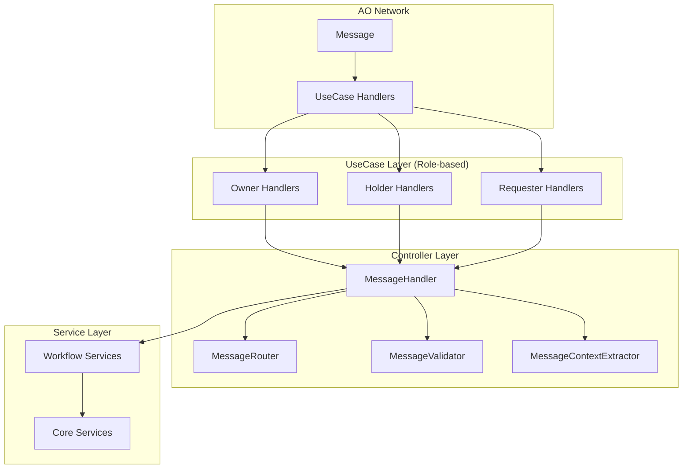
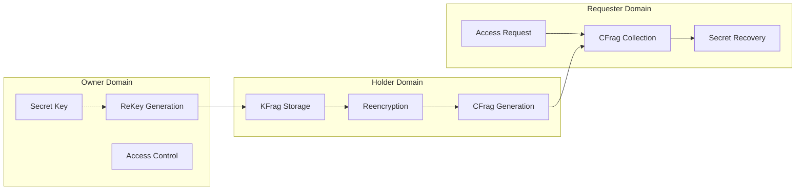
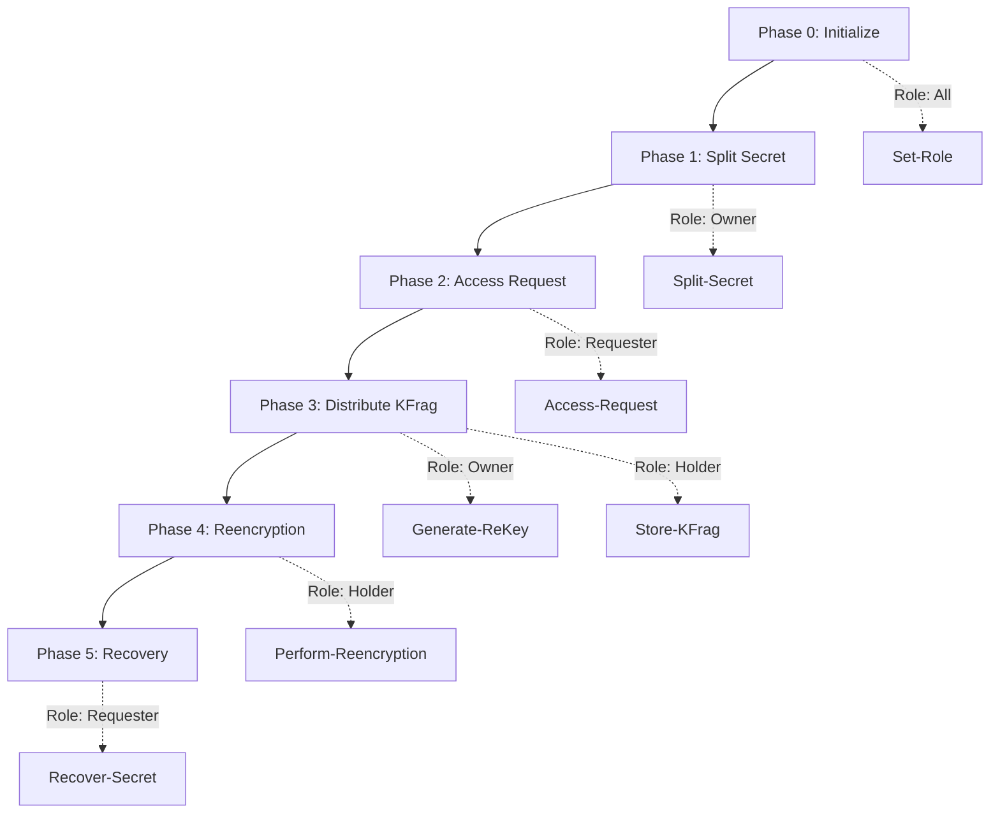

# D-TPRES UseCase層設計概要

## 1. はじめに

本ドキュメントは、D-TPRES（Deterministic Threshold Proxy Re-Encryption System）のUseCase層の設計と実装指針を定義します。UseCase層は、AOプロセスにおける最初のメッセージ受信層として機能し、ロールベースのハンドラー実装により、セキュアで効率的なメッセージ処理を実現します。

### 1.1 UseCase層の位置づけ



### 1.2 設計理念

1. **ロール分離によるセキュリティ**
   - 各プロセスは起動時に設定されたロールに基づくハンドラーのみを実行
   - 不正なロールからのアクション実行を物理的に防止

2. **ステートレス実行への適応**
   - AOの実行モデルに完全準拠
   - 各メッセージ処理は独立した実行単位

3. **最小権限の原則**
   - 各ロールは必要最小限の機能のみにアクセス
   - 攻撃対象領域の最小化

## 2. AOハンドラーアーキテクチャ

### 2.1 ハンドラー登録メカニズム

```rust
use ao_sdk::{Handlers, Message, Response};

/// プロセス起動時のハンドラー登録
pub fn initialize_handlers() -> Result<(), InitError> {
    // ProcessEntityから現在のロールを取得
    let process_role = get_process_role().await?;
    
    // ロールに応じたハンドラーセットを登録
    match process_role {
        ProcessRole::Owner => {
            register_owner_handlers()?;
            info!("Initialized as Owner process");
        }
        ProcessRole::Holder => {
            register_holder_handlers()?;
            info!("Initialized as Holder process");
        }
        ProcessRole::Requester => {
            register_requester_handlers()?;
            info!("Initialized as Requester process");
        }
    }
    
    // 共通ハンドラーの登録
    register_common_handlers()?;
    
    Ok(())
}

/// プロセスロールの取得
async fn get_process_role() -> Result<ProcessRole, RoleError> {
    let process_repo = ProcessEntityRepository::new();
    let process = process_repo.find_by_id(&ao.id)
        .await?
        .ok_or(RoleError::ProcessNotFound)?;
    
    // active_rolesから優先ロールを決定
    process.get_primary_role()
        .ok_or(RoleError::NoActiveRole)
}
```

### 2.2 ハンドラー実装パターン

各ハンドラーは以下の共通パターンに従います：

```rust
/// 標準的なハンドラー実装
pub async fn handle_action(msg: Message) -> Response {
    // 1. コンテキスト初期化
    let ctx = match initialize_context().await {
        Ok(ctx) => ctx,
        Err(e) => return error_response(e),
    };
    
    // 2. ロール検証
    if !ctx.process.has_role(REQUIRED_ROLE) {
        return unauthorized_response("Role mismatch");
    }
    
    // 3. 前提条件チェック
    if let Err(e) = check_preconditions(&ctx, &msg).await {
        return precondition_failed_response(e);
    }
    
    // 4. Controller層への委譲
    let handler = MessageHandler::new(ctx.service_container);
    handler.handle(msg).await
}
```

### 2.3 エラーレスポンス標準化

```rust
/// エラーレスポンス生成
fn error_response(error: impl std::error::Error) -> Response {
    Response {
        tags: vec![
            ("Status", "Error"),
            ("Error-Type", error_type(&error)),
            ("Error-Code", error_code(&error)),
            ("Error-Message", &error.to_string()),
        ],
        data: vec![],
    }
}

/// 認可エラーレスポンス
fn unauthorized_response(reason: &str) -> Response {
    Response {
        tags: vec![
            ("Status", "Error"),
            ("Error-Type", "Authorization"),
            ("Error-Code", "UNAUTHORIZED"),
            ("Error-Message", reason),
        ],
        data: vec![],
    }
}
```

## 3. ロール分離設計

### 3.1 ロール定義とアクセス権限

| ロール | 主要責務 | 許可されるアクション |
|--------|---------|-------------------|
| **Owner** | 秘密の管理と制御 | Split-Secret, Generate-ReKey, Distribute-KFrag, Update-Access-Control |
| **Holder** | 分散ストレージとプロキシ再暗号化 | Store-KFrag, Perform-Reencryption, Send-CFrag, Update-Status |
| **Requester** | アクセス要求と秘密復元 | Access-Request, Request-Reencryption, Collect-CFrags, Recover-Secret |

### 3.2 セキュリティ境界



### 3.3 ロール切り替えの防止

```rust
/// ロール不変性の保証
pub struct ImmutableRole {
    role: ProcessRole,
    initialized_at: SystemTime,
}

impl ImmutableRole {
    pub fn new(role: ProcessRole) -> Self {
        Self {
            role,
            initialized_at: SystemTime::now(),
        }
    }
    
    /// ロールは読み取り専用
    pub fn get(&self) -> ProcessRole {
        self.role.clone()
    }
    
    // setterは存在しない - ロール変更不可
}
```

## 4. ステートレス実行モデル

### 4.1 実行コンテキストの管理

```rust
/// ハンドラーコンテキスト
pub struct HandlerContext {
    /// プロセス情報（毎回ロード）
    pub process: ProcessEntity,
    
    /// リポジトリコンテナ
    pub repositories: RepositoryContainer,
    
    /// サービスコンテナ（Controller層用）
    pub service_container: ServiceContainer,
    
    /// メッセージスコープキャッシュ
    pub cache: MessageScopeCache,
}

impl HandlerContext {
    /// コンテキストの初期化（各メッセージ処理の開始時）
    pub async fn initialize() -> Result<Self, ContextError> {
        // 1. ProcessEntityのロード
        let process_repo = ProcessEntityRepository::new();
        let process = process_repo.find_by_id(&ao.id)
            .await?
            .ok_or(ContextError::ProcessNotFound)?;
        
        // 2. 依存関係の初期化
        let repositories = RepositoryContainer::new();
        let service_container = ServiceContainer::new();
        
        Ok(Self {
            process,
            repositories,
            service_container,
            cache: MessageScopeCache::new(),
        })
    }
}
```

### 4.2 状態管理パターン

```rust
/// 状態の読み込みと永続化
pub trait StatefulHandler {
    /// メッセージ処理前の状態ロード
    async fn load_state(&mut self, msg: &Message) -> Result<(), StateError>;
    
    /// ビジネスロジック実行
    async fn execute(&mut self, msg: &Message) -> Result<HandlerResult, BusinessError>;
    
    /// 状態の永続化
    async fn persist_state(&self, result: &HandlerResult) -> Result<(), PersistError>;
}
```

## 5. Controller層との統合

### 5.1 責務の明確な分離

| 層 | 責務 | 実装内容 |
|----|------|---------|
| **UseCase層** | メッセージ受信とロール検証 | AOハンドラー、前提条件チェック |
| **Controller層** | 入力検証と型変換 | バリデーション、DTO変換、Service呼び出し |
| **Service層** | ビジネスロジック | ワークフロー実行、状態管理 |

### 5.2 統合パターン

```rust
/// UseCase層からController層への委譲
pub async fn handle_split_secret(msg: Message) -> Response {
    // UseCase層: 初期化とロール検証
    let ctx = match initialize_context().await {
        Ok(ctx) => ctx,
        Err(e) => return error_response(e),
    };
    
    if !ctx.process.has_role(ProcessRole::Owner) {
        return unauthorized_response("Only Owner can split secrets");
    }
    
    // UseCase層: Phase 1の前提条件チェック
    if ctx.process.has_active_secret(&extract_secret_id(&msg)) {
        return error_response("Secret already exists");
    }
    
    // Controller層への委譲
    let handler = MessageHandler::new(ctx.service_container);
    handler.handle(msg).await
}
```

## 6. Phase別ハンドラー設計

### 6.1 Phase依存関係



### 6.2 前提条件の管理

```rust
/// Phase前提条件チェッカー
pub struct PreconditionChecker {
    phase_requirements: HashMap<Phase, Vec<Requirement>>,
}

impl PreconditionChecker {
    pub async fn check(
        &self,
        phase: Phase,
        ctx: &HandlerContext,
        msg: &Message,
    ) -> Result<(), PreconditionError> {
        let requirements = self.phase_requirements.get(&phase)
            .ok_or(PreconditionError::UnknownPhase)?;
        
        for requirement in requirements {
            requirement.verify(ctx, msg).await?;
        }
        
        Ok(())
    }
}
```

## 7. エラー処理とリカバリー

### 7.1 エラー分類

| エラー種別 | 説明 | リカバリー戦略 |
|-----------|------|--------------|
| **RoleError** | ロール不一致 | リトライ不可、セキュリティログ |
| **PreconditionError** | 前提条件違反 | 条件を満たすアクションの提示 |
| **StateError** | 状態ロード失敗 | 自動リトライ（最大3回） |
| **BusinessError** | ビジネスロジックエラー | エラー内容に応じた対処 |

### 7.2 エラーハンドリングフロー

```rust
/// 包括的エラーハンドリング
pub async fn handle_with_recovery(msg: Message) -> Response {
    let mut retry_count = 0;
    
    loop {
        match handle_internal(msg.clone()).await {
            Ok(response) => return response,
            Err(e) if e.is_retryable() && retry_count < MAX_RETRIES => {
                retry_count += 1;
                warn!("Retrying after error: {}, attempt {}", e, retry_count);
                tokio::time::sleep(exponential_backoff(retry_count)).await;
            }
            Err(e) => {
                error!("Final error after {} retries: {}", retry_count, e);
                return create_error_response(e);
            }
        }
    }
}
```

## 8. パフォーマンス最適化

### 8.1 選択的Entity読み込み

```rust
/// 必要最小限のEntityロード
pub struct LazyEntityLoader {
    loaded_entities: HashMap<String, Box<dyn Any>>,
}

impl LazyEntityLoader {
    pub async fn load_if_needed<T: Entity>(
        &mut self,
        entity_id: &str,
        repository: &dyn Repository<T>,
    ) -> Result<&T, LoadError> {
        if !self.loaded_entities.contains_key(entity_id) {
            let entity = repository.find_by_id(entity_id).await?
                .ok_or(LoadError::NotFound)?;
            self.loaded_entities.insert(entity_id.to_string(), Box::new(entity));
        }
        
        self.loaded_entities.get(entity_id)
            .and_then(|e| e.downcast_ref::<T>())
            .ok_or(LoadError::TypeMismatch)
    }
}
```

### 8.2 並列処理の活用

```rust
/// 並列ハンドラー実行（Phase 4のcFrag収集など）
pub async fn parallel_handler_execution<T>(
    tasks: Vec<HandlerTask>,
) -> Vec<Result<T, HandlerError>> {
    let semaphore = Arc::new(Semaphore::new(MAX_CONCURRENT_HANDLERS));
    
    let futures = tasks.into_iter().map(|task| {
        let sem = semaphore.clone();
        async move {
            let _permit = sem.acquire().await?;
            task.execute().await
        }
    });
    
    futures::future::join_all(futures).await
}
```

## 9. セキュリティ考慮事項

### 9.1 メッセージ認証

```rust
/// メッセージ署名検証
pub async fn verify_message_signature(
    msg: &Message,
    expected_signer: &ProcessId,
) -> Result<(), SignatureError> {
    let signature = msg.tags.get("Signature")
        .ok_or(SignatureError::MissingSignature)?;
    
    let public_key = get_process_public_key(expected_signer).await?;
    
    verify_signature(
        &msg.to_bytes(),
        signature,
        &public_key,
    )
}
```

### 9.2 Rate Limiting

```rust
/// ロール別Rate Limiting
pub struct RoleBasedRateLimiter {
    limits: HashMap<ProcessRole, RateLimit>,
}

impl RoleBasedRateLimiter {
    pub fn check_limit(
        &mut self,
        role: ProcessRole,
        process_id: &ProcessId,
    ) -> Result<(), RateLimitError> {
        let limit = self.limits.get(&role)
            .ok_or(RateLimitError::UnknownRole)?;
        
        limit.check_and_update(process_id)
    }
}
```

## 10. 監視とデバッグ

### 10.1 メトリクス収集

| メトリクス | 説明 | 用途 |
|-----------|------|------|
| handler_invocations | ハンドラー呼び出し回数 | 負荷分析 |
| handler_duration | 処理時間 | パフォーマンス監視 |
| role_errors | ロールエラー発生数 | セキュリティ監視 |
| precondition_failures | 前提条件エラー数 | フロー分析 |

### 10.2 トレーシング

```rust
#[instrument(skip(msg), fields(
    action = %msg.tags.get("Action").unwrap_or(&"Unknown".to_string()),
    process_id = %ao.id,
))]
pub async fn traced_handler(msg: Message) -> Response {
    span!(Level::INFO, "handler_execution");
    
    // ハンドラー実行
    let result = handle_internal(msg).await;
    
    // 結果のログ
    match &result {
        Ok(_) => info!("Handler completed successfully"),
        Err(e) => error!("Handler failed: {}", e),
    }
    
    result
}
```

## 11. テスト戦略

### 11.1 ユニットテスト

```rust
#[cfg(test)]
mod tests {
    use super::*;
    
    #[tokio::test]
    async fn test_role_validation() {
        // Ownerロールのプロセスを作成
        let process = create_test_process(ProcessRole::Owner);
        let ctx = create_test_context(process);
        
        // Holderアクションを試行
        let msg = create_test_message("Store-KFrag");
        let result = validate_role(&ctx, &msg);
        
        assert!(result.is_err());
        assert_eq!(result.unwrap_err().code(), "ROLE_MISMATCH");
    }
    
    #[tokio::test]
    async fn test_precondition_check() {
        let ctx = create_test_context_with_state();
        let msg = create_test_message("Access-Request");
        
        // 存在しない秘密へのアクセス
        let result = check_preconditions(&ctx, &msg).await;
        
        assert!(result.is_err());
        assert_eq!(result.unwrap_err().code(), "SECRET_NOT_FOUND");
    }
}
```

### 11.2 統合テスト

```rust
#[tokio::test]
async fn test_full_handler_flow() {
    // ハンドラー登録
    register_test_handlers();
    
    // Phase 1: 秘密分割
    let split_msg = create_split_secret_message();
    let split_response = handle_message(split_msg).await;
    assert!(is_success(&split_response));
    
    // Phase 2: アクセス要求
    let access_msg = create_access_request_message(
        get_secret_id(&split_response)
    );
    let access_response = handle_message(access_msg).await;
    assert!(is_success(&access_response));
}
```

## 12. まとめ

D-TPRES UseCase層は、以下の特性により、セキュアで効率的なメッセージ処理を実現します：

1. **厳格なロール分離**: 各プロセスは割り当てられたロールのハンドラーのみを実行
2. **ステートレス対応**: AOの実行モデルに完全準拠した設計
3. **セキュリティファースト**: 多層防御によるセキュアな実装
4. **高い拡張性**: 新しいハンドラーの追加が容易
5. **包括的なエラー処理**: 詳細なエラー情報とリカバリー戦略

これらの設計により、D-TPRESシステムの信頼性とセキュリティを確保します。

---

**Document Status**: UseCase Layer Architecture Specification  
**Version**: 1.0  
**Last Updated**: 2025-01-07