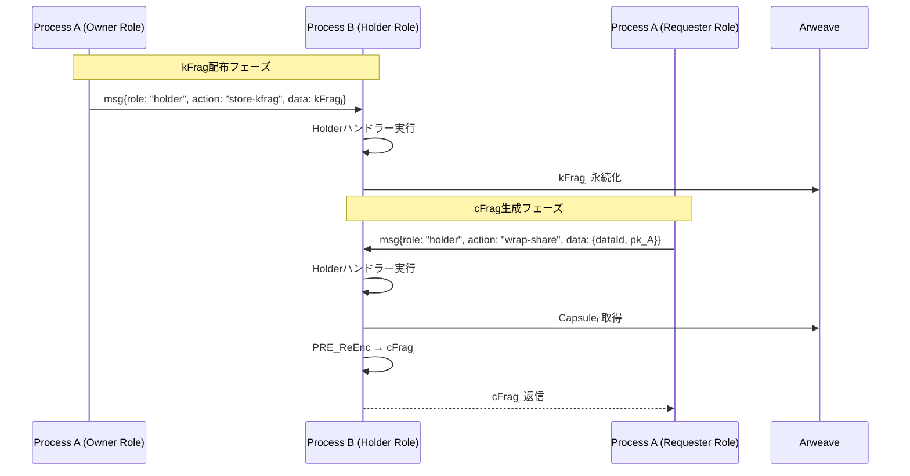

# Holder Role 仕様

> **目的** ― Holderロールは、プロセスが kFrag を保持し、他のプロセスからの要求に応じて Capsuleᵢ を再暗号化して cFragⱼ を生成・提供する役割。全てのプロセスがHolderロールを持ち、他のプロセスから呼び出された時に実行される。

---

## 概要

* **ロール:** `role = "holder"`（全プロセスが保持）
* **呼び出し元:** OwnerロールまたはRequesterロールを実行中の他プロセス
* **主な責務:**

  1. Ownerロールからの kFragⱼ を受信・保存
  2. Requesterロールからの `wrap_share` 要求に応答
  3. Capsuleᵢ をロードし `cFragⱼ = PRE_ReEnc(kFragⱼ, Capsuleᵢ)` を計算
  4. cFragⱼ を生成してRequesterに返信

### 実装パス
* **Rust実装**: `src/usecase/holder/holder_handlers.rs`
* **Service層**: `src/service/core/crypto.rs` (PRE_ReEnc実装)
* **ビルドターゲット**: wasm32-unknown-unknown (AO用)

---

## 入力 (Input)

| 送信元                        | メッセージ (`fn`)         | 内容                           |
| -------------------------- | -------------------- | ---------------------------- |
| **Ownerロールプロセス**     | `msg{role: "holder", action: "store-kfrag"}` | `{ data_id, kFrag_j, pk_A }` |
| **Requesterロールプロセス** | `msg{role: "holder", action: "wrap-share"}`  | `{ data_id, idx, pk_A }`  |

---

## 処理フロー

1. **kFrag 保存 (Ownerロールからの要求)**

   1. Ownerロールプロセスから `{role: "holder", action: "store-kfrag"}` を受信
   2. kFrag_j をプロセス内部ストレージに保存
   3. AOのステートレス制約により、Arweaveに永続化

2. **再暗号化 (Requesterロールからの要求)**

   1. Requesterロールプロセスから `{role: "holder", action: "wrap-share"}` を受信
   2. 保存された kFrag_j を取得
   3. Arweaveから Capsuleᵢ を取得
   4. `cFrag_j = PRE_ReEnc(kFrag_j, Capsuleᵢ)` を計算（`src/` のWASMで実行）
   5. cFrag_j をRequesterロールプロセスに返信

---

## シーケンス図

---

## 出力 (Output)

| 宛先                    | メッセージ         | 内容                             |
| --------------------- | ------------- | ------------------------------ |
| **SQLite/Arweave**    | 差分ページ         | kFrag, cFrag データ永続化            |
| **Requester-Process** | `cfrag_ready` | `{ idx, tx_id }` cFrag TxID 通知 |

---

## その他考慮事項

* **パッシブロール:** Holderロールは他のロールから呼び出される受動的な役割。
* **検証:** `wrap_share` 内 pk_A が kFrag レコードの pk_A と一致しない場合は拒否。
* **メモリ安全:** kFrag, cFrag 用バッファは `SecretVec` で保持し計算後 `zeroize()`。
* **ステートレス実行:** AO のステートレス制約により、各メッセージ処理で Arweave から状態復元。
* **実装場所:** `src/usecase/holder/` に Holder ハンドラー、`src/service/core/crypto.rs` に PRE_ReEnc 実装。
