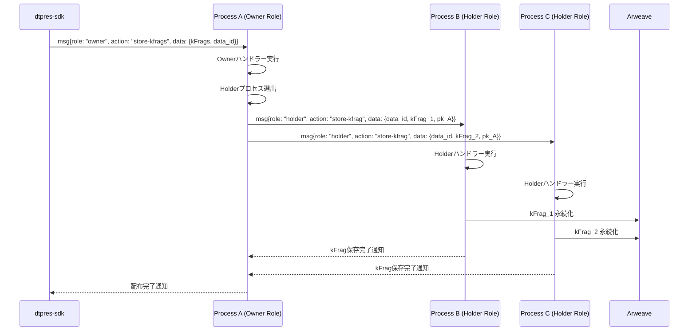

# Owner Role 仕様

> **目的** ― Ownerロールは、O-Browser からの要求に応じて、`local/` で生成された kFrag を受信し、Holderロールを持つ他プロセスに配布する役割。

---

## 概要

* **ロール:** `role = "owner"`（全プロセスが保持）
* **呼び出し元:** O-Browser (`dtpres-sdk` 経由)
* **主な責務:**

  1. O-Browser (`local/`) で生成された kFrag を受信・保存
  2. RandAO でランダムに n 個の Holderプロセスを選出
  3. 各 Holderプロセスに kFrag_j を配布
  4. Capsule と Ciphertext の Arweave 参照情報を管理

### 実装パス
* **Rust実装**: `src/usecase/owner/owner_handlers.rs`
* **Service層**: `src/service/workflow/key_distribution.rs`
* **ビルドターゲット**: wasm32-unknown-unknown (AO用)

---

## 入力 (Input)

| 送信元           | メッセージ (`fn`)  | 内容                                                            |
| ------------- | ------------- | ------------------------------------------------------------- |
| **dtpres-sdk (O-Browser)** | `msg{role: "owner", action: "store-kfrags"}` | `{ kFrags: [kFrag₁...kFragₙ], data_id }` kFrag配布要求 |
| **External** | `msg{role: "owner", action: "access-request"}` | `{ data_id, pk_A }` アクセス許可（外部検証済み前提） |

---

## 処理フロー

1. **kFrag配布要求受信**

   * O-Browserから `{role: "owner", action: "store-kfrags", data: {kFrags, data_id}}` を受信
   * `local/` で生成された n個の kFrag を受信・保存

2. **Holderプロセス選出**

   1. 利用可能なプロセス（Holderロール保持）を探索
   2. `online_score` 高い順に n個のプロセスを選出
   3. 各プロセスのprocess_idを取得

3. **kFrag配布**

   1. 各Holderプロセスに `{role: "holder", action: "store-kfrag"}` を送信
   2. `{data_id, kFrag_j, pk_A}` を各Holderに配布
   3. 配布完了をO-Browserに通知

---

## シーケンス図

---

## 出力 (Output)

| 宛先                    | メッセージ               | 内容                                     |
| --------------------- | ------------------- | -------------------------------------- |
| **Holderロールプロセス** | `msg{role: "holder", action: "store-kfrag"}` | `{ data_id, kFrag_j, pk_A }` 全 Holder へ配布 |
| **dtpres-sdk (O-Browser)** | `response` | 配布完了通知 |
| **Arweave** | 状態永続化 | kFrag配布状態の永続化 |

---

## その他考慮事項

* **サイズ制限:** kFrag_j ≤ 8 KiB / Tx を目安とし、Tx コストを抑制。
* **アクティブロール:** Ownerロールは O-Browser からの要求で能動的に実行される。
* **ステートレス実行:** AO のステートレス制約により、各メッセージ処理で Arweave から状態復元。
* **実装場所:** `src/usecase/owner/` に Owner ハンドラー、`src/service/workflow/` にkFrag配布ロジック。
* **フォールトトレランス:** Holder 指名は `online_score` 高い順に再計算。失敗時は再指名。
