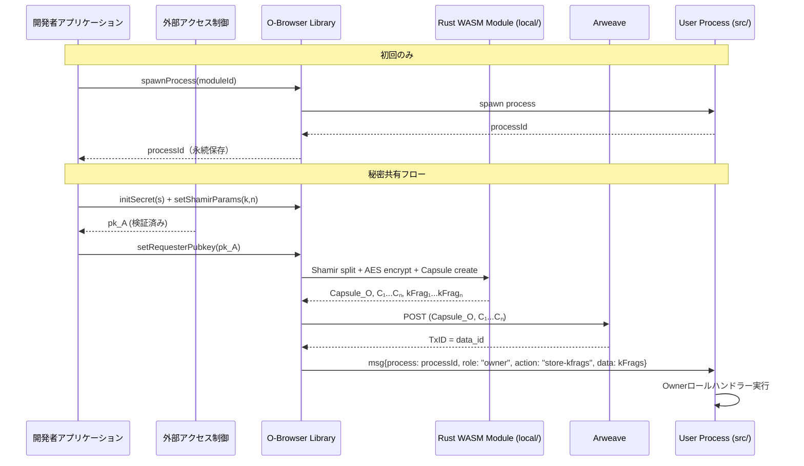

# O‑Browser 仕様（secret所有者クライアント）

> **目的** ― データ所有者（Alice）がブラウザ環境で D‑TPRES の暗号化・秘密分散機能を利用できる JavaScript/TypeScript ライブラリモジュール。

---

## 概要

* ブラウザ環境で **local/ ディレクトリのRust WASM モジュール** を使用した暗号鍵生成・データ暗号化・Capsule 作成・Owner‑Process spawn をライブラリ関数として提供。
* **umbral-pre** による Threshold Proxy Re-Encryption と **sssa** による Shamir Secret Sharing をブラウザで実行。
* 秘密鍵はローカル環境でのみ生成・使用し、ネットワーク送信は一切行わない。
* **dtpres-sdk** パッケージの Owner 側エントリーポイントとして機能。

### 実装パス
* **Rust実装**: `local/src/owner/` (key_generation.rs, secret_sharing.rs, encryption.rs, capsule.rs, rekey.rs)
* **JavaScript SDK**: `dtpres-sdk/src/owner/OBrowser.ts`
* **ビルドターゲット**: wasm32-unknown-unknown (wasm-pack)

---

## 入力 (Input)

| 発生源    | メソッド / パラメータ      | 説明                             |
| ------ | --------------- | ------------------------------ |
| **開発者** | `initSecret(secret)` | 共有したい秘密値 (s)            |
| **開発者** | `setShamirParams(k, n)` | (k,n) しきい値パラメータ                |
| **開発者** | `setRequesterPubkey(pk_A)` | 外部検証済みRequester公開鍵 |
| **開発者** | `spawnOwnerProcess(moduleId)` | AOモジュールID指定でプロセスspawn |

---

## 処理手順

1. **プロセス初期化（初回のみ）**

   * ユーザー専用プロセスをspawn（コントラクトデプロイと同様）
   * `processId` を取得して永続的に保存
   * 以降、全ての操作はこの `processId` を使用

2. **鍵生成**

   * `pk_O`,`sk_O` を Rust WASM (`umbral-pre`) で生成
   * ブラウザの IndexedDB に暗号化保存

3. **秘密分割**

   * `s` を Shamir(k,n) ⇒ f(1)…f(n)。Rust WASM (`sssa`) を使用

4. **対称鍵 & 暗号文**

   * `k_O` を Rust WASM の secure random で生成
   * n個の `Cᵢ = AES_GCM(k_O, f(i))` を Rust WASM (`aes-gcm`) で暗号化

5. **Capsule 生成**

   * `Capsule_O = PRE_Enc(pk_O, k_O)` を Rust WASM (`umbral-pre`) で実行

6. **Requester公開鍵設定**

   * 外部アクセス制御システムで検証済みの `pk_A` を受け取り（前提条件）

7. **再暗号化キー生成**

   * `rekey = PRE_ReKey(sk_O → pk_A)` を Rust WASM (`umbral-pre`) で生成

8. **kFrag分割**

   * `kFrag_j = Shamir_Split(rekey, k, n)` を Rust WASM (`sssa`) で分割

9. **Arweave 永続化**

   * `Capsule_O` と n個の `Cᵢ` をArweaveに保存
   * 戻り値: `data_id` (Transaction ID)

10. **kFrag送信（Ownerロール指定）**

    * プロセスにOwnerロールを指定してメッセージ送信
    * `{ process: processId, role: "owner", action: "store-kfrags", data: { kFrags, data_id }}`
    * 秘密鍵は一切外部送信せず、ローカル環境でのみ使用

---

## シーケンス図



---

## 出力 (Output)

| 宛先                | 返り値 / 送信内容    | 説明                          |
| ----------------- | --------------- | --------------------------- |
| **開発者アプリケーション** | `Promise<data_id>` | Arweave保存完了時のTransaction ID |
| **Arweave**       | Tx(data\_id)    | Capsule\_O + n個のCᵢ 永続保存    |
| **Owner‑Process** | `owner.init`    | 初期化メッセージ (data\_id 付き)    |
| **Owner‑Process** | `kFrag₁...kFragₙ` | n個の再暗号化キーフラグメント          |

---

## ライブラリAPI設計

```typescript
// dtpres-sdk/src/owner/OBrowser.ts
import { DtpresLocalWasm } from '../../wasm-local';
import { AOClient } from '../ao';

interface OBrowserConfig {
  arweaveUrl: string;
  aoModuleId: string;
  shamirK: number;
  shamirN: number;
  processId?: string; // 既存プロセスID（オプション）
}

export class OBrowser {
  private wasmModule: DtpresLocalWasm;
  private aoClient: AOClient;
  private processId: string | null;

  constructor(config: OBrowserConfig);

  // プロセス初期化（初回のみ実行、以降は既存processIdを使用）
  async initializeProcess(): Promise<string> {
    if (this.processId) return this.processId;
    this.processId = await this.aoClient.spawnProcess(this.config.aoModuleId);
    return this.processId;
  }

  // 秘密設定
  async initSecret(secret: Uint8Array): Promise<void>;

  // Requester公開鍵設定（外部検証済み前提）
  async setRequesterPubkey(pubkey: Uint8Array): Promise<void>;

  // 暗号化・分散処理実行（local/でWASM実行）
  async processSecret(): Promise<{
    dataId: string;
    kFrags: Uint8Array[];
  }>;

  // kFrag送信（Ownerロール指定でメッセージ送信）
  async sendKFrags(kFrags: Uint8Array[], dataId: string): Promise<void> {
    await this.aoClient.sendMessage({
      process: this.processId,
      role: 'owner',
      action: 'store-kfrags',
      data: { kFrags, dataId }
    });
  }
}
```

## その他考慮事項

* **セキュリティ** : 全ての暗号化処理は `local/` のRust WASM で実行。秘密鍵は IndexedDB に暗号化保存。
* **外部アクセス制御** : pk\_A の受信は外部アクセス制御システムで検証済みが前提。D-TPRES内では検証を行わない。
* **メモリ管理** : Rust WASM内で `zeroize` による適切な秘密鍵クリア。
* **エラーハンドリング** : 非同期処理での例外処理、リトライ機構をPromiseベースで提供。
* **拡張性** : 大きなファイルは事前に分割・暗号化し、Arweave にはメタデータのみ保存する拡張が可能。
* **OSS配布** : `@dtpres/sdk` npm パッケージとして配布予定。`local/` のWASM バイナリも同梱。
