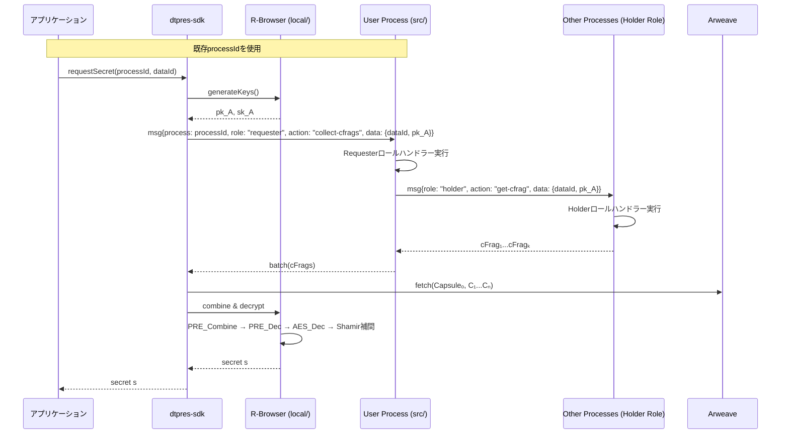

# R-Browser 仕様（アクセス者クライアント）

> **目的** ― データ利用者（Bob）がブラウザでアクセス要求を行い、cFrag 受領後に暗号文を復号して秘密 s を取得するクライアントライブラリ。

---

## 概要

* **local/ ディレクトリのRust WASM モジュール** を使用して、ブラウザ環境でCapsule結合・復号・秘密復元を実行。
* Requester-Process (RP) を spawn し、cFrag 収集を待機（**src/** のAOプロセス）。
* 必要個数の cFrag が揃ったらローカルで Capsule′ を再構築し、対称鍵 kₒ と Shamir シェア f(i) を復元、最終的に秘密 s を補間。
* **dtpres-sdk** パッケージの Requester 側エントリーポイントとして機能。
* 外部アクセス制御システムは前提条件（D-TPRES内では実装しない）。

### 実装パス
* **Rust実装**: `local/src/requester/` (capsule_combine.rs, decryption.rs, secret_recovery.rs, cfrag_collection.rs)
* **JavaScript SDK**: `dtpres-sdk/src/requester/RBrowser.ts`
* **ビルドターゲット**: wasm32-unknown-unknown (wasm-pack)


---

## 入力 (Input)

| 発生源        | イベント / データ       | 説明                               |
| ---------- | ---------------- | -------------------------------- |
| **UI**     | `request_access` | data\_id, Owner から共有された URL/TxID |
| **Wallet** | `signature`      | MetaMask 等による本人署名                |
| **RP**     | `rp.batch`       | Capsuleᵢ, Cᵢ, cFrag₁…k バッチ       |

---

## 処理手順

1. **プロセス取得**

   * 既存の `processId` を使用（Ownerとして使用していた同じプロセス）
   * または他のユーザーのプロセスIDを指定

2. **鍵生成**

   * `local/` の Rust WASM で `(pk_A, sk_A)` を生成
   * 公開鍵 `pk_A` は外部アクセス制御システムで検証済みとして扱う

3. **cFrag 収集要求（Requesterロール指定）**

   * プロセスにRequesterロールを指定してメッセージ送信
   * `{ process: processId, role: "requester", action: "collect-cfrags", data: { dataId, pk_A }}`
   * プロセス内のRequesterハンドラーが k個の Holder から cFrag を収集

4. **復号処理（local/で実行）**

   * Capsule′ = `PRE_Combine(Capsuleₒ, cFrag₁…k)`（umbral-pre wasm）
   * kₒ = `PRE_Dec(sk_A, Capsule′)`
   * f(i) = `AES_DEC(kₒ, Cᵢ)` でk個のシェアを復号
   * Shamir補間で秘密 `f(0) = s` を復元

5. **秘密取得**

   * 復元された秘密をアプリケーションに返却

---

## シーケンス図



---

## 出力 (Output)

| 宛先                  | 内容                 | 説明                    |
| ------------------- | ------------------ | --------------------- |
| **verifyAccess SC** | `requestAccess` Tx | アクセス要求として pk\_A を登録   |
| **AO / RP**         | `spawn requester`  | Requester-Process 初期化 |
| **ユーザ端末**           | 復号済みデータ            | ファイルダウンロード or クリップボード |

---

## ライブラリAPI設計

```typescript
// dtpres-sdk/src/requester/RBrowser.ts
import { DtpresLocalWasm } from '../../wasm-local';
import { AOClient } from '../ao';

interface RBrowserConfig {
  arweaveUrl: string;
  processId: string;  // 使用するプロセスID（必須）
}

export class RBrowser {
  private wasmModule: DtpresLocalWasm;
  private aoClient: AOClient;
  private processId: string;

  constructor(config: RBrowserConfig) {
    this.processId = config.processId;
  }

  // 鍵生成（local/でWASM実行）
  async generateKeys(): Promise<{ publicKey: Uint8Array; privateKey: Uint8Array }>;

  // cFrag収集要求（Requesterロール指定でメッセージ送信）
  async requestCFrags(dataId: string, publicKey: Uint8Array): Promise<void> {
    await this.aoClient.sendMessage({
      process: this.processId,
      role: 'requester',
      action: 'collect-cfrags',
      data: { dataId, publicKey }
    });
  }

  // cFrag受信待機
  async waitForCFrags(): Promise<CFragBundle>;

  // 秘密復元（local/でWASM実行）
  async recoverSecret(cfrags: CFragBundle, privateKey: Uint8Array): Promise<Uint8Array>;

  // 統合API：秘密の取得
  async getSecret(dataId: string): Promise<Uint8Array> {
    const { publicKey, privateKey } = await this.generateKeys();
    await this.requestCFrags(dataId, publicKey);
    const cfrags = await this.waitForCFrags();
    return await this.recoverSecret(cfrags, privateKey);
  }
}
```

## その他考慮事項

* **セキュリティ:** 全ての暗号化処理は `local/` のRust WASM で実行。秘密鍵は `zeroize` で適切にクリア。
* **外部アクセス制御:** pk_A の検証は外部システムで完了済みが前提。D-TPRES内では検証を行わない。
* **進行状況:** cFrag 受領数／閾値をSDK経由で取得可能。
* **エラーハンドリング:** しきい値未達のタイムアウト、リトライ機構をSDKで提供。
* **OSS配布:** `@dtpres/sdk` npm パッケージとして配布予定。`local/` のWASM バイナリも同梱。
