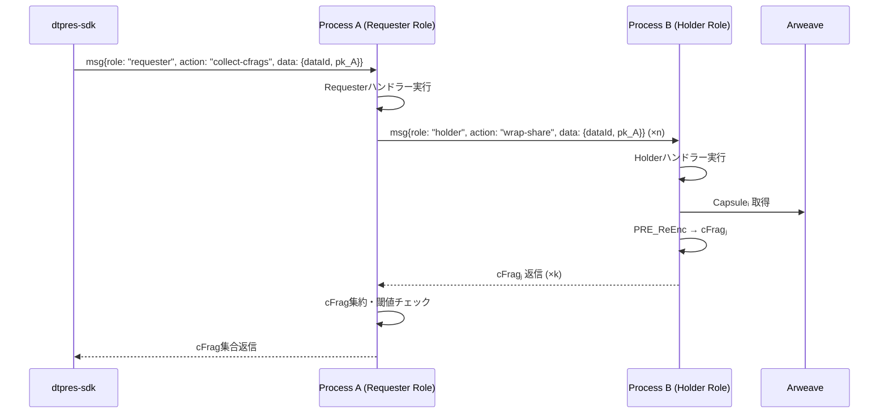

# Requester Role 仕様

> **目的** ― Requesterロールは、R-Browser からの要求に応じて、Holderロールを持つ他プロセスに再暗号化要求を送信し、k 個の cFrag を収集して R-Browser へ返却する集約役割。

---

## 概要

* **ロール:** `role = "requester"`（全プロセスが保持）
* **呼び出し元:** R-Browser (`dtpres-sdk` 経由)
* **主な責務:**

  1. R-Browser からの cFrag 収集要求を受信
  2. 対象データ `data_id` の情報をArweaveから取得
  3. Holderロールを持つ他プロセスへ `wrap_share(data_id, pk_A)` を送信
  4. 受信した k 個以上の cFrag を収集
  5. R-Browser へ cFrag集合を返却

### 実装パス
* **Rust実装**: `src/usecase/requester/requester_handlers.rs`
* **Service層**: `src/service/workflow/secret_recovery.rs`
* **ビルドターゲット**: wasm32-unknown-unknown (AO用)

---

## 入力 (Input)

| 送信元           | メッセージ (`fn`)         | 内容                                                  |
| ------------- | -------------------- | --------------------------------------------------- |
| **dtpres-sdk (R-Browser)** | `msg{role: "requester", action: "collect-cfrags"}` | `{ data_id, pk_A }` cFrag収集要求 |
| **Holderロールプロセス** | `response` | `cFrag_j` 再暗号化結果返信 |

---

## 処理フロー

1. **cFrag収集要求受信**

   * R-Browserから `{role: "requester", action: "collect-cfrags", data: {data_id, pk_A}}` を受信
   * プロセス内部に状態を保存（`needed_k = 3`, `received = 0`）

2. **Holderロールへの要求送信**

   1. 利用可能な Holderロールプロセスを探索
   2. 各 Holderプロセスに `{role: "holder", action: "wrap-share", data: {data_id, pk_A}}` を送信

3. **cFrag 集約**

   1. Holderプロセスから cFrag_j を受信
   2. `received += 1`でカウントアップ
   3. `received >= needed_k` で閾値達成

4. **R-Browserへ返却**

   * 収集した k 個の cFrag を R-Browser (`dtpres-sdk`) へ返却
   * 状態をクリアし次の要求に備える

---

## シーケンス図

---

## 出力 (Output)

| 宛先                 | メッセージ               | 内容                                     |
| ------------------ | ------------------- | -------------------------------------- |
| **Holderロールプロセス** | `msg{role: "holder", action: "wrap-share"}` | `{ data_id, pk_A }` 全 Holder へ要求送信 |
| **dtpres-sdk (R-Browser)** | `response` | `cFrag集合` バッチ返信 |
| **Arweave** | 状態永続化 | cFrag TxID, 状態カウンタの永続化 |

---

## その他考慮事項

* **アクティブロール:** RequesterロールはR-Browserからの要求で能動的に実行される。
* **タイムアウト:** cFrag 未達時は再試行またはエラー返却。
* **複数同時要求:** data_id × pk_A ごとに状態を分離管理。
* **ステートレス実行:** AO のステートレス制約により、各メッセージ処理で Arweave から状態復元。
* **実装場所:** `src/usecase/requester/` に Requester ハンドラー、`src/service/workflow/` にcFrag収集ロジック。
