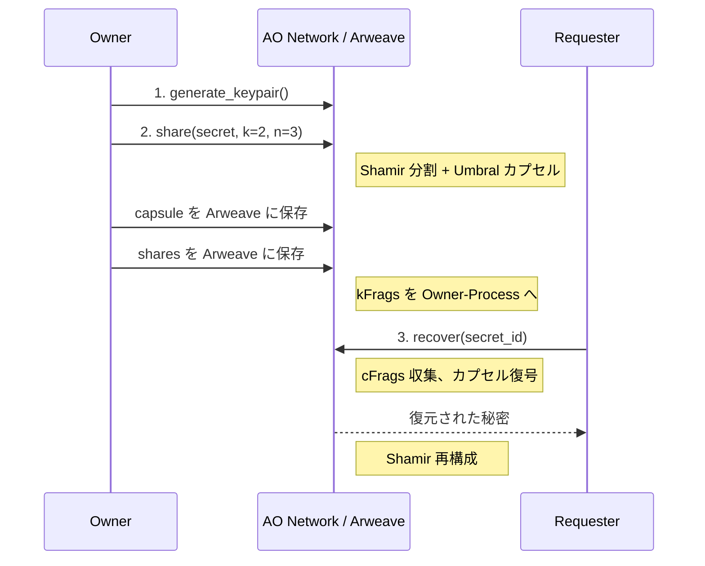
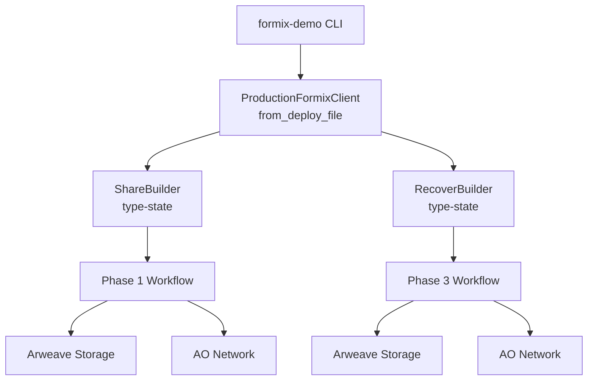

# FORMIX デモ

Arweave + AO Network 上で動作する FORMIX 閾値プロキシ再暗号化（TPRE）ワークフローを体験するための開発者向け CLI です。

## このデモの概要



**2-of-3** 閾値スキームを使用します。秘密は 3 つのシェアに分割され、任意の 2 つで復元できます。

## 前提条件

- Rust 1.86.0（`rustup` が `rust-toolchain.toml` を自動検出します）
- Node.js 20+ および Yarn（`ao/` スクリプト用）
- Arweave JWK ウォレットファイル（Step 3 で生成）

## セットアップ

### Step 1: 環境設定

```bash
cp .env.example .env
# .env を編集して ARWEAVE_WALLET_PATH を設定（または CLI で --wallet を指定）
```

### Step 2: AO 依存パッケージのインストール

```bash
make setup
```

### Step 3: Arweave ウォレットの生成

```bash
make keygen
# ao/ ディレクトリに wallet.json が作成されます
```

### Step 4: WASM モジュールのデプロイ

```bash
make deploy
# 出力された module_id を控えてください
```

### Step 5: AO プロセスの起動

```bash
make spawn
# 出力された process_id を控えてください
```

### Step 6: deploy.json の作成

```bash
cp deploy.example.json deploy.json
```

`deploy.json` を編集し、Step 4・5 で取得した `module_id` と `process_id` を記入してください。

### Step 7: デモの実行

```bash
make demo-all
```

## サブコマンド

### `keygen` - PRE 鍵ペア生成

```bash
cargo run -- keygen
```

Owner と Requester の Umbral PRE 鍵ペアを生成します。鍵はメモリ上のみ（エフェメラル）で、公開鍵が hex 表示されます。

### `share` - Phase 1: 秘密分割

```bash
cargo run -- share
```

1. Owner + Requester 鍵ペアを生成
2. デモ用秘密データ（`"Hello FORMIX - Threshold PRE Demo"`）を Shamir 秘密分散で分割（k=2, n=3）
3. 対称鍵の Umbral PRE カプセルを作成
4. kFrags を AO 上の Owner-Process に送信
5. カプセルと暗号化シェアを Arweave に保存
6. 復元に使用する `secret_id` を出力

### `recover` - Phase 3: 秘密復元

```bash
cargo run -- recover --secret-id <SECRET_ID>
```

1. Requester + Owner 鍵ペアを生成
2. AO Network から cFrags を収集
3. カプセルを復号し、Shamir 補間で秘密を再構成
4. 復元された平文を出力

## CLI オプション

```
formix-demo [OPTIONS] <COMMAND>

Options:
  --deploy <PATH>   deploy.json のパス（デフォルト: deploy.json）
  --wallet <PATH>   Arweave JWK ウォレットのパス（ARWEAVE_WALLET_PATH を上書き）

Commands:
  keygen   Owner と Requester の鍵ペアを生成
  share    2-of-3 閾値 PRE で秘密を分割
  recover  Arweave から秘密を復元
```

## トラブルシューティング

**"Failed to read deploy config"**
カレントディレクトリに `deploy.json` が存在するか確認してください（または `--deploy <path>` で指定）。

**"Wallet path not provided"**
`.env` で `ARWEAVE_WALLET_PATH` を設定するか、`--wallet <path>` で指定してください。

**"Failed to create AO client"**
`deploy.json` の `module_id` と `process_id` が正しいこと、AO ゲートウェイに接続可能であることを確認してください。

**`formix` クレートのビルドエラー**
`cd ../client && make check` で原因を確認してください。デモは `production-ao` フィーチャーフラグに依存しています。

## アーキテクチャ


