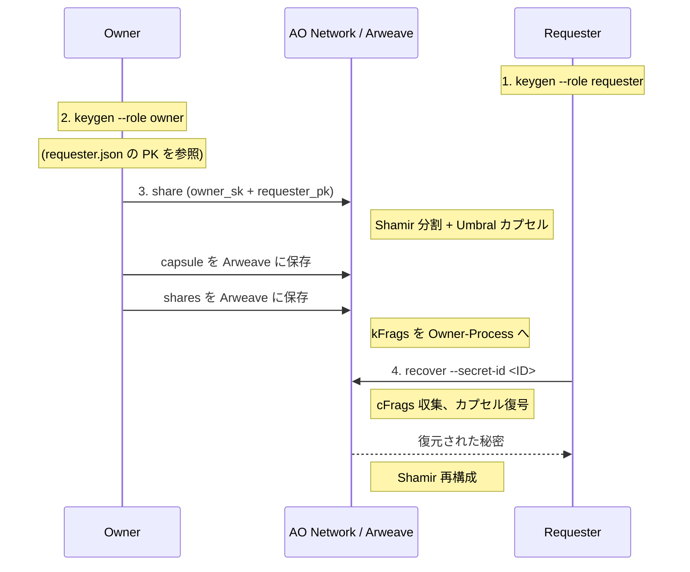
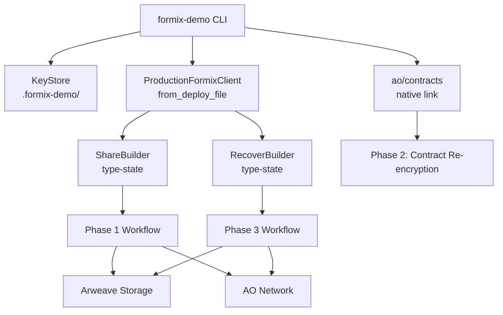

# FORMIX デモ

Arweave + AO Network 上で動作する FORMIX 閾値プロキシ再暗号化（TPRE）ワークフローを体験するための開発者向け CLI です。

## このデモの概要



**2-of-3** 閾値スキームを使用します。秘密は 3 つのシェアに分割され、任意の 2 つで復元できます。

## ローカルモード（推奨：クイックスタート）

AO Network / Arweave への接続が不要なローカル実行モードです。Phase 2 の再暗号化処理は `ao/contracts/` の実際のコントラクトコードをネイティブリンクして実行します。

### 一括実行

全ステップを 1 コマンドで実行します:

```bash
make demo-local
# または: cargo run --release -- local all
# または: cargo run --release -- --local  (後方互換)
```

### ステップ実行

各 Phase を個別に実行できます:

```bash
# Step 1: 鍵ペア生成（既存コマンド）
cargo run --release -- keygen --role requester
cargo run --release -- keygen --role owner

# Step 2: Phase 1 — ローカル秘密分割
cargo run --release -- local share
# → secret_id が出力されます

# Step 3: Phase 2 — コントラクトコードで再暗号化
cargo run --release -- local reencrypt --secret-id <SECRET_ID>

# Step 4: Phase 3 — ローカル秘密復元
cargo run --release -- local recover --secret-id <SECRET_ID>
```

Make ターゲットも使用可能です:

```bash
make demo-keygen ROLE=owner
make demo-keygen ROLE=requester
make demo-local-share
make demo-local-reencrypt SECRET_ID=<id>
make demo-local-recover SECRET_ID=<id>
```

### Phase 2: コントラクト統合

ローカルモードの Phase 2 では、`ao/contracts/` の実際のコントラクトコードを使用して再暗号化を実行します:

1. kFrag ごとに独立した Holder コントラクトインスタンスを作成
2. `SubmitKFrag` → `SubmitCapsule` → 内部で `perform_reencryption()` が自動実行
3. `GetCFrag` クエリで cFrag を取得

これにより AO Network 上の動作と同等の暗号処理パスを通ります。

### 中間データファイル

各ステップの結果は `.formix-demo/` に保存されます:

```
.formix-demo/
├── owner.json                          # Owner の秘密鍵 + 公開鍵
├── requester.json                      # Requester の秘密鍵 + 公開鍵
├── {secret_id}.local-share.json        # Phase 1 出力（capsule, kFrags, encrypted shares）
└── {secret_id}.local-reencrypt.json    # Phase 2 出力（cFrags）
```

### 出力例

```
[Phase 1] Secret Sharing (2-of-3 threshold)
────────────────────────────────────────────────────────
  secret: "Hello FORMIX - Threshold PRE Demo" (33 bytes)
  threshold: k=2, n=3
  OK Symmetric key generated (32 bytes)
  OK Shamir split: 3 shares
  OK AES-encrypted 3 shares
  OK PRE capsule created (...)
  OK Generated 3 kFrags

[Phase 2] Proxy Re-Encryption (contract code, local execution)
────────────────────────────────────────────────────────
  Using 2 of 3 kFrags (threshold)
  OK Holder 0 re-encrypted kFrag -> cFrag (...) [contract]
  OK Holder 1 re-encrypted kFrag -> cFrag (...) [contract]
  OK Collected 2/2 cFrags (threshold met)

[Phase 3] Secret Recovery
────────────────────────────────────────────────────────
  >> Executing recover workflow...
  OK Symmetric key recovered via PRE
  OK Decrypted 2 shares with recovered key
  OK Secret reconstructed via Shamir

[Result] Phase 3 completed successfully
  recovered secret: Hello FORMIX - Threshold PRE Demo

  SUCCESS: Secret matches original!
```

## 前提条件

- Rust 1.86.0（`rustup` が `rust-toolchain.toml` を自動検出します）
- Node.js 20+（`ao/` スクリプト用）
- Arweave JWK ウォレットファイル（`arweave-keyfile.json`）

## セットアップ（Production モード）

以下の手順は AO Network / Arweave を使用する Production モードのセットアップです。ローカルモードではこのセットアップは不要です。

### Step 1: 環境設定

```bash
cp .env.example .env
# .env を編集して ARWEAVE_WALLET_PATH を設定（または CLI で --wallet を指定）
```

### Step 2: AO 依存パッケージのインストール

```bash
make setup
# --ignore-scripts 付きで npm install（sqlite3 ネイティブビルドをスキップ）
```

### Step 3: WASM ビルド & モジュールのデプロイ

```bash
make deploy
# WASM をビルドし Arweave にデプロイします
# 出力された module_id を控えてください
```

### Step 4: AO プロセスの起動

```bash
make spawn MODULE_ID=<module_id> SCHEDULER=<scheduler_address>
# 出力された process_id を控えてください
```

### Step 5: deploy.json の作成

```bash
cp deploy.example.json deploy.json
```

`deploy.json` を編集し、Step 3・4 で取得した `module_id` と `process_id` を記入してください。

### Step 6: デモの実行（E2E フロー）

```bash
# 1. Requester の鍵ペアを生成・保存
cargo run -- keygen --role requester

# 2. Owner の鍵ペアを生成・保存
cargo run -- keygen --role owner

# 3. 秘密を分割して Arweave に保存（owner_sk + requester_pk を使用）
cargo run -- share

# 4. 秘密を復元（requester_sk + owner_pk を使用）
cargo run -- recover --secret-id <SECRET_ID>
```

## サブコマンド

### `keygen` - PRE 鍵ペア生成

```bash
cargo run -- keygen --role <owner|requester> [--output <PATH>]
```

| オプション | デフォルト | 説明 |
|-----------|-----------|------|
| `--role` | (必須) | `owner` または `requester` |
| `--output` | `.formix-demo/{role}.json` | 出力先ファイルパス |

### `share` - Phase 1: 秘密分割（Production）

```bash
cargo run -- share [--owner-key-file <PATH>] [--requester-pubkey-file <PATH>]
```

### `recover` - Phase 3: 秘密復元（Production）

```bash
cargo run -- recover --secret-id <SECRET_ID> [--requester-key-file <PATH>] [--share-result-file <PATH>]
```

### `local share` - Phase 1: ローカル秘密分割

```bash
cargo run -- local share [--owner-key-file <PATH>] [--requester-pubkey-file <PATH>]
```

### `local reencrypt` - Phase 2: コントラクト再暗号化

```bash
cargo run -- local reencrypt --secret-id <SECRET_ID> [--share-result-file <PATH>]
```

### `local recover` - Phase 3: ローカル秘密復元

```bash
cargo run -- local recover --secret-id <SECRET_ID> [--requester-key-file <PATH>]
```

### `local all` - 全ステップ一括実行

```bash
cargo run -- local all [--owner-key-file <PATH>] [--requester-key-file <PATH>]
```

## CLI オプション

```
formix-demo [OPTIONS] <COMMAND>

Options:
  --local           全フェーズを一括実行（local all のエイリアス）
  --deploy <PATH>   deploy.json のパス（デフォルト: deploy.json）
  --wallet <PATH>   Arweave JWK ウォレットのパス（ARWEAVE_WALLET_PATH を上書き）

Commands:
  keygen   鍵ペアを生成してファイルに保存
  share    2-of-3 閾値 PRE で秘密を分割（Production）
  recover  Arweave から秘密を復元（Production）
  local    ローカルモード: ステップ実行 + コントラクト再暗号化
```

## Make ターゲット一覧

| ターゲット | 説明 | 必須変数 |
|-----------|------|----------|
| `make setup` | `ao/` の npm 依存パッケージをインストール | - |
| `make deploy` | WASM ビルド & Arweave にモジュールをデプロイ | `WALLET` |
| `make spawn` | AO プロセスを起動 | `MODULE_ID`, `SCHEDULER` |
| `make build` | デモバイナリをビルド（release） | - |
| `make demo-keygen` | PRE 鍵ペアを生成 | `ROLE` |
| `make demo-share` | Phase 1: 秘密分割（Production） | - |
| `make demo-recover` | Phase 3: 秘密復元（Production） | `SECRET_ID` |
| `make demo-local` | ローカル全ステップ実行 | - |
| `make demo-local-share` | ローカル Phase 1: 秘密分割 | - |
| `make demo-local-reencrypt` | ローカル Phase 2: コントラクト再暗号化 | `SECRET_ID` |
| `make demo-local-recover` | ローカル Phase 3: 秘密復元 | `SECRET_ID` |
| `make demo-local-all` | ローカル全ステップ実行 | - |
| `make demo-all` | フルデモフロー（keygen + share） | - |

## トラブルシューティング

**"Failed to read deploy config"**
カレントディレクトリに `deploy.json` が存在するか確認してください（または `--deploy <path>` で指定）。

**"Wallet path not provided"**
`.env` で `ARWEAVE_WALLET_PATH` を設定するか、`--wallet <path>` で指定してください。

**"Failed to load owner key from ..."**
先に `keygen --role owner` を実行して鍵ファイルを生成してください。

**"Failed to load requester PK from ..."**
先に `keygen --role requester` を実行して鍵ファイルを生成してください。

**"Failed to load local share from ..."**
先に `local share` を実行してください。`--secret-id` が正しいことを確認してください。

**"Failed to load local reencrypt from ..."**
先に `local reencrypt --secret-id <ID>` を実行してください。

**`formix` クレートのビルドエラー**
`cd ../client && make check` で原因を確認してください。デモは `production-ao` と `key-export` フィーチャーフラグに依存しています。

## アーキテクチャ


