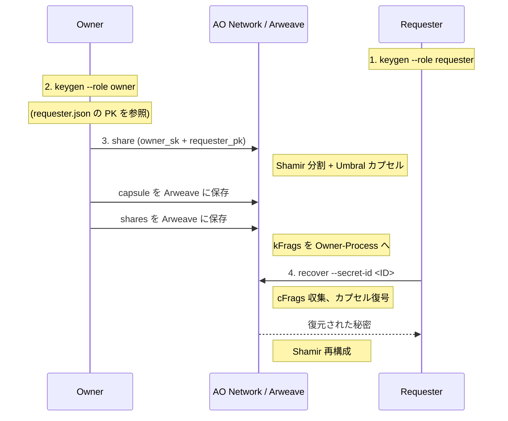
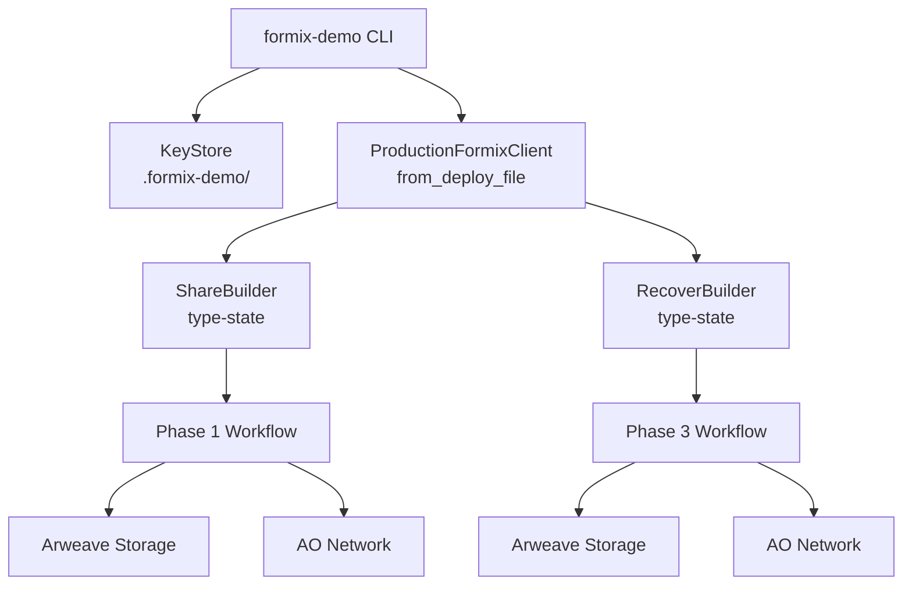

# FORMIX デモ

Arweave + AO Network 上で動作する FORMIX 閾値プロキシ再暗号化（TPRE）ワークフローを体験するための開発者向け CLI です。

## このデモの概要



**2-of-3** 閾値スキームを使用します。秘密は 3 つのシェアに分割され、任意の 2 つで復元できます。

## 前提条件

- Rust 1.86.0（`rustup` が `rust-toolchain.toml` を自動検出します）
- Node.js 20+ および Yarn（`ao/` スクリプト用）
- Arweave JWK ウォレットファイル（Step 3 で生成）

## セットアップ

### Step 1: 環境設定

```bash
cp .env.example .env
# .env を編集して ARWEAVE_WALLET_PATH を設定（または CLI で --wallet を指定）
```

### Step 2: AO 依存パッケージのインストール

```bash
make setup
```

### Step 3: Arweave ウォレットの生成

```bash
make keygen
# ao/ ディレクトリに wallet.json が作成されます
```

### Step 4: WASM モジュールのデプロイ

```bash
make deploy
# 出力された module_id を控えてください
```

### Step 5: AO プロセスの起動

```bash
make spawn
# 出力された process_id を控えてください
```

### Step 6: deploy.json の作成

```bash
cp deploy.example.json deploy.json
```

`deploy.json` を編集し、Step 4・5 で取得した `module_id` と `process_id` を記入してください。

### Step 7: デモの実行（E2E フロー）

```bash
# 1. Requester の鍵ペアを生成・保存
cargo run -- keygen --role requester

# 2. Owner の鍵ペアを生成・保存
cargo run -- keygen --role owner

# 3. 秘密を分割して Arweave に保存（owner_sk + requester_pk を使用）
cargo run -- share

# 4. 秘密を復元（requester_sk + owner_pk を使用）
cargo run -- recover --secret-id <SECRET_ID>
# → "Hello FORMIX - Threshold PRE Demo" が復元されます
```

## 鍵ファイルの構造

鍵と結果は `.formix-demo/` ディレクトリに保存されます。

```
.formix-demo/
├── owner.json         # Owner の秘密鍵 + 公開鍵
├── requester.json     # Requester の秘密鍵 + 公開鍵
└── {secret_id}.json   # share コマンドの結果（owner_pk, tx_ids 等）
```

## サブコマンド

### `keygen` - PRE 鍵ペア生成

```bash
cargo run -- keygen --role <owner|requester> [--output <PATH>]
```

指定されたロール（owner または requester）の Umbral PRE 鍵ペアを生成し、ファイルに永続化します。

| オプション | デフォルト | 説明 |
|-----------|-----------|------|
| `--role` | (必須) | `owner` または `requester` |
| `--output` | `.formix-demo/{role}.json` | 出力先ファイルパス |

### `share` - Phase 1: 秘密分割

```bash
cargo run -- share [--owner-key-file <PATH>] [--requester-pubkey-file <PATH>]
```

1. `owner.json` から Owner 秘密鍵を読込
2. `requester.json` から Requester 公開鍵を読込
3. デモ用秘密データを Shamir 秘密分散で分割（k=2, n=3）
4. Umbral PRE カプセルを作成し Arweave に保存
5. 結果を `.formix-demo/{secret_id}.json` に保存

| オプション | デフォルト | 説明 |
|-----------|-----------|------|
| `--owner-key-file` | `.formix-demo/owner.json` | Owner 鍵ファイルのパス |
| `--requester-pubkey-file` | `.formix-demo/requester.json` | Requester 公開鍵ファイルのパス |

### `recover` - Phase 3: 秘密復元

```bash
cargo run -- recover --secret-id <SECRET_ID> [--requester-key-file <PATH>] [--share-result-file <PATH>]
```

1. `requester.json` から Requester 秘密鍵を読込
2. `{secret_id}.json` から Owner 公開鍵を読込
3. AO Network から cFrags を収集、復号し秘密を再構成

| オプション | デフォルト | 説明 |
|-----------|-----------|------|
| `--secret-id` | (必須) | share コマンドが出力した秘密ID |
| `--requester-key-file` | `.formix-demo/requester.json` | Requester 鍵ファイルのパス |
| `--share-result-file` | `.formix-demo/{secret_id}.json` | share 結果ファイルのパス |

## CLI オプション

```
formix-demo [OPTIONS] <COMMAND>

Options:
  --deploy <PATH>   deploy.json のパス（デフォルト: deploy.json）
  --wallet <PATH>   Arweave JWK ウォレットのパス（ARWEAVE_WALLET_PATH を上書き）

Commands:
  keygen   鍵ペアを生成してファイルに保存
  share    2-of-3 閾値 PRE で秘密を分割
  recover  Arweave から秘密を復元
```

## トラブルシューティング

**"Failed to read deploy config"**
カレントディレクトリに `deploy.json` が存在するか確認してください（または `--deploy <path>` で指定）。

**"Wallet path not provided"**
`.env` で `ARWEAVE_WALLET_PATH` を設定するか、`--wallet <path>` で指定してください。

**"Failed to load owner key from ..."**
先に `keygen --role owner` を実行して鍵ファイルを生成してください。

**"Failed to load requester PK from ..."**
先に `keygen --role requester` を実行して鍵ファイルを生成してください。

**"Failed to load share result from ..."**
先に `share` コマンドを実行してください。`--secret-id` が正しいことを確認してください。

**"Failed to create AO client"**
`deploy.json` の `module_id` と `process_id` が正しいこと、AO ゲートウェイに接続可能であることを確認してください。

**`formix` クレートのビルドエラー**
`cd ../client && make check` で原因を確認してください。デモは `production-ao` と `key-export` フィーチャーフラグに依存しています。

## アーキテクチャ


