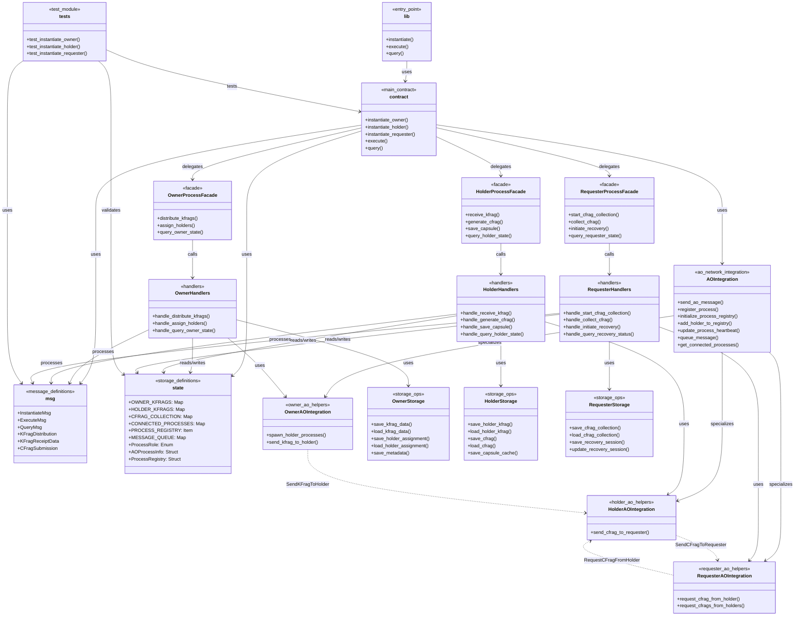

# D-TPRES コントラクト アーキテクチャドキュメント

## プロジェクト構造

### ディレクトリ構成

```
/deploy/contracts/src/
├── lib.rs              # CosmWasm エントリーポイント
├── contract.rs         # メインコントラクト実装
├── msg.rs              # メッセージ定義
├── state.rs            # ストレージ定義
├── ao_integration.rs   # AO Network プロセス間通信統合
├── tests.rs            # 基本テスト
├── owner/              # Owner-Process モジュール
│   ├── mod.rs          # モジュール統合とFacade
│   ├── handlers.rs     # メッセージハンドラ
│   └── storage.rs      # ストレージ操作
├── holder/             # Holder-Process モジュール
│   ├── mod.rs          # モジュール統合とFacade
│   ├── handlers.rs     # メッセージハンドラ
│   └── storage.rs      # ストレージ操作
└── requester/          # Requester-Process モジュール
    ├── mod.rs          # モジュール統合とFacade
    ├── handlers.rs     # メッセージハンドラ
    └── storage.rs      # ストレージ操作
```

### ファイル一覧と概要

| ファイル | サイズ | 役割 |
|---------|-------|------|
| `lib.rs` | 902B | CosmWasm標準エントリーポイント |
| `contract.rs` | 11.2KB | メインコントラクト、ルーティング |
| `msg.rs` | 8.8KB | メッセージ・データ構造定義 |
| `state.rs` | 10.7KB | KVストレージ・状態定義（AO Network機能含む） |
| `ao_integration.rs` | 10.2KB | AO Network プロセス間通信・管理統合 |
| `tests.rs` | 4.8KB | 基本テストスイート |
| `owner/mod.rs` | 9.0KB | Owner-Processファサード |
| `owner/handlers.rs` | 15.4KB | Ownerメッセージハンドラ |
| `owner/storage.rs` | 13.7KB | Ownerストレージ操作 |
| `holder/mod.rs` | 12.2KB | Holder-Processファサード |
| `holder/handlers.rs` | 21.0KB | Holderメッセージハンドラ |
| `holder/storage.rs` | 21.0KB | Holderストレージ操作 |
| `requester/mod.rs` | 13.6KB | Requester-Processファサード |
| `requester/handlers.rs` | 22.8KB | Requesterメッセージハンドラ |
| `requester/storage.rs` | 25.6KB | Requesterストレージ操作 |

## アーキテクチャ図



## アーキテクチャ階層

### 1. エントリーポイント層 (`lib.rs`)

**役割**: CosmWasm標準のエントリーポイントを提供

```rust
#[entry_point]
pub fn instantiate(deps: DepsMut, env: Env, info: MessageInfo, msg: InstantiateMsg) -> Result<Response, ContractError>

#[entry_point]
pub fn execute(deps: DepsMut, env: Env, info: MessageInfo, msg: ExecuteMsg) -> Result<Response, ContractError>

#[entry_point]
pub fn query(deps: Deps, _env: Env, msg: QueryMsg) -> StdResult<Binary>
```

**特徴**:
- CosmWasm AO Network との統合点
- すべてのメッセージの最初の受信ポイント
- `contract.rs` への委譲のみを行う

### 2. コントラクト層 (`contract.rs`)

**役割**: メインコントラクトロジックとメッセージルーティング

**主要機能**:
- **役割別初期化**: Owner/Holder/Requesterの3つの役割別にプロセス初期化
- **メッセージルーティング**: 役割に応じた適切なモジュールへの委譲
- **統合クエリ処理**: 全プロセスのクエリを統合的に処理
- **エラーハンドリング**: 統一されたエラー処理

**設計パターン**: Router Pattern + Facade Pattern

### 3. メッセージ定義層 (`msg.rs`)

**役割**: プロセス間通信とデータ構造の定義

**主要コンポーネント**:

#### InstantiateMsg
```rust
pub struct InstantiateMsg {
    pub role: ProcessRole,
    pub threshold_k: Option<u32>,
    pub total_holders_n: Option<u32>,
}
```

#### ExecuteMsg
```rust
pub enum ExecuteMsg {
    // Owner-Process Messages
    DistributeKFrags { kfrags: Vec<KFragDistribution> },
    AssignHolders { assignments: Vec<HolderAssignment> },

    // Holder-Process Messages
    ReceiveKFrag { kfrag_data: KFragReceiptData },
    GenerateCFrag { kfrag_id: String },
    SaveCapsule { capsule_data: CapsuleData },

    // Requester-Process Messages
    StartCFragCollection { session_id: String, threshold: u32 },
    CollectCFrag { cfrag: CFragSubmission },
    InitiateRecovery { session_id: String },
}
```

#### データ転送オブジェクト
- `KFragDistribution`: kFrag配布用データ
- `KFragReceiptData`: kFrag受信用データ
- `CFragSubmission`: cFrag提出用データ
- `CapsuleData`: Capsule保存用データ

### 4. ストレージ定義層 (`state.rs`)

**役割**: KVストレージの定義とデータ構造

**ストレージマップ**:

#### Owner-Process用
```rust
pub const OWNER_KFRAGS: Map<String, OwnerKFragData> = Map::new("owner_kfrags");
pub const HOLDER_ASSIGNMENTS: Map<String, HolderAssignment> = Map::new("holder_assignments");
pub const OWNER_METADATA: Item<OwnerMetadata> = Item::new("owner_metadata");
```

#### Holder-Process用
```rust
pub const HOLDER_KFRAGS: Map<String, HolderKFragData> = Map::new("holder_kfrags");
pub const HOLDER_CFRAGS: Map<String, HolderCFragData> = Map::new("holder_cfrags");
pub const CAPSULE_CACHE: Map<String, CapsuleData> = Map::new("capsule_cache");
```

#### Requester-Process用
```rust
pub const CFRAG_COLLECTION: Map<String, CFragCollection> = Map::new("cfrag_collection");
pub const RECOVERY_SESSIONS: Map<String, RecoverySession> = Map::new("recovery_sessions");
pub const THRESHOLD_TRACKER: Item<ThresholdInfo> = Item::new("threshold_tracker");
pub const REQUESTER_METADATA: Item<RequesterMetadata> = Item::new("requester_metadata");
```

#### AO Network プロセス管理用
```rust
pub const CONNECTED_PROCESSES: Map<String, AOProcessInfo> = Map::new("connected_processes");
pub const PROCESS_REGISTRY: Item<ProcessRegistry> = Item::new("process_registry");
pub const MESSAGE_QUEUE: Map<String, PendingMessage> = Map::new("message_queue");
```

**主要データ構造**:

**プロセス管理**:
```rust
pub struct AOProcessInfo {
    pub process_id: String,
    pub wasm_tx_id: String,         // ArweaveのWASMモジュールTXID
    pub process_role: ProcessRole,
    pub spawned_at: u64,
    pub status: AOProcessStatus,    // Active, Inactive, Failed, Initializing
    pub last_heartbeat: u64,
}

pub struct ProcessRegistry {
    pub current_process_id: String,
    pub current_role: ProcessRole,
    pub initialization_time: u64,
    pub holder_processes: Vec<String>,      // Owner-Processが管理するHolder-Process
    pub requester_processes: Vec<String>,   // システム内のRequester-Process
    pub owner_process: Option<String>,      // Holder/RequesterからみたOwner-Process
}

pub struct PendingMessage {
    pub message_id: String,
    pub target_process: String,
    pub message_type: String,
    pub message_data: Vec<u8>,
    pub created_at: u64,
    pub retry_count: u32,
    pub max_retries: u32,
}
```

**セキュリティ特徴**:
- 暗号関連データはすべて `Zeroize` + `ZeroizeOnDrop` 実装
- プロセス役割の型安全性確保
- 定数時間操作によるサイドチャネル攻撃対策
- プロセス認証とメッセージ整合性検証

### 5. AO Network統合層 (`ao_integration.rs`)

**役割**: AO Networkにおけるプロセス間通信と管理機能の統合

AO Networkの分散実行環境において、個別にデプロイされたWebAssemblyプロセス間の通信を実現する重要な統合層です。

#### 5.1 主要コンポーネント

##### AOIntegration (基本統合機能)
```rust
pub struct AOIntegration;

impl AOIntegration {
    // プロセス間メッセージ送信
    pub fn send_ao_message(target_process: String, message: ExecuteMsg) -> Result<CosmosMsg, StdError>

    // プロセス登録・管理
    pub fn register_process(deps: DepsMut, env: Env, process_id: String, wasm_tx_id: String, role: ProcessRole) -> StdResult<()>

    // プロセスレジストリ初期化
    pub fn initialize_process_registry(deps: DepsMut, env: Env, process_id: String, role: ProcessRole) -> StdResult<()>

    // メッセージキューイング
    pub fn queue_message(deps: DepsMut, env: Env, target_process: String, message_type: String, message_data: Vec<u8>) -> StdResult<String>
}
```

##### プロセス固有の統合機能

**OwnerAOIntegration**: Owner-Process専用機能
```rust
impl OwnerAOIntegration {
    // 複数Holder-Processの生成
    pub fn spawn_holder_processes(deps: DepsMut, env: Env, wasm_tx_id: String, holder_count: u32) -> StdResult<Vec<String>>

    // Holder-ProcessへのkFrag送信
    pub fn send_kfrag_to_holder(target_process: String, kfrag: KFragDistribution, owner_process: String) -> StdResult<CosmosMsg>
}
```

**HolderAOIntegration**: Holder-Process専用機能
```rust
impl HolderAOIntegration {
    // Requester-ProcessへのcFrag送信
    pub fn send_cfrag_to_requester(target_process: String, cfrag: CFragSubmission, holder_process: String) -> StdResult<CosmosMsg>
}
```

**RequesterAOIntegration**: Requester-Process専用機能
```rust
impl RequesterAOIntegration {
    // Holder-ProcessからのcFrag要求
    pub fn request_cfrag_from_holder(target_process: String, session_id: String, requester_process: String) -> StdResult<CosmosMsg>

    // 複数Holder-Processからの並行cFrag要求
    pub fn request_cfrags_from_holders(holder_process_ids: Vec<String>, session_id: String, requester_process: String) -> StdResult<Vec<CosmosMsg>>
}
```

#### 5.2 プロセス管理機能

**プロセスライフサイクル管理**:
- **Spawn**: ArweaveのWASM TXIDからプロセス生成
- **Register**: プロセスレジストリへの登録
- **Heartbeat**: プロセス健全性監視
- **Discovery**: 動的プロセス発見

**データ構造**:
```rust
pub struct AOProcessInfo {
    pub process_id: String,
    pub wasm_tx_id: String,      // ArweaveのWASMモジュールTXID
    pub process_role: ProcessRole,
    pub spawned_at: u64,
    pub status: AOProcessStatus,
    pub last_heartbeat: u64,
}

pub struct ProcessRegistry {
    pub current_process_id: String,
    pub current_role: ProcessRole,
    pub holder_processes: Vec<String>,      // Owner-Processが管理するHolder-Process
    pub requester_processes: Vec<String>,   // システム内のRequester-Process
    pub owner_process: Option<String>,      // Holder/RequesterからみたOwner-Process
}
```

#### 5.3 メッセージキューイング

**非同期メッセージ配信**:
- **Queue管理**: 配信失敗時の再試行機能
- **優先度制御**: 重要度に応じたメッセージ処理
- **Dead Letter Queue**: 最大再試行後の失敗メッセージ管理

```rust
pub struct PendingMessage {
    pub message_id: String,
    pub target_process: String,
    pub message_type: String,
    pub message_data: Vec<u8>,
    pub created_at: u64,
    pub retry_count: u32,
    pub max_retries: u32,
}
```

#### 5.4 AO Network特有の設計制約への対応

**ステートレス実行**:
- メッセージ間でメモリが保持されないため、すべての状態はストレージから復元
- プロセス間通信は非同期メッセージングのみ

**分散Compute Unit**:
- 異なるCUで実行される可能性を考慮した堅牢性
- プロセス状態の一貫性保証

### 6. プロセスモジュール層

各プロセス（Owner/Holder/Requester）は統一された3層構造を採用：

#### 6.1 ファサード層 (`mod.rs`)

**役割**: 統合インターフェースの提供

```rust
pub struct OwnerProcessFacade;

impl OwnerProcessFacade {
    pub fn distribute_kfrags(deps: DepsMut, env: Env, info: MessageInfo, kfrags: Vec<KFragDistribution>) -> Result<Response, ContractError>
    pub fn assign_holders(deps: DepsMut, env: Env, info: MessageInfo, assignments: Vec<HolderAssignment>) -> Result<Response, ContractError>
    pub fn query_owner_state(deps: Deps, query: OwnerQuery) -> StdResult<Binary>
}
```

**設計パターン**: Facade Pattern
**特徴**:
- 外部からのシンプルなインターフェース
- 内部の複雑性を隠蔽
- テスト容易性の確保

#### 6.2 ハンドラ層 (`handlers.rs`)

**役割**: ビジネスロジックの実装

**CosmWasm AO 3段階パターン**:
```rust
pub fn handle_message(deps: DepsMut, env: Env, info: MessageInfo, msg: SpecificMsg) -> Result<Response, ContractError> {
    // 1. 状態ロード
    let current_state = load_state(deps.storage, &key)?;

    // 2. ビジネスロジック実行
    let (new_state, response_data) = process_business_logic(current_state, msg)?;

    // 3. 状態保存
    save_state(deps.storage, &key, &new_state)?;

    Ok(Response::new().add_attributes(response_data.attributes))
}
```

**特徴**:
- ステートレス実行への対応
- 原子性の保証
- エラー時の状態保全

#### 6.3 ストレージ層 (`storage.rs`)

**役割**: データ永続化の抽象化

**主要機能**:
- **CRUD操作**: Create, Read, Update, Delete の統一インターフェース
- **トランザクション**: 複数操作の原子性保証
- **バリデーション**: データ整合性チェック
- **統計情報**: パフォーマンス監視

```rust
pub fn save_data<T>(storage: &mut dyn Storage, key: String, data: &T) -> Result<(), ContractError>
where T: Serialize + for<'de> Deserialize<'de>

pub fn load_data<T>(storage: &dyn Storage, key: String) -> Result<T, ContractError>
where T: for<'de> Deserialize<'de>
```

### 7. テスト層 (`tests.rs`)

**役割**: 品質保証とリグレッション防止

**テストカテゴリ**:

#### 基本テスト
- プロセス初期化テスト
- メッセージバリデーションテスト
- クエリ機能テスト

#### 統合テスト
- プロセス間メッセージングテスト
- エンドツーエンドフローテスト
- エラーハンドリングテスト

#### セキュリティテスト
- Zeroize動作確認
- 役割分離テスト
- アクセス制御テスト

## 重要な設計パターン

### 1. ファサードパターン (Facade Pattern)

**適用箇所**: 各プロセスモジュールの `mod.rs`

**目的**:
- 複雑なサブシステムに対するシンプルなインターフェース提供
- クライアントコードの簡素化
- 内部実装の変更からクライアントを保護

**実装例**:
```rust
// 複雑な内部処理を隠蔽
impl OwnerProcessFacade {
    pub fn distribute_kfrags(/* 引数 */) -> Result<Response, ContractError> {
        // 内部で handlers::handle_distribute_kfrags() を呼び出し
        // エラーハンドリング、ログ出力なども統合
    }
}
```

### 2. レイヤードアーキテクチャ (Layered Architecture)

**階層構造**:
- **プレゼンテーション層**: lib.rs, contract.rs
- **ビジネスロジック層**: handlers.rs
- **データアクセス層**: storage.rs
- **データ層**: state.rs

**利点**:
- 明確な責任分離
- テスト容易性
- 保守性の向上

### 3. リポジトリパターン (Repository Pattern)

**適用箇所**: storage.rs ファイル群

**目的**:
- データアクセスロジックの抽象化
- データソースの詳細の隠蔽
- テスト時のモック化容易性

### 4. メッセージ駆動アーキテクチャ (Message-Driven Architecture)

**CosmWasm AO対応**:
- ステートレス実行への適応
- イベントソーシングによる状態管理
- 非同期メッセージングサポート

## プロセス間通信フロー

### 1. AO Network プロセス間メッセージング

D-TPRESシステムでは、Owner、Holder、RequesterがそれぞれAO Network上の独立したプロセスとして動作し、メッセージパッシングによって連携します。

#### 1.1 プロセス初期化とレジストリ構築

```
Owner-Process(spawn) → Holder-Process(spawn) → Requester-Process(spawn)
```

1. **Owner-Process**:
   - 自身のプロセスレジストリ初期化
   - 複数Holder-Processを`spawn_holder_processes()`で生成
   - 各Holder-Processを`add_holder_to_registry()`で登録

2. **Holder-Process**:
   - Owner-Processから登録メッセージ受信
   - Owner-Processを`set_owner_in_registry()`で登録

3. **Requester-Process**:
   - システムに参加時、Holder-Processリストを取得
   - 必要に応じてOwner-Processに登録

#### 1.2 kFrag配布フロー (PHASE 1)

```
O-Browser → Owner-Process → Holder-Process(1..n) [via SendKFragToHolder message]
```

**メッセージフロー**:
```rust
// Owner-Process → Holder-Process
ExecuteMsg::SendKFragToHolder {
    target_process: String,        // Holder-ProcessのプロセスID
    kfrag: KFragDistribution,      // 暗号化されたkFragデータ
    owner_process: String,         // Owner-ProcessのプロセスID
}
```

1. **O-Browser**: kFrag生成・暗号化
2. **Owner-Process**:
   - kFrag受信・検証
   - Holder選出（RandAOアルゴリズム）
   - `OwnerAOIntegration::send_kfrag_to_holder()`でメッセージ送信
3. **Holder-Process**:
   - `execute_send_kfrag_to_holder()`でkFrag受信・保存
   - プロセス認証とデータ検証

#### 1.3 cFrag要求・生成フロー (PHASE 2)

```
Requester-Process → Holder-Process [via RequestCFragFromHolder]
                 ← Holder-Process [via SendCFragToRequester]
```

**メッセージフロー**:
```rust
// Requester-Process → Holder-Process
ExecuteMsg::RequestCFragFromHolder {
    target_process: String,        // Holder-ProcessのプロセスID
    session_id: String,           // セッション識別子
    requester_process: String,     // Requester-ProcessのプロセスID
}

// Holder-Process → Requester-Process
ExecuteMsg::SendCFragToRequester {
    target_process: String,        // Requester-ProcessのプロセスID
    cfrag: CFragSubmission,       // 生成されたcFragデータ
    holder_process: String,        // Holder-ProcessのプロセスID
}
```

1. **Requester-Process**:
   - `RequesterAOIntegration::request_cfrags_from_holders()`で複数要求
   - 各Holder-Processに並行してcFrag要求
2. **Holder-Process**:
   - `execute_request_cfrag_from_holder()`で要求受信
   - Capsule取得、cFrag生成 (PRE_ReEnc)
   - `HolderAOIntegration::send_cfrag_to_requester()`で応答
3. **Requester-Process**:
   - `execute_send_cfrag_to_requester()`でcFrag収集
   - 閾値達成チェック

#### 1.4 秘密復元フロー (PHASE 3)

```
R-Browser → Requester-Process → R-Browser
```

1. **Requester-Process**:
   - k個のcFrag収集完了確認
   - `CFragCollection`の閾値チェック
   - 復元用データパッケージ作成
2. **R-Browser**:
   - cFragを用いた秘密復元実行
   - 最終的なデータ復号化

### 2. メッセージ配信の信頼性保証

#### 2.1 メッセージキューイング
```rust
// 失敗時の再試行メカニズム
AOIntegration::queue_message() → MESSAGE_QUEUE → retry_message() → complete_message()
```

#### 2.2 プロセス健全性監視
```rust
// 定期的なハートビート更新
AOIntegration::update_process_heartbeat() → AOProcessInfo.last_heartbeat
```

#### 2.3 メッセージ順序保証
- セッションIDベースの順序制御
- 重複メッセージの検出と排除
- タイムアウト処理とデッドレター管理

## セキュリティ設計

### 1. メモリ安全性

**Zeroize実装**:
```rust
#[derive(Serialize, Deserialize, Clone, Debug, Zeroize, ZeroizeOnDrop)]
pub struct SecretData {
    #[zeroize(skip)]
    pub public_metadata: String,
    pub secret_material: Vec<u8>,  // 自動的にゼロクリア
}
```

### 2. アクセス制御

**プロセス役割検証**:
```rust
pub fn verify_process_role(deps: &DepsMut, expected_role: ProcessRole) -> Result<(), ContractError> {
    let current_role = get_process_role(deps)?;
    if current_role != expected_role {
        return Err(ContractError::UnauthorizedRole);
    }
    Ok(())
}
```

### 3. 定数時間操作

**サイドチャネル攻撃対策**:
```rust
use subtle::ConstantTimeEq;

fn verify_signature_safe(sig1: &[u8], sig2: &[u8]) -> bool {
    sig1.ct_eq(sig2).into()
}
```

## パフォーマンス最適化

### 1. キャッシング戦略

- **Capsuleキャッシュ**: Arweaveアクセス回数削減
- **cFragキャッシュ**: 重複生成防止
- **統計情報キャッシュ**: クエリ応答時間短縮

### 2. メモリ使用量最適化

- **大容量データの参照管理**: Arweave TXIDのみ保存
- **不要データの即座解放**: Zeroizeによる自動クリア
- **効率的なシリアライゼーション**: 最小限のデータサイズ

## 拡張性

### 1. 新機能追加

**モジュラー設計**:
- 新しいプロセス役割の追加容易性
- メッセージ型の拡張可能性
- ストレージスキーマの進化対応

### 2. パフォーマンススケーリング

**水平スケーリング**:
- 複数CUでの並行実行
- プロセス間の独立性
- ステートレス実行による拡張性

## 運用監視

### 1. 統計情報

- **処理回数・成功率**: 各操作の実行統計
- **レスポンス時間**: パフォーマンス監視
- **エラー頻度**: 品質監視

### 2. ログ出力

- **構造化ログ**: JSON形式での出力
- **トレーサビリティ**: 処理の追跡可能性
- **デバッグ情報**: 開発・運用支援

## 重要なアーキテクチャ変更: 単一プロセスから複数プロセスへの移行

### アーキテクチャパラダイムの転換

D-TPRESシステムは、当初の**単一プロセス設計**から**真のマルチプロセス設計**への重要な進化を遂げました。

#### 従来の設計（単一プロセス）
```
Single CosmWasm Contract {
  ├── Owner Module
  ├── Holder Module
  └── Requester Module
}
```

**制約**:
- 単一の状態空間での役割切り替え
- 直接的な関数呼び出しによる内部通信
- スケーラビリティの限界
- プロセス独立性の欠如

#### 新設計（マルチプロセス）
```
AO Network Distributed System {
  ├── Owner-Process (独立したWASMプロセス)
  ├── Holder-Process-1 (独立したWASMプロセス)
  ├── Holder-Process-2 (独立したWASMプロセス)
  ├── Holder-Process-N (独立したWASMプロセス)
  └── Requester-Process (独立したWASMプロセス)
}
```

**利点**:
- **真の分散処理**: 各プロセスが独立したCUで実行
- **水平スケーラビリティ**: Holder-Processの動的追加
- **フォルトトレランス**: 個別プロセスの障害分離
- **プロセス専門化**: 役割特化による最適化

### 通信パラダイムの変更

#### 従来の通信（内部関数呼び出し）
```rust
// 直接的な関数呼び出し
owner::handlers::distribute_kfrags() → holder::handlers::receive_kfrag()
holder::handlers::generate_cfrag() → requester::handlers::collect_cfrag()
```

#### 新しい通信（AO Network メッセージング）
```rust
// 非同期メッセージパッシング
Owner-Process --[SendKFragToHolder]--> Holder-Process
Holder-Process --[SendCFragToRequester]--> Requester-Process
Requester-Process --[RequestCFragFromHolder]--> Holder-Process
```

### 技術的変更点

#### 1. プロセス管理の追加
- **プロセスレジストリ**: 動的プロセス発見
- **ライフサイクル管理**: spawn, register, heartbeat
- **故障検出**: プロセス健全性監視

#### 2. メッセージキューイング
- **非同期配信**: メッセージの確実な配信
- **再試行機構**: 配信失敗時の自動再試行
- **順序保証**: セッションベースの順序制御

#### 3. 状態管理の強化
- **プロセス状態分離**: 独立した状態空間
- **プロセス間同期**: 一貫性保証メカニズム
- **メッセージ順序**: タイムスタンプベース排序

### 実装パターンの変更

#### メッセージハンドラパターン
```rust
// 新しいパターン: プロセス間メッセージ処理
pub fn execute_send_kfrag_to_holder(
    deps: DepsMut,
    env: Env,
    info: MessageInfo,
    target_process: String,
    kfrag: KFragDistribution,
    owner_process: String,
) -> ContractResult {
    // 1. プロセス認証
    verify_process_role(deps.as_ref(), ProcessRole::Holder)?;
    verify_sender_is_owner(info.sender, &owner_process)?;

    // 2. 状態ロード
    let mut state = load_holder_state(deps.storage)?;

    // 3. ビジネスロジック実行
    process_kfrag_receipt(&mut state, kfrag)?;

    // 4. 状態保存
    save_holder_state(deps.storage, &state)?;

    // 5. 応答メッセージ構築
    Ok(Response::new().add_attributes(success_attributes))
}
```

### スケーラビリティと性能の向上

#### 並行処理能力
- **複数Holder-Process**: k-of-n閾値に応じた並行処理
- **非同期メッセージング**: ブロッキングなしの通信
- **分散負荷**: CU間での負荷分散

#### 故障耐性
- **プロセス独立性**: 単一プロセス故障の影響局所化
- **自動復旧**: プロセス再起動とレジストリ復元
- **メッセージ冗長化**: 重要メッセージの複数経路配信

### セキュリティ強化

#### プロセス間認証
- **送信者検証**: メッセージ送信者の正当性確認
- **プロセス役割検証**: 適切な役割からのメッセージのみ受信
- **メッセージ整合性**: タンパリング検出機能

#### アクセス制御
- **役割ベース制御**: プロセス役割による機能制限
- **レジストリベース認証**: 登録済みプロセスのみ通信許可
- **セッション管理**: セッションベースのアクセス制御

---

このアーキテクチャ進化により、D-TPRESシステムは**真に分散化された**、**スケーラブル**、**セキュア**、**保守可能**な閾値代理再暗号化システムとして、AO Network上で最適化された性能を発揮します。
