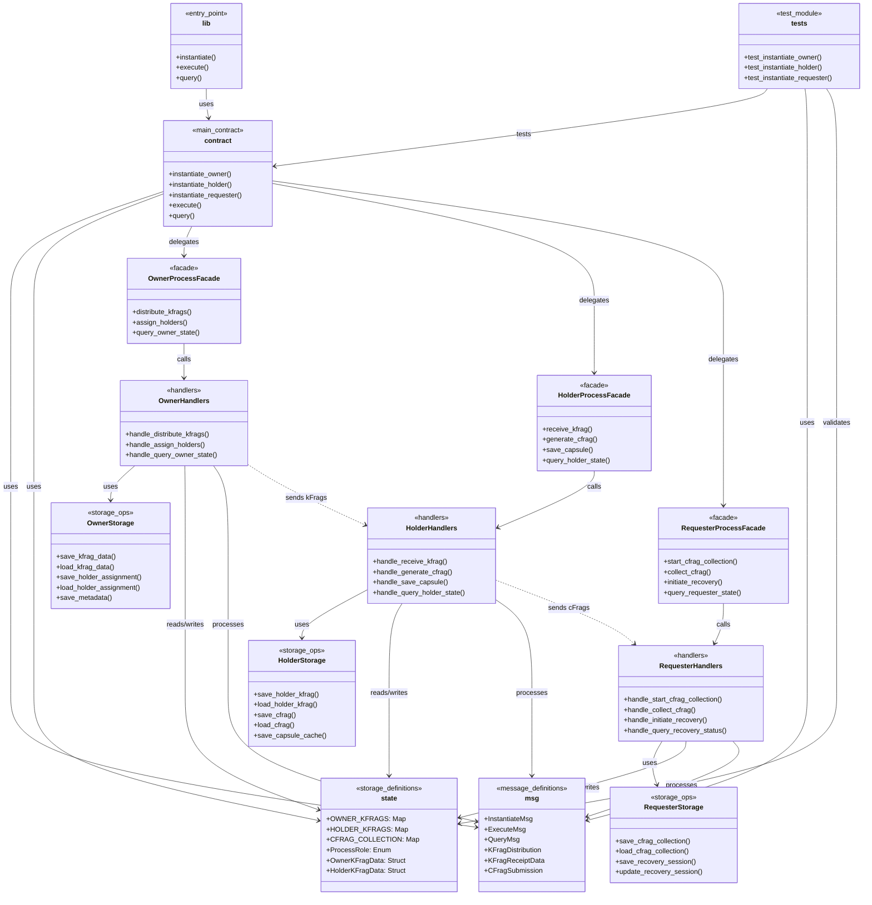

# D-TPRES コントラクト アーキテクチャドキュメント

## プロジェクト構造

### ディレクトリ構成

```
/deploy/contracts/src/
├── lib.rs              # CosmWasm エントリーポイント
├── contract.rs         # メインコントラクト実装
├── msg.rs              # メッセージ定義
├── state.rs            # ストレージ定義
├── tests.rs            # 基本テスト
├── owner/              # Owner-Process モジュール
│   ├── mod.rs          # モジュール統合とFacade
│   ├── handlers.rs     # メッセージハンドラ
│   └── storage.rs      # ストレージ操作
├── holder/             # Holder-Process モジュール
│   ├── mod.rs          # モジュール統合とFacade
│   ├── handlers.rs     # メッセージハンドラ
│   └── storage.rs      # ストレージ操作
└── requester/          # Requester-Process モジュール
    ├── mod.rs          # モジュール統合とFacade
    ├── handlers.rs     # メッセージハンドラ
    └── storage.rs      # ストレージ操作
```

### ファイル一覧と概要

| ファイル | サイズ | 役割 |
|---------|-------|------|
| `lib.rs` | 902B | CosmWasm標準エントリーポイント |
| `contract.rs` | 11.2KB | メインコントラクト、ルーティング |
| `msg.rs` | 8.8KB | メッセージ・データ構造定義 |
| `state.rs` | 6.9KB | KVストレージ・状態定義 |
| `tests.rs` | 4.8KB | 基本テストスイート |
| `owner/mod.rs` | 9.0KB | Owner-Processファサード |
| `owner/handlers.rs` | 15.4KB | Ownerメッセージハンドラ |
| `owner/storage.rs` | 13.7KB | Ownerストレージ操作 |
| `holder/mod.rs` | 12.2KB | Holder-Processファサード |
| `holder/handlers.rs` | 21.0KB | Holderメッセージハンドラ |
| `holder/storage.rs` | 21.0KB | Holderストレージ操作 |
| `requester/mod.rs` | 13.6KB | Requester-Processファサード |
| `requester/handlers.rs` | 22.8KB | Requesterメッセージハンドラ |
| `requester/storage.rs` | 25.6KB | Requesterストレージ操作 |

## アーキテクチャ図



## アーキテクチャ階層

### 1. エントリーポイント層 (`lib.rs`)

**役割**: CosmWasm標準のエントリーポイントを提供

```rust
#[entry_point]
pub fn instantiate(deps: DepsMut, env: Env, info: MessageInfo, msg: InstantiateMsg) -> Result<Response, ContractError>

#[entry_point]
pub fn execute(deps: DepsMut, env: Env, info: MessageInfo, msg: ExecuteMsg) -> Result<Response, ContractError>

#[entry_point]
pub fn query(deps: Deps, _env: Env, msg: QueryMsg) -> StdResult<Binary>
```

**特徴**:
- CosmWasm AO Network との統合点
- すべてのメッセージの最初の受信ポイント
- `contract.rs` への委譲のみを行う

### 2. コントラクト層 (`contract.rs`)

**役割**: メインコントラクトロジックとメッセージルーティング

**主要機能**:
- **役割別初期化**: Owner/Holder/Requesterの3つの役割別にプロセス初期化
- **メッセージルーティング**: 役割に応じた適切なモジュールへの委譲
- **統合クエリ処理**: 全プロセスのクエリを統合的に処理
- **エラーハンドリング**: 統一されたエラー処理

**設計パターン**: Router Pattern + Facade Pattern

### 3. メッセージ定義層 (`msg.rs`)

**役割**: プロセス間通信とデータ構造の定義

**主要コンポーネント**:

#### InstantiateMsg
```rust
pub struct InstantiateMsg {
    pub role: ProcessRole,
    pub threshold_k: Option<u32>,
    pub total_holders_n: Option<u32>,
}
```

#### ExecuteMsg
```rust
pub enum ExecuteMsg {
    // Owner-Process Messages
    DistributeKFrags { kfrags: Vec<KFragDistribution> },
    AssignHolders { assignments: Vec<HolderAssignment> },

    // Holder-Process Messages
    ReceiveKFrag { kfrag_data: KFragReceiptData },
    GenerateCFrag { kfrag_id: String },
    SaveCapsule { capsule_data: CapsuleData },

    // Requester-Process Messages
    StartCFragCollection { session_id: String, threshold: u32 },
    CollectCFrag { cfrag: CFragSubmission },
    InitiateRecovery { session_id: String },
}
```

#### データ転送オブジェクト
- `KFragDistribution`: kFrag配布用データ
- `KFragReceiptData`: kFrag受信用データ
- `CFragSubmission`: cFrag提出用データ
- `CapsuleData`: Capsule保存用データ

### 4. ストレージ定義層 (`state.rs`)

**役割**: KVストレージの定義とデータ構造

**ストレージマップ**:

#### Owner-Process用
```rust
pub const OWNER_KFRAGS: Map<String, OwnerKFragData> = Map::new("owner_kfrags");
pub const HOLDER_ASSIGNMENTS: Map<String, HolderAssignment> = Map::new("holder_assignments");
pub const OWNER_METADATA: Item<OwnerMetadata> = Item::new("owner_metadata");
```

#### Holder-Process用
```rust
pub const HOLDER_KFRAGS: Map<String, HolderKFragData> = Map::new("holder_kfrags");
pub const HOLDER_CFRAGS: Map<String, HolderCFragData> = Map::new("holder_cfrags");
pub const CAPSULE_CACHE: Map<String, CapsuleData> = Map::new("capsule_cache");
```

#### Requester-Process用
```rust
pub const CFRAG_COLLECTION: Map<String, CFragCollection> = Map::new("cfrag_collection");
pub const RECOVERY_SESSIONS: Map<String, RecoverySession> = Map::new("recovery_sessions");
pub const THRESHOLD_TRACKER: Item<ThresholdInfo> = Item::new("threshold_tracker");
```

**セキュリティ特徴**:
- 暗号関連データはすべて `Zeroize` + `ZeroizeOnDrop` 実装
- プロセス役割の型安全性確保
- 定数時間操作によるサイドチャネル攻撃対策

### 5. プロセスモジュール層

各プロセス（Owner/Holder/Requester）は統一された3層構造を採用：

#### 5.1 ファサード層 (`mod.rs`)

**役割**: 統合インターフェースの提供

```rust
pub struct OwnerProcessFacade;

impl OwnerProcessFacade {
    pub fn distribute_kfrags(deps: DepsMut, env: Env, info: MessageInfo, kfrags: Vec<KFragDistribution>) -> Result<Response, ContractError>
    pub fn assign_holders(deps: DepsMut, env: Env, info: MessageInfo, assignments: Vec<HolderAssignment>) -> Result<Response, ContractError>
    pub fn query_owner_state(deps: Deps, query: OwnerQuery) -> StdResult<Binary>
}
```

**設計パターン**: Facade Pattern
**特徴**:
- 外部からのシンプルなインターフェース
- 内部の複雑性を隠蔽
- テスト容易性の確保

#### 5.2 ハンドラ層 (`handlers.rs`)

**役割**: ビジネスロジックの実装

**CosmWasm AO 3段階パターン**:
```rust
pub fn handle_message(deps: DepsMut, env: Env, info: MessageInfo, msg: SpecificMsg) -> Result<Response, ContractError> {
    // 1. 状態ロード
    let current_state = load_state(deps.storage, &key)?;

    // 2. ビジネスロジック実行
    let (new_state, response_data) = process_business_logic(current_state, msg)?;

    // 3. 状態保存
    save_state(deps.storage, &key, &new_state)?;

    Ok(Response::new().add_attributes(response_data.attributes))
}
```

**特徴**:
- ステートレス実行への対応
- 原子性の保証
- エラー時の状態保全

#### 5.3 ストレージ層 (`storage.rs`)

**役割**: データ永続化の抽象化

**主要機能**:
- **CRUD操作**: Create, Read, Update, Delete の統一インターフェース
- **トランザクション**: 複数操作の原子性保証
- **バリデーション**: データ整合性チェック
- **統計情報**: パフォーマンス監視

```rust
pub fn save_data<T>(storage: &mut dyn Storage, key: String, data: &T) -> Result<(), ContractError>
where T: Serialize + for<'de> Deserialize<'de>

pub fn load_data<T>(storage: &dyn Storage, key: String) -> Result<T, ContractError>
where T: for<'de> Deserialize<'de>
```

### 6. テスト層 (`tests.rs`)

**役割**: 品質保証とリグレッション防止

**テストカテゴリ**:

#### 基本テスト
- プロセス初期化テスト
- メッセージバリデーションテスト
- クエリ機能テスト

#### 統合テスト
- プロセス間メッセージングテスト
- エンドツーエンドフローテスト
- エラーハンドリングテスト

#### セキュリティテスト
- Zeroize動作確認
- 役割分離テスト
- アクセス制御テスト

## 重要な設計パターン

### 1. ファサードパターン (Facade Pattern)

**適用箇所**: 各プロセスモジュールの `mod.rs`

**目的**:
- 複雑なサブシステムに対するシンプルなインターフェース提供
- クライアントコードの簡素化
- 内部実装の変更からクライアントを保護

**実装例**:
```rust
// 複雑な内部処理を隠蔽
impl OwnerProcessFacade {
    pub fn distribute_kfrags(/* 引数 */) -> Result<Response, ContractError> {
        // 内部で handlers::handle_distribute_kfrags() を呼び出し
        // エラーハンドリング、ログ出力なども統合
    }
}
```

### 2. レイヤードアーキテクチャ (Layered Architecture)

**階層構造**:
- **プレゼンテーション層**: lib.rs, contract.rs
- **ビジネスロジック層**: handlers.rs
- **データアクセス層**: storage.rs
- **データ層**: state.rs

**利点**:
- 明確な責任分離
- テスト容易性
- 保守性の向上

### 3. リポジトリパターン (Repository Pattern)

**適用箇所**: storage.rs ファイル群

**目的**:
- データアクセスロジックの抽象化
- データソースの詳細の隠蔽
- テスト時のモック化容易性

### 4. メッセージ駆動アーキテクチャ (Message-Driven Architecture)

**CosmWasm AO対応**:
- ステートレス実行への適応
- イベントソーシングによる状態管理
- 非同期メッセージングサポート

## プロセス間通信フロー

### 1. kFrag配布フロー (PHASE 1)

```
O-Browser → Owner-Process → Holder-Process(1..n)
```

1. **O-Browser**: kFrag生成・暗号化
2. **Owner-Process**:
   - kFrag受信・検証
   - Holder選出（RandAO）
   - kFrag配布
3. **Holder-Process**: kFrag受信・保存

### 2. cFrag生成フロー (PHASE 2)

```
Holder-Process → Arweave → Holder-Process → Requester-Process
```

1. **Holder-Process**:
   - Capsule取得
   - cFrag生成 (PRE_ReEnc)
   - Arweave保存
2. **Requester-Process**: cFrag収集

### 3. 秘密復元フロー (PHASE 3)

```
R-Browser → Requester-Process → R-Browser
```

1. **Requester-Process**:
   - k個のcFrag収集
   - 閾値チェック
   - データ送信準備
2. **R-Browser**: 秘密復元実行

## セキュリティ設計

### 1. メモリ安全性

**Zeroize実装**:
```rust
#[derive(Serialize, Deserialize, Clone, Debug, Zeroize, ZeroizeOnDrop)]
pub struct SecretData {
    #[zeroize(skip)]
    pub public_metadata: String,
    pub secret_material: Vec<u8>,  // 自動的にゼロクリア
}
```

### 2. アクセス制御

**プロセス役割検証**:
```rust
pub fn verify_process_role(deps: &DepsMut, expected_role: ProcessRole) -> Result<(), ContractError> {
    let current_role = get_process_role(deps)?;
    if current_role != expected_role {
        return Err(ContractError::UnauthorizedRole);
    }
    Ok(())
}
```

### 3. 定数時間操作

**サイドチャネル攻撃対策**:
```rust
use subtle::ConstantTimeEq;

fn verify_signature_safe(sig1: &[u8], sig2: &[u8]) -> bool {
    sig1.ct_eq(sig2).into()
}
```

## パフォーマンス最適化

### 1. キャッシング戦略

- **Capsuleキャッシュ**: Arweaveアクセス回数削減
- **cFragキャッシュ**: 重複生成防止
- **統計情報キャッシュ**: クエリ応答時間短縮

### 2. メモリ使用量最適化

- **大容量データの参照管理**: Arweave TXIDのみ保存
- **不要データの即座解放**: Zeroizeによる自動クリア
- **効率的なシリアライゼーション**: 最小限のデータサイズ

## 拡張性

### 1. 新機能追加

**モジュラー設計**:
- 新しいプロセス役割の追加容易性
- メッセージ型の拡張可能性
- ストレージスキーマの進化対応

### 2. パフォーマンススケーリング

**水平スケーリング**:
- 複数CUでの並行実行
- プロセス間の独立性
- ステートレス実行による拡張性

## 運用監視

### 1. 統計情報

- **処理回数・成功率**: 各操作の実行統計
- **レスポンス時間**: パフォーマンス監視
- **エラー頻度**: 品質監視

### 2. ログ出力

- **構造化ログ**: JSON形式での出力
- **トレーサビリティ**: 処理の追跡可能性
- **デバッグ情報**: 開発・運用支援

---

このアーキテクチャにより、D-TPRESシステムは**スケーラブル**、**セキュア**、**保守可能**な分散閾値代理再暗号化システムとして機能します。
