# D-TPRES KVストレージ ER図

D-TPRESシステムにおける各プロセス（Owner/Holder/Requester）が管理するKVストレージ構造のEntity-Relationship図です。

## 概要

D-TPRESシステムは3つの独立したAO Networkプロセスで構成され、それぞれが独自のKVストレージを持ちます：

- **Owner-Process**: kFragの生成・配布管理
- **Holder-Process**: kFragの保管・cFrag生成
- **Requester-Process**: cFragの収集・復元管理

各プロセスは役割分離により独立したストレージ空間を持ち、AO Network層を通じて安全に通信します。

## AO Network特有のアーキテクチャ

### イベントソーシング状態管理

D-TPRESシステムは**AO Network**上で動作するため、従来のデータベースとは根本的に異なる状態管理を採用しています：

**🔄 イベントソーシング方式：CUメモリでの動的状態再現**

重要な理解：**KVストレージはディスクに保存されません**。代わりに：
1. **メッセージ履歴**のみがArweaveに永続化される
2. **CUメモリ上で動的に状態を再現**する
3. プロセスが必要な値は、再現されたCUメモリから取得する

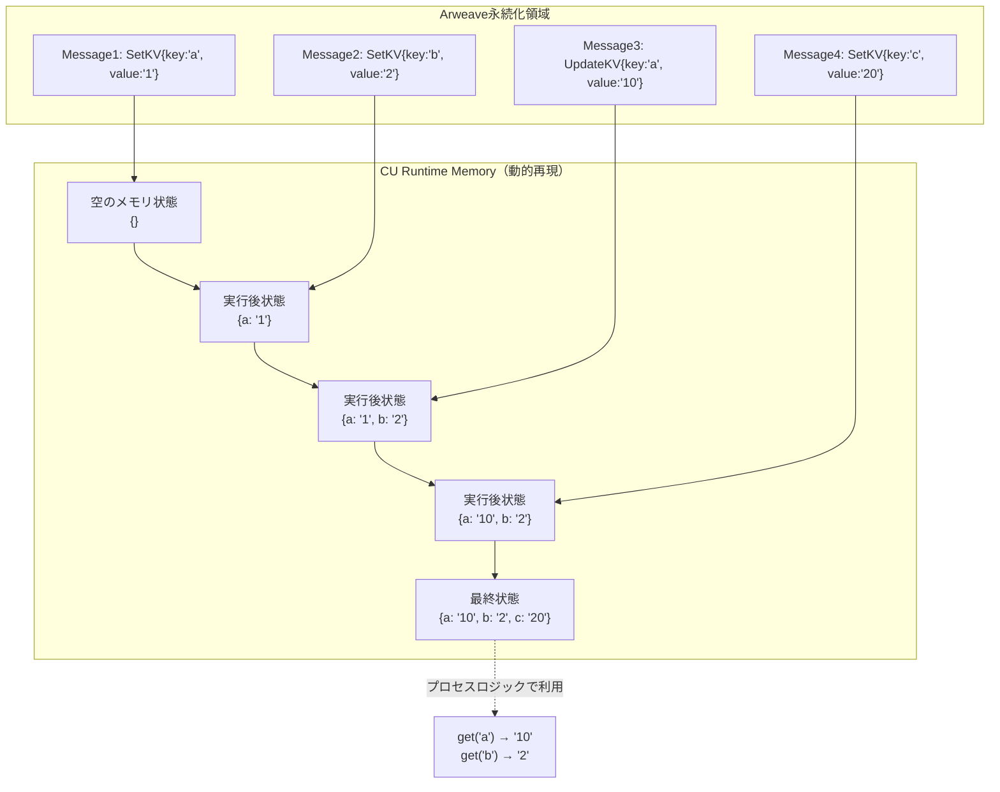

**💡 なぜ「状態」ではなく「メッセージ」を保存するのか**
- **完全な再現性**: どのCUでも同じメッセージ列 → 同じ状態
- **並列実行**: 異なるプロセスを独立したCUで実行可能
- **タイムトラベル**: 過去の任意時点の状態を再計算で復元

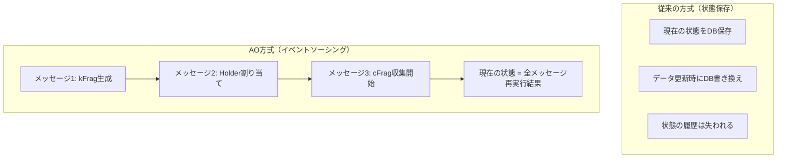

**🎯 決定論的再生の保証**
- 同じWASM + 同じメッセージ順序 = 必ず同じ状態
- 世界中どのCU（Compute Unit）で実行しても同一結果
- タイムトラベル：過去の任意時点の状態復元が可能

### 具体例：空メモリからの段階的KV再現

D-TPRESプロセスでのOwner-ProcessのkFrag管理を例に説明します：

**シナリオ**: Owner-ProcessがkFragを生成・配布する過程

```rust
// 実際のstate.rs定義
pub const OWNER_KFRAGS: Map<String, OwnerKFragData> = Map::new("owner_kfrags");

// メッセージによる状態変更
#[derive(Serialize, Deserialize)]
pub enum ExecuteMsg {
    CreateKFrag { kfrag_id: String, data: OwnerKFragData },
    MarkDistributed { kfrag_id: String },
    // ...
}
```

**段階的なCUメモリ状態の変化**：

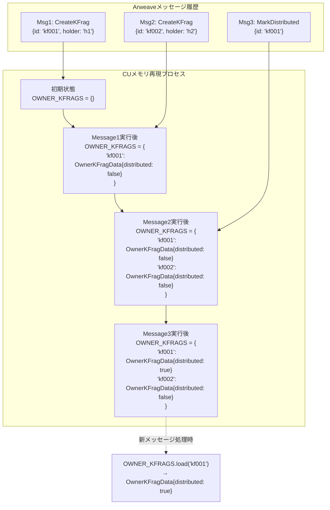

**🔧 実装レベルでの動作**

```rust
// CUが実行する再現処理（概念的なコード）
pub fn reconstruct_state_from_messages(messages: Vec<Message>) -> KVState {
    let mut kv_memory = HashMap::new();

    for msg in messages {
        match msg.action {
            "create_kfrag" => {
                // CUメモリに直接書き込み
                kv_memory.insert(msg.kfrag_id, OwnerKFragData {
                    distributed: false,
                    // ... 他のフィールド
                });
            }
            "mark_distributed" => {
                // CUメモリ上の既存データを更新
                if let Some(kfrag) = kv_memory.get_mut(&msg.kfrag_id) {
                    kfrag.distributed = true;
                }
            }
        }
    }

    kv_memory  // この状態が deps.storage 経由でアクセス可能になる
}
```

### CU（Compute Unit）による自動状態復元

この再現プロセスは完全に自動化されており、新しいメッセージ処理時に透過的に実行されます：

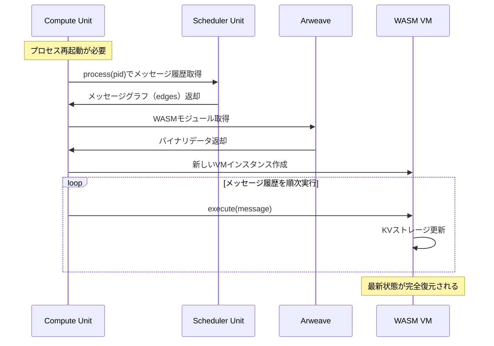

**🔧 開発者視点での透明性とプロセスロジックでのKV利用**

CUが再現したKVストレージは、プロセスロジックから透過的にアクセス可能です：

```rust
// D-TPRES Owner-Processでの実際の利用例
pub fn execute_check_distribution_status(
    deps: DepsMut,
    env: Env,
    info: MessageInfo,
    kfrag_id: String,
) -> Result<Response, ContractError> {
    // 1. CUが再現したKVメモリから値を取得
    let kfrag_data = OWNER_KFRAGS.load(deps.storage, &kfrag_id)?;
    //                ↑ CUメモリ上の{kf001: OwnerKFragData{distributed: true}} から取得

    // 2. ビジネスロジックで再現された状態を利用
    if kfrag_data.distributed {
        // 配布済みの場合の処理
        let holder_assignment = HOLDER_ASSIGNMENTS.load(deps.storage, &kfrag_data.target_holder)?;
        //                      ↑ 同様にCUメモリから取得

        // 3. 計算結果を新しいKV状態として保存（次回の再現で利用される）
        let stats = DistributionStats {
            total_distributed: get_distributed_count(&deps)?,
            last_check: env.block.time.seconds(),
        };
        DISTRIBUTION_STATS.save(deps.storage, &stats)?;
        //                   ↑ この操作も次のメッセージで再現される

        Ok(Response::new()
            .add_attribute("status", "distributed")
            .add_attribute("holder", &kfrag_data.target_holder))
    } else {
        Ok(Response::new().add_attribute("status", "pending"))
    }
}

// ヘルパー関数：CUメモリ上のKVを集計
fn get_distributed_count(deps: &DepsMut) -> StdResult<u32> {
    let mut count = 0;
    for item in OWNER_KFRAGS.range(deps.storage, None, None, Order::Ascending) {
        let (_, kfrag_data) = item?;
        if kfrag_data.distributed {
            count += 1;
        }
    }
    Ok(count)
}
```

**📊 重要なポイント**
- `deps.storage.load()`: CUが再現したメモリから値を取得
- `deps.storage.save()`: 次回再現で利用される新しい状態を設定
- 状態は「保存」されるのではなく「次のメッセージ実行で再計算される」
- プロセスロジックは普通のRustコードのように書ける（再現の複雑さは隠蔽）

### ステートレス実行制約

AO Networkでは**メッセージ間でメモリがリセット**される重要な制約があります：

**⚠️ 従来のプログラミングとの違い**

```rust
// ❌ 動作しない：AOでは使用不可
static mut COUNTER: u32 = 0;

pub fn execute_increment() {
    unsafe { COUNTER += 1; }  // 次のメッセージで0にリセット
}

// ✅ 正しい：必須のLoad→Process→Saveパターン
pub const COUNTER: Item<u32> = Item::new("counter");

pub fn execute_increment(deps: DepsMut, ...) -> Result<Response, ContractError> {
    // 1. 🔍 Load: 状態をストレージから読み込み
    let mut count = COUNTER.load(deps.storage).unwrap_or(0);

    // 2. ⚙️ Process: ビジネスロジック実行
    count += 1;

    // 3. 💾 Save: 次回再現のための新状態を記録
    COUNTER.save(deps.storage, &count)?;

    Ok(Response::new())
}
```

**🎯 3段階の必須パターン**

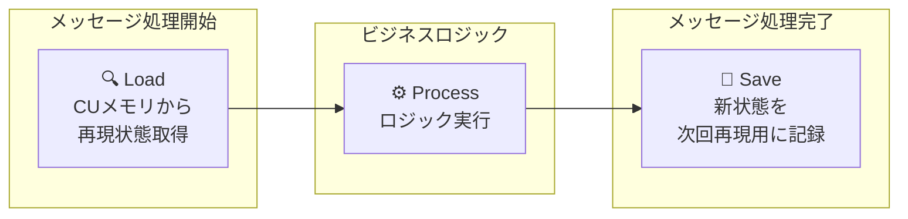

**📝 実装での重要ポイント**
- **CUメモリからの状態取得**: `deps.storage`は実際にはCUが再現したメモリ状態
- **メモリ非永続化**: 静的変数やグローバル変数は使用不可（次のメッセージで消える）
- **原子的処理**: 各メッセージ処理は完結した状態変更を含む
- **状態は「保存」ではなく「記録」**: 次のメッセージ実行時に再計算される

### Arweaveストレージ制約

AO環境では、プロセスから**直接Arweaveにアクセスできません**：

**🚫 無効化されている機能**
- `deps.querier`: 他のコントラクト状態読み込み不可
- 外部ネットワークアクセス: HTTP リクエスト禁止
- ファイルシステムアクセス: ローカルファイル読み書き不可

**✅ 推奨パターン：参照データ設計**

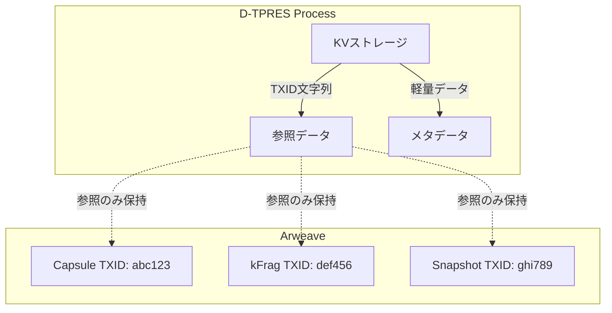

**🏗️ 参照データパターンの実装**

```rust
// 軽量な参照情報のみをプロセス内管理
pub const CAPSULE_REFS: Map<String, CapsuleReference> = Map::new("capsule_refs");

#[derive(Serialize, Deserialize)]
pub struct CapsuleReference {
    pub arweave_txid: String,      // Arweave TXID（参照のみ）
    pub size_bytes: u64,           // ファイルサイズ
    pub content_hash: String,      // 内容のハッシュ値
    pub created_at: u64,           // 作成時刻
}

// ❌ 大容量データを直接格納（メモリ効率が悪い）
pub const LARGE_DATA: Map<String, Vec<u8>> = Map::new("large_data");

// ✅ 参照のみを格納（推奨パターン）
pub fn store_capsule_reference(
    deps: DepsMut,
    capsule_id: String,
    txid: String,
) -> Result<Response, ContractError> {
    let reference = CapsuleReference {
        arweave_txid: txid,
        size_bytes: 1024,  // 例
        content_hash: "sha256_hash".to_string(),
        created_at: env.block.time.seconds(),
    };

    CAPSULE_REFS.save(deps.storage, capsule_id, &reference)?;
    //           ↑ 次回メッセージ実行時にCUメモリで再現される
    Ok(Response::new())
}
```

---

## 1. Owner-Process ストレージ構造

Owner-Processは閾値暗号の中核となるkFragの生成・配布を管理します。

**ストレージ主キー構造**:
- `OWNER_KFRAGS`: kfrag_idをキーとして`OwnerKFragData`を格納
- `HOLDER_ASSIGNMENTS`: holder_idをキーとして`HolderAssignment`を格納
- `OWNER_METADATA`, `OWNER_CONFIG`: 単一値（主キーなし）

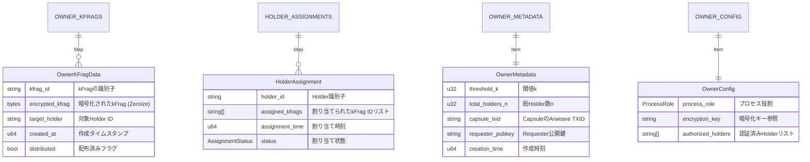

### Owner-Process の責務

- **kFrag管理**: O-Browserから受信した秘密鍵フラグメントの暗号化・保存
- **Holder選出**: RandAOアルゴリズムによるn個のHolder-Process選択
- **配布追跡**: 各HolderへのkFrag配布状況の管理・監視
- **閾値設定**: k-of-n閾値暗号のパラメータ管理

### AOメッセージ処理フロー

Owner-Processでの各メッセージ処理は、AO制約に従って実装されます：

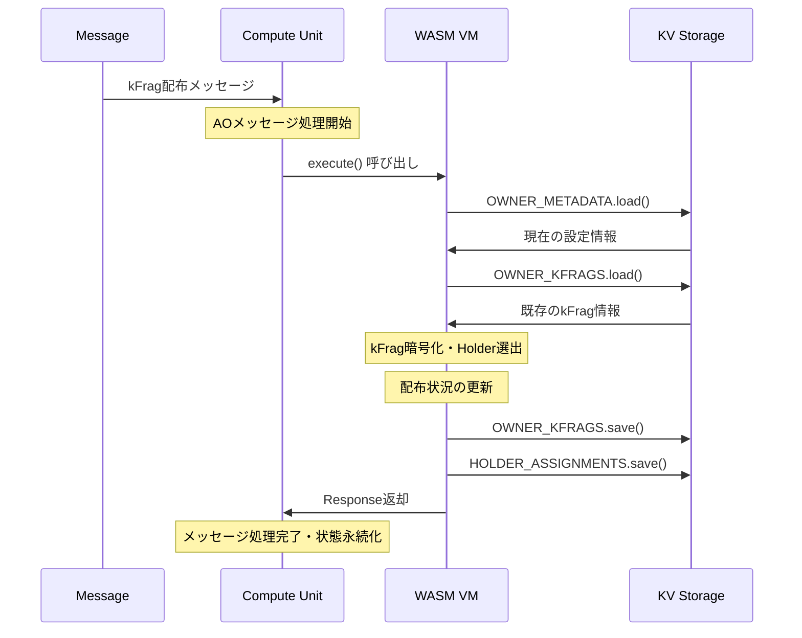

### セキュリティ特性

- `OwnerKFragData.encrypted_kfrag`フィールドは**Zeroize**対応
- 配布後はローカルのkFragデータを安全に消去
- Holder認証リストによるアクセス制御
- **AO準拠**: メッセージ間での秘密データの自動クリア

---

## 2. Holder-Process ストレージ構造

Holder-ProcessはkFragを安全に保管し、要求に応じてcFragを生成します。

**ストレージ主キー構造**:
- `HOLDER_KFRAGS`: kfrag_idをキーとして`HolderKFragData`を格納
- `HOLDER_CFRAGS`: cfrag_idをキーとして`HolderCFragData`を格納
- `CAPSULE_CACHE`: capsule_idをキーとして`CapsuleData`を格納
- `HOLDER_METADATA`: 単一値（主キーなし）

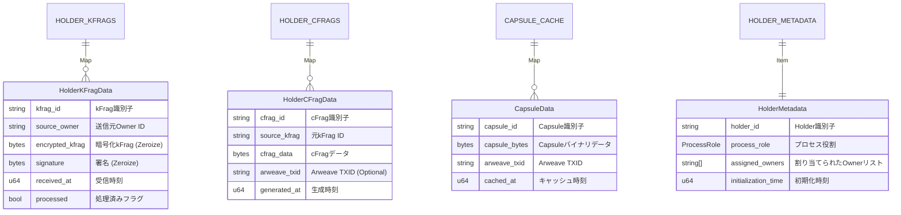

### Holder-Process の責務

- **kFrag保管**: Owner-Processから受信したkFragの安全な保存
- **cFrag生成**: Requester要求に応じたProxy Re-Encryption実行
- **Capsuleキャッシュ**: ArweaveからのCapsuleデータの効率的キャッシング
- **署名検証**: 受信データの真正性確認

### セキュリティ特性

- `HolderKFragData`の機密フィールドは**Zeroize**対応
- cFrag生成時の定数時間操作保証
- 複数Ownerからの独立したkFrag管理

---

## 3. Requester-Process ストレージ構造

Requester-ProcessはcFrag収集と閾値達成を管理します。

**ストレージ主キー構造**:
- `CFRAG_COLLECTION`: session_idをキーとして`CFragCollection`を格納
- `RECOVERY_SESSIONS`: session_idをキーとして`RecoverySession`を格納
- `THRESHOLD_TRACKER`, `REQUESTER_METADATA`: 単一値（主キーなし）

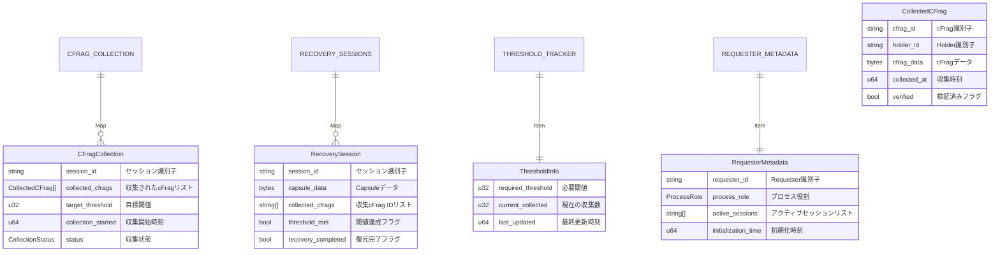

### Requester-Process の責務

- **セッション管理**: R-Browserからの復元要求受信・セッション作成
- **cFrag収集**: 複数Holder-Processからのcフラグメント順次収集
- **閾値監視**: k-of-n閾値達成のリアルタイム追跡
- **復元準備**: 閾値達成時のCapsule+cFragセット準備

### 収集プロセス

1. **セッション開始**: R-Browserから復元要求受信
2. **Holder特定**: 対象kFragを保持するHolder-Process群の特定
3. **並行収集**: 複数Holderからの効率的cFrag収集
4. **閾値判定**: k個以上のcFrag収集完了の自動検知
5. **データ配信**: R-Browserへの復元データセット送信

---

## 4. AO Network統合層ストレージ

AO Network統合層はプロセス間通信とメッセージングを管理します。

**ストレージ主キー構造**:
- `CONNECTED_PROCESSES`: process_idをキーとして`AOProcessInfo`を格納
- `MESSAGE_QUEUE`: message_idをキーとして`PendingMessage`を格納
- `PROCESS_REGISTRY`: 単一値（主キーなし）

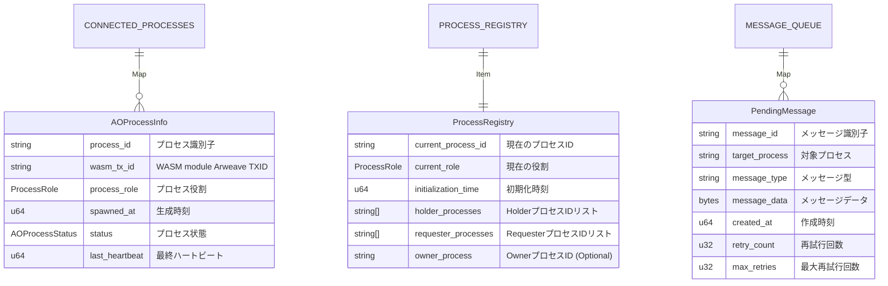

### AO Network統合層の責務

- **プロセス発見**: 動的なプロセス登録・発見メカニズム
- **ハートビート管理**: プロセス生存監視と障害検知
- **メッセージルーティング**: 非同期メッセージ配信・再試行制御
- **状態同期**: 分散プロセス間での一貫性保証

### プロセス管理機能

- **動的スケーリング**: 新しいHolder/Requesterプロセスの自動登録
- **負荷分散**: 複数プロセス間でのリクエスト分散
- **障害復旧**: プロセス障害時の自動フェイルオーバー

---

## 5. プロセス間関係とデータフロー

システム全体のプロセス間関係とデータフローを示します。

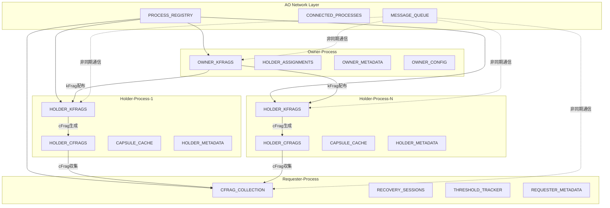

### データフロー段階

1. **Phase 1**: Owner → Holder kFrag配布
2. **Phase 2**: Holder cFrag生成待機
3. **Phase 3**: Requester → Holder cFrag要求
4. **Phase 4**: Holder → Requester cFrag送信
5. **Phase 5**: Requester 閾値達成判定・復元準備

---

## ストレージタイプと主キーの説明

### Map<K, V> 型
- **キー・バリュー形式**でデータを格納
- 複数のレコードを効率的に管理
- **第1型パラメータ K が主キー**として機能
- キーによる高速検索が可能（O(log n)）
- 動的なデータ追加・削除に対応

#### 主キーの仕組み
CosmWasmの`Map<K, V>`では、**型パラメータKが実際の主キー**です：

```rust
// 例: Map<String, OwnerKFragData>
pub const OWNER_KFRAGS: Map<String, OwnerKFragData> = Map::new("owner_kfrags");

// 使用例
OWNER_KFRAGS.save(deps.storage, "kfrag_001", &kfrag_data)?;  // "kfrag_001"が主キー
let data = OWNER_KFRAGS.load(deps.storage, "kfrag_001")?;   // 主キーでアクセス
```

#### 各ストレージの主キー定義
- `OWNER_KFRAGS`: `String` → kfrag_id値
- `HOLDER_ASSIGNMENTS`: `String` → holder_id値
- `HOLDER_KFRAGS`: `String` → kfrag_id値
- `HOLDER_CFRAGS`: `String` → cfrag_id値
- `CAPSULE_CACHE`: `String` → capsule_id値
- `CFRAG_COLLECTION`: `String` → session_id値
- `RECOVERY_SESSIONS`: `String` → session_id値
- `CONNECTED_PROCESSES`: `String` → process_id値
- `MESSAGE_QUEUE`: `String` → message_id値

**重要**: 構造体内の`xxx_id`フィールドは論理的な識別子であり、実際の主キーはMap操作時に使用する文字列です。

### AOにおけるKVストレージの動作

CosmWasm AOでは、KVストレージが特殊な動作をします：

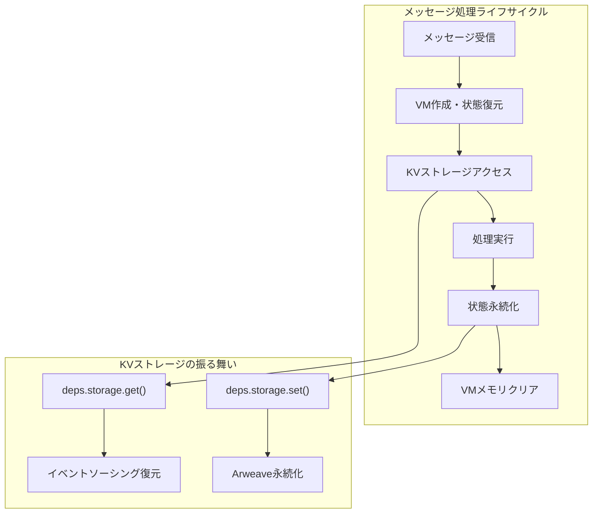

**📊 実際のstate.rs実装におけるAO最適化**

```rust
// state.rs の実装がAO制約にどう対応しているか

// ✅ AOで効率的：軽量な参照データ
pub const CAPSULE_CACHE: Map<String, CapsuleData> = Map::new("capsule_cache");

#[derive(Serialize, Deserialize, Clone, Debug)]
pub struct CapsuleData {
    pub capsule_id: String,
    pub capsule_bytes: Vec<u8>,        // 小容量データのみ
    pub arweave_txid: String,          // 大容量データは参照のみ
    pub cached_at: u64,
}

// ✅ AOで安全：Zeroize対応の秘密データ
#[derive(Serialize, Deserialize, Clone, Debug, Zeroize, ZeroizeOnDrop)]
pub struct OwnerKFragData {
    pub kfrag_id: String,
    pub encrypted_kfrag: Vec<u8>,      // メッセージ処理後に自動消去
    // ... 他のフィールド
}

// ✅ AOで効率的：型安全なストレージ分離
pub const OWNER_KFRAGS: Map<String, OwnerKFragData> = Map::new("owner_kfrags");
pub const HOLDER_KFRAGS: Map<String, HolderKFragData> = Map::new("holder_kfrags");
pub const REQUESTER_METADATA: Item<RequesterMetadata> = Item::new("requester_metadata");
```

### Item<T> 型
- **単一の値**を格納するストレージ
- プロセス全体のメタデータや設定に使用
- 直接アクセスによる効率的な読み書き
- アトミックな更新操作保証
- **主キーなし**（単一の値のため不要）

---

## セキュリティ特性

### Zeroize対応エンティティ
**機密データの自動消去**機能を持つエンティティ：

- `OwnerKFragData`: `encrypted_kfrag` フィールド
- `HolderKFragData`: `encrypted_kfrag`, `signature` フィールド

これらのフィールドは使用後に自動的にメモリから安全に消去され、機密情報の漏洩を防ぎます。

### アクセス制御
- **プロセス役割分離**: 各プロセスは独自のストレージのみアクセス可能
- **メッセージ認証**: プロセス間通信は認証済みメッセージのみ
- **データ暗号化**: 機密データはすべて暗号化して保存
- **署名検証**: すべての重要なメッセージに対する署名検証

### メモリ安全性
- **定数時間操作**: 秘密依存の分岐処理を回避
- **セキュアな比較**: `subtle`クレートによる定数時間比較
- **メモリ保護**: スタックオーバーフロー・バッファオーバーフローの防止

---

## ストレージ容量とパフォーマンス

### 容量設計
- **Owner-Process**: kFragデータとHolder割り当て情報（中程度）
  - 典型的：数百KB〜数MB程度
- **Holder-Process**: kFrag + cFrag + Capsuleキャッシュ（大容量）
  - 典型的：数MB〜数十MB程度
- **Requester-Process**: cFrag収集とセッション管理（中程度）
  - 典型的：数百KB〜数MB程度

### パフォーマンス最適化
- **インデックス戦略**: 主キーによる高速検索（O(log n)）
- **キャッシング**: Capsuleデータの効率的なキャッシング
- **ガベージコレクション**: 完了セッションの自動クリーンアップ
- **バッチ処理**: 複数操作の効率的な一括実行
- **遅延ロード**: 必要時のみデータをロード

### スケーラビリティ考慮
- **水平分散**: 複数Holderプロセスによる負荷分散
- **非同期処理**: メッセージキューによる非ブロッキング通信
- **状態パーティション**: プロセス役割による状態の論理分離

---

このER図により、D-TPRESシステムの複雑なデータ構造と、AO Network上での分散プロセス間の関係性が明確に可視化されます。