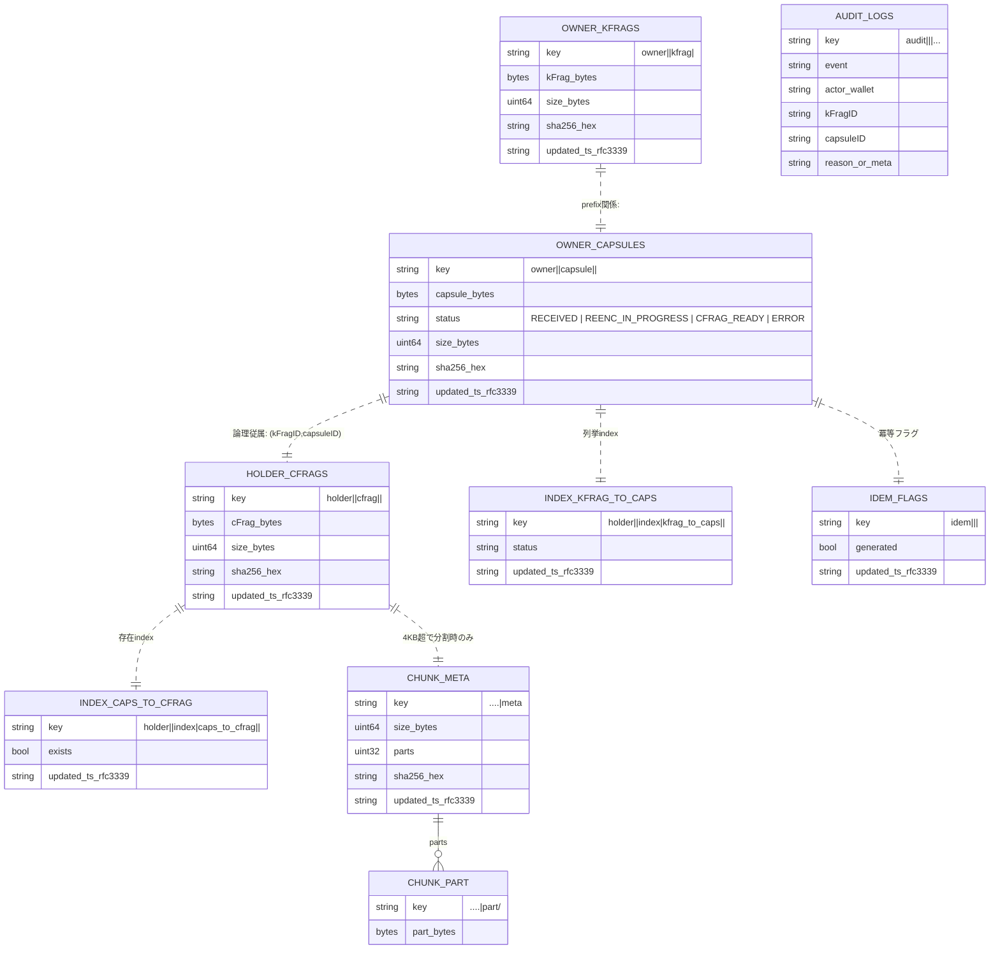
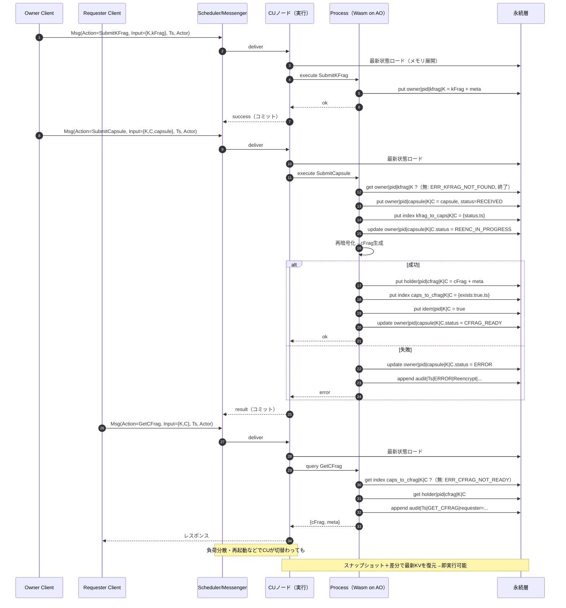

# CosmWasm on AO｜プロセスのステート管理に関する主要機能ミニマム仕様書

> **目的**
> 単一 AO プロセス内で Owner / Holder / Requester の3ロールを論理的に扱い、
> `kFrag` と `Capsule` から **1 Capsule あたり 1 cFrag** を生成・保持・配布する最小実装。
> この仕様は、これまでの議論での**改善点・深掘り**（順序固定・index運用・監査・チャンク方針 等）を反映済み。
> 参照元はご指定の GitHub ページ（CosmWasm on AO）。本文の転載は行わない。

---

## 0. 前提・ポリシー

* **プロセス主キー**: `process.id` を状態キー空間のルートに採用（署名ウォレットは監査用メタに記録）。
* **ロール**: Owner / Holder / Requester（**同一プロセスに論理共存**）。
* **順序固定**: **必ず `SubmitKFrag` → `SubmitCapsule` → `GetCFrag`** の順で到着する前提。

  * `kFrag` 未登録で `SubmitCapsule` が来たら **`ERR_KFRAG_NOT_FOUND`**（何も書かない）。
* **同期制約**: 他プロセスの同期読取なし（必要データは当該プロセスに保持）。
* **ACL/DoS**: 当面なし（将来拡張前提）。
* **監査（Audit）**: **失敗イベント**と**cFrag配布イベント**を必ず記録。時刻は**外部時刻（メッセージタグ）**を採用。
* **チャンク**: 原則**非分割**。4KB超のみ分割、最大32パーツ（合計≲128KB）。
* **一覧ページング**: 既定 `limit = 50`。

---

## 1. ドメインIDと冪等

* `kFragID`（≤128文字）, `capsuleID`（≤128文字）
* **cFrag** は `(kFragID, capsuleID)` に対して **常に1つ**。
* 冪等フラグ: `idem|process.id|kFragID|capsuleID = true` で**重複生成を完全No-Op**。

---

## 2. 状態スキーマ（KV＝エンティティ）とキー設計

> **命名規則**: `role|<process.id>|...` を先頭に置き、**プレフィックス走査**を最短化。
> **値**は原則バイト列＋軽メタ（`size_bytes`, `sha256`, `updated_ts`）。
> **チャンク分割**時のみ `...|meta` / `...|part/<i>` を追加。

### 2.1 本体（Owner / Holder）

* **OWNER_KFRAGS**

  * key: `owner|<process.id>|kfrag|<kFragID>`
  * value: `{ kFrag_bytes, meta }`
* **OWNER_CAPSULES**

  * key: `owner|<process.id>|capsule|<kFragID>|<capsuleID>`
  * value: `{ capsule_bytes, status, meta }`
  * `status ∈ { RECEIVED, REENC_IN_PROGRESS, CFRAG_READY, ERROR }`
* **HOLDER_CFRAGS**

  * key: `holder|<process.id>|cfrag|<kFragID>|<capsuleID>`
  * value: `{ cFrag_bytes, meta }`

### 2.2 インデックス（列挙／存在確認）

* **INDEX_KFRAG_TO_CAPS**（kFrag → Capsule 列挙）

  * key: `holder|<process.id>|index|kfrag_to_caps|<kFragID>|<capsuleID>`
  * value: `{ status, updated_ts }`（軽量）
* **INDEX_CAPS_TO_CFRAG**（Capsule → cFrag 存在）

  * key: `holder|<process.id>|index|caps_to_cfrag|<kFragID>|<capsuleID>`
  * value: `{ exists: true, updated_ts }`

### 2.3 冪等・監査・チャンク

* **IDEM_FLAGS**

  * key: `idem|<process.id>|<kFragID>|<capsuleID>`
  * value: `{ generated: true, updated_ts }`
* **AUDIT_LOGS**（Append-only）

  * key: `audit|<ext_ts>|<EVENT>|...`
  * value: `{ event, actor_wallet, kFragID, capsuleID, reason_or_meta }`
  * `EVENT ∈ { ERROR, GET_CFRAG, ... }` / `ext_ts` は外部時刻（タグ `Ts`）
* **CHUNK_META / CHUNK_PART**（4KB超のみ）

  * meta key: `....|meta` → `{ size_bytes, parts, sha256, updated_ts }`
  * part key: `....|part/<i>` → `part_bytes`

---

## 3. メッセージ仕様（AO “ワイヤ”＋Input JSON）

### 3.1 ワイヤ共通（tags）

* `target`: `process.id`
* `data`: 空（通常未使用）
* `tags`（必須）

  * `App-Name`: 例 `cwao`
  * `Action`: 下記アクション名
  * `Read-Only`: `"True"` / `"False"`
  * `Input`: **JSON文字列**（各アクション入力）
  * `Process-Id`: `process.id`
  * `Actor`: 送信ウォレットアドレス
  * `Ts`: 外部時刻（RFC3339 または epoch-ms）→ 監査の `ext_ts` に採用

### 3.2 Execute

* **SubmitKFrag**（順序：常に先行）

  ```json
  {
    "kFragID": "string<=128",
    "kFrag": "base64"
  }
  ```

  * 既存なら No-Op。

* **SubmitCapsule**（kFrag先行が**必須**）

  ```json
  {
    "kFragID": "string<=128",
    "capsuleID": "string<=128",
    "capsule": "base64"
  }
  ```

  * `kFrag` 未登録なら `ERR_KFRAG_NOT_FOUND`（本体/index含め**何も書かない**）。
  * 冪等ONなら完全No-Op。

* **Reencrypt**（運用リトライ）

  ```json
  {
    "kFragID": "string<=128",
    "capsuleID": "string<=128"
  }
  ```

### 3.3 Query

* **GetCFrag**

  ```json
  {
    "kFragID": "string<=128",
    "capsuleID": "string<=128"
  }
  ```

  * 返却: `{ cFrag: "base64", meta: { size_bytes, sha256, updated_ts } }`
  * 監査: `GET_CFRAG` を必ず記録。

* **ListCapsulesByKFrag**

  ```json
  {
    "kFragID": "string<=128",
    "start_after": "string<=128?",
    "limit": 50
  }
  ```

  * 返却: `capsules[]` + `next_start_after`（ページング）

---

## 4. 動作フロー（厳密・順序固定）

### 4.1 Execute：SubmitKFrag（先行）

1. 入力検証 → 既存なら No-Op
2. `put owner|pid|kfrag|K = kFrag + meta`
3. コミット

### 4.2 Execute：SubmitCapsule（kFrag存在が前提）

1. 入力検証
2. `get owner|pid|kfrag|K` が **無** → `ERR_KFRAG_NOT_FOUND`（**終了**）
3. `get idem|pid|K|C` が **有** → **No-Op**（終了）
4. `put owner|pid|capsule|K|C = {capsule, status=RECEIVED, meta}`
5. `put index kfrag_to_caps|K|C = {status, ts}`
6. `update owner|pid|capsule|K|C.status = REENC_IN_PROGRESS`
7. 再暗号化 → cFrag 生成

   * 失敗 → `status=ERROR`, 監査 `ERROR`, 終了
8. `put holder|pid|cfrag|K|C = {cFrag, meta}`
9. `put index caps_to_cfrag|K|C = {exists:true, ts}`
10. `put idem|pid|K|C = true`
11. `update owner|pid|capsule|K|C.status = CFRAG_READY`
12. コミット

### 4.3 Query：GetCFrag

1. 入力検証
2. `get index caps_to_cfrag|K|C` **無** → `ERR_CFRAG_NOT_READY`
3. `get holder|pid|cfrag|K|C`（必要ならチャンク結合）
4. 監査 `GET_CFRAG` 追記
5. 返却

### 4.4 Query：ListCapsulesByKFrag（limit=50 既定）

* prefix = `holder|pid|index|kfrag_to_caps|K|`
* `start_after` と `limit` でレンジ取得
* 軽メタ（status/updated_ts）をそのまま返却（必要に応じて本体補完）

---

## 5. ER 図（KV＝エンティティ、ロール別）

> **各エンティティ＝1つのKVマッピング**。**key → value** 対応を明示。
> RDBの外部キーは使わない（プレフィックス命名で疎結合）。



---

## 6. シーケンス図（順序固定・メモリ展開の同期）

> 各メッセージ実行前に、担当 CU は**最新状態をメモリに展開**（スナップショット＋差分適用）。
> コミット後の状態は永続化され、**CUが再割当されても同じ状態**で即実行できる。



---

## 7. バリデーション & エラー

* **入力**: `kFragID/capsuleID`（非空・ASCII安全・≤128）、`kFrag/capsule`（Base64・サイズ>0）、`Ts`（任意時刻）
* **代表エラー**

  * `ERR_KFRAG_NOT_FOUND`（順序違反の `SubmitCapsule`。**何も書かない**）
  * `ERR_CFRAG_NOT_READY`（未生成の `GetCFrag`）
  * `ERR_REENC_FAILED`（再暗号化失敗）
  * `ERR_DUPLICATE_KFRAG` / `ERR_DUPLICATE_CAPSULE`（通知が必要なら使用）
  * `ERR_BAD_REQUEST` / `ERR_OBJECT_TOO_LARGE`

---

## 8. 既定値・運用ノート

* `ListCapsulesByKFrag.limit` 既定 **50**
* 監査は **失敗** と **配布** を必ず記録（`ext_ts`=タグ`Ts`、`actor/requester`=タグ`Actor`）
* チャンクは **4KB超のみ**（最大32パーツ）。通常は非分割で高速I/O。
* index は「**一覧**（kfrag_to_caps）」と「**存在確認**（caps_to_cfrag）」に用途分離。
* 冪等フラグで**再送・重複**を完全No-Op。

---

## 9. 実装タスク（最短ルート）

1. **instantiate**: `process.id` を state ルートに採用。
2. **KVユーティリティ**: `kv_put/kv_get/kv_scan_prefix`、キー生成（`role|process.id|...`）、冪等I/F。
3. **execute**: `SubmitKFrag` / `SubmitCapsule`（順序チェック・即時完結） / `Reencrypt`。
4. **query**: `GetCFrag`（存在index→本体） / `ListCapsulesByKFrag(limit=50)`（prefixスキャン）。
5. **監査ユーティリティ**: 失敗/配布の記録（外部時刻とアクター転記）。
6. **テスト**:

   * 正常系: kFrag→Capsule→GetCFrag、重複送信のNo-Op
   * 異常系: `SubmitCapsule`の順序違反、再暗号化失敗、未生成取得、巨大入力
   * ページング: `ListCapsulesByKFrag` 連続取得
   * 監査: 失敗＋配布が必ず残ること

---

# 10. 追加：CU再割当時の「状態復元」ステップバイステップ（Messaging / メモリ状態に着目）

> ここからは**追記**です（既存本文は変更なし）。
> 目的：正常系後に**別のCU**へ割り当て直されても、**メッセージ履歴（スナップショット＋差分）**から**同一の最新状態**を再現し、以降の処理を継続できることを明確化。

### 10.1 事前状態（正常系完了後の永続KV）

* 例：`SubmitKFrag(K)`→`SubmitCapsule(K,C)`成功後

  * `OWNER_KFRAGS(pid,K)`：存在
  * `OWNER_CAPSULES(pid,K,C).status = CFRAG_READY`
  * `HOLDER_CFRAGS(pid,K,C)`：存在
  * `INDEX_KFRAG_TO_CAPS(pid,K,C)`：存在（status=CFRAG_READY）
  * `INDEX_CAPS_TO_CFRAG(pid,K,C)`：`exists=true`
  * `IDEM_FLAGS(pid,K,C)=true`
  * `AUDIT_LOGS`：必要に応じて `GET_CFRAG` 等が追加されている

### 10.2 CU再割当（割当直後の復元手順）

1. **SU（スケジューラ）→ 新CUに割当**
2. **新CU は永続層から最新スナップショット取得**
3. **スナップショット以降の差分メッセージを再生**

   * メッセージ順は **すでに順序固定**（`kFrag→Capsule→GetCFrag`）のため、再生は直列で安全
4. **KVをメモリ上に展開**

   * `OWNER_* / HOLDER_* / INDEX_* / IDEM_* / AUDIT_*` が**直前と同一内容**に再構築
5. **実行準備完了**（以降の`execute/query`はこの最新状態で即時実行）

### 10.3 復元後のメッセージ到着（例：`GetCFrag(K,C)`）

1. **Requester→SU→新CU** に配送
2. **新CU** はすでに最新KVをメモリに展開済み
3. **query処理**

   * `INDEX_CAPS_TO_CFRAG(pid,K,C)` を `get` → `exists=true` で即時肯定
   * `HOLDER_CFRAGS(pid,K,C)` を `get` → cFrag本体を返却
   * `AUDIT_LOGS` に `GET_CFRAG` を追記
4. **レスポンス返却**（再割当前と同一の結果）

> 結論：**スナップショット＋差分の適用 → KV再構築 → 直後の`execute/query`** という流れにより、**CUがどこでも一貫した最新状態**が保障される。

---

# 11. 追加：メッセージ仕様の「ワイヤ」完全例（tags含む）

> AOに送る**実体メッセージ**の例を示します（`data`は空を想定。CWAO流儀で`tags.Input`にJSONを詰める）。

### 11.1 SubmitKFrag（execute）

```json
{
  "target": "<process.id>",
  "data": "",
  "tags": [
    {"name":"App-Name","value":"cwao"},
    {"name":"Action","value":"SubmitKFrag"},
    {"name":"Read-Only","value":"False"},
    {"name":"Input","value":"{\"kFragID\":\"K\",\"kFrag\":\"<base64>\"}"},
    {"name":"Process-Id","value":"<process.id>"},
    {"name":"Actor","value":"<walletAddress_of_owner>"},
    {"name":"Ts","value":"2025-10-16T12:34:56Z"}
  ]
}
```

### 11.2 SubmitCapsule（execute）

```json
{
  "target": "<process.id>",
  "data": "",
  "tags": [
    {"name":"App-Name","value":"cwao"},
    {"name":"Action","value":"SubmitCapsule"},
    {"name":"Read-Only","value":"False"},
    {"name":"Input","value":"{\"kFragID\":\"K\",\"capsuleID\":\"C\",\"capsule\":\"<base64>\"}"},
    {"name":"Process-Id","value":"<process.id>"},
    {"name":"Actor","value":"<walletAddress_of_owner>"},
    {"name":"Ts","value":"2025-10-16T12:35:40Z"}
  ]
}
```

### 11.3 GetCFrag（query）

```json
{
  "target": "<process.id>",
  "data": "",
  "tags": [
    {"name":"App-Name","value":"cwao"},
    {"name":"Action","value":"GetCFrag"},
    {"name":"Read-Only","value":"True"},
    {"name":"Input","value":"{\"kFragID\":\"K\",\"capsuleID\":\"C\"}"},
    {"name":"Process-Id","value":"<process.id>"},
    {"name":"Actor","value":"<walletAddress_of_requester>"},
    {"name":"Ts","value":"2025-10-16T12:36:10Z"}
  ]
}
```

---

# 12. 追加：`state.rs` における KV マッピングとデータ構造（宣言のみ）

> **実装（impl）は不要**との指定に従い、**宣言のみ**を示します。
> 仕様本文（§2）と一致する命名・型に揃えています。

```rust
use cosmwasm_schema::cw_serde;
use cosmwasm_std::Binary;
use cw_storage_plus::{Item, Map};

pub const DEFAULT_CHUNK_THRESHOLD: u32 = 4 * 1024;
pub const MAX_CHUNKS: u32 = 32;
pub const DEFAULT_LIST_LIMIT: u32 = 50;

// --------------------- 設定 ---------------------
#[cw_serde]
pub struct Config {
    pub process_id: String,
    pub chunk_threshold: u32,
    pub max_chunks: u32,
    pub default_list_limit: u32,
}
pub const CONFIG: Item<Config> = Item::new("config");

// --------------------- メタ ---------------------
pub type Rfc3339String = String;

#[cw_serde]
pub struct BlobMeta {
    pub size_bytes: u64,
    pub sha256_hex: String,
    pub updated_ts: Rfc3339String,
}

// --------------------- ドメイン ---------------------
#[cw_serde]
pub enum CapsuleStatus { Received, ReencInProgress, CFragReady, Error }

#[cw_serde]
pub struct OwnerKFragData {
    pub kfrag: Binary,
    pub meta: BlobMeta,
}

#[cw_serde]
pub struct OwnerCapsuleData {
    pub capsule: Binary,
    pub status: CapsuleStatus,
    pub meta: BlobMeta,
}

#[cw_serde]
pub struct HolderCFragData {
    pub cfrag: Binary,
    pub meta: BlobMeta,
}

#[cw_serde]
pub struct IndexKFragToCapsValue {
    pub status: CapsuleStatus,
    pub updated_ts: Rfc3339String,
}

#[cw_serde]
pub struct IndexCapsToCFragValue {
    pub exists: bool,
    pub updated_ts: Rfc3339String,
}

#[cw_serde]
pub struct IdemFlag {
    pub generated: bool,
    pub updated_ts: Rfc3339String,
}

#[cw_serde]
pub struct AuditLogEntry {
    pub event: String,
    pub actor_wallet: String,
    pub kfrag_id: String,
    pub capsule_id: String,
    pub reason_or_meta: String,
    pub ext_ts: Rfc3339String,
}

#[cw_serde]
pub struct ChunkMeta {
    pub size_bytes: u64,
    pub parts: u32,
    pub sha256_hex: String,
    pub updated_ts: Rfc3339String,
}

// --------------------- マッピング ---------------------
// すべて process_id を先頭キーに含むタプルキー

pub const OWNER_KFRAGS: Map<(String, String), OwnerKFragData> =
    Map::new("owner_kfrags");

pub const OWNER_CAPSULES: Map<(String, String, String), OwnerCapsuleData> =
    Map::new("owner_capsules");

pub const HOLDER_CFRAGS: Map<(String, String, String), HolderCFragData> =
    Map::new("holder_cfrags");

pub const INDEX_KFRAG_TO_CAPS: Map<(String, String, String), IndexKFragToCapsValue> =
    Map::new("index_kfrag_to_caps");

pub const INDEX_CAPS_TO_CFRAG: Map<(String, String, String), IndexCapsToCFragValue> =
    Map::new("index_caps_to_cfrag");

pub const IDEM_FLAGS: Map<(String, String, String), IdemFlag> =
    Map::new("idem_flags");

pub const AUDIT_LOGS: Map<(String, String, String, String, String), AuditLogEntry> =
    Map::new("audit_logs");

pub const CHUNK_META: Map<(String, String, String), ChunkMeta> =
    Map::new("chunk_meta");

pub const CHUNK_PARTS: Map<(String, String, String, u32), Binary> =
    Map::new("chunk_parts");
```

---

# 13. 追加：インデックスの機能詳細（ステップバイステップ）

> 目的：**列挙の高速化**（`kFrag→Capsule`）と、**単件存在判定のO(1)**（`Capsule→cFrag`）。
> 「順序固定」により、**一括更新**で一貫性を維持しやすい。

### 13.1 書き込み時（`SubmitCapsule(K,C)` 成功パス）

1. **本体保存（Capsule）**

   * `OWNER_CAPSULES(pid,K,C) = {capsule, status=RECEIVED, meta}`

2. **列挙用インデックス追加（kFrag→Caps）**

   * `INDEX_KFRAG_TO_CAPS(pid,K,C) = {status=RECEIVED, updated_ts}`
   * 効果：`prefix = (pid,K,*)` のレンジ走査で **CapsuleID が辞書順に列挙**可能

3. **状態遷移**

   * `OWNER_CAPSULES.status = REENC_IN_PROGRESS`

4. **cFrag生成 → 本体保存**

   * `HOLDER_CFRAGS(pid,K,C) = {cFrag, meta}`

5. **存在インデックス追加（Capsule→cFrag）**

   * `INDEX_CAPS_TO_CFRAG(pid,K,C) = {exists=true, updated_ts}`
   * 効果：**O(1)** の `get` で「cFrag存在」可否を即判定

6. **冪等ON**

   * `IDEM_FLAGS(pid,K,C) = {generated=true, updated_ts}`
   * 効果：同一 `(K,C)` の再送は**完全No-Op**

7. **最終状態更新**

   * `OWNER_CAPSULES.status = CFRAG_READY`
   * 望ましければ `INDEX_KFRAG_TO_CAPS(pid,K,C).status` も `CFRAG_READY` に更新
     （一覧で本体を見ずに status を返せる）

> **順序固定**により、**“Capsuleだけ存在”** や **“indexだけ先に立つ”** といった**中間不整合**を構造的に排除。

---

### 13.2 読み取り時：一覧（`ListCapsulesByKFrag(K, start_after, limit)`）

1. **prefix決定**

   * `P = (pid,K,*)` に相当（実際のキーは `(process_id, kfrag_id, capsule_id)`）

2. **開始位置**

   * `start_after` があれば、`(pid,K,start_after)` の **直後**から
   * 無ければ `(pid,K,"")` 相当から

3. **レンジ走査**

   * `INDEX_KFRAG_TO_CAPS` から **辞書順で最大 `limit` 件** の `(K,C)` を取得
   * 値の `status, updated_ts` をそのまま一覧に載せる
   * 詳細が必要なら、その `C` に対して `OWNER_CAPSULES(pid,K,C)` を `get` して補完

4. **ページング**

   * 最後に読んだ `C` を `next_start_after` に入れて返却

---

### 13.3 読み取り時：単件取得（`GetCFrag(K,C)`）

1. **存在判定（O(1)）**

   * `INDEX_CAPS_TO_CFRAG(pid,K,C)` を `get`
   * 無ければ `ERR_CFRAG_NOT_READY`（または `ERR_NOT_FOUND`）

2. **本体取得**

   * `HOLDER_CFRAGS(pid,K,C)` を `get`（分割時は `CHUNK_META/CHUNK_PARTS` で結合）

3. **監査**

   * `AUDIT_LOGS` に `GET_CFRAG` を追記（`ext_ts`, `actor`, `size`, `hash` 等）

---

### 13.4 削除・再生成（運用時の一貫性）

* **削除**

  * `OWNER_CAPSULES(pid,K,C)` を削除
  * 対応する `INDEX_KFRAG_TO_CAPS(pid,K,C)` を削除
  * cFragも削除するなら `INDEX_CAPS_TO_CFRAG(pid,K,C)` と `HOLDER_CFRAGS(pid,K,C)` を削除
  * 冪等リセットしたい場合は `IDEM_FLAGS(pid,K,C)` を削除

* **再生成（Reencrypt）**

  * `IDEM_FLAGS(pid,K,C)` が **存在** → 完全No-Op
  * **不存在** → 13.1 の 4〜7 を再実行（cFrag生成→index→idem→status）

> 書き込みは **「本体→index→（cFrag本体）→index→idem→status」** の一貫した順序で更新し、
> 読み取りは **「index→（必要時のみ本体）」** の最短I/Oで処理する、が原則。

---

以上が、**既存仕様に追記**した「状態復元の詳細」「ワイヤ具体例」「state.rsの宣言」「インデックス詳細」です。必要なら、このv2をベースに **`execute.rs` / `query.rs` の入出力スキーマ（JSON Schema）** も追加します。
